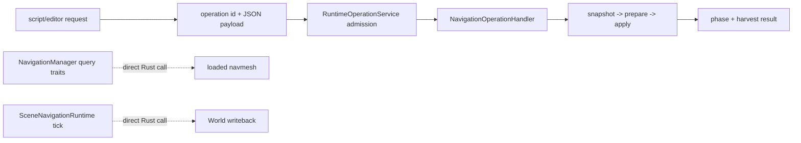

---
related_code:
  - zircon_runtime/src/navigation/operation/registration.rs
  - zircon_runtime/src/navigation/operation/handler.rs
  - zircon_runtime/src/operation/service.rs
  - zircon_runtime/src/dynamic_api/session/operation.rs
  - zircon_runtime_interface/src/runtime_api/session/operation.rs
  - zircon_runtime/src/navigation/module.rs
  - zircon_runtime/src/core/framework/navigation/mod.rs
implementation_files:
  - zircon_runtime/src/navigation/operation
  - zircon_runtime/src/navigation/module.rs
plan_sources:
  - user: 2026-09-09 扩展脚本、反射、动画与导航公开接口文档
tests:
  - zircon_runtime/src/navigation/runtime/tests.rs
  - zircon_runtime/src/operation/tests/source_guards.rs
  - zircon_runtime/src/dynamic_api/session/tests/vampire_gameplay.rs
  - zircon_runtime_interface/src/tests/runtime_operation.rs
doc_type: module-detail
---

# Navigation Operation 与脚本调用

## 为什么需要 operation 层

World 级 navigation manager 适合 Rust 内部调用；脚本、编辑器和动态 session 需要稳定的
operation 名称、参数 schema 和可轮询的 receipt。`register_navigation_operation_handlers` 只把
**烘焙状态工作流**注册到 `RuntimeOperationService`。路径查询、位置采样、射线检测和 agent
tick 仍然由 `NavigationManager`/`SceneNavigationRuntime` trait 直接调用，不会因为加载了
operation 注册表就自动出现同名 operation。



## 注册与调用

```rust
use zircon_runtime::navigation::register_navigation_operation_handlers;
use zircon_runtime::operation::RuntimeOperationService;
use zircon_runtime_interface::{
    ZrRuntimeOperationSubmitRequestV1, ZIRCON_RUNTIME_ABI_VERSION_V1,
};

// Session construction 为每个 runtime session 建立并注册一次 service。
let mut operations = RuntimeOperationService::new();
register_navigation_operation_handlers(&mut operations)?;

let request = ZrRuntimeOperationSubmitRequestV1::new(
    ZIRCON_RUNTIME_ABI_VERSION_V1,
    "navigation.bake.clear_surface",
    serde_json::json!({ "surface_entity": 42 }),
);
let operation_handle = operations.submit(request)?;

// 宿主的每帧 update：tick 才会推进 snapshot、prepare 完成和 owner apply。
operations.tick(&core, &mut world);
let status = operations.poll(operation_handle)?;
if matches!(status.phase(), Some(phase) if phase.is_terminal()) {
    let result = operations.harvest(operation_handle)?;
    // 检查 result.outcome；未终态时在后续帧继续 poll。
}
```

动态 ABI 使用同一 service 的 `submit_operation`/`poll_operation`/`harvest_operation`
函数指针；不存在 `session.invoke_operation` 这个 Rust API。脚本不应直接构造
`NavMeshHandle` 数值。operation handler 只负责快照与生成状态变化；查询侧仍通过
`NavigationManager` 解析已加载 mesh，不能把查询请求伪装成 operation。

`RuntimeOperationService::tick(&CoreHandle, &mut World)` 的调用顺序是固定的：先回收超时和
worker prepare 结果，再在 owner thread 执行 apply，最后为排队任务创建快照并派发 prepare。
`poll` 只读状态，不推进工作；`harvest` 只能对 `Completed` 或 `Failed` 终态调用，并会把
任务转为 `Harvested`。

内置 handler 的重要限制：`navigation.bake.scene` 与 `navigation.bake.surface` 当前在
prepare 阶段返回 `navigation bake requires a pure prepare backend`，因此不会产出成功的
bake report。真正的烘焙需要提供纯 prepare backend（通常由导航插件、编辑器或离线工具
完成），再把生成的快照交给 clear/restore 工作流。`clear_surface` 和
`restore_snapshot` 会在 apply 前比较 `before` 快照；状态被其他写入改变时 operation 失败，
不会覆盖新状态。

## 参数合同

四个已注册 operation 的 payload 由源码中的 DTO 决定：

| operation | payload | handler 约束 |
| --- | --- | --- |
| `navigation.bake.scene` | `NavMeshBakeRequest` | 强制将 `surface_entity` 设为 `None`；其余字段为 `agent_type`、`output_asset`、`force_full_rebuild` |
| `navigation.bake.surface` | `NavMeshBakeRequest` | 必须提供 `surface_entity`；缺失时 snapshot 阶段失败 |
| `navigation.bake.clear_surface` | `NavigationClearBakeRequest` | `surface_entity` 可选；未提供时使用当前生成快照的实体 |
| `navigation.bake.restore_snapshot` | `NavigationGeneratedBakeSnapshot` | 用提交的 snapshot 替换当前生成快照，并校验 `before` |

请求外层必须包含 `abi_version`、`operation_id` 和 `payload`，由
`ZrRuntimeOperationSubmitRequestV1::new` 构造。所有向量、字符串长度和数组元素的额外
限制属于对应 DTO/backend；未知 operation 会在 admission 阶段返回
`UnknownOperation`，不会进入 handler。

路径查询的 `start/end`、sample 的 `position/extents`、raycast 的 `start/end` 属于
`NavigationManager` 的直接 trait DTO，不是上述四个 operation 的 payload。调用方仍应在
进入几何算法前保证坐标 finite、extents 非负。

## 能力与后端差异

builtin backend 支持 baked mesh 查询，但不支持 surface bake 和 per-query filter。导航
operation handler 不会把 `find_path`、`sample_position` 或 `raycast` 注册到 service；这些
调用直接落到 `NavigationManager`，并由其返回 `NavigationErrorKind::BackendFailure`、
`MissingNavMesh` 或合法的 `NoPath` 结果。需要烘焙时应接入导航插件/编辑器 backend，而不是
把 backend failure 映射成“无路径”。

## 幂等与并发

宿主可以为只读查询做 request id 去重；若宿主把 bake/load/settings 封装为状态请求，应带
project/session ownership 和 revision。`RuntimeOperationService` 本身不定义 request id，
因此去重表必须由 session/宿主维护。当前 handler 只在 owner 的 snapshot/apply 回调中短暂
借用 `World`；宿主扩展 handler 时不应跨 await 持有 `&mut World`。长任务改用异步 request
和 completion event。

## 诊断

service receipt 的稳定字段是 `ZrRuntimeOperationStatusV2`（`phase`、`detail_kind`、
`handle`、`completed_work`、`total_work`、`detail_value`）以及 harvest 后的
`ZrRuntimeOperationResultV1`（`operation_id` 与 `Succeeded { output }`/`Failed { error }`）。
request/session/backend/mesh revision 等关联信息属于宿主 telemetry，不是当前 operation
result 保证提供的字段。生产日志避免输出完整 payload；开发模式可附加 bounds 和耗时。

## 负例

| 错误做法 | 后果 |
| --- | --- |
| 直接把 JSON 数组转 `Vec3` | NaN/越界进入几何算法 |
| 把 backend failure 映射为 `NoPath` | 用户无法判断缺插件还是无路 |
| 缓存 mesh handle 跨 session | 句柄 owner 不匹配 |
| 无 request id 重发状态操作 | 重复加载/设置产生非确定结果 |

## 验收清单

- [ ] operation 名称和 schema 有版本记录。
- [ ] 宿主边界校验 bounds/ownership/capability，并把结果映射到 operation 诊断。
- [ ] builtin/plugin 能力差异对用户可见。
- [ ] receipt 可关联 request/session/backend。
- [ ] 查询和状态操作的幂等策略不同。

## 源码与测试

- [registration](https://github.com/He-Jiahui/ZirconEngine/blob/main/zircon_runtime/src/navigation/operation/registration.rs)
- [handler](https://github.com/He-Jiahui/ZirconEngine/blob/main/zircon_runtime/src/navigation/operation/handler.rs)
- [navigation module](https://github.com/He-Jiahui/ZirconEngine/blob/main/zircon_runtime/src/navigation/module.rs)
- [navigation tests](https://github.com/He-Jiahui/ZirconEngine/blob/main/zircon_runtime/src/navigation/runtime/tests.rs)

## 已注册 Operation 目录

| 常量 | operation id | 读写 | 当前 handler 行为 |
| --- | --- | --- | --- |
| `NAVIGATION_BAKE_SCENE_OPERATION` | `navigation.bake.scene` | 读快照，预期写生成 bake | builtin prepare 明确返回 pure-prepare backend 错误 |
| `NAVIGATION_BAKE_SURFACE_OPERATION` | `navigation.bake.surface` | 读快照，预期写生成 bake | 要求 `surface_entity`；builtin prepare 明确返回 backend 错误 |
| `NAVIGATION_CLEAR_SURFACE_OPERATION` | `navigation.bake.clear_surface` | 写生成快照 | prepare 生成 before/after，apply 做并发快照校验后清空 |
| `NAVIGATION_RESTORE_BAKE_OPERATION` | `navigation.bake.restore_snapshot` | 写生成快照 | prepare 生成 before/after，apply 做并发快照校验后恢复 |

`navigation.load_mesh`、`navigation.find_path`、`navigation.sample_position`、
`navigation.raycast`、`navigation.tick_agents` 等名称当前**没有**注册 handler。它们若被
提交会得到 `UnknownOperation`；对应功能必须使用 `NavigationManager` 或
`SceneNavigationRuntime` trait。新增 operation 必须同时修改 registration、payload/handler、
动态 ABI 映射、测试和本页目录。

## 幂等键

当前 `RuntimeOperationService` 以 service 内部 handle 管理任务，没有通用的
`request_id` 去重字段。宿主若需要重试幂等性，应在 session/project 层维护
`(session_id, request_id) -> handle/result` 映射，并在再次 submit 前查询已有 receipt。
clear/restore 的 apply 快照比较是最后一道并发保护，但不是跨请求去重机制。

## 超时与取消

operation admission 可以带 owner-tick deadline；状态会从 `Queued`、`Preparing` 或
`ReadyToApply` 进入 `Expired`。`cancel` 只能在 owner apply 尚未 claim 时成功。长 bake
应该通过异步 operation 轮询 phase，不要在主线程阻塞等待；同步 path query 不经过该 service，
其限流由导航 runtime 的内部 repath budget 负责。

## 负例测试矩阵

- 错误 operation 名（例如 `navigation.find_path`）：stable `UnknownOperation` code。
- 缺必填字段：snapshot decode error，不进入 prepare/apply。
- 超大 snapshot/asset JSON：bounded JSON 拒绝。
- session ownership 不符：由宿主边界返回 permission denied；当前 service 不持有 session ownership。
- builtin bake：prepare 阶段返回 pure-prepare backend capability error。
- builtin filter/query：直接 trait 调用返回 backend error，不会生成 operation receipt。
- 重复 request id：只有宿主层去重表能返回原 receipt；service 本身不识别 request id。
