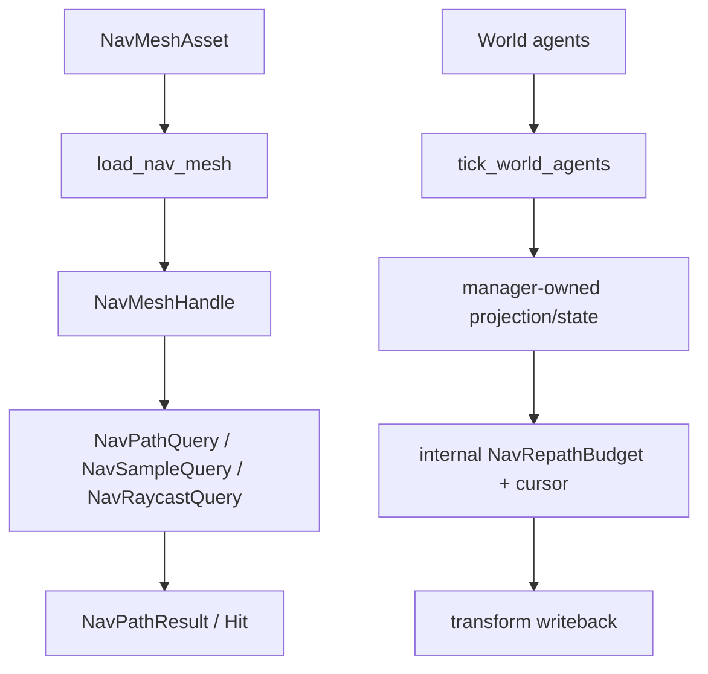

---
related_code:
  - zircon_runtime/src/core/framework/navigation/manager.rs
  - zircon_runtime/src/core/framework/navigation/agent.rs
  - zircon_runtime/src/core/framework/navigation/query.rs
  - zircon_runtime/src/core/framework/navigation/stats.rs
  - zircon_runtime/src/core/framework/navigation/error.rs
  - zircon_runtime/src/navigation/runtime.rs
  - zircon_runtime/src/navigation/repath_budget.rs
  - zircon_runtime/src/navigation/runtime/baked_mesh.rs
  - zircon_runtime/src/scene/navigation.rs
  - zircon_runtime/src/core/framework/navigation/mod.rs
implementation_files:
  - zircon_runtime/src/navigation/runtime
  - zircon_runtime/src/navigation/repath_budget.rs
  - zircon_runtime/src/scene/navigation.rs
plan_sources:
  - user: 2026-09-09 扩展脚本、反射、动画与导航公开接口文档
tests:
  - zircon_runtime/src/navigation/runtime/tests.rs
  - zircon_runtime/src/navigation/runtime/state/repath_entry_tests.rs
doc_type: module-detail
---

# Navigation Runtime、NavMesh 与 Agent

## 能力边界

`BuiltinNavigationManager` 是一个可复用的、带互斥状态的内置导航实现。它可以加载 baked
navmesh、执行路径查询/采样/raycast，并驱动 World 中的 agent；它**不**负责从场景几何
生成 navmesh。`bake_surface` 明确返回 `NavigationErrorKind::BackendFailure`，因此烘焙必须
由导航插件、编辑器 operation 或离线工具完成。内置实现还明确拒绝带
`NavQueryFilter` 的 per-query filter。



## 公开接口

`BuiltinNavigationManager::new()`/`default()` 创建空状态。它实现两个不同的公开 trait；导入
正确 trait 才能以方法语法调用对应接口。

| Trait | 用途 | 关键方法 |
| --- | --- | --- |
| `NavigationManager` | manager/query 侧的 navmesh 与查询服务 | `load_nav_mesh`、`load_navigation_settings`、`find_path`、`find_path_with_filter`、`sample_position`、`raycast`、`stats` |
| `SceneNavigationRuntime` | scene/world 侧的 bake operation 与 agent 写回 | `bake_surface`、`generated_bake_snapshot`、`replace_generated_bake_snapshot`、`tick_world_agents`、`tick_world_agent` |

```rust
use zircon_runtime::core::framework::navigation::{
    NavMeshAsset, NavPathQuery, NavigationManager, DEFAULT_AGENT_TYPE, DEFAULT_AREA_MASK,
};
use zircon_runtime::navigation::BuiltinNavigationManager;
use zircon_runtime::scene::SceneNavigationRuntime;

let manager = BuiltinNavigationManager::new();

// `NavigationManager` trait 提供加载和查询接口。
let nav_mesh = manager.load_nav_mesh(
    NavMeshAsset::simple_quad(DEFAULT_AGENT_TYPE, 20.0),
)?;
let path = manager.find_path(NavPathQuery {
    nav_mesh: Some(nav_mesh),
    start: [-5.0, 0.0, 0.0],
    end: [5.0, 0.0, 0.0],
    agent_type: DEFAULT_AGENT_TYPE.to_string(),
    area_mask: DEFAULT_AREA_MASK,
})?;

// `SceneNavigationRuntime` trait 提供 scene/world 侧接口。
let report = SceneNavigationRuntime::tick_world_agents(&manager, &mut world, dt_seconds)?;
```

完整签名如下：

```rust
trait NavigationManager: Send + Sync {
    fn load_nav_mesh(&self, asset: NavMeshAsset) -> Result<NavMeshHandle, NavigationError>;
    fn load_navigation_settings(&self, settings: NavigationSettingsAsset)
        -> Result<(), NavigationError>;
    fn find_path(&self, query: NavPathQuery) -> Result<NavPathResult, NavigationError>;
    fn find_path_with_filter(&self, query: NavPathQuery, filter: &NavQueryFilter)
        -> Result<NavPathResult, NavigationError>;
    fn sample_position(&self, query: NavSampleQuery)
        -> Result<Option<NavSampleHit>, NavigationError>;
    fn raycast(&self, query: NavRaycastQuery) -> Result<NavRaycastResult, NavigationError>;
    fn stats(&self) -> NavigationRuntimeStats;
}
```

scene/world 侧使用另一套 trait；它的 `World` 借用方向决定了线程边界：烘焙和快照读取
只借用 `&World`/值对象，快照替换和 agent tick 在 owner thread 借用 `&mut World`。

```rust
use zircon_runtime::core::framework::navigation::{
    NavAgentTickReport, NavMeshBakeReport, NavMeshBakeRequest, NavigationError,
    NavigationGeneratedBakeSnapshot,
};
use zircon_runtime::core::math::Real;
use zircon_runtime::scene::{SceneNavigationRuntime, World};

trait SceneNavigationRuntime: Send + Sync {
    fn bake_surface(
        &self,
        world: &World,
        request: NavMeshBakeRequest,
    ) -> Result<NavMeshBakeReport, NavigationError>;
    fn generated_bake_snapshot(
        &self,
        surface_entity: Option<u64>,
    ) -> NavigationGeneratedBakeSnapshot;
    fn replace_generated_bake_snapshot(
        &self,
        snapshot: NavigationGeneratedBakeSnapshot,
    ) -> Result<(), NavigationError>;
    fn tick_world_agents(
        &self,
        world: &mut World,
        dt_seconds: Real,
    ) -> Result<NavAgentTickReport, NavigationError>;
    fn tick_world_agent(
        &self,
        world: &mut World,
        entity: u64,
        dt_seconds: Real,
    ) -> Result<NavAgentTickReport, NavigationError> {
        let _ = entity;
        self.tick_world_agents(world, dt_seconds)
    }
}
```

对 `BuiltinNavigationManager` 使用方法语法时，分别导入
`core::framework::navigation::NavigationManager` 与 `scene::SceneNavigationRuntime`；也可用
UFCS 明确 dispatch：

```rust
let path = NavigationManager::find_path(&manager, query)?;
let report = SceneNavigationRuntime::tick_world_agents(&manager, &mut world, dt_seconds)?;
```

`BuiltinNavigationModule` 注册的是同一个实现的 manager/scene driver；通过
`SceneNavigationRuntimeHandle` 解析 scene driver 时，调用仍分派到上述 trait 实现。

`BuiltinNavigationModule` 将同一个实现注册为内部 runtime driver、公开
`NavigationManager` manager，以及 `SceneNavigationRuntimeHandle` scene driver。应用层应
依赖 trait/handle，而不是触碰 `BuiltinNavigationManager` 的私有状态。

## Query 约束

`NavPathQuery` 的 `start`/`end` 是 `[Real; 3]` 坐标，`nav_mesh` 可选；当为 `None` 时，内置
实现选择当前已加载 handle 中数值最小的一个。`agent_type` 和 `area_mask` 会随查询传入，
但内置 baked mesh 当前主要按其几何和 polygon area 执行查询。没有加载 mesh、指定 handle
不存在或加载空 asset 时返回 `NavigationErrorKind::MissingNavMesh`。

`NavPathResult` 是成功返回的值对象，字段为 `status`、`points`、`length`、
`visited_nodes`；`status` 可为 `Complete`、`Partial` 或 `NoPath`，`NoPath` 不是异常。
`NavSampleQuery` 需要 `position`、`extents`、`agent_type` 和 `area_mask`，成功时返回
`Option<NavSampleHit>`；`NavRaycastQuery` 返回带 `hit`、`position`、`normal`、`distance`
的 `NavRaycastResult`。所有坐标和值都应在调用前保证 finite，extents 应覆盖 agent 的
半径和高度。

## Agent tick

`BuiltinNavigationManager::tick_world_agents(&mut World, dt_seconds)` 先从 World 建立或复用 generation 对齐的
navigation projection，再从保留的 repath cursor 开始轮转 agent。每个 agent 依次处理
destination、stopping distance、缓存路线和必要的 path query；局部避障在写回前调整
movement target，最终通过 `world.update_transform` 提交。超出本帧内部 repath 预算时，
当前 agent 及其后的 agent 留到下一帧，cursor 保证后续帧继续轮转，而不是丢弃路线。

`SceneNavigationRuntime::tick_world_agent` 是按实体调度的 trait 入口；内置 manager 覆盖该
默认实现，只对指定实体运行 agent 决策并返回 `scanned_agents = 1`（实体不存在时返回默认
报告）。它仍可能建立或复用 whole-world projection，因此不应把该入口理解为完全不读取其他
world navigation 行。不要把 trait 的默认实现误认为所有 backend 都会自动提供 targeted tick
语义。

```rust
use zircon_runtime::navigation::BuiltinNavigationManager;
use zircon_runtime::scene::SceneNavigationRuntime;

fn tick_navigation(
    manager: &BuiltinNavigationManager,
    world: &mut zircon_runtime::scene::World,
    dt_seconds: f32,
) -> Result<(), zircon_runtime::core::framework::navigation::NavigationError> {
    let report = SceneNavigationRuntime::tick_world_agents(manager, world, dt_seconds)?;
    if report.blocked_agents > 0 {
        for diagnostic in &report.diagnostics {
            eprintln!("navigation: {diagnostic}");
        }
    }
    Ok(())
}
```

`dt_seconds <= 0` 或非 finite 时返回默认报告，不推进状态。批量 tick 的
`scanned_agents` 会是 0，targeted tick 找不到实体时也返回默认报告；调用方应把这类输入
视为调度错误或无效目标并自行计数。

## Repath budget

`NavRepathBudget` 的结构和 `new`/`begin_frame`/`try_consume` 方法是公开的，但
`BuiltinNavigationManager` 自己在互斥状态中持有并消费一个内部实例（默认
`max_queries_per_frame = 32`）。`tick_world_agents` 和 `tick_world_agent` 没有 budget 参数，
也没有公开 setter；调用方创建另一个 `NavRepathBudget` 不会改变内置 manager 的调度。

它适合自定义 navigation plugin 或宿主自己编排昂贵查询时使用：

```rust
use zircon_runtime::navigation::NavRepathBudget;

let mut budget = NavRepathBudget::new(8);
budget.begin_frame();
if budget.try_consume() {
    // 自定义 backend 的一次 path query；与 BuiltinNavigationManager 无关。
}
```

内置 manager 的预算耗尽表现为内部 cursor 停在当前 agent；`NavAgentTickReport` 不提供
`budget_exhausted` 字段。需要观测预算时，应在自定义 backend 或 telemetry 层记录 query
次数，不能从报告中读取不存在的字段。

## 对照

- Unreal Recast 将烘焙和查询由 NavSystem 管理；Zircon 明确把 bake 交给插件、builtin 只消费 baked 数据。
- Godot NavigationServer 以 map/region/agent handle 分层；Zircon 的 `NavMeshHandle` 只标识已加载 mesh，World agent 仍由 ECS projection 驱动。
- Bevy pathfinding 常由插件异步计算；Zircon 内建查询同步执行，必须依赖 manager 内部
  repath budget 限流。

## 错误恢复

| 症状 | 处理 |
| --- | --- |
| `MissingNavMesh` | 加载非空 baked asset 后重试 |
| `NoPath` | 保持当前位置，记录目标与 agent type |
| filter backend failure | 启用 navigation plugin |
| 无 world transform | report blocked，补齐 Transform |
| budget exhausted | 延迟重算，不清除旧路线 |

## 验收清单

- [ ] bake capability 与 load/query capability 分开展示。
- [ ] 空 mesh、无路径、无 transform 有诊断。
- [ ] 每帧重算受 builtin manager 内部的 `NavRepathBudget` 限制（公开同名类型不负责配置它）。
- [ ] targeted tick 不破坏 retained projection generation。
- [ ] 测试覆盖 query、agent movement、repath cursor。

## 源码与测试

- [navigation runtime](https://github.com/He-Jiahui/ZirconEngine/blob/main/zircon_runtime/src/navigation/runtime.rs)
- [budget](https://github.com/He-Jiahui/ZirconEngine/blob/main/zircon_runtime/src/navigation/repath_budget.rs)
- [baked mesh](https://github.com/He-Jiahui/ZirconEngine/blob/main/zircon_runtime/src/navigation/runtime/baked_mesh.rs)
- [runtime tests](https://github.com/He-Jiahui/ZirconEngine/blob/main/zircon_runtime/src/navigation/runtime/tests.rs)

## 查询返回值

`NavPathResult` 的字段是 `status`、`points`、`length` 和 `visited_nodes`，不带诊断数组；
`NavPathStatus::NoPath` 是合法结果，不等同于 `NavigationError`。`NavSampleHit` 表示采样
位置、距离和所属区域；`NavRaycastResult` 的字段是 `hit`、`position`、`normal` 和
`distance`，backend failure 通过外层 `Result` 返回。调用方必须处理所有枚举分支。

`NavAgentTickReport` 是 tick 的逐帧结果值对象，字段如下：

| 字段 | 含义 |
| --- | --- |
| `scanned_agents` | 本次入口实际扫描的 agent 数 |
| `moved_agents` | 成功调用 `World::update_transform` 的 agent 数 |
| `blocked_agents` | 无 transform、无路径或写回失败的 agent 数 |
| `traversing_agents` / `queued_link_agents` | off-mesh traversal 计数（builtin 当前保持默认值） |
| `off_mesh_events` | off-mesh traversal 事件列表 |
| `diagnostics` | 可操作的文本诊断 |
| `arrived_agents` / `no_path_agents` | 生产到达/无路径结果（空时不序列化；builtin 当前不追加这些行） |
| `debug_agents` | 仅启用 `NavigationDebugCapture` 的 producer 才填充的调试行 |

## mesh handle 所有权

`NavMeshHandle` 只在 manager 实例的加载表内有效；不能序列化为跨进程 ID，也没有公开的
unload/select API。查询显式传入 handle 时必须仍由同一个 manager 持有；传 `None` 时，内置
实现选择当前加载 handle 中数值最小的一个。通过 generated bake snapshot 替换资源时，
runtime 会在 owner 状态中移除旧的 generated handle，再为非空 asset 创建新 handle；调用方
不应缓存旧 handle 或假设存在可手动切换的 selected mesh。

## agent 字段策略

| 字段 | 约束 |
| --- | --- |
| destination | None 表示停止并清除路线 |
| speed | 负值按 0 处理 |
| radius/height | sample extents 至少覆盖安全下限 |
| stopping_distance | clamp 到非负 |
| update_position | false 时清除缓存路线并跳过移动写回 |
| update_rotation | false 时保持原旋转 |
| agent_type/area_mask | 参与 repath cache key |

## 运行时统计

`NavigationRuntimeStats` 是 manager 返回的轻量快照，当前字段只有
`loaded_nav_meshes`、`active_agents`、`active_obstacles`、`active_off_mesh_links` 和
`active_off_mesh_bridges`。其中 agent/obstacle 计数在 world tick 扫描 projection 时更新，
loaded mesh 计数在加载或 generated snapshot 替换时更新；当前 builtin 对 off-mesh 两项保持
默认值。`repath_queries`、blocked 数、
diagnostics 和最后错误不属于该结构；它们分别只能从内部 telemetry/test instrumentation
或本帧 `NavAgentTickReport` 获取。不要在 API 文档或序列化协议中添加不存在的字段。

## 场景变化

World generation 改变后 retained projection 需要更新 generation。障碍物、agent transform 和目标变化可以触发 repath；小幅位置变化优先复用缓存路线，超过阈值再 query。

## 安全测试

- 空 baked mesh 拒绝。
- 非 finite dt 不移动。
- 无 transform agent 计为 blocked。
- 自定义 `NavRepathBudget::new(0)` 不执行自定义 backend 的 path query；它不会配置内置 tick。
- filter 在 builtin 返回 backend failure。
- targeted tick 不影响其他 agent cursor。
