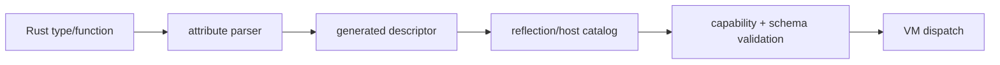

---
related_code:
  - zircon_runtime/reflection_macros/src/function.rs
  - zircon_runtime/reflection_macros/src/module.rs
  - zircon_runtime/reflection_macros/src/derive_type.rs
  - zircon_runtime/reflection_macros/src/attrs.rs
  - zircon_reflect_derive/src/attributes.rs
implementation_files:
  - zircon_runtime/reflection_macros/src
  - zircon_reflect_derive/src
plan_sources:
  - user: 2026-09-09 扩展脚本、反射、动画与导航公开接口文档
tests:
  - zircon_runtime/reflection_macros/src/tests.rs
  - zircon_reflect_derive/src/tests.rs
  - zircon_runtime/src/script/vm/tests/reflection_docs.rs
doc_type: module-detail
---

# 反射与 Host 宏的编写指南

## 宏的职责

`#[derive(ZrReflect)]` 生成反射类型注册；`#[derive(ZirconScriptType)]` 生成脚本类型 schema；`#[zircon_host_function]` 把 Rust 函数转换成 host descriptor；`#[zircon_host_module]` 收集模块内函数并生成 module descriptor。宏只生成描述和桥接代码，不负责 capability 授权或生命周期。



## 类型 derive 约定

类型路径必须稳定、全限定，并带正确 plugin owner。公开字段应使用可迁移的 schema 类型；包含裸指针、锁、线程句柄或平台对象的结构不应直接 derive。重命名字段时保留旧 `ReflectFieldId` 的迁移映射。

```rust
#[derive(ZirconScriptType)]
#[zircon_script(path = "gameplay::Health", plugin = "gameplay")]
pub struct Health {
    pub current: f32,
    pub maximum: f32,
}
```

上例为调用形状，具体属性键以 `attrs.rs` 当前解析器为准；未知属性应让宏在编译期报错，不要通过 `allow` 静默忽略。

## Host function 约定

Host function 应明确输入、输出和错误类型，并避免隐式全局状态。函数 descriptor 需要 module/function 名、capability、参数 schema、返回 schema。宏生成的包装器负责把 VM value 转为 Rust 类型、捕获 callback panic，并把错误映射为 `VmError`。

```rust
#[zircon_host_function(capability = "gameplay.read")]
fn read_health(ctx: &VmPluginHostContext, entity: u64)
    -> Result<f32, VmError> {
    let _ = (ctx, entity);
    Ok(100.0)
}
```

不要在 host wrapper 中调用阻塞 IO、持有 World 可变借用跨越另一个 callback，或把脚本字符串拼成 Rust 代码。

## Module 宏与命名

模块名应使用反向域名或插件命名空间，例如 `gameplay.combat`。函数名在 module 内唯一；跨 module 重名没有问题，但诊断必须打印完整路径。`zircon_host_module` 生成的注册函数应只在插件 activation 阶段调用一次。

## 编译期失败

常见错误是属性参数缺失、函数不是合法 `fn`、返回类型不是 `Result`/可转换值、重复导出名、不可反射字段和 owner 缺失。优先修复编译错误；不要在运行时动态猜测 descriptor。

## 对照与取舍

- Unreal UHT 在构建期生成反射代码；Zircon proc macro 更局部，适合插件独立编译。
- Godot GDExtension 依赖运行时注册；Zircon 将 schema 生成前移，运行时只做版本/能力校验。
- Bevy derive 偏组件反射；Zircon host macro 还必须输出 ABI 调用合同。

## 验收清单

- [ ] derive 类型路径和 plugin owner 稳定。
- [ ] host function 有显式 capability、schema、错误。
- [ ] module 注册只发生一次且可撤销。
- [ ] 宏测试覆盖非法属性、重复名称、panic/error 映射。
- [ ] 生成 API 文档与实际 descriptor 一致。

## 源码与测试

- [function macro](https://github.com/He-Jiahui/ZirconEngine/blob/main/zircon_runtime/reflection_macros/src/function.rs)
- [module macro](https://github.com/He-Jiahui/ZirconEngine/blob/main/zircon_runtime/reflection_macros/src/module.rs)
- [derive macro](https://github.com/He-Jiahui/ZirconEngine/blob/main/zircon_runtime/reflection_macros/src/derive_type.rs)
- [derive tests](https://github.com/He-Jiahui/ZirconEngine/blob/main/zircon_reflect_derive/src/tests.rs)

## 宏生成物检查

CI 应检查生成 descriptor 的 type path、module/function 名、参数数量、错误类型和 capability。宏升级后先运行 trybuild/compile-fail 测试，再更新运行时 fixtures。不要依赖展开代码的私有函数名。

## 泛型与生命周期

反射类型优先使用 concrete struct；泛型需为每个实例提供稳定 path。带生命周期引用、`Rc`、`MutexGuard`、裸指针的函数参数不应直接暴露给 VM，应转换为 handle 或 owned DTO。

## 返回值策略

简单标量可直接返回；复杂结果使用 serializable DTO；失败统一 `Result<T, VmError>`。宏包装器应保留 source location，以便诊断显示 Rust 文件和函数名。

## 安全审查

审查属性是否扩大 capability、module 是否暴露文件/网络、字段读写是否绕过 validation。发布前生成 host markdown，人工检查每个 export 的最小权限。

## 迁移 checklist

- [ ] 先新增新 path，再迁移调用方。
- [ ] 保留旧 field id 映射和 deprecation 诊断。
- [ ] 更新 reflection docs fixture。
- [ ] 跑 derive、macro、VM dispatch 三层测试。
- [ ] 检查 server/profile 下宏生成物仍可编译。
