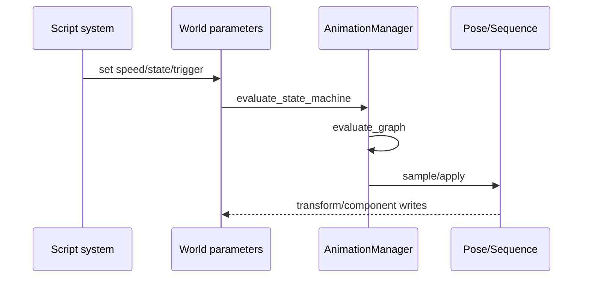

---
related_code:
  - zircon_runtime/src/script/vm/scene_system.rs
  - zircon_runtime/src/animation/manager/mod.rs
  - zircon_runtime/src/animation/sequence/compiled.rs
  - zircon_runtime/src/dynamic_api/session/script_systems.rs
implementation_files:
  - zircon_runtime/src/script/vm/scene_system.rs
  - zircon_runtime/src/animation
  - zircon_runtime/src/dynamic_api/session/script_systems.rs
plan_sources:
  - user: 2026-09-09 扩展脚本、反射、动画与导航公开接口文档
tests:
  - zircon_runtime/src/script/vm/tests
  - zircon_runtime/src/animation/sequence/tests.rs
  - zircon_runtime/src/dynamic_api/session/tests/vampire_gameplay.rs
doc_type: workflow-detail
---

# Script 与 Animation 集成方案

## 推荐数据流

脚本只写 gameplay intent 和动画参数；动画 manager 在固定/更新阶段读取参数、评估 graph/state machine，再把 pose/sequence 应用到 World。这样脚本不直接持有骨骼数组，也不跨线程访问渲染资源。



## 固定与更新阶段

使用 `SCRIPT_SCENE_FIXED_UPDATE_SYSTEM` 处理确定性 gameplay 参数和网络输入；使用 `SCRIPT_SCENE_UPDATE_SYSTEM` 处理表现层播放头、blend 和 sequence。`ScriptSceneRuntimeSystem::run` 接收 `RuntimeSceneSystemContext`，system 之间通过 typed components/资源通信。

```rust
// 示意：脚本 host callback 只修改参数，不直接采样 GPU。
fn set_locomotion(manager: &DefaultAnimationManager,
    parameters: &mut AnimationParameterMap, speed: f32) {
    manager.set_parameter(parameters, "speed".into(),
        AnimationParameterValue::Float(speed));
}
```

## 状态机到 graph

状态机 evaluation 返回 `active_state`、`transition` 和 graph reference。应用方应先判断 `transitioned`，再更新播放头；同一帧不要同时执行旧 graph 和新 graph 的根输出。Triggered 参数应在消费后由 gameplay 层清除或转换为 one-shot 事件。

## 序列覆盖

Sequence 适合过场、编辑器预览和属性驱动动画；状态机/graph 适合持续 locomotion。两者同时写同一 track 时，必须定义优先级：通常 gameplay pose 先生成，sequence 作为显式 override layer，结束后恢复 graph 参数。

## 热重载集成

脚本 plugin reload 可能改变参数名或反射字段。reload 前保存 animation parameter map 和 sequence playback time；catalog commit 后用 type path/field id 恢复，无法匹配则使用 graph 默认值并产生诊断。不要使用字符串模糊匹配自动迁移关键 gameplay 状态。

## 性能与确定性

- graph/clip asset 只读，可并行评估；World 写回集中在 apply 阶段。
- 对同一 skeleton 的 clips 共享采样缓存和 track path normalization。
- fixed update 使用固定 dt，render update 可插值但不回写 gameplay 状态。
- 避免脚本每帧创建新 `AnimationParameterMap`；维护实体级 map。
- 将动画诊断按 entity/asset 去重，避免日志放大。

## 安全边界

脚本可写参数必须由 host capability 授权；禁止脚本传入任意 track path 后修改未知组件。所有浮点参数 finite 校验，速度/权重 clamp 在 manager 层执行，不能只相信脚本输入。

## 常见问题

| 症状 | 根因 | 处理 |
| --- | --- | --- |
| 状态不切换 | 参数缺失或 NaN | 检查 parameter defaults 与 finite 校验 |
| 动画抖动 | fixed/update 同时写 transform | 明确单一写回阶段 |
| reload 后姿态丢失 | sequence compiled 过期 | `is_current_for` 后重编译 |
| 脚本能改任意组件 | host capability 过宽 | 缩小 schema/operation scope |

## 验收清单

- [ ] gameplay 参数只在授权 host 中写入。
- [ ] fixed/update 的动画责任明确。
- [ ] graph 与 sequence 的覆盖优先级有测试。
- [ ] reload 保存/恢复参数与播放时间。
- [ ] 相同输入下 fixed update 可重放。

## 源码与测试

- [scene systems](https://github.com/He-Jiahui/ZirconEngine/blob/main/zircon_runtime/src/script/vm/scene_system.rs)
- [animation manager](https://github.com/He-Jiahui/ZirconEngine/blob/main/zircon_runtime/src/animation/manager/mod.rs)
- [sequence](https://github.com/He-Jiahui/ZirconEngine/blob/main/zircon_runtime/src/animation/sequence/compiled.rs)
- [script systems](https://github.com/He-Jiahui/ZirconEngine/blob/main/zircon_runtime/src/dynamic_api/session/script_systems.rs)

## 端到端示例（调用形状）

```rust
fn update_character(
    animation: &DefaultAnimationManager,
    machine: &AnimationStateMachineAsset,
    graph: &AnimationGraphAsset,
    params: &mut AnimationParameterMap,
    speed: f32,
) {
    animation.set_parameter(params, "speed", AnimationParameterValue::Float(speed));
    let sm = animation.evaluate_state_machine(machine, Some("Locomotion"), params);
    let selected = sm.graph.as_ref().unwrap_or(graph);
    let eval = animation.evaluate_graph(selected, params);
    // 后续按 eval.clips 采样并写回 World。
    let _ = eval;
}
```

## 优先级表

| 层 | 可写内容 | 不可写内容 |
| --- | --- | --- |
| script fixed | gameplay parameters, triggers | GPU resources |
| animation manager | evaluated clips/pose | arbitrary script memory |
| sequence | declared track targets | undeclared components |
| render extract | immutable pose snapshot | gameplay state |

## 网络回放

网络层只同步参数、state transition 事件和固定 tick；客户端本地采样 clip。发生 desync 时比较 state machine active state、parameter map、asset revisions 和 World generation。

## 性能剖析

将脚本 host call、parameter update、graph evaluation、pose sampling、World writeback 分段计时。大量角色使用相同 graph 时共享只读 evaluation plan；每个实体只保存参数和播放时间。

## 安全检查

对脚本可写参数建立白名单；对 sequence track path 做 owner/asset scope 校验；所有触发器和权重限制 cardinality，防止脚本构造百万个节点或 target。
