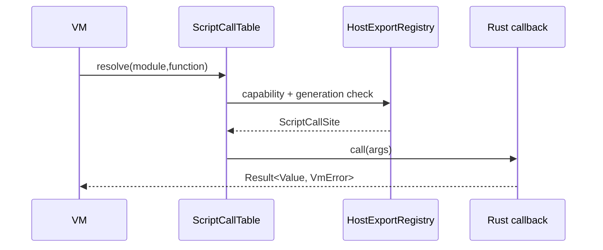

---
related_code:
  - zircon_runtime/src/script/vm/host/script_call_table.rs
  - zircon_runtime/src/script/vm/host_interface/registry.rs
  - zircon_runtime/src/script/vm/host/mod.rs
  - zircon_runtime/src/script/vm/module/script_module.rs
implementation_files:
  - zircon_runtime/src/script/vm/host
  - zircon_runtime/src/script/vm/host_interface
plan_sources:
  - user: 2026-09-09 扩展脚本、反射、动画与导航公开接口文档
tests:
  - zircon_runtime/src/script/vm/tests/host_interfaces.rs
  - zircon_runtime/src/script/vm/tests
doc_type: module-detail
---

# Script Host、模块与函数合同

## Host 的边界

Host module 是脚本访问 ZirconEngine 的唯一稳定边界。`register_builtin_host_modules` 发布内建模块；`register_bridge_host_module` 发布跨域 bridge；`register_gameplay_host_module` 发布游戏逻辑入口。每个函数都包含 module 名、function 名、能力名、参数/返回 schema 和错误策略。



## `ScriptCallTable`

- `ScriptCallSiteId::raw()`：取得稳定的 dense u32 槽位。
- `ScriptCallSite::{id,module_name,function_name,descriptor}`：读取调用点元数据。
- `ScriptCallSite::call(...)`：通过当前 host context 执行，不应缓存底层函数指针。
- `ScriptCallTable::{generation,len,is_empty,get,resolve,call}`：查询表版本、按 ID 或名称调用。

表的 `generation` 在热重载后变化；旧 ID 只能用于诊断，调用前应重新 `resolve`。解析失败返回 `None`，执行失败返回 `VmError`，两者必须分别记录。

## Host interface 注册

`VmHostInterfaceRegistry` 的四个注册入口：

```rust
registry.register_system(&caller, "combat.tick", VmSystemStage::Update,
    "gameplay", "combat_tick")?;
registry.register_behavior_node(&caller, "combat.attack", "Attack",
    "gameplay", "attack_node")?;
registry.register_rpc_handler(&caller, "combat.damage", schema,
    "network", "damage_rpc")?;
registry.register_editor_operation(&caller, "game.combat.damage",
    "editor", "apply_damage")?;
```

`VmInterfaceCaller` 携带 slot、generation、package owner 与 `CapabilitySet`。注册前会校验能力、标识符和 callback target；重复同 generation 的 id 返回注册冲突。`VmSystemStage` 只有 `FixedUpdate`、`Update`、`Last`，不要自行创建字符串阶段。

## capability 约束

| capability 常量 | 用途 |
| --- | --- |
| `VM_SYSTEM_CAPABILITY` | 定时 system |
| `VM_BT_NODE_CAPABILITY` | 行为树节点 |
| `VM_RPC_HANDLER_CAPABILITY` | RPC handler |
| `VM_EDITOR_OPERATION_CAPABILITY` | 编辑器命令 |

能力检查失败、非法 id、缺少 callback 和 slot generation 不匹配都归入 `VmHostInterfaceError`。插件应把错误作为加载失败处理，而不是发布“空实现”。

## scene system 时序

`ScriptSceneRuntimeSystem::fixed_update()` 和 `update()` 生成固定 system id；`run(RuntimeSceneSystemContext)` 读取当前 World/时间并执行 active snapshot。`Last` 阶段用于收尾和诊断。脚本不能在 `FixedUpdate` 内直接改变渲染提交顺序；应通过 World 组件或 host request 传递意图。

## 设计与其他引擎对照

- Unreal 将 Blueprint event 绑定到 UObject；Zircon 用 capability + generation 使绑定可撤销。
- Godot 的 GDScript 方法按节点查找；Zircon 用 dense callback handle 减少字符串查找，但仍保留名称用于诊断。
- Bevy system schedule 强调阶段与资源借用；`VmSystemStage` 同样要求确定性阶段，但脚本 VM 借用由 host context 封装。

## 安全与性能

回调中不要持有 registry 锁、不要跨 await 保存 `&mut World`、不要把脚本传入的字符串直接当路径。批量 system 查询应使用 `systems(slots, stage)` 一次获取快照；单个 callback 调用才使用 `resolve_callback`。对 RPC payload 执行大小和 schema 校验，拒绝未知字段或超限数组。

## 负例

```rust
// 错误：缓存上一代 handle，热重载后直接调用。
let old = table.resolve("gameplay", "tick").unwrap();
// ... reload ...
old.call(ctx, args); // 可能得到 MissingCallbackTarget
```

正确做法是 reload 后重新获取表 generation，再解析 module/function。

## 验收清单

- [ ] 每个导出都有 capability 与 schema。
- [ ] system id、operation 使用稳定命名空间。
- [ ] 旧 generation 的注册在 stop/reload 时撤销。
- [ ] callback 失败可追踪到 slot、generation、module、function。
- [ ] 测试覆盖 duplicate、denied、missing target 和 stage 顺序。

## 源码

- [call table](https://github.com/He-Jiahui/ZirconEngine/blob/main/zircon_runtime/src/script/vm/host/script_call_table.rs)
- [interface registry](https://github.com/He-Jiahui/ZirconEngine/blob/main/zircon_runtime/src/script/vm/host_interface/registry.rs)
- [host exports](https://github.com/He-Jiahui/ZirconEngine/blob/main/zircon_runtime/src/script/vm/host/mod.rs)

## 接口逐项说明

| 接口 | 作用 | 失败信号 |
| --- | --- | --- |
| `HostRegistry::register_module` | 发布模块 descriptor | duplicate/invalid module |
| `HostRegistry::resolve` | 按模块名查找 | `None` |
| `HostExportRegistry::register` | 保存导出函数 | capability error |
| `HostExportRegistry::get` | 查询导出 | missing export |
| `ScriptCallSite::call` | 调用单个函数 | `VmError` |
| `ScriptCallTable::resolve` | 名称到 dense slot | `None` |
| `ScriptCallTable::generation` | 读取表代次 | stale check |
| `VmHostInterfaceRegistry::intern_callback` | 建立 callback 槽 | missing owner |
| `register_system` | 注册定时 system | denied/duplicate |
| `register_behavior_node` | 注册 BT node | denied/duplicate |
| `register_rpc_handler` | 注册 RPC | bad schema |
| `register_editor_operation` | 注册 editor op | bad path |
| `resolve_callback` | 刷新 callback generation | missing target |
| `systems` | active systems 快照 | 空列表表示无 active |
| `behavior_nodes` | active BT 快照 | 空列表表示无 active |
| `rpc_handlers` | active RPC 快照 | 空列表表示无 active |
| `editor_operations` | active editor 快照 | 空列表表示无 active |

## 标识符语法

system、behavior node、RPC id 使用单段或点分命名，禁止空白、控制字符和无限长度。editor operation 必须是三段路径（domain.group.command）；解析失败不要在运行时截断。module/function 名采用 ASCII 优先，显示名可含 Unicode 但必须有长度上限。

## 调用上下文

`VmInterfaceCaller` 的 slot/generation 由 manager 创建，插件不能伪造。调用 callback 时 host context 提供当前 frame、World 访问权限和 capability snapshot。跨帧保存 caller 需要重新验证 active generation；跨 session 复用 caller 一律拒绝。

## 确定性

registry 返回值按注册 key 排序；不要依赖 Mutex 插入顺序。FixedUpdate system 不得读取 wall clock 或随机全局状态；随机数使用 runtime random service。RPC handler 的执行顺序按 id 稳定排序，长任务转为事件。

## 测试矩阵

| 测试 | 必须断言 |
| --- | --- |
| capability denied | 没有副作用 |
| duplicate id | 旧 descriptor 保留 |
| stale generation | 先 refresh 再调用 |
| missing callback | 返回 slot/module/function |
| stage ordering | Fixed -> Update -> Last |
| poisoned lock | registry 可恢复 |
| panic callback | 变成 `VmError` |
| RPC schema mismatch | payload 不进入 handler |

## 操作员排错

看到“函数不存在”时先查看 table generation、module/function 全名、slot state；不要只看脚本源文件。看到“权限拒绝”时检查 package manifest capability 和 active snapshot。看到“回调偶发失效”时检查是否缓存旧 `ScriptCallSiteId`。

## 迁移建议

从字符串命令迁移到 host interface 时，先给 operation 增加 schema，再保留一层兼容解析；兼容层不得绕过 capability。删除旧函数前发布 deprecation diagnostics，等所有插件 generation 更新后再移除。

## Rust 类型映射

| Rust | VM DTO | 约束 |
| --- | --- | --- |
| `bool` | Bool | 无隐式数字转换 |
| `i32/u32` | Int | 检查范围 |
| `f32/f64` | Float | finite |
| `String` | Utf8 | 长度上限 |
| `Vec<T>` | Array | 元素数上限 |
| handle newtype | Handle | slot/generation |
| `Result<T,E>` | status + payload | E 可序列化 |

## Host 回调模板

```rust
fn callback(ctx: &VmPluginHostContext, args: VmValue)
    -> Result<VmValue, VmError> {
    let input = decode_args(args)?;
    ctx.require_capability("gameplay.read")?;
    let output = execute_read(ctx, input)?;
    encode_output(output)
}
```

模板中 helper 代表现有 host 转换器；真实实现应复用 crate 提供的边界逻辑。

## 事件与 RPC

RPC handler 只处理已验证 schema，业务事件通过 queue 返回。handler 不应同步等待网络响应；使用 request id 关联异步 completion。editor operation 需要 transaction scope，不能直接修改持久资产。
