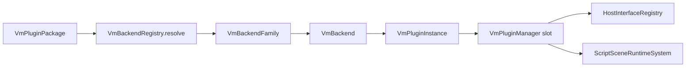

---
related_code:
  - zircon_runtime/src/script/vm/backend/vm_backend.rs
  - zircon_runtime/src/script/vm/backend/backend_registry.rs
  - zircon_runtime/src/script/vm/runtime/vm_plugin_manager.rs
  - zircon_runtime/src/script/vm/plugin/vm_plugin_package.rs
implementation_files:
  - zircon_runtime/src/script/vm/backend
  - zircon_runtime/src/script/vm/runtime
plan_sources:
  - user: 2026-09-09 扩展脚本、反射、动画与导航公开接口文档
tests:
  - zircon_runtime/src/script/vm/tests
  - zircon_runtime/src/script/vm/backend/backend_registry.rs
doc_type: module-detail
---

# VM Backend 与插件管理器

## 解决的问题

脚本调用必须在不绑定某一种语言实现的前提下完成。`VmBackend` 只描述“把一个已发现的 `VmPluginPackage` 载入为 `VmPluginInstance`”，`VmBackendFamily` 负责把 selector（例如 `lua:jit` 或 `wasm:component`）解析成 backend。`VmBackendRegistry` 是共享解析表，`VmPluginManager` 则负责 slot、generation、能力、GC 和脚本场景系统。



## 核心 trait

```rust
use zircon_runtime::script::{VmBackend, VmError, VmPluginHostContext,
    VmPluginInstance, VmPluginPackage};

struct WasmBackend;
impl VmBackend for WasmBackend {
    fn backend_name(&self) -> &str { "wasm:component" }
    fn load_package(
        &self,
        package: &VmPluginPackage,
        host: &VmPluginHostContext,
    ) -> Result<Box<dyn VmPluginInstance>, VmError> {
        // 校验 manifest/backend selector、能力和 payload 后再实例化。
        let _ = (package, host);
        Err(VmError::BackendUnavailable("wasm backend not linked".into()))
    }
}
```

`VmBackend` 必须是 `Send + Sync`；实现不能把非线程安全的 VM 状态藏在共享 backend 对象中。实例级状态放入 `VmPluginInstance`，并由 manager 在脚本阶段调用。

## selector 解析规则

| 调用 | 行为 |
| --- | --- |
| `VmBackendRegistry::new()` | 创建空 registry |
| `register_family(Arc<dyn VmBackendFamily>)` | 以 `family_name()` 覆盖同名 family，返回名称 |
| `resolve("family:backend")` | 先定向调用 family，再返回 backend |
| `resolve("backend")` | 按注册 family 顺序尝试 |
| `contains(selector)` | `resolve(selector).is_ok()` |
| `names()` | 汇总并排序去重所有 selector |

未知 selector 返回 `VmError::UnknownBackend(String)`；不能把该错误静默降级为 `UnavailableVmBackend`，否则能力报告会与实际执行路径不一致。

## manager 的公开查询

`VmPluginManager` 提供 backend registry、host registry、host exports/interfaces、reflection catalog、slot 记录和已注册 system/behavior/RPC/editor operation 的只读访问器。典型生命周期为：

1. discovery 生成 `VmPluginPackage`。
2. manager 分配 `PluginSlotId`，校验 `VmPluginManagementPolicy`。
3. backend `load_package` 返回实例，发布 host registrations。
4. slot 进入 running，按 `VmSystemStage::{FixedUpdate,Update,Last}` 执行。
5. 停止时先撤销 generation，再执行状态迁移/GC，最后释放实例。

`registered_systems(stage)`、`registered_behavior_nodes()`、`registered_rpc_handlers()`、`registered_editor_operations()` 返回确定性排序的快照，调用方不应持有内部锁或假定返回值实时更新。

## Host context 与能力

`VmPluginHostContext` 是 backend 装载期的只读/受限入口。插件必须通过 capability 声明获取能力；Host 回调不应直接访问 `wgpu::Device`、编辑器窗口或任意文件系统。能力缺失时使用 `VmHostInterfaceError::CapabilityDenied`（具体变体以当前源码为准）向上报告。

## 失败与恢复

| 失败 | 处理 |
| --- | --- |
| backend 不存在 | 标记 package load failed，显示 `UnknownBackend` |
| backend 已注册但不可用 | 保留诊断，不执行脚本，等待 profile/插件提供实现 |
| 实例初始化 panic | manager 捕获边界 panic，slot 回滚到 stopped |
| generation 注册冲突 | 保留旧 generation，拒绝新注册 |
| host 回调目标丢失 | 返回 `MissingCallbackTarget`，不要调用过期函数槽 |

## 线程与所有权

registry 使用 `Arc<Mutex<...>>`，锁中只做 selector/descriptor 操作；VM 执行应在调度阶段完成。`VmPluginInstance` 归 manager 的 slot 所有，返回给调用方的 registration 是值快照。跨线程发送 callback handle 前，必须在目标帧以 `resolve_callback` 刷新 generation。

## 最小验收清单

- [ ] family 名称唯一，selector 带 family 前缀。
- [ ] `load_package` 对 payload、manifest、capability 都执行边界校验。
- [ ] backend unavailable 不冒充成功实例。
- [ ] stop/reload 前撤销旧 generation 的 systems 和 callbacks。
- [ ] 测试覆盖未知 selector、锁中毒恢复和重复注册。

## 源码与测试

- [backend trait](https://github.com/He-Jiahui/ZirconEngine/blob/main/zircon_runtime/src/script/vm/backend/vm_backend.rs)
- [registry](https://github.com/He-Jiahui/ZirconEngine/blob/main/zircon_runtime/src/script/vm/backend/backend_registry.rs)
- [manager](https://github.com/He-Jiahui/ZirconEngine/blob/main/zircon_runtime/src/script/vm/runtime/vm_plugin_manager.rs)
- [backend registry tests](https://github.com/He-Jiahui/ZirconEngine/blob/main/zircon_runtime/src/script/vm/backend/backend_registry.rs)

## 公开符号速查

| 符号 | 输入/输出 | 使用时机 | 注意事项 |
| --- | --- | --- | --- |
| `BuiltinVmBackendFamily` | backend family 实现 | 内建 backend 注册 | 不代表 backend 一定可执行 |
| `VmBackendFamily::family_name` | `&self -> &str` | selector 命名 | 返回值必须稳定 |
| `VmBackendFamily::resolve` | selector -> `Arc<dyn VmBackend>` | 载入前 | 失败返回 `VmError` |
| `VmBackendRegistry::register_family` | `Arc<dyn VmBackendFamily> -> String` | 启动注册 | 同名覆盖 |
| `VmBackendRegistry::resolve` | `&str -> Result<Arc<dyn VmBackend>, VmError>` | package load | 先按 family 定向解析 |
| `UnavailableVmBackend` | backend placeholder | feature 缺失 | 不能创建 running slot |
| `VmPluginManager::list_slots` | `Vec<VmPluginSlotRecord>` | UI/诊断 | 返回快照 |
| `VmPluginManager::coordinator` | `&HotReloadCoordinator` | reload 协调 | 不跨线程持有执行借用 |
| `VmPluginManager::reflection_catalog` | `VmReflectionCatalog` | 类型同步 | clone 是共享 catalog |

## Feature gate 与 profile

| 配置 | 结果 |
| --- | --- |
| `script` 未启用 | `zircon_runtime::script` 不提供 VM 执行能力 |
| `script` 启用、无具体 backend | 只能列出 selector，load 返回 unavailable |
| server profile | 可保留 host/反射合同，但通常不启用图形依赖 |
| dynamic-api | 额外提供外部 session 入口，不改变 VM backend 选择 |

启动时应先读取 profile capability，再决定是否调用 discovery。避免扫描一个 profile 明确禁止的插件目录。

## 完整时序示例

```text
1. VmBackendRegistry::new
2. register_family(Arc::new(MyFamily))
3. discover_vm_plugin_packages_with_limits(request, limits)
4. 对每个 DiscoveredVmPluginPackage 校验 manifest
5. VmPluginManager 分配 slot/generation
6. VmBackend::load_package(package, host_context)
7. HostInterfaceRegistry 发布 callback/system
8. ReflectionCatalog prepare + commit
9. slot state=Running
10. scene system 按 FixedUpdate/Update/Last 执行
```

任何一步失败都必须包含 package、slot 和阶段字段；第 8 步失败时第 6/7 步的注册需要回滚。

## VmError 分类

调用方至少区分：

- `UnknownBackend(selector)`：没有 family 能解析 selector。
- `BackendUnavailable(detail)`：selector 存在但实现未链接或能力不满足。
- `Operation(detail)`：backend 执行期业务错误。
- `Host(...)`/`Reflection(...)`：跨模块注册或 schema 错误（具体包装变体以源码为准）。

日志只记录 detail 的摘要，用户界面使用稳定 code；不要匹配错误字符串作为控制流。

## 负例测试模板

```rust
#[test]
fn unknown_selector_is_not_unavailable() {
    let registry = VmBackendRegistry::new();
    let error = registry.resolve("missing:vm").unwrap_err();
    assert!(matches!(error, VmError::UnknownBackend(_)));
}
```

还应测试同名 family 覆盖、qualified selector 不回退到其他 family、`names()` 排序去重、锁 poison 后 registry 仍可读写，以及 backend load 失败时 slot 保持非 running。

## 资源和 GC 关系

backend 只拥有 VM 实例；对象 root 由 `VmGcRootRegistry` 管理。manager 停止顺序应是：停止新 callback、flush pending system、撤销 root、执行有预算 GC、释放实例。不要让 backend `Drop` 隐式执行无限 GC。

## 生产运维

启动日志输出 backend selector、backend_name、profile、manifest digest；运行时输出 slot/generation 和 callback count。热重载完成后比较旧/新 descriptor 数，发现异常增长时触发泄漏诊断。发布包应固定 manifest hash，开发包才允许目录扫描。

## Backend 接入步骤

1. 定义 `VmBackendFamily`，返回稳定 family name。
2. 为每个 selector 实现 `resolve`，未知 selector 返回 `UnknownBackend`。
3. 在 `load_package` 中验证 payload digest、执行模式和 capability。
4. 返回实现了 `VmPluginInstance` 的 boxed instance。
5. 编写 registry、load failure、reload rollback 测试。

backend 不应直接注册 host interface；由 manager 在实例成功创建后统一注册，保证失败时没有孤儿 descriptor。

## Slot 状态观察

`VmPluginSlotRecord` 至少关联 slot id、package name、generation、state 和 backend selector。UI 需要将 `Loading`、`Running`、`Stopping`、`Failed` 区分显示。状态快照为只读值，不能通过修改返回结构改变 manager。

## 最小集成验收

```text
resolve selector -> load package -> publish host -> publish reflection
-> execute one FixedUpdate -> stop -> assert no active callbacks
```

该流程应在无图形 profile 下执行，证明 VM manager 不隐式依赖 GPU。
