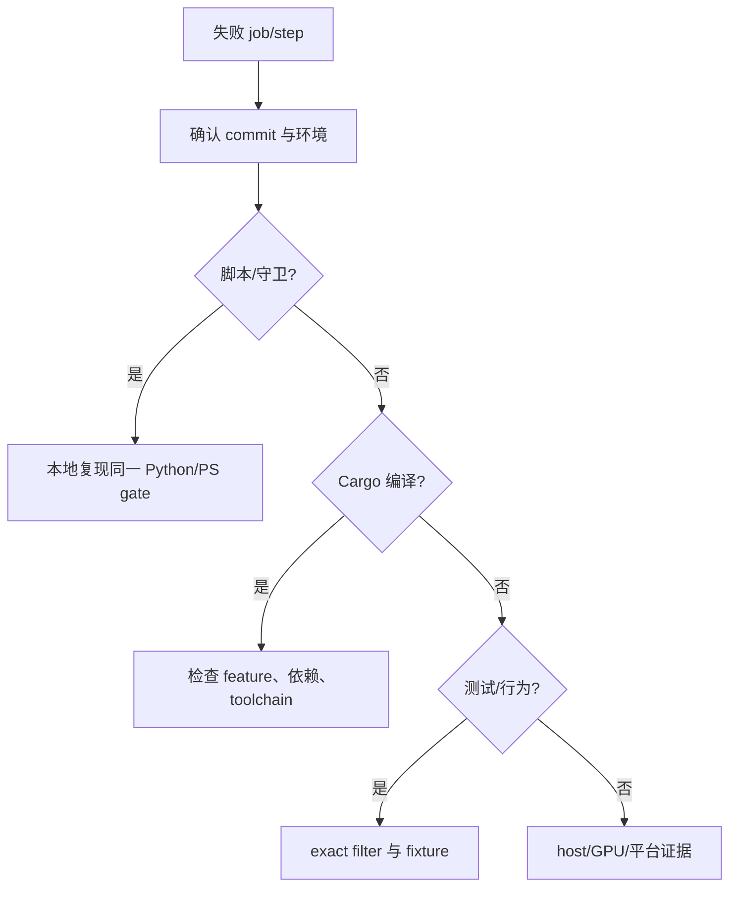
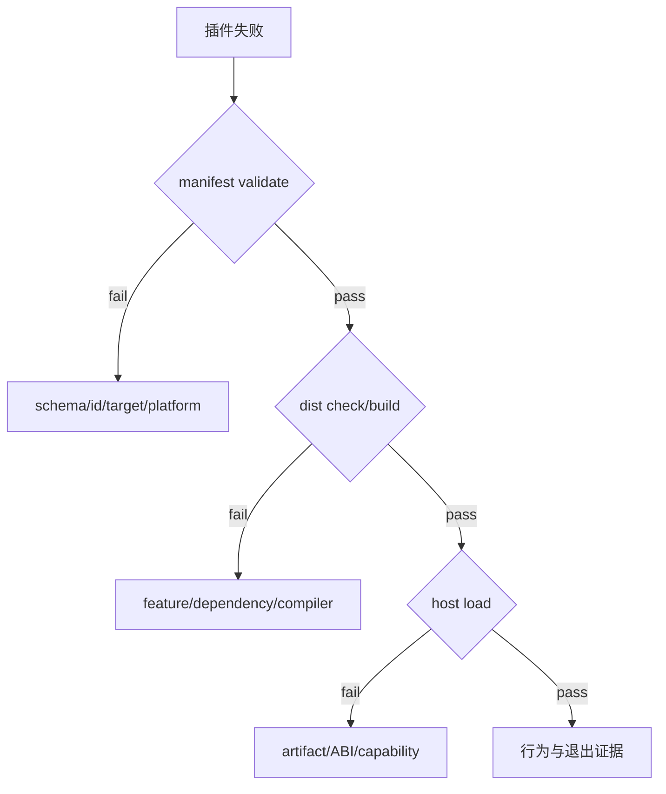

---
related_code:
  - .github/workflows/ci.yml
  - .github/workflows/profile-feature-contract.yml
  - .github/workflows/mvp-editor-windows.yml
  - tools/check_conventions.py
  - tools/validate_cargo_test_reachability.py
implementation_files:
  - tools/runtime-profile-feature-presets.py
  - tools/zircon_export
  - tools/cargo-zircon
  - tools/mvp
plan_sources:
  - docs/plans/milestone-validation-policy.md
tests:
  - tools/tests/test_frameworks_06_ci_toolchain_contract.py
  - tools/tests/test_validate_cargo_test_reachability.py
  - zircon_runtime/tests/export_build_plan_contract.rs
doc_type: ci-reference
---

# CI 失败分诊与本地复现

CI job 名称就是第一层分类。先保存 job、step、commit、runner、toolchain 和完整日志，再判断是脚本守卫、编译、测试、插件分发、平台策略还是产品 host 问题。

## 1. Job 到责任域

| Job | 责任域 | 首个本地命令 |
| --- | --- | --- |
| dependency-governance | advisories/licenses/sources | `python -m unittest tools.tests.test_frameworks_06_dependency_governance_contract -v` |
| runtime-profile-feature-matrix | profile 编译可达性 | `python tools/runtime-profile-feature-presets.py matrix` |
| runtime-domain-feature-matrix | additive feature | `cargo check -p zircon_runtime --no-default-features ...` |
| rust | workspace gate | `python tools/check_conventions.py --json` |
| plugin-standalone-validate | manifest schema | `python -m tools.zircon_export plugin validate --all --repo-root . --json` |
| export-platform-contract | target policy | 指定 `ZR_EXPORT_CONTRACT_PLATFORM` 的 cargo test |
| mvp-editor-windows | 真实产品闭环 | F1/F2/F3/F4 exact gate |

## 2. 统一分诊流程



不要一开始就跑全 workspace；先缩小到同 job、同 manifest、同 feature 和同 exact test。

## 3. Rust job 复现

```powershell
python -m unittest tools.tests.test_check_conventions tools.tests.test_frameworks_06_ci_toolchain_contract -v
python -m unittest tools.tests.test_validate_cargo_test_reachability -v
python tools/validate_cargo_test_reachability.py --json
python tools/check_conventions.py --json
cargo +1.94.1 build --workspace --locked --verbose
cargo +1.94.1 test --workspace --locked --verbose
```

插件步骤：

```powershell
cargo +1.94.1 check --manifest-path zircon_plugins/Cargo.toml --workspace --locked --all-targets --verbose
cargo +1.94.1 build --manifest-path zircon_plugins/Cargo.toml --workspace --locked
python tools/validate_cargo_test_reachability.py --manifest-path zircon_plugins/Cargo.toml --json
cargo +1.94.1 test --manifest-path zircon_plugins/Cargo.toml --workspace --locked
```

## 4. Profile matrix 失败

先用脚本确认 feature：

```powershell
python tools/runtime-profile-feature-presets.py feature server
cargo +1.94.1 check -p zircon_app --lib --no-default-features --features target-server --locked --verbose
```

若只某个 profile 失败，检查该 profile 的 `app_features` 与 `runtime_features`；若所有 profile 失败，优先看 toolchain、系统库和 Cargo target。

## 5. Plugin standalone 失败

manifest validate 失败时先修 schema、id、targets/platforms 和 artifact 元数据；dist compile 失败时再看 feature 与依赖。不要用 workspace 默认 feature 代替 `--no-default-features --features dist` 的独立验证。

## 6. MVP F1-F4 失败

| gate | exact 测试/证据 |
| --- | --- |
| F1 | editor template 与 source registry recovery |
| F2 | persisted scene、WGPU frame、input、shutdown |
| F3 | project document roundtrip |
| F4 | full application restart authoring |

每个 gate 都必须检查 `test result: ok. 1 passed; 0 failed`；只看到 cargo exit 0 但 exact filter 未执行目标测试，仍不接受。

## 7. 日志与 artifact

CI MVP 将日志放在 evidence root，并生成 environment、gate logs、PNG、`profile-contract-summary.json` 与 `workspace-summary.json`。分诊报告至少附：失败 step、完整错误首尾、复现命令、环境差异、最小修复和是否需要 Windows GPU。

## 8. 常见误判

- 把 Linux 缺系统库当 Rust 类型错误。
- 把缓存污染当随机测试失败。
- 把 `cargo check` 通过当作动态插件可加载。
- 把单元测试通过当作编辑器窗口可见。
- 把截图上传成功当作截图内容有效。
- 把 `#[ignore]` 性能测试当作默认门禁。

## 9. 修复后的回归

修复后先重跑原 exact 命令，再跑所属 job 的邻近 gate，最后才扩大到 workspace。报告应说明失败是否由源码、fixture、平台资源、缓存或 CI 配置触发。

## 10. 检查单

- [ ] commit、runner、toolchain 已锁定。
- [ ] 使用同一 manifest/path/features。
- [ ] exact test 确实执行并有数量断言。
- [ ] 原始日志未被截断。
- [ ] 失败归类有证据。
- [ ] 修复后原失败与邻近 gate 都复跑。
- [ ] 产品失败保留 PNG、adapter 和环境 receipt。

## 11. 源码索引

job 定义见 `.github/workflows/ci.yml`、`profile-feature-contract.yml` 和 `mvp-editor-windows.yml`；脚本守卫见 `tools/check_conventions.py`、`validate_cargo_test_reachability.py`；MVP gate 注册与 receipt 逻辑见 `tools/mvp/`。

## 12. 最小复现记录

```text
workflow/job/step:
commit:
runner image:
toolchain:
manifest:
features:
exact command:
first error:
last error:
artifact/log path:
reproduced locally:
```

记录 first error 与 last error 是为了区分根因和级联失败；不要只粘贴末尾的 `process exited with code 101`。

## 13. Cargo 编译错误分组

| 错误 | 优先检查 |
| --- | --- |
| unresolved import | feature gate、crate dependency |
| linker not found | OS system package/toolchain |
| trait bound | API contract 或 feature 条件 |
| duplicate lang item | target/cache/toolchain 污染 |
| lock unavailable | Cargo target 并发与目录 |
| plugin artifact missing | standalone dist 输出与 manifest |

对 feature 矩阵失败，先执行同一个 `--no-default-features --features` 命令；对 workspace 失败，先固定 `--locked` 和 `+1.94.1`。

## 14. Python/PowerShell 守卫错误

Python JSON guard 失败时保留完整 JSON；PowerShell validator 失败时保留 command、参数和环境变量。检查脚本自身的 unit test，再检查被审计的源码。脚本的“路径不安全”错误不是应该通过改成相对路径来绕过的提示。

## 15. 插件失败分叉



这条分叉防止把 catalog 问题误判成 ABI 问题，或把缺 GPU 的 host failure 误判为 Cargo failure。

## 16. 重跑策略

重跑前先判断失败是否确定性：同一 commit、同一环境连续两次都失败，优先修复；只失败一次则保留两次日志并比较缓存、资源、时间和并发。重跑不得覆盖原 artifact，应使用新的 run/attempt 目录。

## 17. 修复验收

- 原 exact gate 通过。
- 所属 job 的相邻 gate 通过。
- 若改 feature，profile/domain matrix 通过。
- 若改插件，standalone validate/dist/host load 通过。
- 若改 UI/render，视觉 capture 通过。
- receipt 记录修复 commit 与新旧差异。

## 18. 不应接受的“修复”

- 删除失败测试或把 target 从 CI matrix 移除。
- 将 required plugin 改成 optional 只为启动成功。
- 删除 blank capture 断言。
- 把 exact filter 改成模糊过滤而不检查测试数量。
- 用 WSL/headless 结果替代 Windows GPU 产品证据。

## 19. 报告结论模板

```text
结论: source / environment / fixture / nondeterministic / 未确定
根因证据:
修复范围:
复跑命令:
复跑结果:
剩余风险:
```

## 20. 交付规则

只有原失败命令和必要邻近门禁都通过，且 receipt 已归档，才关闭 CI 故障。无法复现的失败保留为待观察项，并注明下一次重跑条件。

## 21. 分诊责任

提交者负责提供最小复现，模块 owner 负责源码/契约判断，平台 owner 负责 runner 与 GPU 证据，发布者负责确认 artifact 完整。分工不能减少任何必要证据。

## 22. 历史比较

比较两次 CI 时同时比较 commit、runner image、toolchain、feature、缓存策略和系统依赖；只比较退出码没有诊断价值。
