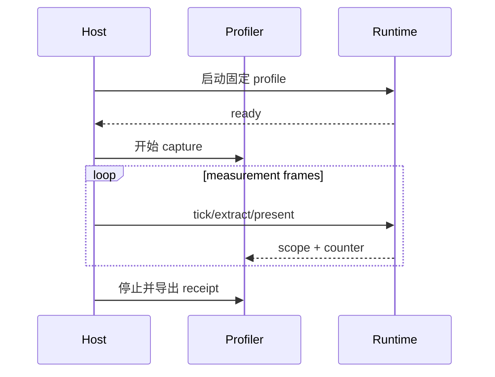

---
related_code:
  - zircon_runtime/src/runtime_diagnostics
  - zircon_runtime/src/diagnostic_log
  - zircon_runtime/src/core/runtime/diagnostics/profiling
  - zircon_app/src/reference_cpu_presenter.rs
  - zircon_editor/src/ui/workbench
implementation_files:
  - tools/profile-capture-paths.ps1
  - tools/ui-profile-capture.ps1
  - tools/validate_render_measurement_evidence.py
  - tools/validate_performance_comparison_receipt.py
plan_sources:
  - docs/plans/milestone-validation-policy.md
tests:
  - zircon_runtime/tests/runtime_profiling_recorder_performance.rs
  - zircon_runtime/tests/runtime_frame_extract_shared_payload_performance.rs
  - zircon_app/tests/diagnostic_log_process_lifecycle.rs
doc_type: diagnostics-reference
---

# 诊断、性能与采集证据

诊断系统用于回答“发生了什么”，profiling 用于回答“时间/内存花在哪里”，性能 receipt 用于回答“这次结果是否可以与基线比较”。三者不能互相替代：日志不是 profile，单次耗时不是回归证据，截图也不是资源诊断。

## 1. 诊断层次

| 层 | 内容 | 典型输出 |
| --- | --- | --- |
| lifecycle log | 启动、激活、关闭、错误 | `diagnostic-log` |
| runtime diagnostics | asset/plugin/physics/UI 状态 | 结构化 snapshot |
| profile scope | 区间耗时与调用路径 | scope sample |
| profile counter | 计数、字节、批次数 | counter sample |
| product receipt | 环境、命令、hash、结论 | JSON/日志/PNG |

## 2. 生命周期记录

```rust
zircon_runtime::diagnostic_log::write_log(
    "asset",
    "import_complete",
    "source=tree/model.glb state=ready",
);
```

实际调用应遵循当前模块的参数签名；示例强调事件应包含 domain、稳定事件名和可检索上下文。不要把临时指针地址、随机顺序或大块 payload 直接塞入日志。

`zircon_app/tests/diagnostic_log_process_lifecycle.rs` 验证 entry runner 在 shutdown 后返回/匹配捕获结果，适合检查异常退出与生命周期日志的一致性。

## 3. Scope 与 counter

```rust
let _scope = zircon_runtime::profile_scope!("app", "reference_cpu_presenter", "present");
zircon_runtime::profile_counter!("app", "present", "bytes", byte_count as u64);
```

scope 负责时间区间，counter 负责离散数量；长生命周期 scope 不应包住整个 session。`reference_cpu_presenter.rs` 已将 `present`、`copy_rgba`、`softbuffer_present` 分开，并在 present 后记录延迟。

## 4. 采集窗口

一次性能实验必须定义 warmup、measurement、teardown：



warmup 样本不能与 measurement 混算；首帧 shader 编译、asset import 和缓存建立应单独标记。

## 5. 采集路径约定

`tools/profile-capture-paths.ps1`、`tools/ui-profile-capture.ps1` 和众多 `*_pressure.py` 工具都拒绝 C 盘输出。先准备 run-bound 目录，再把路径传给脚本：

```powershell
$root = 'D:\ZirconBuilds\profile-zircon-20260909'
New-Item -ItemType Directory -Force $root | Out-Null
.\tools\profile-capture-paths.ps1 -OutputRoot $root
```

具体参数以脚本 `Get-Help` 为准；文档中的目录示例不能覆盖用户已有证据。

## 6. 性能比较 receipt

`tools/validate_performance_comparison_receipt.py` 用于检查比较结果的结构；`tools/validate_render_measurement_evidence.py` 检查 render measurement 证据。典型检查：

```powershell
python tools/validate_performance_comparison_receipt.py --help
python tools/validate_render_measurement_evidence.py --help
```

receipt 至少应包含 scenario、commit/source fingerprint、host、toolchain、feature/profile、采样数量、统计方法、基线、当前值、单位、阈值和原始文件 hash。

## 7. 诊断窗口与 UI

编辑器 runtime diagnostics 页面是可视化投影，不是诊断数据的唯一来源。源数据应能由 runtime snapshot 或日志重建；UI 测试应验证空状态、过期 generation、不可用 provider 和高频更新下的稳定性。

## 8. 预算与统计

| 指标 | 关注点 | 反例 |
| --- | --- | --- |
| P50/P95 | 长尾和交互体验 | 只报平均值 |
| allocations | 热路径分配 | 只测 release 启动 |
| bytes resident | 物理驻留 | 把 lookup bytes 相加 |
| frame latency | extract/present 分段 | 把 I/O 算进 render |
| dropped events | mailbox/bridge 丢失 | 只看最终 UI |

`runtime_profiling_recorder_performance.rs` 和 `runtime_frame_extract_shared_payload_performance.rs` 说明性能测试应将模型、采集和断言分层；`#[ignore]` 的 release evidence 不能当作默认 workspace 通过。

## 9. 负例与恢复

- profile 输出目录为 C 盘：立即失败并修正路径。
- 没有 warmup 标记：废弃当前样本，重新采集。
- scope 名称变更：保留 alias 或更新比较 schema，不能静默合并。
- capture 为空/统一色：按产品验收失败处理。
- 日志缺 source fingerprint：标记不可比较，而不是猜测 commit。

## 10. 提交流程

```text
固定环境 -> 固定 profile -> warmup -> measurement -> 导出原始数据
      -> 生成 receipt -> validator -> 人工审阅异常 -> 归档
```

## 11. 检查单

- [ ] scope/counter 命名包含 owner、场景和阶段。
- [ ] 日志可关联到 frame、asset 或 operation id。
- [ ] warmup 与正式样本分开。
- [ ] 统计含 P50/P95 或明确替代方法。
- [ ] receipt 有 hash、单位和阈值。
- [ ] 原始日志和导出文件未被覆盖。
- [ ] 性能结论没有超出采集环境范围。

## 12. 源码索引

运行时诊断实现见 `zircon_runtime/src/runtime_diagnostics`；日志接口见 `zircon_runtime/src/diagnostic_log`；采样宏使用点见 `zircon_app/src/reference_cpu_presenter.rs`；性能 contract 位于 `zircon_runtime/tests/*performance*` 与 `tools/*evidence*`。

## 13. 采样设计案例

以 frame present 为例，将一次帧拆成：

```text
frame_begin -> asset wait -> extract -> UI extract -> submit -> present -> frame_end
```

每段使用独立 scope；asset wait 若超过预算，记录 asset id 和 dependency state；submit/present 记录 viewport 与 surface；frame_end 汇总 dropped events 和计数器。这样才能区分 CPU copy、GPU wait、UI 绘制和资源等待。

## 14. 指标命名

推荐 `<owner>.<domain>.<operation>.<unit>` 形式，例如 `app.reference_cpu_presenter.present.latency_ns`、`ui.surface.paint.bytes`。名称一旦进入比较 receipt，应视为公共诊断契约；改名需提供迁移说明。

## 15. 日志采样级别

| 级别 | 内容 | 适用 |
| --- | --- | --- |
| error | 失败与恢复不可行 | 默认保留 |
| warn | 降级、重试、缺 optional 能力 | 产品诊断 |
| info | 生命周期和关键状态 | smoke/CI |
| debug | 选择路径、generation、计数 | 定向复现 |
| trace | 高频事件/细粒度 scope | 短窗口采集 |

高频 pointer/frame 事件不应无条件写全量字符串日志；使用 counter、聚合 snapshot 或短时间 trace。

## 16. 采样前检查

- [ ] profile 和 feature 已固定。
- [ ] build 类型（debug/release）已记录。
- [ ] warmup 与 measurement 帧数已定义。
- [ ] 输出目录为空且位于批准根。
- [ ] 系统电源、窗口尺寸和 GPU backend 已记录。
- [ ] 采集工具版本与 commit 已记录。

## 17. 结果解释

单次高延迟可能来自首次导入、shader 编译、OS 调度或缓存冷启动。至少重复多个 measurement window，报告中位数与长尾，并把 outlier 原因作为诊断字段。若无法解释，应报告“不足以结论”，不要用平均数掩盖。

## 18. 失败案例

`runtime_profiling_recorder_performance.rs` 若在 debug 下变慢，不可直接宣称 release 回归；`runtime_frame_extract_shared_payload_performance.rs` 若共享 payload 分配增加，应结合 allocation counter 和 frame receipt；UI pressure 脚本若拒绝输出路径，先修环境，不应绕过路径校验。

## 19. 归档布局

```text
evidence/
  environment.txt
  raw/
  scopes.json
  counters.json
  comparison-receipt.json
validator-output.json
summary.md
```

summary 只引用 raw/receipt 的字段，不手工重写数值。保留原始文件便于复核和重新计算。

## 20. 公开诊断接口的使用边界

诊断 snapshot 是观察值，不应被业务逻辑当作授权来源；业务代码应调用正式的 capability、load-state 或 manager API。snapshot 可能按 generation 更新，读取者应保存 generation 并在下一次刷新时比较，不能假设两次读取之间没有变化。

## 21. 采集后的清理

采集完成后只清理明确的临时文件，保留 receipt、原始日志和失败样本。清理前确认没有测试或 profiler 进程仍占用文件；任何无法解释的异常样本都应归档到独立目录，而不是删除。

## 22. 最小回归包

性能回归包应包含一个冷启动、一个 warmup 后窗口和一个稳定窗口；每个窗口都关联相同 source fingerprint。这样既能识别首次加载成本，也能判断稳定帧是否真正回归。
