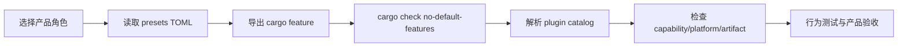

---
related_code:
  - zircon_runtime/runtime-feature-presets.toml
  - zircon_runtime/Cargo.toml
  - zircon_app/Cargo.toml
  - zircon_app/src/entry/entry_profile.rs
  - .github/workflows/ci.yml
implementation_files:
  - tools/runtime-profile-feature-presets.py
  - .github/workflows/profile-feature-contract.yml
  - .codex/skills/zircon-dev/scripts/validate-matrix.ps1
plan_sources:
  - docs/plans/mvp/index.md
tests:
  - zircon_runtime/tests/frameworks_03_profile_feature_presets.rs
  - zircon_runtime/tests/frameworks_03_server_profile.rs
  - zircon_app/src/entry/tests
doc_type: configuration-reference
---

# Feature/Profile 矩阵参考

本页定义“产品角色、Cargo feature、内置模块、插件能力、验证命令”之间的关系。矩阵不是一份手工复制的清单：权威来源是 `zircon_runtime/runtime-feature-presets.toml`，CI 通过 `tools/runtime-profile-feature-presets.py matrix` 生成组合，再交给 Cargo 检查。

## 1. 先区分四个概念

| 概念 | 所在层 | 解决的问题 | 典型例子 |
| --- | --- | --- | --- |
| Cargo feature | 编译层 | 代码是否进入 crate | `target-server`, `graphics` |
| `RuntimeProfileId` | 产品配置层 | 选择哪一种运行时角色 | `Minimal`, `Client3d`, `Editor` |
| `RuntimeTargetMode` | 宿主边界层 | 运行环境允许哪些资源 | `ClientRuntime`, `ServerRuntime` |
| plugin manifest | 分发层 | 动态/静态插件能否加载 | `rendering`, `net` |

一个 profile 可以打开一组 features，但 feature 打开并不意味着插件已注册；一个插件可出现在 catalog，也不意味着目标平台有可加载 artifact。

## 2. 当前 profile 摘要

| profile | Cargo feature | target mode | 最低成熟度 | 必需能力 |
| --- | --- | --- | --- | --- |
| `minimal` | `core-min` | `client_runtime` | core | lifecycle、tasks、time、diagnostics |
| `client2d` | `target-client` | `client_runtime` | beta | asset、scene、render.base、sound、rendering |
| `client3d` | `target-client` | `client_runtime` | beta | asset、scene、render.base、sound、rendering |
| `editor` | `target-editor-host` | `editor_host` | beta | editor.host.ui_shell、plugin_management |
| `dev` | `target-editor-host` | `editor_host` | experimental | diagnostics、plugin_management |
| `server` | `target-server` | `server_runtime` | beta | lifecycle、scene |

`client2d` 与 `client3d` 当前共享 `target-client` feature；两者的业务差异由插件/资源和产品配置承担，不能从 feature 名称推断 3D 能力。

## 3. 解析权威矩阵

```powershell
python tools/runtime-profile-feature-presets.py matrix
python tools/runtime-profile-feature-presets.py feature minimal
python tools/runtime-profile-feature-presets.py feature editor
```

预期第一条输出是 JSON object，包含 `include` 数组；后两条分别输出 `core-min` 和 `target-editor-host`。未知 profile 必须以退出码 2 失败，不能默默回退到默认配置。

## 4. 组合检查顺序



先做可编译性，再做插件解析，再做真实宿主验收。跳过中间层会产生“能编译但启动缺插件”或“能启动但没有产品证据”的假绿。

## 5. Rust 侧读取

```rust
use zircon_app::entry::{EntryConfig, RuntimeProfileId};

let config = EntryConfig::for_runtime_profile(RuntimeProfileId::Client3d);
assert_eq!(config.runtime_profile(), RuntimeProfileId::Client3d);
```

上例只建立 profile 配置；能力判断应继续经过产品组合/插件解析结果。不要使用 `cfg!(feature = "graphics")` 作为运行时授权，因为它只反映当前编译单元。

## 6. CI 对应关系

`runtime-profile-feature-matrix-plan` 导出 canonical matrix；`runtime-profile-feature-matrix` 对每个 profile 执行 `cargo check -p zircon_app --lib --no-default-features --features ... --locked --verbose`。另一个 `runtime-domain-feature-matrix` 对 `core-min` 加每个 additive domain 单独检查，防止域 feature 隐式依赖完整 client。

本地复现：

```powershell
foreach ($profile in @('minimal','client2d','client3d','editor','dev','server')) {
  $feature = python tools/runtime-profile-feature-presets.py feature $profile
  cargo +1.94.1 check -p zircon_app --lib --no-default-features --features $feature --locked
}
```

Windows 下应通过受管 validator 执行 Cargo；直接把 target 写入 C 盘或并发共享 target 会使结果不可接受。

## 7. 负例与诊断

| 症状 | 常见原因 | 处理 |
| --- | --- | --- |
| `unknown runtime profile` | 手写了不存在的 profile id | 从 TOML 和脚本输出复制 id |
| server 拉入 winit | 使用默认 features | 使用 `--no-default-features --features target-server` |
| plugin missing capability | feature 打开但 catalog 未注册 | 检查 plugin group 与 manifest |
| artifact not found | manifest platform/文件名不匹配 | 运行 standalone validate/dist |
| editor 编译但无 UI | 只启用了 runtime，不是 editor host | 同时选择 `dep:zircon_editor` 与 host preset |

## 8. 提交前检查单

- [ ] 变更 profile 时同时更新 TOML、profile 解析测试和 CI matrix。
- [ ] 任何新 domain 都能在 `core-min,<domain>` 下单独 `cargo check`。
- [ ] profile 必需 capability 有对应 provider 或明确 externalized policy。
- [ ] server 不依赖窗口/图形实现。
- [ ] 输出包含 toolchain、feature、manifest 和 artifact 信息。
- [ ] 文档中的矩阵由脚本输出复核，不手工猜测。

## 9. 源码与测试索引

源码入口是 `RuntimeProfileId`、`runtime-feature-presets.toml` 与两个 crate 的 `[features]` 表。契约测试 `frameworks_03_profile_feature_presets.rs` 检查 preset 结构；`frameworks_03_server_profile.rs` 保证 server 角色；`zircon_app/src/entry/tests/profile_bootstrap` 检查应用启动组合。涉及平台时还要阅读 `.github/workflows/profile-feature-contract.yml` 的 host 资源安装步骤。

## 10. 逐项核对 profile

### minimal

`minimal` 只保留 foundation、tasks、time、frame count 和 diagnostics core。它适合验证核心 spine、模块生命周期、时间推进和错误诊断。不要在该 profile 中预期窗口、GPU、UI、文本或动态插件。

```powershell
cargo +1.94.1 check -p zircon_app --lib --no-default-features --features core-min --locked
cargo +1.94.1 test -p zircon_runtime --test frameworks_03_profile_feature_presets --locked
```

### client2d/client3d

两者共享 `target-client`，都包含 asset、scene、graphics、text、script 和 UI 相关域，并注册 sound/rendering。`client3d` 的扩展能力由 optional plugins 和资源类型表达；不能仅凭 profile id 断言 virtual geometry、GI 或 Solari 可用。

### editor/dev

`editor` 是 beta editor host；`dev` 允许更实验性的诊断和工具组合。编辑器 feature 同时影响 `zircon_app` 的 entry 与 `zircon_editor` 的依赖，任何只在 editor crate 上成功的编译都不足以证明产品可启动。

### server

`server` 使用 `target-server`、`platform-headless`，只带 core-min、diagnostic-log、platform 与 scene。server 可以拥有 input/asset/scene 的 contract，但不得隐式加载 winit 或可见窗口资源。

## 11. Additive domain 矩阵

CI 当前检查 `ai-contracts`、`animation`、`diagnostic-log`、`dynamic-api`、`graphics`、`navigation`、`net-contracts`、`physics-contracts`、`script`、`sound-contracts`、`text`、`ui`。每项都以 `core-min,<domain>` 检查，目的是发现反向依赖和缺少 gate：

```powershell
$domains = @('ai-contracts','animation','diagnostic-log','dynamic-api','graphics','navigation','net-contracts','physics-contracts','script','sound-contracts','text','ui')
foreach ($domain in $domains) {
  cargo +1.94.1 check -p zircon_runtime --lib --no-default-features --features "core-min,$domain" --locked
}
```

如果某个 domain 只能与 `target-client` 一起编译，应明确记录这是当前设计限制，不能把它标成 additive domain。

## 12. Profile 选择决策

| 需求 | 起点 | 进一步确认 |
| --- | --- | --- |
| 最小 runtime 单测 | `minimal` | 是否需要 asset/scene |
| 无窗口后台服务 | `server` | headless platform policy |
| 2D 客户端 | `client2d` | texture、tilemap、UI 插件 |
| 3D viewer | `client3d` | rendering、shader、GPU adapter |
| 编辑器开发 | `dev` | editor plugins、diagnostic-log |
| 发布编辑器 | `editor` | required plugin artifact |

## 13. 不变量

1. 同一个 profile id 在 TOML、Rust enum、entry resolver 和 CI 输出中必须一致。
2. required plugin 缺失时启动必须失败并包含 capability/plugin id。
3. optional plugin 缺失可以降级，但必须出现在诊断报告。
4. feature 关闭时，相关公开接口要么不存在，要么返回明确的 unsupported 结果。
5. 每个新增 profile 都需要一个正例和一个错误/缺失能力测试。

## 14. 变更示例

加入新 `terrain` capability 时，建议顺序如下：

```text
TOML preset -> Rust profile resolver -> Cargo feature -> plugin catalog
-> profile contract test -> additive check -> standalone plugin dist
-> host/product acceptance -> Wiki matrix update
```

不要先把 `terrain` 写进文档再等待实现；文档应引用已存在的符号、测试或明确的计划状态。

## 15. 诊断字段建议

profile selection diagnostics 至少应显示 `profile`、`rust_variant`、`target_mode`、`cargo_feature`、enabled builtin modules、required capabilities、registered plugins 和 missing optional plugins。`zircon_app/src/tests/prelude.rs` 已对 Minimal 的 platform/module diagnostics 做了字符串契约测试，修改字段时要同步更新测试与文档。

## 16. 复核记录模板

```text
profile:
cargo feature:
target mode:
toolchain:
command:
enabled modules:
required capabilities:
registered plugins:
missing optional plugins:
result:
evidence path:
```

记录模板适合附在 PR 或 CI artifact 中，使 profile 选择可以被第三方复核。

## 17. API 变更影响

新增公开 API 时，先问它属于哪个 profile：core-min 是否仍可编译、server 是否需要该符号、editor 是否依赖 host-only 类型。若接口只在 feature 下存在，文档应在标题或前置条件中明确 feature；若接口在所有 profile 存在但部分运行时不支持，应说明返回的错误/降级语义。

## 18. 发布前矩阵快照

将脚本输出保存为构建 artifact，并记录 TOML 的 source hash。评审者可以用同一 checkout 重新运行 `matrix`，比较 profile id 和 cargo feature；发现差异时优先判断是否使用了不同 commit，而不是修改 CI 输出。

## 19. 维护责任

profile owner 负责 TOML、resolver、测试、CI 和本页同步；页面 review 不能替代代码 review。
