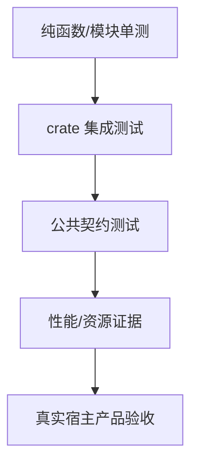

---
related_code:
  - zircon_runtime/tests
  - zircon_editor/tests
  - zircon_app/tests
  - tools/validate_cargo_test_reachability.py
  - .github/workflows/ci.yml
implementation_files:
  - tools/tests
  - tools/check_conventions.py
  - Cargo.toml
plan_sources:
  - docs/plans/mvp/index.md
tests:
  - tools/tests/test_validate_cargo_test_reachability.py
  - zircon_runtime/tests/frameworks05_manager_resolution_contract.rs
  - zircon_editor/tests/integration_contracts.rs
  - zircon_app/tests/editor_mvp_authoring.rs
doc_type: testing-reference
---

# 测试分层与契约参考

ZirconEngine 的测试分成单元、集成、契约、性能和产品验收层。每层回答不同问题：函数逻辑是否正确、crate 边界是否可用、公共约定是否稳定、压力下是否满足预算、用户能否完成闭环。

## 1. 分层模型



越靠上越快，越靠下越接近用户；低层绿灯不能替代高层证据。一个渲染函数的单测通过，不能证明 wgpu adapter、窗口表面、present 和输入闭环可用。

## 2. 单元测试

放置位置通常是源码旁 `#[cfg(test)]` 模块或 crate 的 `src/tests`。适合验证解析、状态转移、边界值和错误分类：

```powershell
cargo +1.94.1 test -p zircon_runtime --lib operation --locked
cargo +1.94.1 test -p zircon_editor --lib core::project --locked
```

用 `-- --exact` 运行单个测试；用 `-- --nocapture` 观察显式诊断。单测应构造最小输入，不依赖真实 GPU、用户目录或网络。

## 3. 集成测试

集成测试放在 `crate/tests`，通过 crate 的公开 API 验证调用者视角。例如 `zircon_editor/tests/integration_contracts.rs` 组合 workbench、窗口、拖拽和 retained UI；`zircon_app/tests/editor_mvp_authoring.rs` 验证应用重启后的 authoring 闭环。

```powershell
cargo +1.94.1 test -p zircon_editor --test integration_contracts --locked
cargo +1.94.1 test -p zircon_app --test editor_mvp_authoring --no-default-features --features target-editor-host --locked
```

集成测试中的临时目录、端口和窗口资源必须可清理；并行执行不应共享持久化文件。

## 4. 契约测试

契约测试锁定跨模块协议，而不是内部实现细节。常见对象包括：

| 契约 | 应断言 |
| --- | --- |
| manager resolution | service id、缺失错误、生命周期 |
| plugin ABI | manifest、能力、版本、panic 边界 |
| asset import | source identity、derived artifact、失败原因 |
| render frame | extract/present 顺序、viewport、统计 |
| UI bridge | DTO 字段、generation、事件顺序 |

例如 `frameworks05_manager_resolution_contract.rs` 应在注册成功和缺失两条路径都断言；只测试成功路径会掩盖诊断不可用问题。

## 5. 测试可达性守卫

CI 先运行 Python 测试，再运行：

```powershell
python tools/validate_cargo_test_reachability.py --json
python tools/validate_cargo_test_reachability.py --manifest-path zircon_plugins/Cargo.toml --json
```

预期 JSON 中每个 workspace target 都有可达测试目标。新增 `[[test]]`、`required-features` 或 feature gate 时，必须确认测试没有被静默排除。

## 6. 完整本地门禁

```powershell
python -m unittest tools.tests.test_check_conventions tools.tests.test_frameworks_06_ci_toolchain_contract -v
python -m unittest tools.tests.test_validate_cargo_test_reachability -v
python tools/check_conventions.py --json
cargo +1.94.1 fmt --all --check
cargo +1.94.1 test --workspace --locked
```

插件 workspace 另行执行 `cargo test --manifest-path zircon_plugins/Cargo.toml --workspace --locked`。不要用 `cargo test -p zircon_runtime` 代替 workspace 级检查来宣称全仓通过。

## 7. 负例测试策略

- 缺失 manager、重复 plugin id、未知 profile 必须返回结构化错误。
- 资源 source 删除、derived 文件损坏、依赖未 ready 必须能恢复或明确失败。
- native callback panic 不得穿越 ABI；测试应验证错误 receipt。
- UI generation 过期、重复事件和空输入必须稳定拒绝/忽略。
- 零尺寸 viewport、不可用 adapter、超预算 frame 必须留下可定位诊断。

## 8. 失败定位矩阵

| 失败层 | 先看什么 | 不要先做什么 |
| --- | --- | --- |
| Python guard | JSON 的 rule/path | 直接改 Rust 让守卫失效 |
| 单测 | 最小输入与错误分支 | 立刻跑全 workspace |
| 集成 | fixture、临时目录、feature | 把失败归因给 GPU |
| 契约 | DTO/manifest 版本 | 修改断言绕过变更 |
| 性能 | receipt、采样窗口、基线 | 只看单次 wall time |
| 产品 | adapter、帧、日志、重启 | 接受 blank capture |

## 9. Rust 测试书写约定

```rust
#[test]
fn missing_manager_reports_stable_service_id() {
    let result = resolve_manager_for_test("rendering");
    let error = result.expect_err("missing manager must be observable");
    assert!(error.to_string().contains("rendering"));
}
```

测试名描述行为与条件；`expect` 文案解释失败含义；不要断言无关的 debug 格式或 HashMap 顺序。跨 crate 测试只使用公开接口。

## 10. 证据记录

每个重要测试应记录命令、toolchain、feature、commit/source fingerprint、退出码和输出路径。测试通过但没有记录实际执行的 exact filter 时，不能证明目标测试确实运行过。

## 11. 索引

参考 `zircon_runtime/tests` 的 asset/render/plugin 契约，`zircon_editor/tests/integration_contracts` 的宿主集成，`zircon_app/tests` 的产品入口。CI 对应 `.github/workflows/ci.yml` 的 `rust`、`plugin-standalone-*` 和 `export-platform-contract` jobs。

## 12. 从需求到测试

先把需求拆成可观察的状态和边界，再决定测试层：

```text
需求: 插件可被宿主使用
  -> manifest 可解析        (Python/standalone validate)
  -> capability 可解析      (contract test)
  -> crate 可编译           (cargo check/build)
  -> callback 不越界        (ABI contract)
  -> host 能加载并退出      (integration/product)
```

一个测试名称不应承担多个层次的隐含结论。比如 `plugin_manifest_is_valid` 不能宣称动态库已经被 Windows host 加载。

## 13. fixture 设计

fixture 应小、稳定、可从源码重建。资产 fixture 需要 source identity；渲染 fixture 需要固定 viewport；UI fixture 需要明确 layout preset；插件 fixture 需要 manifest 与 artifact 的对应关系。fixture 不得引用开发者机器的绝对路径。

```rust
let fixture = PathBuf::from(env!("CARGO_MANIFEST_DIR"))
    .join("tests/fixtures/shader_invocation/fullscreen_binding_probe");
assert!(fixture.join("fullscreen_binding_probe.zshader").is_file());
```

## 14. 时间、并发与确定性

测试中优先使用受控 clock、固定 seed 和单线程参数。涉及异步 module、operation 或 frame 时，必须等待明确的 ready/completed 状态，不能用固定 sleep 猜测完成。

```powershell
cargo +1.94.1 test -p zircon_runtime --test runtime_world_sync_subscription_table --locked -- --test-threads=1
cargo +1.94.1 test -p zircon_editor --test integration_contracts --locked -- --test-threads=1
```

若并行测试必须共享进程资源，应给资源分配 generation/id，并断言释放发生；否则将测试隔离到独立临时目录。

## 15. 错误断言等级

| 断言 | 适用 |
| --- | --- |
| `is_err()` | 只关心拒绝 |
| error variant | 关心调用者分支 |
| stable service/plugin id | 关心定位能力 |
| fields and receipt | 关心恢复/审计 |
| exact debug string | 极少数 CLI 输出契约 |

错误测试应同时覆盖错误前状态是否保持一致，以及重试是否有定义。不要因为错误字符串改进可读性就锁死整段 debug 输出。

## 16. 忽略测试管理

`#[ignore = "release performance evidence"]` 只表示该测试不进入默认快速门禁。运行时要显式指定：

```powershell
cargo +1.94.1 test -p zircon_runtime --test runtime_profiling_recorder_performance --locked -- --ignored --nocapture
```

性能测试报告必须说明它是 ignored/release evidence；不能把一次手工运行混入默认 CI 结论。

## 17. 可达性检查细节

新增 integration test 后，检查三个层面：

- 文件是否位于正确 crate 的 `tests/`。
- Cargo target 是否被 `required-features` 排除。
- CI 的 manifest 与 feature 是否真的包含该 target。

```powershell
rg -n "\[\[test\]\]|required-features|autotests" zircon_runtime/Cargo.toml zircon_editor/Cargo.toml zircon_app/Cargo.toml
python tools/validate_cargo_test_reachability.py --json
```

## 18. 契约升级策略

修改公开 DTO、manifest schema 或 test receipt 时，先增加版本字段，再同时更新生产者、消费者、fixture、契约测试和 Wiki。兼容期若不存在，不要在测试中保留未声明的旧格式。

## 19. 测试报告模板

```text
layer:
target:
features:
exact filter:
fixture/source:
environment:
expected:
observed:
exit code:
receipt/log:
```

## 20. 终审检查

- [ ] 每个公共行为至少有成功与拒绝路径。
- [ ] 测试使用公开边界，不窥探私有实现。
- [ ] fixture 可从仓库 checkout 后直接定位。
- [ ] 异步测试不依赖脆弱 sleep。
- [ ] ignored 测试未被误计入默认门禁。
- [ ] reachability JSON 明确列出目标。
- [ ] 失败报告足以让另一台机器复现。
