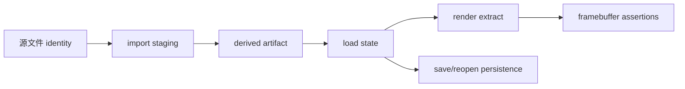

---
related_code:
  - zircon_runtime/tests/zui_native_visual_acceptance.rs
  - zircon_runtime/tests/runtime_text_multilingual_product_framebuffer.rs
  - zircon_runtime/tests/virtual_geometry_visbuffer_overlay_contract.rs
  - zircon_editor/src/tests/workbench
  - .github/workflows/mvp-editor-windows.yml
implementation_files:
  - zircon_runtime/tests/zui_native_visual_acceptance
  - tools/capture-editor-ui-visual.ps1
  - tools/zircon_pbr_visual_oracle.py
plan_sources:
  - docs/plans/mvp/index.md
tests:
  - zircon_runtime/tests/zui_native_visual_acceptance.rs
  - zircon_runtime/tests/runtime_text_multilingual_product_framebuffer.rs
  - zircon_app/tests/editor_mvp_authoring.rs
doc_type: acceptance-reference
---

# 资产、渲染与 UI 验收证据

视觉验收验证的是“产品真的呈现了正确内容”，不是“某个 renderer 函数返回了 Ok”。证据必须能够说明输入资源、运行 profile、GPU adapter、viewport、帧内容、交互和持久化状态之间的关系。

## 1. 四类证据

| 证据 | 说明 | 失败含义 |
| --- | --- | --- |
| source asset | `.zui`、gltf、纹理、shader 等源 | 输入不存在或不受支持 |
| runtime state | import/load/derived 状态 | 资源未 ready |
| framebuffer | 非空、尺寸正确、语义正确 | 渲染链断裂或 blank |
| host persistence | 保存、重开、输入、退出 | 产品闭环不成立 |

## 2. Native visual acceptance

`zui_native_visual_acceptance.rs` 将测试拆成 assets、catalog、dpi、evidence、preview、semantic、state 等模块。它要求 source 可解析、生成工作目录安全、物理 viewport 尺寸一致，并拒绝 uniform framebuffer。

```powershell
$env:ZR_F2_BASIC_SCENE_CAPTURE_PNG = 'D:\ZirconBuilds\evidence\f2-runtime-frame.png'
cargo +1.94.1 test -p zircon_runtime --test zui_native_visual_acceptance --locked -- --test-threads=1
```

输出 PNG 必须与测试日志和环境 receipt 同目录保存；不要只把截图贴到 issue 而丢失生成命令。

## 3. 资产验收路径



每个节点都要可定位。source 删除后的 regenerable recovery、derived 损坏后的重建以及依赖未 ready 都应有负例或恢复测试。

## 4. Framebuffer 断言

至少检查：

- 物理宽高等于 viewport contract。
- 像素不是全透明、全黑或单一常量。
- 关键对象/文字/材质在预期区域出现。
- DPI、色彩和 alpha 解释与测试 profile 一致。
- capture 来源是真实 runtime frame，而非 fixture 复制。

`runtime_text_multilingual_product_framebuffer` 进一步检查多语言文本、rich block、MSDF/table 像素和 DPI；`virtual_geometry_visbuffer_overlay_contract.rs` 检查 overlay 只显示执行子集。

## 5. 编辑器 UI 验收

编辑器验收需要 host 级证据：窗口创建、初始 layout、asset browser、viewport、command、save、restart。截图只证明一个时刻，应结合交互日志和持久化断言。

```powershell
cargo +1.94.1 test -p zircon_app --test editor_mvp_authoring --no-default-features --features target-editor-host --locked f4_project_authoring_survives_full_application_restart -- --exact --test-threads=1
```

空白画布、adapter unavailable、缺少输入、窗口尺寸不符、保存后重开丢失都属于失败，不应标记为“仅视觉差异”。

## 6. 证据命名

```text
<gate>-<profile>-<scenario>-<run>.png
<gate>-<profile>-<scenario>.log
<gate>-summary.json
```

JSON 应包括 source fingerprint、profile、platform、adapter、viewport、asset identity、capture path、sha256、exit code 和 assertion summary。

## 7. 负例矩阵

| 负例 | 必须看到的结果 |
| --- | --- |
| source 路径越界 | capture preparation 拒绝 |
| source 缺失 | 明确 import diagnostic |
| derived 损坏 | 重建或可解释失败 |
| 统一色 framebuffer | acceptance 失败 |
| 尺寸不符 | 失败并列出 expected/actual |
| editor 与 runtime 不同 | 记录 parity failure |

## 8. 检查单

- [ ] 资源来源和 hash 已记录。
- [ ] profile/feature 与目标产品一致。
- [ ] GPU adapter 和物理尺寸已记录。
- [ ] PNG 非空且不是纯色。
- [ ] 语义像素/文本/材质断言通过。
- [ ] UI 操作日志与截图可关联。
- [ ] 保存、重开、退出证据齐全。
- [ ] 所有输出在批准 evidence root。

## 9. 源码索引

native capture 的分拆实现位于 `zircon_runtime/tests/zui_native_visual_acceptance/`；多语言产品帧测试位于 `zircon_runtime/tests/runtime_text_multilingual_product_framebuffer/`；MVP F1-F4 workflow gate 位于 `.github/workflows/mvp-editor-windows.yml`。

## 10. 案例：RenderableEmpty

MVP 的最小可见场景包含模板创建、camera、cube 和 sun。验收顺序是先用 editor 测试证明模板结构，再用 runtime WGPU 测试证明 persisted scene 可 extract/present，最后由应用测试证明 authoring 重启后仍可恢复。

```text
F1 template -> F2 visible frame/input -> F3 document roundtrip -> F4 full restart
```

任何一步失败都会使后续产品结论降级；例如 F1 通过但 F2 adapter 不可用，只能报告“模板逻辑通过，产品渲染未验收”。

## 11. 案例：文本与 DPI

多语言文本验收应固定字体 artifact、DPI、viewport、语言内容和 fallback。像素测试应同时关注 glyph 可见性、表格/rich block 布局和 clamp 规则，避免只检查文件存在。

## 12. 案例：资产恢复

先记录 source identity，删除 derived artifact，再触发 import；若源仍可读，应看到 derived 重建和 load state 回到 ready。若源丢失，结果应是结构化 failure reason，而不是旧缓存悄悄复用。

## 13. 捕获审阅顺序

1. 查看 environment 与 profile。
2. 查看 import/load 日志和 asset identity。
3. 查看 viewport/adapter/framebuffer metadata。
4. 查看 PNG 的尺寸、非空和语义断言。
5. 查看 input/save/reopen/restart 日志。

不要先凭截图视觉判断，再回头猜测运行环境；图像必须能被 receipt 解释。

## 14. 视觉差异分类

| 差异 | 是否阻塞 | 需要的证据 |
| --- | --- | --- |
| 全黑/全透明 | 阻塞 | adapter、frame log |
| 尺寸错误 | 阻塞 | expected/actual viewport |
| 字体 fallback | 视产品要求 | font artifact、语言 |
| 轻微抗锯齿 | 可能非阻塞 | renderer/backend |
| 缺少关键对象 | 阻塞 | scene/resource state |
| editor/runtime 不一致 | 阻塞 | 两侧 capture 与 state |

## 15. 检查记录模板

```text
case:
source assets:
source fingerprint:
profile/features:
adapter/backend:
logical viewport:
physical viewport:
frame path/hash:
semantic assertions:
input result:
save/reopen result:
final status:
```

## 16. 资产、渲染、UI 三方责任

资产层负责 source/derived identity 与 ready 状态；渲染层负责 extract、submit、present 和 framebuffer；UI/host 层负责窗口、输入、保存和重启。验收报告应分别列出三层结果，避免把资产未 ready 误报为 renderer 缺陷，或把窗口不可用误报为 UI layout 差异。

## 17. 证据重放

重放时使用相同 source fingerprint、profile、viewport 和测试命令。若必须更换 GPU 或 OS，应在报告中分叉为新环境结果；不要覆盖原 PNG。重放成功只证明新环境通过，不能改写原失败的历史原因。

## 18. 交付阈值

产品验收只有在日志、状态、帧内容和 host 闭环都通过时才标记 `passed`。缺少任一关键证据应标记 `inconclusive`，而不是 `passed with no evidence`；这让后续网页展示可以按证据等级筛选。

## 19. 责任人

提交者应提供原始 evidence root；审阅者负责检查断言覆盖和环境边界；发布者负责保留可重放 receipt。

## 20. 复核问题

审阅者应询问“这张图由哪个测试生成、输入是什么、为何不是纯色、失败时保留了什么”。无法回答时，证据只能作为草稿。

## 21. 页面呈现

网页展示可按 gate、profile、platform 和 status 筛选，但筛选字段必须来自 receipt，不能由页面作者手工推断。

## 22. 截图保真

截图文件应保留原始分辨率和颜色解释；缩略图只用于网页预览，不能替代验收原图。PNG hash 应针对原始文件计算。

## 23. 失败留档

失败截图、失败日志和输入 fixture 应一并保留，直到根因关闭；成功重跑不会自动删除失败样本。
