---
related_code:
  - zircon_runtime/tests/zui_native_visual_acceptance.rs
  - zircon_runtime/tests/runtime_text_multilingual_product_framebuffer.rs
  - zircon_runtime/tests/virtual_geometry_visbuffer_overlay_contract.rs
  - zircon_editor/src/tests/workbench
  - zircon_editor/tests/integration_contracts
  - tools/capture-editor-ui-visual.ps1
  - tools/zircon_pbr_visual_oracle.py
implementation_files:
  - docs/tests/editor
  - docs/tests/runtime
  - docs/tests/workflow-control-center
  - docs/ui-and-layout
  - tools/capture-editor-ui-visual.ps1
plan_sources:
  - docs/plans/mvp/index.md
  - docs/plans/milestone-validation-policy.md
tests:
  - zircon_runtime/tests/zui_native_visual_acceptance.rs
  - zircon_runtime/tests/runtime_text_multilingual_product_framebuffer.rs
  - zircon_editor/tests/editor_asset_index_projection.rs
  - zircon_editor/tests/integration_contracts/workbench_window_template.rs
doc_type: evidence-reference
title: 视觉证据画廊与教程参考图
status: source-audited
---

# 视觉证据画廊与教程参考图

本页集中存放当前仓库中可以追溯到源码、测试或设计稿的截图，并给出与教程对应的阅读顺序。图片不是装饰：每张图都标注来源、尺寸、SHA-256 和证据等级。**设计参考图只能说明目标布局，不能替代运行时验收；运行时截图也不能单独证明资产来源、保存和重开成功。**

## 快速选择

| 你正在验证什么 | 先看图片 | 再看页面 | 最低证据等级 |
| --- | --- | --- | --- |
| 编辑器窗口和资产浏览器 | [编辑器工作台](#editor-workbench-reference)、[资产浏览器](#asset-browser-acceptance) | [Workbench 布局](../../editor/reference/workbench-layout-panels.md)、[资产导入教程](../../tutorials/advanced/asset-import-hot-reload.md) | 行为 + 视觉 |
| RenderGraph 和帧呈现 | [RenderGraph 参考图](#rendergraph-reference)、[光照截图](#forward-deferred-acceptance) | [RenderFramework API](../../graphics/reference/render-framework-api.md)、[帧捕获教程](../../tutorials/advanced/render-viewport-frame-capture.md) | 编译 + 行为 |
| UI Binding、文本和 IME | [UI Binding 参考图](#ui-binding-reference)、[富文本截图](#rich-text-acceptance) | [UI V2](../../ui/reference/v2-assets-and-retained-tree.md)、[文本与 IME](../../ui/reference/text-font-shaping-editing-and-ime.md) | 行为 + 产品帧 |
| 导入、热重载和恢复 | [资产浏览器](#asset-browser-acceptance) | [资产热重载](../../tutorials/advanced/asset-import-hot-reload.md)、[资产就绪机制](../../mechanisms/asset-import-readiness-residency.md) | 资源状态 + 视觉 |
| Hub/控制台工作流 | [控制中心](#workflow-control-center-acceptance) | [Hub CLI API](../../hub-tooling/reference/cargo-zircon-cli.md)、[Receipt 教程](../../tutorials/advanced/project-export-hub-automation.md) | 结构化 receipt |

## 证据等级和阅读规则

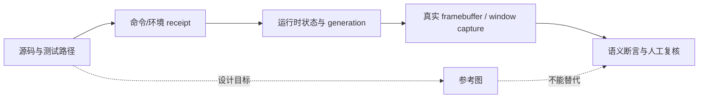

图中的实线是可追溯的验收链；虚线表示设计图只用于说明布局或交互目标。阅读截图时同时记录：

1. 输入资源和源文件 fingerprint；
2. Cargo profile、feature、平台、adapter 和 viewport 物理尺寸；
3. 生成截图的测试或捕获命令、运行号、时间戳和 SHA-256；
4. 失败时保留的日志、receipt、fixture 与上一张 last-good 图。

## 证据索引

以下表格是本页图片的 machine-readable 入口。`source` 列指向仓库中真正生成或维护图片的位置；`wiki copy` 是为了让 MkDocs 在 `docs/wiki` 内自包含而保存的副本。

| wiki copy | source | 尺寸 | SHA-256 | 类型 | 解释 |
| --- | --- | ---: | --- | --- | --- |
| `editor-workbench-reference.png` | `docs/ui-and-layout/workbench.png` | 1672 x 941 | `4AD7706C08138EF422802C0C46B5DE4775237021F474200EFC100DAD577C02D0` | 设计/参考 | 展示 Scene、Inspector、UI Components 和状态栏的目标组合；不是当前运行通过证据。 |
| `render-graph-reference.png` | `docs/ui-and-layout/editor-workbench-designs/render-graph-workbench.png` | 1672 x 941 | `639B5602942A407903433386336A7E9B48F696FFA55DE7CAE293DE2AC9181169` | 设计/参考 | 展示 pass、barrier、graph summary 和 compile/capture 操作。 |
| `ui-binding-reference.png` | `docs/ui-and-layout/editor-workbench-designs/ui-binding-workbench.png` | 1672 x 941 | `55257D06BBC02E09AF7481F6E3844A4625FEDCC4E5559502FC333B1F21A657AB` | 设计/参考 | 展示 Binding Contract、Data Sources、trace 和 validation 输出。 |
| `asset-browser-acceptance.png` | `docs/tests/editor/editor-window-m3-asset-browser-900x620.png` | 900 x 620 | `0779A99A06B66FDCCCCC7013ACB3B228D99473EF61CBB9A29A751D2F83AFCC98` | 运行时/测试 | M3 Asset Browser 截图；需结合对应测试日志和 source asset identity 解读。 |
| `text-rich-table-acceptance.png` | `docs/tests/runtime/text/runtime_text_multilingual_rich_table_product_framebuffer_20260712.png` | 1080 x 1450 | `0B69036E831C376B6C7235CF5CE05D62331F48BE18D7D93F59D97C6527A1A0AA` | 运行时/产品帧 | 多语言、RTL、富文本表格和 inline object 的 framebuffer 证据。 |
| `lightmap-forward-deferred-acceptance.png` | `docs/tests/runtime/render/plan11_lightmap_probe_forward_deferred_wgpu_20260713.png` | 1932 x 360 | `386909A40E13EB4C0B8E27B354D05AC0DAEE2113FA2EC9A564F787B9B30FAB22` | 运行时/产品帧 | Forward/Deferred lightmap probe 对比；图像本身不能证明 MAE 或 adapter，需读测试记录。 |
| `workflow-control-center-acceptance.png` | `docs/tests/workflow-control-center/control-center-1568x1003.png` | 1568 x 1003 | `105D451D5CDA0E90C7769015C71C079037F1ABF7F5AF11BDB62C8F1AAC1034FD` | 工具/工作流 | Session、Failure、验证和日志面板的控制中心截图；不是 Runtime framebuffer。 |

## 编辑器工作台参考图 {#editor-workbench-reference}

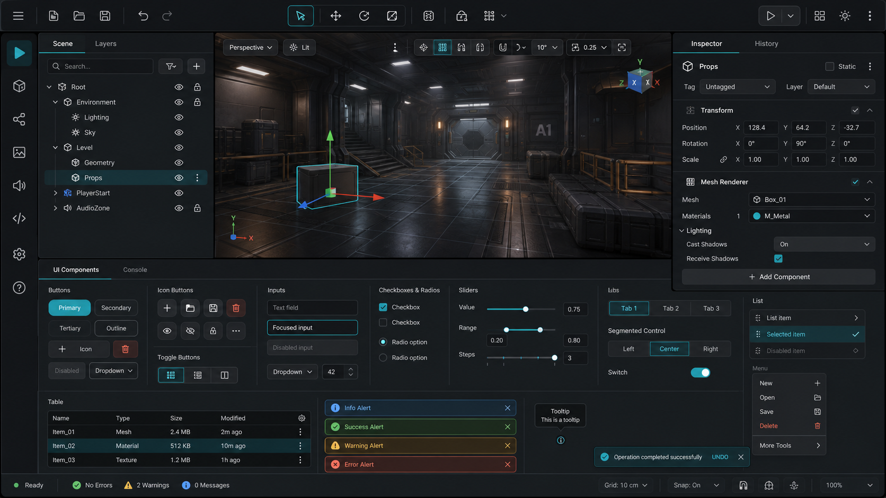

这张图是 `docs/ui-and-layout/workbench.png` 的副本，适合在阅读编辑器页面时定位 Scene tree、中心 viewport、Inspector、底部 UI Components 和状态栏。它的用途是说明面板之间的空间关系：

- Scene/Layer 面板持有作者态选择和层级导航；
- 中央 viewport 消费 runtime/editor gateway 的可见快照；
- Inspector 和 History 是同一编辑会话的属性与事务观察面；
- 底部组件区展示输入、选择、列表和提示等可复用控件。

不要从图中推断某个按钮已经接通真实 command。要证明 command、save、restart 闭环，应运行 `editor_mvp_authoring` 或对应集成测试，并将截图和 transaction/receipt 关联。

## RenderGraph 参考图 {#rendergraph-reference}

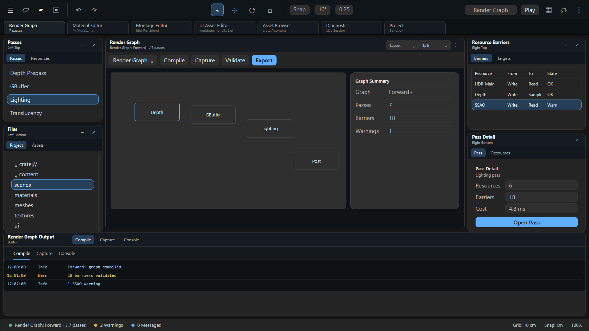

参考图中的 `Passes`、`Resource Barriers`、`Graph Summary` 和 `Render Graph Output` 对应 [RenderGraph 构建 API](../../graphics/reference/render-graph-api.md) 中的概念。实际 Rust 调用仍应遵循：

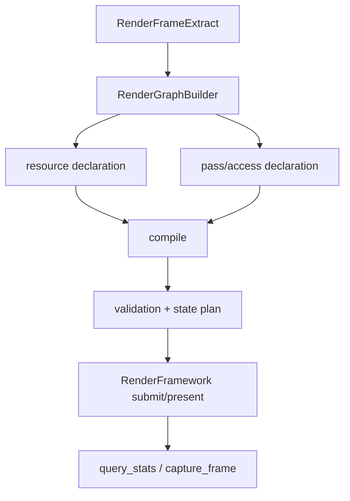

图中的 `Compile` 或 `Capture` 按钮不是 `RenderFramework` 的隐式方法；应用层必须明确使用 `submit_frame_extract`、`present_frame_extract` 和 `capture_frame`，并处理 `RenderFrameworkError`。

## UI Binding 参考图 {#ui-binding-reference}

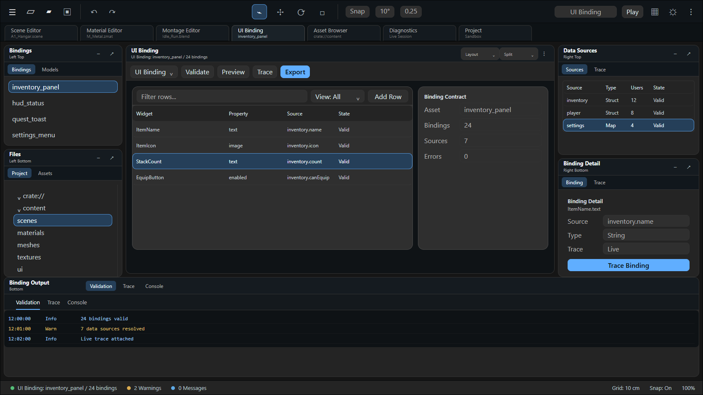

这张参考图把 `inventory_panel`、数据源、绑定状态和 trace 输出放在同一个画面，适合配合 [UI V2 资产与保留树](../../ui/reference/v2-assets-and-retained-tree.md) 以及 [组件、绑定、样式](../../ui/reference/components-bindings-style-and-theme.md) 阅读。绑定问题应按以下链路定位：

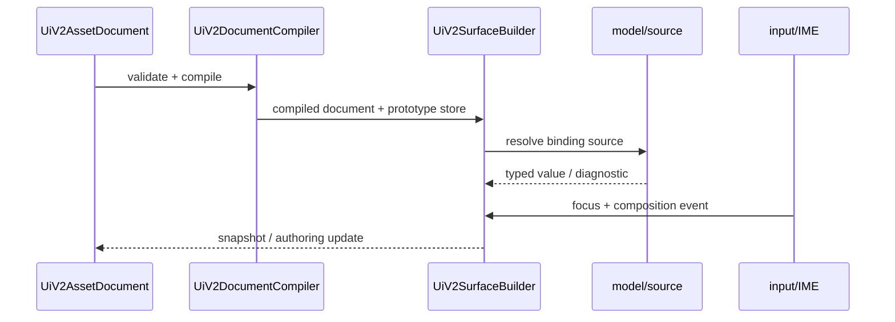

截图里的“Valid”只应在 binding validation receipt 和对应 source generation 一致时采信；不可通过手工改标签把错误状态伪装为 valid。

## 资产浏览器运行时截图 {#asset-browser-acceptance}

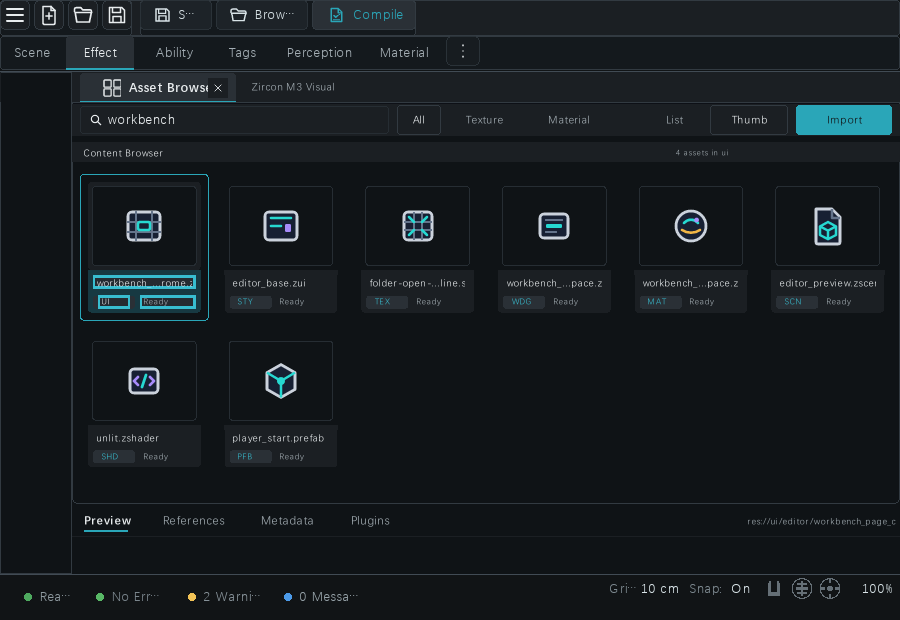

这张 900 x 620 图片来自 `docs/tests/editor/editor-window-m3-asset-browser-900x620.png`。它可用来检查搜索、类型筛选、列表/缩略图切换、导入按钮、资产状态 chip 和底部状态栏是否在同一窗口内可见。完整验收至少还要有：

1. 资源源文件的 URI、大小和 hash；
2. importer descriptor、derived artifact 和 `AssetLoadState` 的转换日志；
3. editor index 的 `apply_watch_events` 结果；
4. 保存后重开或热重载后的 generation 没有回退。

推荐教程顺序是[资产导入、依赖就绪与热重载](../../tutorials/advanced/asset-import-hot-reload.md) -> [资源注册与就绪](../../scene-assets/reference/resource-registry-readiness.md) -> [视觉验收证据](visual-acceptance-evidence.md)。

## 富文本表格运行时截图 {#rich-text-acceptance}

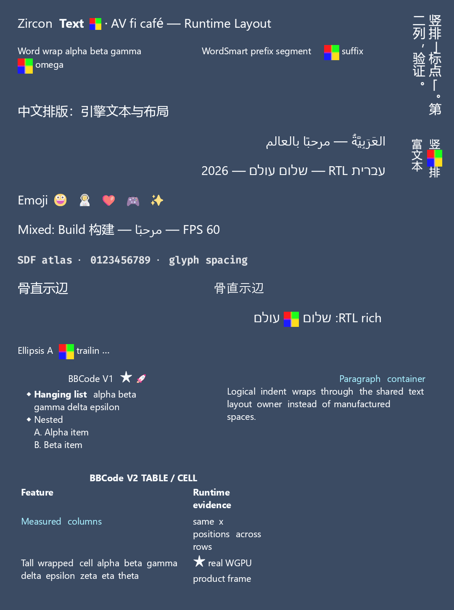

该图来自 `runtime_text_multilingual_rich_table_product_framebuffer_20260712`，可观察 CJK、RTL、emoji、富文本 inline、表格列测量、嵌套列表和垂直文字。它是产品 framebuffer 证据，不是字体设计稿。复核时同时检查：

- `TextShapeRequest` 的 language/direction/writing mode 与测试输入一致；
- `TextShapeResult.runs`、glyph cluster 和 visual range 没有被应用层按 byte offset 猜测；
- fallback font、DPI、viewport 和颜色空间写在 receipt 中；
- 文本截图与 [文本、字体整形、编辑和 IME](../../ui/reference/text-font-shaping-editing-and-ime.md) 的公开 API 说明一致。

## Forward/Deferred 光照运行时截图 {#forward-deferred-acceptance}

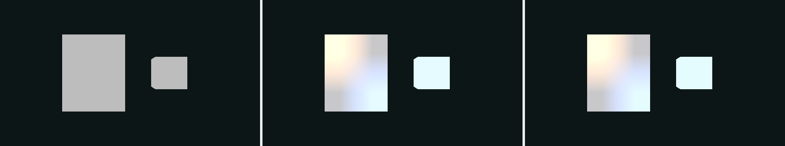

这张三联图来自 `plan11_lightmap_probe_forward_deferred_wgpu_20260713.png`。它适合说明同一场景在 Forward/Deferred 路径下如何消费 lightmap/probe 数据，但不能独立证明渲染误差、dispatch 数或 GPU 完成。应把它与 [光照、环境与后处理 API](../../graphics/reference/lighting-postprocess-api.md)、[材质与纹理资产](../../graphics/reference/assets-material-mesh-api.md) 以及测试记录一起阅读。

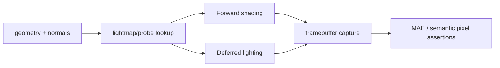

## Workflow Control Center 运行截图 {#workflow-control-center-acceptance}

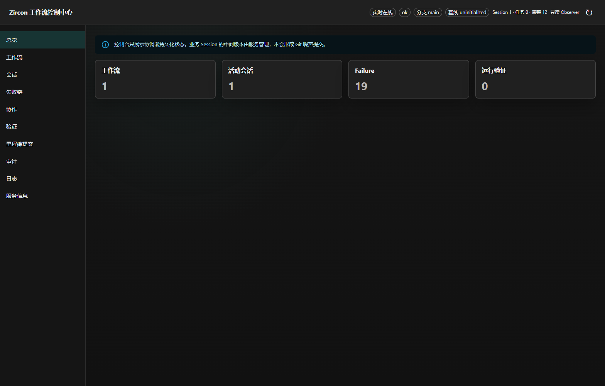

控制中心截图证明的是 Hub/Session Coordinator 的可观测表面：当前 session、任务、failure、验证计数和日志状态。它不证明底层 Runtime 或 GPU 已完成。配合 [Hub 自动化方案](../../hub-tooling/reference/automation-recipes.md) 阅读时，按“请求 -> receipt -> 状态 -> 失败链 -> 重试/恢复”顺序核对，而不是只看顶部的绿色或红色标签。

## 教程参考图：四条可复用方案

### 方案 A：项目资产到可见帧

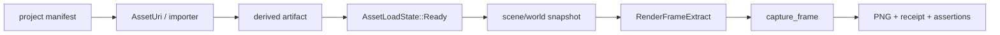

操作顺序：先运行项目/导入教程，保存 source identity 和 generation；再阅读帧捕获教程，创建 viewport、提交 extract、捕获 RGBA；最后把 PNG、统计快照和测试输出放在同一个 evidence root。任何节点失败都应保留结构化错误，而不是用旧 PNG 代替。

### 方案 B：UI 模板到 IME

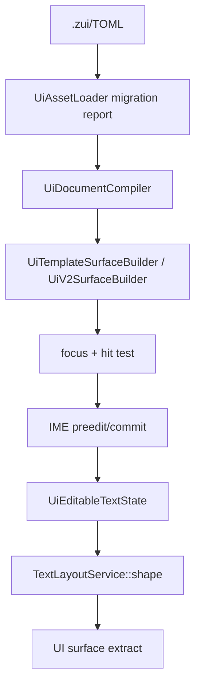

教程截图应至少覆盖默认、聚焦、composition、提交和 validation failure 五个状态。设计图可以用来对齐控件位置，真实文本截图则用来检查 shaping、DPI 和方向性。

### 方案 C：插件到产品 Receipt

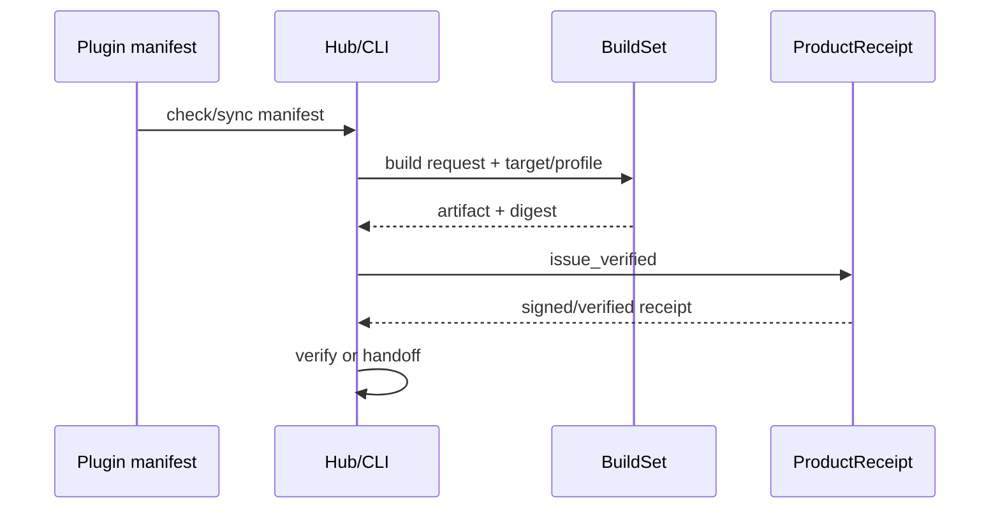

配图只展示工作流 UI；真正的发布依据是 `ProductReceipt::issue_verified`、artifact digest、toolchain 和 verifier report。参见[项目导出、产品 Receipt 与 Hub 自动化](../../tutorials/advanced/project-export-hub-automation.md)。

### 方案 D：编辑器事务与重启恢复

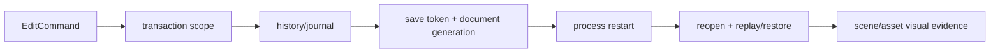

截图应与 command label、participant document ID、dirty generation、save token 和重启结果关联。不要把“按钮看起来被点击”当作事务已提交；必须能在 history/journal 或测试断言中找到同一个 operation。

## 如何生成新截图

Windows 编辑器截图优先使用仓库的受控脚本。脚本会校验窗口尺寸、虚拟屏幕定位、颜色/亮度信息和 SHA-256；命令中的 digest 仍必须来自本次构建产物：

```powershell
pwsh -File tools/capture-editor-ui-visual.ps1 `
  -BundleDirectory E:\editor-bundle `
  -OutputDirectory E:\evidence\editor `
  -ExpectedEditorSha256 <64-hex> `
  -ExpectedRuntimeSha256 <64-hex> `
  -ExpectedSourceSha256 <64-hex>
```

Runtime framebuffer 证据应由对应测试写出，而不是手工截取播放器窗口。示例：

```powershell
$env:ZR_F2_BASIC_SCENE_CAPTURE_PNG = 'E:\evidence\runtime\f2-runtime-frame.png'
cargo +1.94.1 test -p zircon_runtime --test zui_native_visual_acceptance --locked -- --test-threads=1
```

每次新增图片都应同步记录：

```text
case/profile/platform/adapter:
source fingerprint:
viewport width/height and dpi:
capture command:
test/receipt path:
png sha256:
semantic assertions:
known limitations:
```

## 证据发布检查单

- [ ] 图片副本位于 `docs/wiki/assets/evidence/`，文件名包含稳定场景语义。
- [ ] 表格记录原始 source 路径、尺寸、SHA-256 和证据等级。
- [ ] 设计参考图明确写出“不能替代运行时验收”。
- [ ] 运行时截图能关联测试、profile、feature、adapter、viewport 和输入资源。
- [ ] PNG 不是全黑、全透明或统一颜色；语义像素断言有日志支持。
- [ ] 失败截图、receipt、日志和 fixture 未被成功重跑覆盖。
- [ ] 页面中的教程链接、图片路径和导航项都通过 Wiki 严格校验。

## 与其他页面的关系

- [资产、渲染与 UI 验收证据](visual-acceptance-evidence.md)：证据定义、负例和保存格式。
- [测试分层与契约参考](test-layers-and-contracts.md)：从静态检查到产品闭环的证据等级。
- [诊断、性能与采集证据](diagnostics-and-profiling.md)：日志、指标、profile 和 GPU 采集。
- [Windows 与 WSL 验证](windows-wsl-validation.md)：目标目录、Windows 优先和 Linux 特例。
- [Wiki 与源码守卫](wiki-source-guards.md)：frontmatter、路径、围栏和导航规则。
