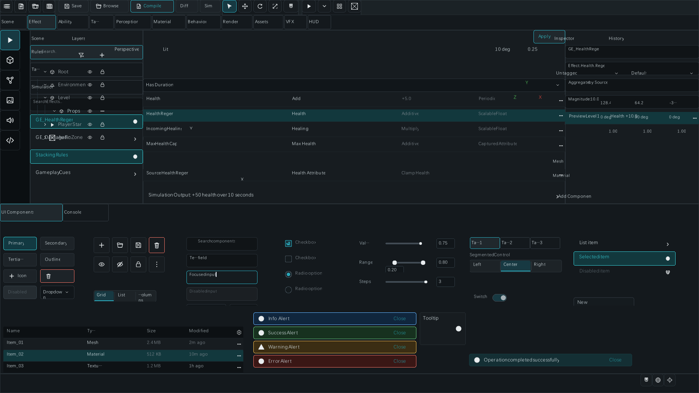
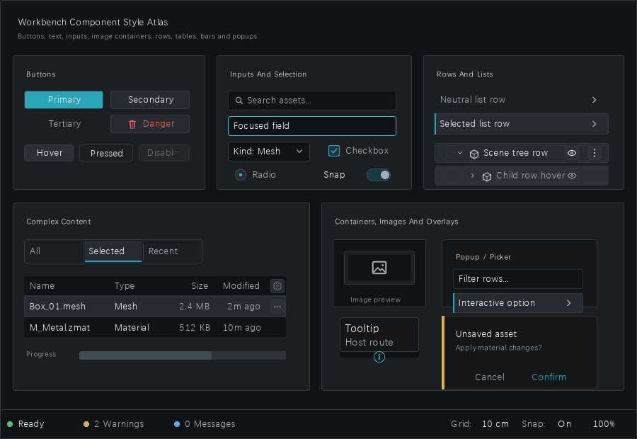
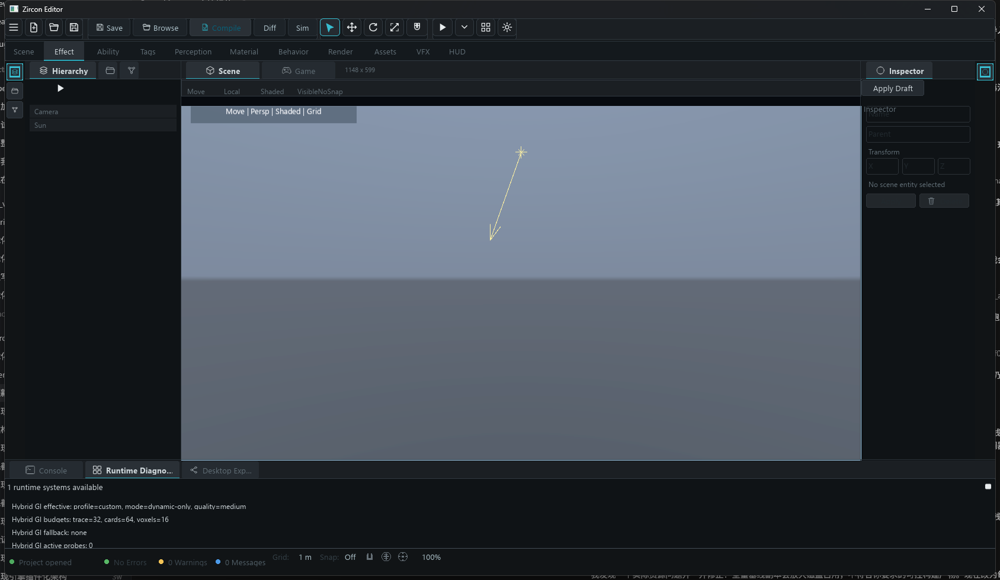

---
related_code:
  - zircon_editor/src/tests/host/retained_callback_dispatch/template_bridge/workbench_toolbar_breakpoints/visual_artifacts.rs
  - zircon_editor/src/tests/host/retained_menu_pointer/visual_screenshot/chrome_artifacts.rs
  - zircon_editor/src/tests/host/retained_menu_pointer/visual_screenshot/component_atlas
  - zircon_runtime/tests/zui_native_visual_acceptance.rs
  - zircon_runtime/tests/runtime_text_multilingual_product_framebuffer.rs
  - zircon_runtime/tests/virtual_geometry_visbuffer_overlay_contract.rs
  - tools/capture-editor-ui-visual.ps1
implementation_files:
  - docs/tests/editor
  - docs/tests/runtime
  - docs/tests/workflow-control-center
  - tools/capture-editor-ui-visual.ps1
  - .codex/skills/zircon-project-skills/capture-hub-window-screenshot/scripts/capture-hub-window.ps1
plan_sources:
  - docs/plans/mvp/index.md
  - docs/plans/milestone-validation-policy.md
tests:
  - zircon_runtime/tests/zui_native_visual_acceptance.rs
  - zircon_runtime/tests/runtime_text_multilingual_product_framebuffer.rs
  - zircon_editor/tests/editor_asset_index_projection.rs
  - zircon_editor/tests/integration_contracts/workbench_window_template.rs
doc_type: evidence-reference
title: 真实截图证据画廊
status: source-audited
---

# 真实截图证据画廊

本页只收录由现有 Rust 测试实际渲染、Runtime framebuffer 实际导出，或由运行中的原生窗口实际捕获的 PNG。概念图、布局图、设计稿和流程图都不属于视觉证据，不能进入 `docs/wiki/assets/evidence/`，也不会出现在下方索引中。每张图均记录原始路径、尺寸、SHA-256、生成路径和适用边界。

真实截图仍不是完整验收结论。证据链必须是“源码/测试 -> 命令或 receipt -> 实际渲染或窗口状态 -> PNG -> 语义断言与人工复核”；其中只有 PNG 是视觉证据，测试、receipt 和断言负责证明它来自可重放的状态。

## 快速选择

| 你正在验证什么 | 先看真实截图 | 再看页面 | 最低证据等级 |
| --- | --- | --- | --- |
| 编辑器窗口和资产浏览器 | [完整 Workbench](#editor-workbench-run-mode-acceptance)、[资产浏览器](#asset-browser-acceptance) | [Workbench 布局](../../editor/reference/workbench-layout-panels.md)、[资产导入教程](../../tutorials/advanced/asset-import-hot-reload.md) | 编辑器测试渲染 + 行为断言 |
| 图形运行时和帧呈现 | [Hybrid GI 诊断](#hybrid-gi-editor-diagnostics-acceptance)、[光照对比](#forward-deferred-acceptance) | [RenderFramework API](../../graphics/reference/render-framework-api.md)、[帧捕获教程](../../tutorials/advanced/render-viewport-frame-capture.md) | 产品帧 + 统计/语义断言 |
| UI、文本和 IME | [组件图集](#ui-components-acceptance)、[富文本产品帧](#rich-text-acceptance) | [UI V2](../../ui/reference/v2-assets-and-retained-tree.md)、[文本与 IME](../../ui/reference/text-font-shaping-editing-and-ime.md) | 测试渲染 + 产品帧 |
| 导入、热重载和恢复 | [资产浏览器](#asset-browser-acceptance) | [资产热重载](../../tutorials/advanced/asset-import-hot-reload.md)、[资产就绪机制](../../mechanisms/asset-import-readiness-residency.md) | 资源状态 + 截图 + generation |
| Hub/控制台工作流 | [控制中心](#workflow-control-center-acceptance) | [Hub CLI API](../../hub-tooling/reference/cargo-zircon-cli.md)、[Receipt 教程](../../tutorials/advanced/project-export-hub-automation.md) | 实际界面截图 + 结构化 receipt |

## 证据索引

`source` 是仓库内生成或保存原图的位置；`wiki copy` 只是为 MkDocs 页面自包含而保存的字节相同副本。类型中的“测试渲染”表示图像由对应 Rust 测试运行真实渲染路径生成，而不是由设计工具绘制。

| wiki copy | source | 尺寸 | SHA-256 | 类型 | 解释 |
| --- | --- | ---: | --- | --- | --- |
| `editor-workbench-run-mode-acceptance.png` | `docs/tests/editor/editor-window-m3-workbench-run-mode-1672x941.png` | 1672 x 941 | `02FB8D6447185527245C1CE436E17DC938237CCBCDC1E5628BE88794654F888B` | 编辑器测试渲染 | `capture_full_workbench_run_mode_visual_artifact` 实际绘制 Workbench 保留树后的 PNG。 |
| `ui-components-workbench-acceptance.png` | `docs/tests/editor/editor-components-workbench-slate-atlas-900x620.png` | 900 x 620 | `BAAF115498884D16B1233F71D67E277809D9E58D1496563DF28AD45613E80184` | 编辑器测试渲染 | `capture_workbench_component_slate_atlas_visual_artifact` 实际绘制组件模板后的 PNG。 |
| `asset-browser-acceptance.png` | `docs/tests/editor/editor-window-m3-asset-browser-900x620.png` | 900 x 620 | `0779A99A06B66FDCCCCC7013ACB3B228D99473EF61CBB9A29A751D2F83AFCC98` | 编辑器测试渲染 | M3 Asset Browser 实际窗口树快照；须结合资源身份和测试日志解读。 |
| `hybrid-gi-editor-diagnostics-acceptance.png` | `docs/tests/runtime/render/plan18_hybrid_gi_editor_runtime_diagnostics_actual_20260714.png` | 1688 x 980 | `35A8FF93D8C67E3EEBC6A59F9C251EE9FAB279BC00406753C0D6FD600511844E` | 编辑器产品截图 | Hybrid GI 的 `custom/dynamic-only/medium` 实际诊断界面截图；完整条件见同目录 evidence report。 |
| `text-rich-table-acceptance.png` | `docs/tests/runtime/text/runtime_text_multilingual_rich_table_product_framebuffer_20260712.png` | 1080 x 1450 | `0B69036E831C376B6C7235CF5CE05D62331F48BE18D7D93F59D97C6527A1A0AA` | Runtime 产品帧 | 多语言、RTL、富文本表格和 inline object 的 framebuffer 证据。 |
| `lightmap-forward-deferred-acceptance.png` | `docs/tests/runtime/render/plan11_lightmap_probe_forward_deferred_wgpu_20260713.png` | 1932 x 360 | `386909A40E13EB4C0B8E27B354D05AC0DAEE2113FA2EC9A564F787B9B30FAB22` | Runtime 产品帧 | 同一场景的 Forward/Deferred lightmap/probe 实际输出对比。 |
| `workflow-control-center-acceptance.png` | `docs/tests/workflow-control-center/control-center-1568x1003.png` | 1568 x 1003 | `105D451D5CDA0E90C7769015C71C079037F1ABF7F5AF11BDB62C8F1AAC1034FD` | 工具界面截图 | Session、Failure、验证和日志面板的实际工作流界面截图；不是 Runtime framebuffer。 |

## 编辑器 Workbench 运行模式测试截图 {#editor-workbench-run-mode-acceptance}



这张 1672 x 941 PNG 由 `capture_full_workbench_run_mode_visual_artifact` 生成。测试建立真实 `BuiltinWorkbenchWindowTemplateSurfaceBridge`，读取其 render extract，调用 `paint_runtime_render_commands_for_test` 绘制字节缓冲，并保存为 PNG；它不是编辑器设计稿或后期合成图。

图中可复核两行工具栏、模块页签、Scene/Inspector、底部 UI Components、状态栏和 Run Mode 下拉触发器是否同时进入实际绘制结果。它不证明 Save、Compile 或 Run Mode 命令已经提交；这些行为仍需对应 command、transaction、receipt 和重启回归。

## 编辑器组件图集测试截图 {#ui-components-acceptance}



这张图由 `capture_workbench_component_slate_atlas_visual_artifact` 的真实模板绘制路径输出。它覆盖按钮、输入框、选择控件、列表/树行、表格、菜单、图像容器、提示、对话框和状态栏，因此适合发现控件尺寸、裁切、焦点态或层级问题。

它只证明这些组件在给定 fixture 状态下完成绘制。UI Binding、数据源解析和 IME 提交仍必须由 `UiV2DocumentCompiler`、surface diagnostic、输入事件和对应回归测试证明，不能从一张“Valid”界面截图反推成功。

## 资产浏览器测试截图 {#asset-browser-acceptance}


该 PNG 来自 `capture_m3_gui_acceptance_visual_artifacts` 运行时构造的 `asset_browser_window(900, 620)` 和 `save_window_snapshot`。它可用于检查搜索、类型筛选、列表/缩略图切换、导入按钮、资产状态 chip 和状态栏是否在同一真实测试渲染输出中可见。

完整导入验收还必须记录：

1. 源文件 URI、大小与 hash；
2. importer descriptor、derived artifact 和 `AssetLoadState` 转换日志；
3. editor index 的 `apply_watch_events` 结果；
4. 保存、重开或热重载后没有回退的 generation。

推荐阅读顺序是[资产导入、依赖就绪与热重载](../../tutorials/advanced/asset-import-hot-reload.md) -> [资源注册与就绪](../../scene-assets/reference/resource-registry-readiness.md) -> [视觉验收证据](visual-acceptance-evidence.md)。

## Hybrid GI 编辑器运行诊断截图 {#hybrid-gi-editor-diagnostics-acceptance}



原图和证据报告 `docs/tests/runtime/render/plan18_hybrid_gi_editor_runtime_diagnostics_20260714.md` 成对保存。报告记录该图为 `custom/dynamic-only/medium`、trace/card/voxel budget 为 `32/64/16`、fallback 为 `none` 的实际产品状态；截图中可以同时复核编辑器 viewport、Inspector 和 Runtime Diagnostics 面板。

它用于观察 Runtime 向编辑器诊断面的数据投影，不等同于证明 RenderGraph 的全部 pass、barrier 或 GPU 完成。验证帧图、资源状态和呈现顺序时，还应阅读 [RenderGraph 构建 API](../../graphics/reference/render-graph-api.md) 与 [RenderFramework API](../../graphics/reference/render-framework-api.md)，并保存 `query_stats`、adapter、viewport 和 capture receipt。

## 富文本表格运行时截图 {#rich-text-acceptance}


该图来自 `runtime_text_multilingual_rich_table_product_framebuffer_20260712` 的实际 framebuffer，可观察 CJK、RTL、emoji、富文本 inline、表格列测量、嵌套列表和垂直文字。复核时同时检查：

1. `TextShapeRequest` 的 language、direction 和 writing mode 与测试输入一致；
2. `TextShapeResult.runs`、glyph cluster 和 visual range 没有被应用层按 byte offset 猜测；
3. fallback font、DPI、viewport 和颜色空间写在 receipt 中；
4. 截图与 [文本、字体整形、编辑和 IME](../../ui/reference/text-font-shaping-editing-and-ime.md) 的公开 API 说明一致。

## Forward/Deferred 光照运行时截图 {#forward-deferred-acceptance}


这张三联产品帧来自 `plan11_lightmap_probe_forward_deferred_wgpu_20260713.png`。它展示同一场景在 Forward/Deferred 路径下消费 lightmap/probe 数据的实际输出，但不能单独证明 MAE、dispatch 数或 GPU fence 完成。应把它与 [光照、环境与后处理 API](../../graphics/reference/lighting-postprocess-api.md)、[材质与纹理资产](../../graphics/reference/assets-material-mesh-api.md) 及测试记录一起阅读。

## Workflow Control Center 运行截图 {#workflow-control-center-acceptance}


控制中心截图证明的是 Session Coordinator 的可观测表面：当前 session、任务、failure、验证计数和日志状态。它不证明底层 Runtime 或 GPU 已完成。配合 [Hub 自动化方案](../../hub-tooling/reference/automation-recipes.md) 阅读时，按“请求 -> receipt -> 状态 -> 失败链 -> 重试或恢复”核对，而不是只看顶部颜色标签。

## 教程执行顺序（非视觉证据）

本节是文字化操作路径，不含截图，也不产生证据等级。需要视觉证据时，只能回到上方索引中的真实 PNG 或重新运行生成命令。

### 项目资产到可见帧

1. 记录 project manifest、`AssetUri`、importer 和 source fingerprint。
2. 等待 derived artifact 与 `AssetLoadState::Ready`，保存 generation。
3. 构造 scene/world snapshot 和 `RenderFrameExtract`，提交后调用 `capture_frame`。
4. 把 PNG、receipt、统计快照和语义断言一起写入同一个 evidence root。

### UI 模板到 IME

1. 由 `UiAssetLoader` 迁移 `.zui`/TOML，再由 `UiV2DocumentCompiler` 校验并编译。
2. 用 `UiTemplateSurfaceBuilder` 或 `UiV2SurfaceBuilder` 构建实际 surface。
3. 依次测试 focus、hit test、IME preedit、commit 和 `UiEditableTextState`。
4. 对默认、聚焦、composition、提交和 validation failure 分别产出真实测试截图与诊断记录。

### 插件到产品 Receipt

1. Hub/CLI 读取 plugin manifest 并检查或同步。
2. BuildSet 产出 artifact 和 digest。
3. 仅当 `ProductReceipt::issue_verified`、verifier report 与 artifact digest 相互匹配时，才可发布。
4. 工作流界面截图仅补充状态可见性，不能替代 receipt。

### 编辑器事务与重启恢复

1. 记录 `EditCommand`、transaction scope 和 participant document ID。
2. 保存 history/journal、dirty generation 与 save token。
3. 重启后重新打开并 replay/restore。
4. 将重新得到的场景或资产截图与同一 operation 的结构化断言关联。

## 如何生成新截图

先选择证据类型，再保存命令、原始输出和 hash。不要把 Figma、设计导出、手绘图或 Mermaid 输出放进 `docs/wiki/assets/evidence/`。

编辑器测试渲染截图可从对应 ignored test 重新生成，Cargo 输出必须放在外部目标目录：

```powershell
cargo test -p zircon_editor --lib capture_full_workbench_run_mode_visual_artifact `
  --locked --jobs 1 --target-dir E:\cargo-targets\zircon-editor-visual `
  -- --ignored --exact --test-threads=1 --nocapture

cargo test -p zircon_editor --lib capture_workbench_component_slate_atlas_visual_artifact `
  --locked --jobs 1 --target-dir E:\cargo-targets\zircon-editor-visual `
  -- --ignored --exact --test-threads=1 --nocapture
```

原生编辑器窗口截图使用受控脚本；脚本会校验窗口尺寸、虚拟屏幕定位、颜色/亮度信息和 SHA-256：

```powershell
pwsh -File tools/capture-editor-ui-visual.ps1 `
  -BundleDirectory E:\editor-bundle `
  -OutputDirectory E:\evidence\editor `
  -ExpectedEditorSha256 <64-hex> `
  -ExpectedRuntimeSha256 <64-hex> `
  -ExpectedSourceSha256 <64-hex>
```

Hub 截图必须从运行中的 `Zircon Hub` 原生窗口捕获，而不是浏览器 mock 或静态页面导出：

```powershell
pwsh -File .codex/skills/zircon-project-skills/capture-hub-window-screenshot/scripts/capture-hub-window.ps1 `
  -RepoRoot E:\Git\ZirconEngine `
  -BinaryPath E:\cargo-targets\zircon-hub\debug\zircon_hub.exe `
  -OutputPath E:\evidence\hub\hub-window.png `
  -RequireWindowTitle 'Zircon Hub' `
  -WindowWidth 1440 -WindowHeight 960
```

Runtime framebuffer 应由对应测试写出，而不是手工截取播放器窗口：

```powershell
$env:ZR_F2_BASIC_SCENE_CAPTURE_PNG = 'E:\evidence\runtime\f2-runtime-frame.png'
cargo +1.94.1 test -p zircon_runtime --test zui_native_visual_acceptance `
  --locked --target-dir E:\cargo-targets\zircon-runtime-visual `
  -- --test-threads=1
```

每次新增图片都应同时记录：

```text
case/profile/platform/adapter:
source fingerprint:
viewport width/height and dpi:
capture command:
test/receipt path:
png sha256:
semantic assertions:
known limitations:
```

## 证据发布检查单

- [ ] 图片副本位于 `docs/wiki/assets/evidence/`，且原图来自测试渲染、Runtime framebuffer 或原生窗口捕获。
- [ ] 索引记录原始 source 路径、尺寸、SHA-256、生成测试或捕获路径和证据等级。
- [ ] 概念图、设计稿、流程图和 mock 不在证据目录、索引或截图段落中。
- [ ] 截图关联测试、profile、feature、adapter、viewport、输入资源和 receipt。
- [ ] PNG 不是全黑、全透明或统一颜色；语义像素断言有日志支持。
- [ ] 失败截图、receipt、日志和 fixture 未被成功重跑覆盖。
- [ ] 页面中的教程链接、图片路径和导航项都通过 Wiki 严格校验。

## 与其他页面的关系

- [资产、渲染与 UI 验收证据](visual-acceptance-evidence.md)：证据定义、负例和保存格式。
- [测试分层与契约参考](test-layers-and-contracts.md)：从静态检查到产品闭环的证据等级。
- [诊断、性能与采集证据](diagnostics-and-profiling.md)：日志、指标、profile 和 GPU 采集。
- [Windows 与 WSL 验证](windows-wsl-validation.md)：目标目录、Windows 优先和 Linux 特例。
- [Wiki 与源码守卫](wiki-source-guards.md)：frontmatter、路径、围栏和导航规则。
