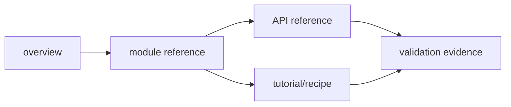
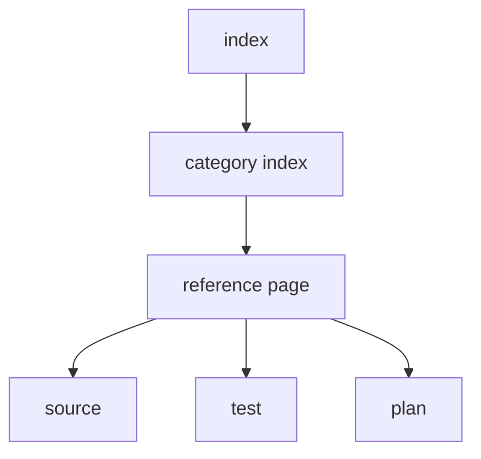

---
related_code:
  - tools/wiki_site.py
  - tools/check_conventions.py
  - docs/wiki
  - .github/workflows/wiki-pages.yml
implementation_files:
  - tools/wiki_site.py
  - docs/wiki/navigation.yaml
  - docs/wiki/contributing-docs.md
plan_sources:
  - docs/plans/milestone-validation-policy.md
tests:
  - tools/wiki_site.py
  - .github/workflows/wiki-pages.yml
  - .github/workflows/wiki-pages.yml
doc_type: documentation-validation-reference
---

# Wiki 与源码守卫

Wiki 是可发布产品，不是任意 Markdown 的堆放目录。`tools/wiki_site.py` 检查页面 frontmatter、链接、导航覆盖和结构；`tools/check_conventions.py` 检查源码约定。两者分别保护文档可发布性与实现可维护性。

## 1. Wiki 页面契约

每页必须有 YAML frontmatter，且包含 `related_code`、`implementation_files`、`plan_sources`、`tests`、`doc_type`。路径应相对于仓库根，且目标真实存在。正文应有恰好一个 H1；代码围栏、内部链接和导航 slug 必须可解析。

```yaml
---
related_code:
  - zircon_runtime/src/lib.rs
implementation_files:
  - tools/wiki_site.py
plan_sources:
  - docs/plans/mvp/index.md
tests:
  - tools/wiki_site.py
doc_type: module-reference
---
```

## 2. 本地验证

```powershell
python tools/wiki_site.py validate --json
python tools/wiki_site.py validate --strict-metadata --json
python tools/wiki_site.py build --strict-metadata --output site --json
```

成功输出应报告 markdown 页面数与 navigation 页面数相等，`error_count` 和 `warning_count` 为 0；build 应生成每个页面的 HTML。strict metadata 是发布前门禁，不应只运行宽松模式。

## 3. CI 工作流

`.github/workflows/wiki-pages.yml` 在变更 Wiki、导航、脚本或 workflow 时运行 validate/build。CI build 失败时先看是 frontmatter、broken link、navigation orphan 还是主题配置，不要直接删除页面来使页面数下降。

## 4. 源码链接等级

| 链接目标 | 适用内容 |
| --- | --- |
| public Rust module | 接口语义和调用者契约 |
| Cargo manifest | feature、依赖和 target |
| test file | 可执行行为证据 |
| plan | 架构决策、范围与未完成项 |
| tool/script | 命令参数和验证流程 |

“源码路径存在”不等于“行为已实现”。涉及状态、错误、性能或平台时，至少再链接一个测试或 guard。

## 5. 页面类型



overview 解释边界，module/API 解释公开契约，tutorial/recipe 解释任务路径，validation 解释如何证明结果。不要把教程步骤写成 API 参考，也不要用 API 页代替验收说明。

## 6. Mermaid 与示例

使用 ` ```mermaid ` 围栏描述状态、数据流或时序；图下必须有读图说明。Rust 示例应标明是“可编译片段”还是“调用形状/伪代码”，并给出真实模块路径。不存在的接口名称必须避免。

## 7. 链接检查与孤儿页

```powershell
python tools/wiki_site.py validate --strict-metadata --json | ConvertFrom-Json | Format-List
rg -n "docs/wiki|navigation" .github/workflows tools/wiki_site.py
```

新增页面要同时加入所属目录 index、`docs/wiki/navigation.yaml` 和必要的首页入口。未被导航引用的页面即使 build 成功，也不算可发现。

## 8. 源码约定 guard

```powershell
python -m unittest tools.tests.test_check_conventions tools.tests.test_frameworks_06_ci_toolchain_contract -v
python tools/check_conventions.py --json
```

该 guard 覆盖 layering、structure、fmt、clippy 及规则表。Wiki 不能通过复制旧规则来宣称源码门禁；规则 ID 和实际 command 必须来自 convention source。

## 9. 负例

- frontmatter 缺 `tests`：strict metadata 失败。
- `related_code` 指向已删除文件：路径校验失败。
- 页面有两个 H1：结构校验失败。
- navigation slug 与文件不一致：导航 coverage 失败。
- Mermaid fence 未闭合：渲染/结构检查失败。
- 文档写了不存在的 Rust 方法：Wiki 可能 build 成功，但 review 应拒绝。

## 10. 变更审阅

审阅时逐项回答：页面描述是否与当前源码一致？示例是否说明 feature 前提？错误和负例是否覆盖？命令是否含 locked/toolchain/manifest？链接是否能带读者到测试或实现？未完成计划是否明确标注，而不是写成已交付。

## 11. 提交前检查单

- [ ] frontmatter 字段齐全且路径存在。
- [ ] 每页一个 H1，围栏平衡。
- [ ] strict validate 0 error/0 warning。
- [ ] build 生成 HTML，Mermaid 能被主题处理。
- [ ] navigation 无 orphan、无重复 slug。
- [ ] API 示例与真实符号核对。
- [ ] 页面入口、index 和导航同步。

## 12. 索引

实现见 `tools/wiki_site.py`；页面规范见 `docs/wiki/contributing-docs.md`；导航见 `docs/wiki/navigation.yaml`；CI 见 `.github/workflows/wiki-pages.yml`。修改脚本时应同步更新 `tools/tests/test_wiki_site*.py`。

## 13. 新增页面实例

以新增本参考页为例，最小闭环是：

```text
创建 reference/<slug>.md
 -> 添加 frontmatter 真实路径
 -> 写一个 H1 和可执行命令
 -> 链接源码与测试
 -> 加入 category index/navigation
 -> strict validate
 -> build
```

如果页面仍处于草稿状态，应放在明确的 draft 区域并标注状态；不要让未完成页面冒充稳定 API 参考。

## 14. 公开接口描述规则

描述接口时至少说明：输入前置条件、所有权/生命周期、成功输出、错误类型、线程/阶段约束、feature 前提、可观测诊断和一个反例。只抄函数签名无法回答调用者最容易犯的错误。

## 15. 文档示例等级

| 标记 | 含义 | 要求 |
| --- | --- | --- |
| compile-ready | 可直接编译 | import、feature、参数真实 |
| call shape | 调用形状 | 明确说明省略上下文 |
| pseudo | 机制示意 | 不得暗示现有 API |
| command | 可执行命令 | 写出工作目录和预期结果 |

Rust 代码若没有经过 Cargo 验证，不要写成 compile-ready。伪代码必须使用明显的占位符并链接真正实现位置。

## 16. 文档链接图



每个 reference page 至少有 source 和 test 边；只有计划链接没有实现证据的页面，应明确写“planned/not implemented”。

## 17. 变更审阅问题

- 页面是否描述当前分支，而不是过去版本？
- 命令是否包含正确 crate、manifest、feature 和锁文件？
- 示例是否解释 ownership、错误和生命周期？
- 图是否说明箭头、状态、receipt 和失败分支？
- 是否新增了与已有页面矛盾的术语？
- 导航是否让读者能从概览走到验证？

## 18. 自动检查之外

自动 validator 无法证明 API 语义正确，也无法发现“函数存在但返回值含义写错”。人工 review 必须抽查源码实现、测试断言和错误路径；涉及公开接口时优先查 `pub` 定义及其调用者。

## 19. 发布门禁记录

```text
markdown pages:
navigation pages:
strict errors:
strict warnings:
build output:
source/API review:
reviewer:
```

## 20. 版本化与失效页面

当 public API、路径或测试被移动，旧页面应在同一变更中更新链接和语义。若旧页面仍有历史价值，使用明确的版本/迁移章节；不要留下指向旧路径的“看似有效”链接。validator 只能发现路径失效，不能判断旧语义是否仍然正确。

## 21. 网页构建验收

发布前至少检查：页面数量与导航数量、首页入口、代码高亮、Mermaid 块、中文字体/换行和移动端长表格。构建生成的 `site/` 属于产物，不应将临时缓存或本机绝对路径写进 Markdown。

## 22. 归档

验证 JSON 与构建日志应随发布记录保存，便于网页内容和源码版本对应。

## 23. 术语表

`source` 指输入代码或资源，`artifact` 指构建/导出的结果，`receipt` 指带环境和 hash 的结构化证明，`guard` 指自动阻止不合规变更的检查。

## 24. 维护节奏

每次 public API、目录、feature、测试命令或 CI gate 变化都应在同一变更中审阅本分区相关页面。

## 25. 审阅完成条件

页面必须能从概览进入，能跳到真实源码和测试，并能让读者在目标环境执行至少一个验证命令；缺少任一条件时应继续完善或标记为草稿。
