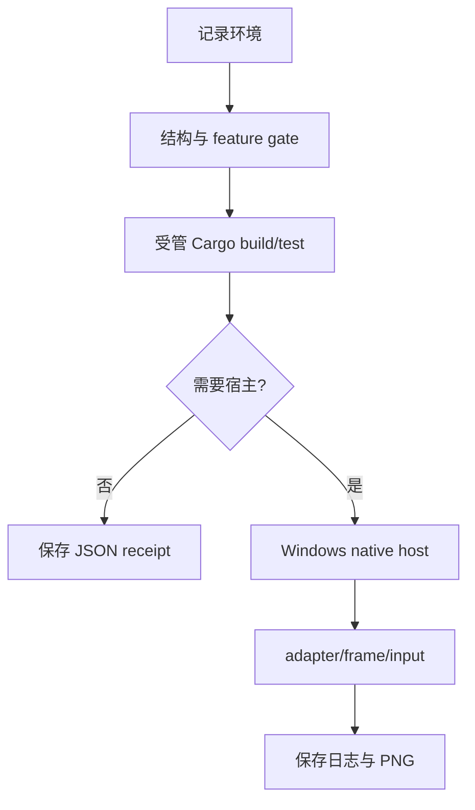

---
related_code:
  - .github/workflows/mvp-editor-windows.yml
  - .github/workflows/ci.yml
  - tools/check_conventions.py
  - .codex/skills/zircon-dev/scripts/validate-matrix.ps1
implementation_files:
  - tools/dev-fast-build.ps1
  - tools/profile-capture-paths.ps1
  - tools/cleanup-stale-targets.ps1
plan_sources:
  - docs/plans/milestone-validation-policy.md
tests:
  - .github/workflows/mvp-editor-windows.yml
  - zircon_runtime/tests/frameworks_03_server_profile.rs
doc_type: platform-validation-reference
---

# Windows 与 WSL 验证

Windows 是编辑器、窗口、输入和 GPU 产品验收的首选环境；CI Linux 用于跨平台编译契约；WSL 仅在明确需要 Linux 工具时使用。验证环境本身是证据的一部分，不能只记录 Cargo 命令而省略 target、toolchain 和宿主。

## 1. 选择环境

| 工作 | Windows native | Linux CI | WSL |
| --- | --- | --- | --- |
| editor host/window/input | 必须 | 不足以替代 | 不适合 |
| wgpu 可见帧 | 必须 | 仅按 CI 能力 | 通常不接受 |
| feature reachability | 可 | 必须 | 可复现时可 |
| `valgrind`/Linux sanitizer | 不适用 | 可 | 仅明确需求 |
| cross-platform export policy | 可做 host contract | 必须 | 可辅助 |

## 2. Windows 受管 target

MVP workflow 固定 `CARGO_TARGET_DIR=D:\ZirconBuilds\cargo-target`，证据目录固定为 run-bound 的 `D:\ZirconBuilds\mvp-ci-results-<run>-<attempt>`。本地若使用 coordinator，应让它设置 target、TEMP、SCCACHE 并发策略；不要将 Cargo target 指向仓库内或 C 盘。

```powershell
$env:CARGO_TARGET_DIR = 'D:\ZirconBuilds\cargo-target'
rustc +1.94.1 -Vv
cargo +1.94.1 metadata --locked --no-deps --format-version 1
```

若受管环境未启用，应通过 `.codex/skills/zircon-dev/scripts/validate-matrix.ps1`，而不是手工拼接一组隐含环境变量。

## 3. Windows 快速门禁

```powershell
rustup run 1.94.1 pwsh -NoProfile -ExecutionPolicy Bypass -File .codex/skills/zircon-dev/scripts/validate-matrix.ps1 -SkipBuild -SkipTest -RunConventionStructure
python tools/check_conventions.py --json
python tools/validate_cargo_test_reachability.py --json
```

预期输出为 JSON 或 validator 的成功摘要；任何 convention、reachability 或 target-policy 失败都应先修复环境/边界，不应通过删除测试或降低 gate 规避。

## 4. Linux CI 依赖

CI 的 `rust` 与 profile matrix job 安装 `pkg-config`、fontconfig、udev、input、dbus、X11/XCB、Wayland 和 ALSA 开发包。缺少这些库时，链接失败是环境失败，不是 Rust API 失败。

```bash
python tools/runtime-profile-feature-presets.py matrix
cargo check -p zircon_app --lib --no-default-features --features core-min --locked --verbose
cargo test --workspace --locked --verbose
```

## 5. WSL 边界

WSL 适合复现 Linux-only 工具、脚本解析和无窗口 contract；不应拿 WSL 的 headless 结果宣称 Windows editor 视觉验收。所有输出目录仍应位于批准的 D/E/F 挂载根，并在开始前打印 `pwd`、`rustc -Vv`、`cargo -V` 和 `uname -a`。

```bash
pwd
uname -a
rustc -Vv
cargo -V
python tools/validate_cargo_test_reachability.py --json
```

## 6. 平台 target policy

`export-platform-contract` job 对 `windows, linux, macos, android, ios, web_gpu, wasm, headless` 逐项运行 `platform_target_policy_matches_host_resource_and_plugin_strategy`。这是策略契约，不代表当前主机真的构建出每个目标的二进制。

```bash
ZR_EXPORT_CONTRACT_PLATFORM=headless cargo test -p zircon_runtime platform_target_policy_matches_host_resource_and_plugin_strategy --locked --verbose
```

## 7. 常见故障矩阵

| 症状 | 证据 | 处理 |
| --- | --- | --- |
| C 盘 target 被拒绝 | validator 路径错误 | 迁移到受管 D/E/F 根 |
| wgpu adapter unavailable | F2 日志、adapter 枚举 | 在真实 Windows GPU 主机重跑 |
| Linux `-sys` 链接失败 | 缺失库名 | 安装 CI 同款 apt 包 |
| WSL 视觉结果空白 | capture/adapter 证据 | 降级为 headless contract，不宣称产品通过 |
| lock/并发污染 | target 日志、进程 | 停止冲突任务后清理受管 target |
| toolchain 不同 | `rustc -Vv` | 使用 1.94.1 或 CI policy |

## 8. 证据结构

```text
D:\ZirconBuilds\mvp-ci-results-123-1\
  environment.txt
  f2-runtime.log
  f2-runtime-frame.png
  build\logs\<gate>.log
  build\profile-contract-summary.json
```

`environment.txt` 必须包含 runner image、Rust、Cargo 与 action identity；图像不能是统一纯色；JSON receipt 必须包含 gate、命令、退出码、时间和日志 hash。

## 9. 验证流程



## 10. 检查单

- [ ] 目标环境与需求匹配。
- [ ] toolchain 与 target policy 已记录。
- [ ] target/temp/cache 不在 C 盘且没有共享污染。
- [ ] feature/profile 命令可复制。
- [ ] 视觉验收有真实 adapter 和非空 framebuffer。
- [ ] 失败时保留原始 stdout/stderr，不只记录摘要。
- [ ] WSL 结果未被误标为 Windows 产品结果。

## 11. 源码索引

环境治理看 `tools/check_conventions.py`、`validate-matrix.ps1` 和 `tools/cleanup-stale-targets.ps1`；CI 策略看 `.github/workflows/ci.yml` 与 `.github/workflows/mvp-editor-windows.yml`；server/headless 语义看 `zircon_runtime/tests/frameworks_03_server_profile.rs`。

## 12. Windows editor smoke

MVP workflow 的 F1-F4 是逐个 exact gate：模板创建、资源状态恢复、persisted WGPU 场景、项目 roundtrip 和完整应用重启。运行时将 stdout/stderr 同时写入 `MVP_EVIDENCE_ROOT`，并检查 exact 测试确实执行一条通过用例。

```powershell
cargo +1.94.1 test -p zircon_editor --lib core::project::tests::template_creation::renderable_empty_template_has_the_f2_camera_cube_and_sun_contract --locked -- --exact --test-threads=1
cargo +1.94.1 test -p zircon_editor --lib tests::workbench::project::document_roundtrip::editor_project_document_roundtrips_world_and_workspace --locked -- --exact --test-threads=1
```

这些命令验证逻辑 gate；窗口和 GPU 资源仍需在 workflow 对应的真实 host 上证明。

## 13. 资源安装差异

Linux CI 必须安装 winit/wgpu/retained UI 所需系统包；Windows 则依赖 runner 镜像、显卡驱动和窗口会话。记录“命令相同”不能隐藏“系统库/adapter 不同”。

| 差异 | 记录字段 |
| --- | --- |
| OS image | `ImageOS/ImageVersion` 或 `uname -a` |
| compiler | `rustc -Vv` |
| Cargo | `cargo -V` |
| GPU | adapter/backend 名称 |
| output root | 完整绝对路径 |
| shell | `pwsh`/bash 与版本 |

## 14. Target 目录治理

执行前检查 target 是否位于允许根；不要把任意环境变量拼入删除命令。清理 stale target 前应列出绝对路径、确认没有 Cargo 进程，并只操作受管目录。

```powershell
Get-Process cargo,rustc -ErrorAction SilentlyContinue
Get-ChildItem D:\ZirconBuilds -Directory -ErrorAction SilentlyContinue
Get-Help .\tools\cleanup-stale-targets.ps1 -Full
```

如果仍有活动进程，先结束冲突任务并重新检查；不能直接递归删除未知目录。

## 15. 何时转到 WSL

只有以下情况才考虑 WSL：Linux-only sanitizer/valgrind、CI shell 脚本差异、Linux 依赖或 headless contract。窗口、IME、GPU present、Windows native plugin loading 必须回到 Windows。

## 16. 输出对比

跨环境比较只比较同一测试层和同一指标。Windows framebuffer 与 Linux headless JSON 不是同一种结果；debug/release、不同 GPU backend、不同 warmup 也不能直接比较 P95。

## 17. 恢复策略

| 失败类别 | 恢复动作 |
| --- | --- |
| 环境路径 | 重建受管目录并重跑 guard |
| toolchain | 安装/选择 1.94.1，再重新采样 |
| 系统依赖 | 对齐 CI 安装清单 |
| cache 污染 | 隔离 run-bound target，保留旧日志 |
| GPU/窗口 | 迁移至 native host，不能降级为通过 |

## 18. 最终报告字段

```text
environment_kind:
os_image:
shell:
rustc:
cargo:
target_dir:
profile/features:
command:
adapter:
result:
evidence_root:
```

## 19. 平台 API 说明

文档描述窗口、surface、adapter、IME 或文件系统接口时，应标注 host 假设。`server/headless` 可以提供同名 contract，但不保证存在窗口 surface；Windows UI host 的失败应返回可定位诊断，不能在 Linux/WSL 中用模拟成功掩盖。

## 20. 终端状态

验证结束时记录测试进程退出码、Cargo 子进程是否结束、target 是否仍被占用以及 evidence 是否完整。未结束的 Cargo/rustc 进程会污染下一次结果；先确认状态，再清理受管临时目录。

## 21. 交接

交接时附环境字段、复现命令和 artifact 路径，使另一台机器能够判断是平台差异还是源码回归。

## 22. 审阅边界

平台验收报告应明确哪些结论来自 Windows、哪些来自 Linux/WSL；不同平台的成功结果不能合并成一个无条件的“全平台通过”。

## 23. 版本记录

当 runner image、Rust、PowerShell、Pester 或系统依赖变更时，重新记录环境并说明与历史结果不可直接比较的字段。
