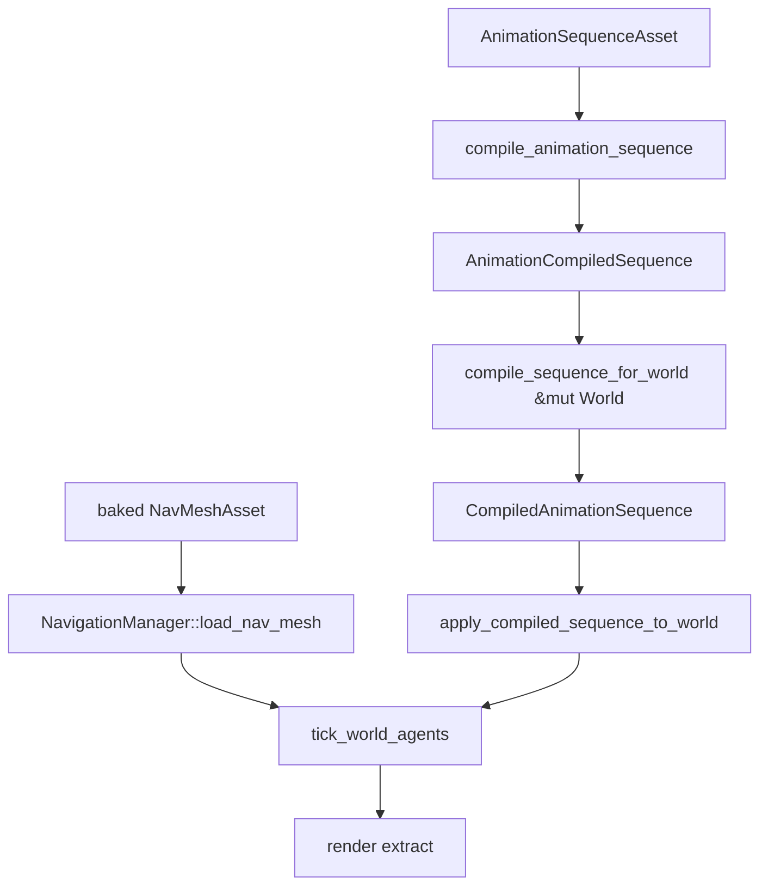

---
related_code:
  - zircon_runtime/src/animation/sequence/compiled.rs
  - zircon_runtime/src/animation/manager/mod.rs
  - zircon_runtime/src/navigation/runtime.rs
  - zircon_runtime/src/navigation/repath_budget.rs
implementation_files:
  - zircon_runtime/src/animation/sequence/compiled.rs
  - zircon_runtime/src/animation/manager/mod.rs
  - zircon_runtime/src/navigation/runtime.rs
plan_sources:
  - user: 2026-09-09 扩充 ZirconEngine 公开接口教程、机制案例与最佳实践
tests:
  - zircon_runtime/src/animation/sequence/tests.rs
  - zircon_runtime/src/navigation/runtime/tests.rs
doc_type: workflow-detail
---

# 动画序列与导航运行时

本教程构建一个 NPC 场景：资产管线先验证动画序列，再把序列绑定到具体 `World`；每帧只应用已经绑定的 compiled projection。导航部分使用内置 fallback 加载已经烘焙的 `NavMeshAsset`，并按 manager 内部的 repath 调度驱动 agent。内置 fallback 当前不负责几何烘焙；需要烘焙时应调用导航插件或编辑器 bake operation。动画和导航都消费稳定 world snapshot，不能在渲染回调中修改 gameplay world。



## 前置条件和目标

- 已注册 Animation 和 Navigation modules。
- world 中有 Transform、Animator、NavAgent 组件。
- 目标是让多个 NPC 播放 locomotion，并由内置 manager 以有界、轮转的重算预算推进寻路。这里的“固定预算”是 manager 的内部策略，不是调用方传入的参数。

## 步骤 1：准备资源和 schema

动画文档声明 track path、采样率和 clip id；导航输入是 importer 产出的 canonical `NavMeshAsset`，其中包含 agent type、几何、polygon、tile 和 area cost。资源加载必须等待依赖 ready。本教程后面的代码从资产管线接收已经解析的 `sequence_asset` 与 `navmesh_asset`，不虚构一个不存在的 `assets.load<T>(string)` 接口。

```rust
use zircon_runtime::core::framework::animation::AnimationSequenceAsset;
use zircon_runtime::core::framework::navigation::NavMeshAsset;

// imported_* 是资产管线在 ready 边界交付的 canonical artifact。
fn install_imported_assets(
    imported_sequence: AnimationSequenceAsset,
    imported_navmesh: NavMeshAsset,
) -> (AnimationSequenceAsset, NavMeshAsset) {
    (imported_sequence, imported_navmesh)
}
```

后续片段假定调用方已经取得 `sequence_asset`、`navmesh_asset`，并且持有需要写入的 `zircon_runtime::scene::World` 的可变借用；这些变量不是隐藏的异步加载 API。

测试或最小样例可以直接构造一个有效的导航网格；`simple_quad` 会生成带 walkable polygon 和 tile 的 v2 资产：

```rust
use zircon_runtime::core::framework::navigation::{NavMeshAsset, DEFAULT_AGENT_TYPE};

let navmesh_asset = NavMeshAsset::simple_quad(DEFAULT_AGENT_TYPE, 50.0);
```

## 步骤 2：编译动画序列

动画序列必须先经过无 world 依赖的语义编译，再拿编译产物绑定实体路径和属性 writer。`compile_animation_sequence` 失败时不会产生 artifact；因此不能跳过诊断检查，也不能把原始 `AnimationSequenceAsset` 直接传给 world 编译器。

```rust
use zircon_runtime::animation::{apply_compiled_sequence_to_world, compile_sequence_for_world};
use zircon_runtime::core::framework::animation::compiler::sequence::compile_animation_sequence;

let source_compilation = compile_animation_sequence(&sequence_asset);
for diagnostic in source_compilation.diagnostics() {
    eprintln!("animation diagnostic: {diagnostic:?}");
}
let source = source_compilation
    .artifact()
    .ok_or("animation sequence did not produce a canonical artifact")?;

// 这里必须是可变 World：编译器会解析目标并预编译 property writer。
let compiled = compile_sequence_for_world(&mut world, source)?;
if !compiled.missing_tracks().is_empty() {
    eprintln!("{} animation tracks are unresolved", compiled.missing_tracks().len());
}
```

`compile_animation_sequence` 只校验 duration、采样率、key 时间、值类型和插值域；`compile_sequence_for_world` 才解析 `EntityPath`/`target_id` 并记录当前 binding-catalog generation。`CompiledAnimationSequence::is_current_for` 用 world generation 和每个 writer 的 schema generation 判断缓存是否可复用。组件重命名、层级变化或类型改变时重新绑定，不要在每帧按字符串猜测 track。

## 步骤 3：应用到 world

```rust
let stats = apply_compiled_sequence_to_world(
    &mut world,
    &compiled,
    frame_time,
    true, // looping：到 duration 后回到序列开头
)?;
println!("tracks={} missing={}", stats.applied_tracks, stats.missing_tracks);
```

`CompiledAnimationSequenceApplyStats` 是固定大小的 `Copy` 结果，公开字段只有 `applied_tracks` 与 `missing_tracks`，没有 duration 或方法式 accessor。`looping=false` 时采样时间会钳制在序列末端；`looping=true` 时按 duration 取模。应用路径不会重新做实体路径解析，但会把 stale writer 的写入计入 missing。调用前通常先检查 `compiled.is_current_for(&world)`，发现 false 就在安全边界重新绑定。

动画系统写入 gameplay-owned pose components；render extract 在稍后阶段读取快照。跨线程时传递 `Arc`/owned snapshot，不保存 world 可变借用。

## 步骤 4：加载已烘焙导航 surface

内置 `BuiltinNavigationManager` 的职责是消费 baked mesh。它的 `bake_surface` 方法目前**始终**返回 `NavigationErrorKind::BackendFailure`，错误信息为 `built-in navigation can load baked navmeshes but does not bake surfaces`。这不是输入 world 无效，也不是可以通过重试解决的暂时失败；请把 bake 放到导航插件、编辑器 operation 或离线工具。

```rust
use zircon_runtime::core::framework::navigation::{
    NavMeshAsset, NavigationManager, DEFAULT_AGENT_TYPE,
};
use zircon_runtime::navigation::BuiltinNavigationManager;

let manager = BuiltinNavigationManager::new();
let nav_mesh = manager.load_nav_mesh(
    NavMeshAsset::simple_quad(DEFAULT_AGENT_TYPE, 50.0),
)?;
println!("loaded baked navmesh handle={nav_mesh:?}");
```

`load_nav_mesh` 拒绝空资产，成功后返回 `NavMeshHandle`；后续 `NavPathQuery` 可以显式携带这个 handle。若需要确认当前 fallback 的能力边界，可以在工具/编辑器流程中保留错误并转交插件：

```rust
use zircon_runtime::core::framework::navigation::NavMeshBakeRequest;

match manager.bake_surface(&world, NavMeshBakeRequest::default()) {
    Ok(_) => unreachable!("the built-in fallback does not bake surfaces"),
    Err(error) => eprintln!("delegate navigation bake to a plugin: {error}"),
}
```

烘焙是昂贵操作，应在编辑器命令或后台 job 执行；运行帧只读取已验证 surface。烘焙 receipt 应记录 geometry generation、settings hash 和 agent settings，之后把生成的 `NavMeshAsset` 交给 `load_nav_mesh`。

## 步骤 5：驱动 agent 和 repath budget

```rust
let report = manager.tick_world_agents(&mut world, frame_time)?;
println!(
    "scanned={} moved={} blocked={}",
    report.scanned_agents, report.moved_agents, report.blocked_agents
);
```

`tick_world_agents` 的公开签名只有 `(&mut World, dt_seconds)`。`BuiltinNavigationManager` 在自己的互斥状态中持有 `NavRepathBudget`、重算 cursor 和已缓存路线；每帧先 `begin_frame`，再从 cursor 轮转 agent，预算耗尽时把未完成 agent 留给后续帧。因此调用方不能也不应传入第三个 budget 参数。导出的 `NavRepathBudget`/`try_consume` 适合自定义导航插件或宿主调度器，不会改变内置 manager 的预算。

当内置 manager 的内部 `try_consume` 返回 false 时，agent 保持上一条有效路径，下一帧从保留 cursor 继续；这属于调度延迟，不是导航数据损坏。`NavAgentTickReport` 可报告 scanned、moved、blocked、arrived/no-path 等结果，但不会承诺一个名为 `deferred` 的字段。

## 步骤 6：动画与导航状态机

导航速度、转向和 grounded 状态进入 animator 参数；参数更新应按 generation 批量提交。状态机 transition 事件可发布到 runtime event bus，UI/telemetry 只消费事件。

```text
PathFollowing -> speed=2.1 -> locomotion.walk
PathComplete  -> speed=0.0 -> locomotion.idle
PathBlocked   -> repath budget -> locomotion.alert
```

## 步骤 7：热重载和失效

导航 surface 变更时，先暂停受影响 agent 的新路径查询，由导航插件/编辑器 operation 烘焙新 surface，验证 checksum，再在 simulation frame boundary 原子替换并重新调用 `load_nav_mesh`。内置 fallback 本身不会执行 bake。动画 clip 变更时，重新 compile sequence；旧 compiled artifact 保持有效直到新 generation 首次应用。

## 预期输出

```text
animation.compile sequence=npc_locomotion tracks=12 missing=0
navigation.frame scanned=128 moved=32 blocked=2
animation.apply generation=88 applied_tracks=12
```

上面的三行是宿主自行记录的 telemetry 文本，不是 `CompiledAnimationSequenceApplyStats` 或 `NavAgentTickReport` 的序列化格式；后者只保证源码中列出的公开字段。

## API 语义矩阵

| API | 语义 | 预算/失败 |
| --- | --- | --- |
| `compile_animation_sequence` | `AnimationSequenceAsset` -> canonical source artifact | 诊断含错误时 artifact 为 `None` |
| `compile_sequence_for_world` | source artifact + `&mut World` -> world-bound compiled projection | 缺 track 会保留在 `missing_tracks()` |
| `is_current_for` | generation 检查 | false 需重编译 |
| `apply_compiled_sequence_to_world` | 按时间和 `looping` 写 pose | 结果字段为 `applied_tracks`/`missing_tracks` |
| `NavigationManager::load_nav_mesh` | 接收非空 `NavMeshAsset` 并返回 `NavMeshHandle` | 空资产返回错误 |
| `BuiltinNavigationManager::bake_surface` | 能力探测/边界报告 | 当前固定 `BackendFailure`，必须委托插件 |
| `tick_world_agents` | 批量扫描、避障和路线写回 | manager 内部 `NavRepathBudget`，无第三个参数 |
| `NavRepathBudget::try_consume` | 自定义调度器消费查询额度 | false 表示延迟，不是数据损坏 |

## 常见失败和恢复

| 现象 | 恢复 |
| --- | --- |
| track missing | 修 schema/path，重新 compile |
| pose 抖动 | 检查固定 tick、插值和 generation |
| nav surface stale | 比较 geometry checksum，由插件或编辑器重新 bake 后再 `load_nav_mesh` |
| repath storm | 降低查询频率和预算，合并目标 |
| agent 卡住 | 检查 blocked 诊断和备用路径 |

## 扩展练习

1. 添加 LOD：远处 agent 降低动画采样率和 repath 频率。
2. 实现 navmesh patch，只重烘焙受影响 tile。
3. 用 deterministic clock 回放动画与导航状态 hash。

## 生产清单

- [ ] 动画 compiled generation 与 world schema 绑定。
- [ ] 导航 bake 在插件/编辑器后台执行，不阻塞 simulation tick。
- [ ] 内置 manager 有每帧 repath 预算；宿主单独记录延迟 agent 指标。
- [ ] 资源替换在 frame boundary 原子进行。
- [ ] agent fallback、blocked 和 stale surface 有可检索诊断。

## 参考

- [Compiled animation](https://github.com/He-Jiahui/ZirconEngine/blob/main/zircon_runtime/src/animation/sequence/compiled.rs)
- [Navigation runtime](https://github.com/He-Jiahui/ZirconEngine/blob/main/zircon_runtime/src/navigation/runtime.rs)
- [Repath budget](https://github.com/He-Jiahui/ZirconEngine/blob/main/zircon_runtime/src/navigation/repath_budget.rs)

## 组件契约矩阵

| 组件 | 写入者 | 读取者 | generation |
| --- | --- | --- | --- |
| `Transform` | animation/navigation | render extract | frame |
| `Animator` | animation manager | animation/render | sequence |
| `NavAgent` | navigation manager | gameplay/UI | path |
| `NavMeshSurface`/`NavMeshAsset` | 插件或 bake job | navigation manager | asset generation |

组件写入者应在同一 simulation phase 完成，render 只读取 snapshot。若多个系统写同一字段，定义明确的 arbitration 顺序，不依赖 query iteration 顺序。

## 动画采样和插值

固定 tick 产生离散 pose，render extract 可以用 alpha 在相邻 snapshot 间插值。暂停、seek 或 clock discontinuity 时清除插值缓存，避免角色从旧时间跳到新时间产生爆闪。

## 导航代理生命周期

agent 创建、重生和销毁都应经过 navigation manager；销毁时先取消 pending query，再移除 path handle。实体 id 复用前等待旧 generation 的回调被消费，防止路径结果写入新实体。

## 性能预算

按 frame 记录动画 tracks、采样时间、repath queries、bake jobs 和宿主侧 deferred agents。内置 manager 的 budget 没有公开 setter；若产品需要按 profile 调整上限，应由导航插件或自定义调度器拥有自己的 `NavRepathBudget`，而不是向 `tick_world_agents` 追加参数。超过预算时优先降低远处 agent 频率，不能跳过近处碰撞或安全约束。

## 自动化验收

```text
cargo test -p zircon_runtime --lib animation::sequence::tests
cargo test -p zircon_runtime --lib navigation::runtime::tests
```

测试覆盖 track missing、generation stale、surface rebuild、budget exhausted、agent despawn 和 deterministic replay。

## 调试案例：NPC 到达目标后不切 idle

先检查导航 manager 是否发布 `PathComplete`，再检查 animation 参数写入是否使用同一个 frame generation。若事件存在而 pose 未变，比较 compiled sequence 是否 `is_current_for` 当前 world；若 generation 过期，重新 compile。最后检查 render extract 是否读取了本帧 snapshot，而不是上一帧缓存。

## 版本兼容

动画 clip schema 和导航 surface schema 都必须带版本。加载旧版本时由 importer 迁移，运行时只接受 canonical artifact。禁止在 `apply_compiled_sequence_to_world` 内临时解释旧字段，这会让回放结果依赖加载路径。

## 运行时开关

profile 可以关闭高成本动画曲线、导航 debug overlay 或远处 agent repath，但开关要在 frame boundary 生效，并发布配置 generation。编辑器修改开关时先写 transaction，再由 runtime session 接收 immutable config snapshot。

## 参考回放脚本

```text
cargo run -p zircon_app --bin server -- --profile replay \
  --input artifacts/npc-inputs.json \
  --expected-state-hash sha256:...
```

脚本只是假定的宿主调用形状；实际参数由当前 server binary 提供。回放失败时输出第一个不匹配 frame、组件 diff 和 animation/navigation diagnostics。

## 案例：动态障碍物

动态障碍物更新时，不要直接修改已发布的 surface。由导航插件或编辑器流程收集 geometry change、生成受影响 tile 集合、提交异步 bake、验证新 surface checksum，再在 simulation tick 边界切换并重新交给 manager 的 `load_nav_mesh`；内置 fallback 只负责消费结果。让受影响 agent 进入短暂 hold 状态，切换期间仍遵守 manager 的内部 repath budget，避免所有 agent 在同一帧重算。

```text
geometry change -> tile bake job -> checksum verified
                -> surface generation++ -> bounded repath
```

## 案例：网络延迟补偿

服务器权威 tick 驱动动画和导航；客户端只显示插值结果。收到迟到的 path/pose snapshot 时，按 frame generation 丢弃过旧数据或触发受控 rewind/replay。不要在客户端本地重新寻路后把结果写回服务器。

## API 边界复核

- `AnimationManager` 持有 playback settings，不持有 renderer surface。
- `BuiltinNavigationManager` 持有路径和 surface，不拥有实体生命周期。
- `CoreRuntime` 提供时间和事件，不替系统决定动画/导航策略。
- editor preview 通过 world-sync 读取结果，不直接调用 manager 私有状态。

这些边界让无头、编辑器和客户端共享系统实现，同时保留不同 profile 的调度预算。

## 资源失效到恢复的完整案例

当 animation clip 被重新导入时，先由 asset watcher 产生 change，再由 importer 发布新 product generation。animation manager 收到事件后标记相关 sequence stale；下一次 tick 使用旧 compiled sequence 完成本帧，后台 compile 成功后在边界切换。这样不会在异步编译中途写入半成品 pose。

导航 surface 采用相同模式：旧 surface 继续服务现有路径，新 surface 通过 checksum 验证后成为下一代。若验证失败，保留旧 surface 并发布 `navigation.surface.reload_failed`，而不是让所有 agent 进入无路径状态。

## 验收证据

保存以下证据可重现问题：

- animation asset/source digest 和 compiled sequence generation；
- navigation geometry checksum、surface generation 和 bake settings；
- runtime frame snapshot、manager repath budget 观察值和宿主 deferred agent count；
- 首个异常 agent id、path status 和 animator state。

证据文件不应包含不可序列化的 world 指针或 manager 引用，使用实体 id、资源 URI 和 generation 即可关联完整链路。

把这份证据与 server/client replay 的 source revision 一起归档，才能判断是内容变更、调度预算还是平台时序导致差异。
