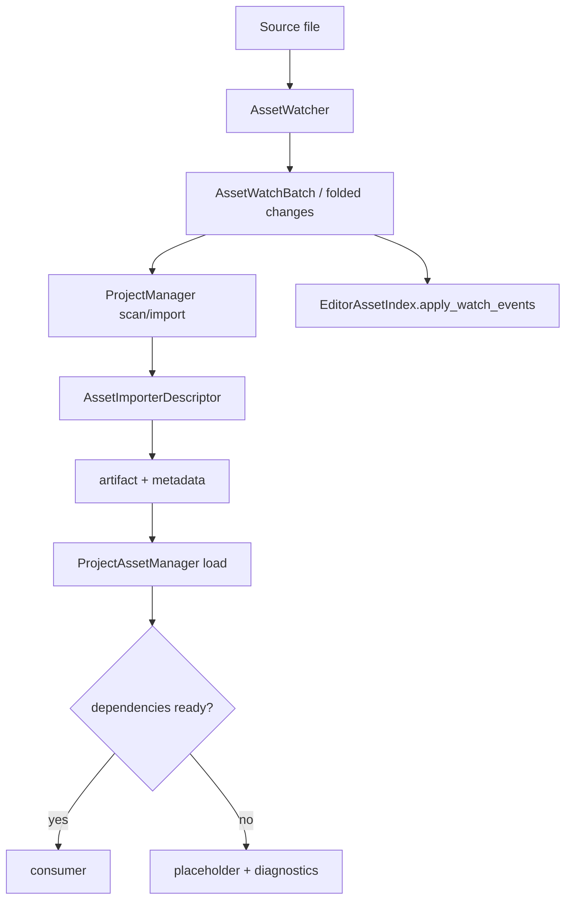

---
related_code:
  - zircon_runtime/src/asset/importer/mod.rs
  - zircon_runtime/src/asset/watch/asset_watcher.rs
  - zircon_runtime/src/asset/watch/fold_events.rs
  - zircon_editor/src/core/asset/index.rs
implementation_files:
  - zircon_runtime/src/asset/importer/mod.rs
  - zircon_runtime/src/asset/watch
  - zircon_editor/src/core/asset/index.rs
plan_sources:
  - user: 2026-09-09 扩充 ZirconEngine 公开接口教程、机制案例与最佳实践
  - docs/plans/zircon_runtime/runtime/04/failure-2026-07-22-asset-importer-generation-index.md
tests:
  - zircon_runtime/src/asset/tests/assets/importer.rs
  - zircon_editor/tests/editor_asset_index_projection.rs
doc_type: workflow-detail
---

# 资产导入、依赖就绪与热重载

本教程实现一条可观察的资产流水线：扫描源文件、选择 importer、生成产品、等待直接和递归依赖 ready，然后通过 watcher 折叠变更并让编辑器索引增量更新。`ProjectManager`/Runtime 保持项目目录、registry 和 metadata authority；编辑器只持有本地 dirty/importing 状态的投影。



## 前置条件和目录

建议项目结构如下：

```text
Demo/
  zircon-project.toml
  assets/source/hero.zmesh
  .zircon/cache/assets/
  .zircon/registry/
```

默认 manifest 的 asset root 是 `assets/`；源文件可以再按 `source/`、`models/`、`ui/` 等目录分类。
派生产物位于项目拥有的 `.zircon/cache/assets/`，registry 位于 `.zircon/registry/`；不要把它们当作
source authority 或手工编辑。项目 manifest 应声明 importer capability，避免宿主扫描到文件后才发现
没有实现。

## 步骤 1：声明 importer

插件注册时使用 `AssetImporterDescriptor` 声明 source extension、`AssetKind`、版本和优先级。下面的
`registry` 代表插件注册阶段传入的 `RuntimeExtensionRegistry`；descriptor 本身只描述匹配和
能力。`register_asset_importer_descriptor` 会安装一个 diagnostic-only backend，真正执行导入时
还要注册 `FunctionAssetImporter` 或 `NativeAssetImporterHandler`。

```rust
use zircon_runtime::asset::{AssetImporterDescriptor, AssetKind};
use zircon_runtime::plugin::RuntimeExtensionRegistry;

let mut registry = RuntimeExtensionRegistry::default();

let descriptor = AssetImporterDescriptor::new(
    "demo.zmesh",
    "com.example.demo",
    AssetKind::Mesh,
    1,
)
.with_priority(100)
.with_full_suffixes([".zmesh"])
.with_required_capabilities(["mesh.import"]);
registry.register_asset_importer_descriptor(descriptor)?;
```

版本号改变代表 artifact schema 改变；导入器不得静默覆盖旧版本产品，应让 registry 产生 invalidation。
注册失败通常来自重复 importer id、同优先级 matcher 冲突或没有声明 extension/suffix。可以在
项目打开前用 `AssetImporter::capability_reports` 检查 optional backend 是否只是
`DiagnosticOnly`。

插件目录中的 registry 不会自动改变一个孤立的 `ProjectManager` 实例。产品启动应让
`ProjectAssetManager`/`AssetManager::open_prepared_project` 复制已验证的插件 registry；只有
在单元测试或离线工具里直接使用 `ProjectManager` 时，才在该实例上调用
`register_asset_importer`/`register_asset_importer_arc`。descriptor-only 注册用于发现和诊断，
不可替代真正 importer handler。

## 步骤 2：扫描并导入

```rust
use zircon_runtime::asset::project::ProjectManager;

let mut project = ProjectManager::open(project_root)?;
let imported = project.scan_and_import()?;
println!("imported records={}", imported.len());
for record in &imported {
    println!(
        "{} kind={:?} revision={} artifact={:?}",
        record.primary_locator(),
        record.kind,
        record.revision,
        record.artifact_locator(),
    );
}
```

`ProjectManager::scan_and_import` 返回本次提交的 `Vec<ResourceRecord>`，不是带有
`imported_count`/`failed_count` 方法的 report。失败会直接返回 `AssetImportError`；需要统计时按
返回记录和错误类型在宿主侧建立 receipt。启动时用 `scan_and_import`，编辑器持续运行用
`scan_and_import_watch_changes(&[AssetChange])`。两个方法都需要 `&mut ProjectManager`，并且只有
事务提交成功后才会替换当前 project generation。

如果需要从物理路径生成稳定的 source URI，应让项目管理器完成 root containment 和规范化，
不要手工拼接字符串：

```rust
let source_path = project.paths().root().join("assets/source/hero.zmesh");
let source_uri = project.project_uri_for_source_path(&source_path)?;
assert_eq!(source_uri.to_string(), "res://source/hero.zmesh");
```

该方法会拒绝位于 manifest `asset_roots` 之外的路径，并处理 Windows 大小写/别名问题；
新目标路径则应交给 `primary_project_source_path_for_uri` 相关项目写入 API，不能把 URI 当成本地
路径直接传给文件系统。`AssetUri` 是 `ResourceLocator` 的类型别名，合法 scheme 为
`res://`（项目源）、`lib://`（派生产物）、`package://`（包资源）、`builtin://`（引擎内置）
和 `mem://`（进程内资源）；`parse` 会拒绝缺少 scheme、空路径、越过根目录的 `..` 和空 label。

### 扫描结果如何解释

| 返回值/字段 | 语义 | 消费建议 |
| --- | --- | --- |
| `Vec<ResourceRecord>` | 本次 generation 实际提交的 registry 记录 | 记录 `id`、`kind`、`revision`、`artifact_locator` |
| `ResourceRecord::state` | `Pending`、`Ready`、`Reloading` 或 `Error` | UI 显示状态，不要仅依据文件是否存在 |
| `source_hash` / `config_hash` | source 与导入设置的内容身份 | 组成缓存 key 和 receipt |
| `dependency_ids` | 直接依赖的 resource id | 交给 readiness 查询进行递归展开 |
| `diagnostics` | 解析、导入、发布阶段的结构化诊断 | 与失败记录一起保留，支持重试定位 |

## 步骤 3：加载并等待依赖

```rust
use zircon_runtime::asset::{AssetUri, MeshAsset, ProjectAssetManager};

fn consume_when_ready(
    assets: &ProjectAssetManager,
) -> Result<(), Box<dyn std::error::Error>> {
    let uri = AssetUri::parse("res://source/hero.zmesh")?;

    // `ProjectManager` owns the catalog; `ProjectAssetManager` is the runtime facade.
    // `handle` can address a pending record, while `load` requires a ready resident payload.
    let hero = assets.handle::<MeshAsset>(&uri)?;
    let states = assets.load_states(hero);
    if !states.is_loaded_with_dependencies() {
        println!(
            "hero not ready: load={:?}, direct={:?}, recursive={:?}",
            states.load_state,
            states.dependency_load_state,
            states.recursive_dependency_load_state,
        );
        if let Some(reason) = assets.failure_reason(hero) {
            println!("hero failure: {reason}");
        }
        return Ok(());
    }

    // Once the state gate passes, `load` is the facade entry that ensures a resident typed
    // payload and returns the same typed handle. Its locator argument is `&AssetUri`.
    let resident_handle = assets.load::<MeshAsset>(&uri)?;
    let payload = assets.assets::<MeshAsset>().get_cloned(resident_handle);
    println!("resident hero payload={}", payload.is_some());
    Ok(())
}
```

`ProjectManager` 没有 `asset_manager()` 方法。运行时通常通过 `ProjectAssetManager` 服务或
`AssetManager` trait 持有 facade，再把 project snapshot 交给它。`handle(&AssetUri)` 只解析
catalog 中的 typed handle，不会把 payload 强行变成 ready；`load(&AssetUri)` 会尝试确保
resident payload，record 尚未 ready 时会返回错误。轮询阶段应使用 `load_states(handle)` 或
`readiness_report(handle)`，渲染或 gameplay 通常应使用
`AssetLoadStates::is_loaded_with_direct_dependencies` 或
`AssetLoadStates::is_loaded_with_dependencies`。等待时允许 placeholder，但必须把 placeholder
与最终 artifact 区分，防止缓存错误结果。

需要在诊断面板显示“哪一个依赖阻塞”时，使用 `readiness_report` 而不是只显示一个布尔值：

```rust
let report = assets.readiness_report(hero);
for dependency in &report.dependencies {
    println!(
        "depth={} direct={} uri={:?} state={:?} diagnostics={:?}",
        dependency.depth,
        dependency.direct,
        dependency.locator,
        dependency.load_state,
        dependency.diagnostics,
    );
}
```

报告以 breadth-first 顺序列出依赖，包含 root/dependency 的 id、locator、kind、revision、
load state 和 `ResourceDiagnostic`；缺失依赖会保留诊断行，不会被静默过滤。把报告序列化给
编辑器或遥测时，保留 revision 与 generation，避免把旧一代的失败误贴到新 artifact。

典型的激活顺序是先解析项目，再把快照交给 runtime-owned manager；激活过程会复制当前
importer registry、执行全量导入、同步资源 registry，并安装 watcher：

```rust
use zircon_runtime::asset::{AssetManager, ProjectAssetManager};
use zircon_runtime::asset::project::ProjectManager;

let project = ProjectManager::open(project_root)?;
let assets = ProjectAssetManager::default();
AssetManager::open_prepared_project(&assets, project)?;
// 后续 load/handle/readiness 调用都通过 `assets` facade 完成。
```

上面的激活路径已经由 `ProjectAssetManager` 拥有 watcher。若采用它，应通过
`AssetManager::subscribe_asset_changes`/`subscribe_asset_watch_errors` 消费 manager 的事件，
不要再对同一 asset root 调用一次 `AssetWatcher::spawn`。下一步的显式 watcher 示例适用于
离线导入器、测试 harness，或由宿主自己完全拥有 `ProjectManager` 的集成；两条路径只能选一条。

manager-owned watcher 的订阅接口交付已经折叠的 `AssetChange`，并单独交付
`AssetWatchError`：

```rust
use zircon_runtime::asset::AssetManager;

let changes = assets.subscribe_asset_changes();
let watch_errors = assets.subscribe_asset_watch_errors();
while let Ok(change) = changes.try_recv() {
    tracing::debug!(uri = %change.uri, kind = ?change.kind,
        previous_uri = ?change.previous_uri, "committed asset change");
}
while let Ok(error) = watch_errors.try_recv() {
    tracing::error!(root = ?error.assets_root, paths = ?error.paths, %error.message,
        "asset watch error");
}
```

这些 receiver 是 manager 的生命周期视图；项目关闭时 manager 会撤销 watcher 和当前
generation，消费者应处理 channel disconnect 并丢弃旧 generation 的 handle。

## 步骤 4：订阅加载事件

以下代码沿用步骤 3 已激活的 `ProjectAssetManager` 变量 `assets`；订阅是 manager 级别的
typed event stream，不是单个资源实例的 callback。

```rust
use std::time::Duration;
use zircon_runtime::asset::{AssetEventKind, MeshAsset};

let subscription = assets.subscribe_asset_events::<MeshAsset>();
// Receiver 是 typed、过滤后的事件流；它没有 callback 参数。
while let Ok(event) = subscription.try_recv() {
    tracing::info!(
        kind = ?event.event_kind(),
        handle = ?event.handle(),
        revision = event.revision(),
        locator = ?event.locator(),
        "asset state changed",
    );
    if event.event_kind() == AssetEventKind::ReloadFailed {
        if let Some(reason) = assets.failure_reason(event.handle()) {
            tracing::error!(%reason, "asset reload failed");
        }
    }
}

// 需要阻塞等待时使用 `recv`；UI/编辑器线程通常使用有界超时。
let _next = subscription.recv_timeout(Duration::from_millis(16));
```

`AssetEventReceiver<TAsset>` 提供 `recv`、`recv_timeout` 和 `try_recv`，每个事件都带 typed
`Handle<TAsset>`、可选 locator、revision，并区分 `Added`、`Modified`、`Removed`、`Renamed`
和 `ReloadFailed`。订阅对象与 consumer 同寿命；消费线程只入队变更，不直接销毁当前渲染资源，
资源替换应在 frame boundary 执行。`try_recv` 返回空/断开错误时应结束本轮 drain，而不是把它
当成资源失败。

## 步骤 5：折叠 watcher 事件

文件系统常在一次保存中发出 create、modify、rename 多个事件。生产路径中的
`AssetWatcher::spawn` 已经在后台线程完成折叠，并通过 callback 交付 `AssetWatchBatch`；
`AssetWatcher::fold_events` 只适用于宿主自己收集 `AssetWatchEvent` 的测试或离线适配器。

```rust
use crossbeam_channel::unbounded;
use zircon_runtime::asset::watch::{AssetWatchBatch, AssetWatchError, AssetWatcher};

let (batch_tx, batch_rx) = unbounded::<AssetWatchBatch>();
let assets_root = project.primary_project_asset_root()?.to_path_buf();
let mut watcher = AssetWatcher::spawn(
    assets_root,
    move |batch: AssetWatchBatch| {
        let _ = batch_tx.send(batch);
    },
    move |error: AssetWatchError| {
        tracing::error!(root = ?error.assets_root, paths = ?error.paths, %error.message,
            "asset watcher error");
    },
)?;

while let Ok(batch) = batch_rx.recv_timeout(std::time::Duration::from_millis(250)) {
    if batch.requires_reconciliation {
        // Overflow or notify errors mean the incremental list is incomplete.
        project.scan_and_import()?;
        continue;
    }
    for change in &batch.changes {
        tracing::debug!(uri = %change.uri, kind = ?change.kind,
            previous_uri = ?change.previous_uri, "asset change");
    }
    project.scan_and_import_watch_changes(&batch.changes)?;
}

let _joined = watcher.shutdown_until(
    std::time::Instant::now() + std::time::Duration::from_secs(1),
);
```

`AssetWatchBatch` 的 `changes`、`requires_reconciliation` 和 `diagnostics` 都是公开字段。
`AssetWatchBatchDiagnostics` 记录 raw/coalesced 数量、队列溢出和最老事件年龄；
`requires_reconciliation=true` 时不要把不完整的 `changes` 当成全量事实，而应重新执行
`scan_and_import`。折叠必须保留最后路径和 `previous_uri`；rename 不应被误报成删除加新建，
否则引用修复和 editor selection 会丢失。watcher 的两个 callback 分别接收
`AssetWatchBatch` 和 `AssetWatchError`，不能传入事件回调或自行调用不存在的 `drain_batch`。

## 步骤 6：更新编辑器索引

`EditorAssetIndex` 只负责 headless projection；下面的 `show_import_badge` 是应用层 UI
adapter，不是 ZirconEngine 的公开函数。示例重点是把 runtime 的 `AssetChange` 映射到 index
要求的 `AssetWatchEvent`。

```rust
use zircon_editor::core::asset::EditorAssetIndex;
use zircon_runtime::asset::watch::AssetWatchBatch;

fn project_editor_batch(
    index: &mut EditorAssetIndex,
    batch: &AssetWatchBatch,
) {
    use zircon_runtime::asset::watch::{AssetChangeKind, AssetWatchEvent};

    if batch.requires_reconciliation {
        // Caller must rebuild the index from the newly committed ProjectManager snapshot.
        return;
    }

    // EditorAssetIndex 接收 AssetWatchEvent；把已折叠的 batch 映射成等价事件。
    let editor_events = batch
        .changes
        .iter()
        .map(|change| match &change.kind {
            AssetChangeKind::Added => AssetWatchEvent::Added(change.uri.clone()),
            AssetChangeKind::Modified => AssetWatchEvent::Modified(change.uri.clone()),
            AssetChangeKind::Removed => AssetWatchEvent::Removed(change.uri.clone()),
            AssetChangeKind::Renamed => AssetWatchEvent::Renamed {
                from: change.previous_uri.clone().expect("rename keeps previous_uri"),
                to: change.uri.clone(),
            },
        })
        .collect::<Vec<_>>();
    index.apply_watch_events(&editor_events);
    for row in index.rows() {
        if row.dirty() || !row.import_valid() {
            show_import_badge(row.uuid(), row.import_state());
        }
    }
}
```

`EditorAssetIndex::from_runtime_project`、`new(Arc<AssetRegistryIndex>)`、`rows`、
`row_by_uuid`、`row_by_path`、`begin_import`、`clear_import` 和 `apply_watch_events` 是当前
公开 API。`EditorAssetRow` 提供 `uuid`、`path`、`type_marker`、`tags`、`dependencies`、
`source_digest`、`import_products`、`dirty`、`import_valid` 和 `import_state`。如果 batch 要求
reconciliation，应先重新构造 `EditorAssetIndex::from_runtime_project(&project)`，不要仅应用
不完整的变化列表。编辑器 index 是 Runtime 权威 registry/metadata 的本地投影，不负责生成
runtime artifact；索引更新与 UI projection 分开，避免文件事件线程直接触碰 UI 状态。

## 输出、遥测和恢复

建议保存一份 import receipt。`primary_uri` 是 registry 的 source identity，`artifact_uri`
遵循 ArtifactStore 的 `lib://<kind-directory>/<resource-id>.zasset` 规则（示例中的
`<resource-id>` 仅为占位符）；不要用一个字段混合两种 locator：

```json
{
  "source_uri": "res://source/hero.zmesh",
  "source_digest": "sha256:...",
  "importer": "demo.zmesh@1",
  "products": [
    {
      "primary_uri": "res://source/hero.zmesh",
      "artifact_uri": "lib://meshes/<resource-id>.zasset"
    }
  ],
  "dependencies_ready": true,
  "duration_ms": 42
}
```

| 指标 | 说明 |
| --- | --- |
| `asset.import.duration_ms` | importer 执行时间 |
| `asset.import.failure` | 稳定错误分类 |
| `asset.watch.coalesced` | 折叠前后的事件数量 |
| `asset.load.pending_dependencies` | 阻塞的依赖数 |
| `asset.reload.generation` | 替换后的资源 generation |

Runtime manager 还提供 `asset_watch_diagnostics()`，可读取 batch 数量、有效变化数、
reconciliation 次数、ingress/pending 溢出、最大 batch 年龄、扫描耗时和增量同步记录数。建议
在每个编辑器 frame 采样一次并按 project generation 打标签：

```rust
let watch = assets.asset_watch_diagnostics();
tracing::debug!(
    batches = watch.batch_count,
    changes = watch.effective_change_count,
    reconciliations = watch.reconciliation_count,
    max_age_ms = watch.max_batch_age.as_millis(),
    "asset watch health",
);
```

## 常见失败

| 现象 | 原因 | 恢复 |
| --- | --- | --- |
| importer not found | capability/extension 未注册 | 检查 plugin manifest 和 registry |
| artifact stale | digest 未变化或 cache key 错 | 删除对应 artifact 后重导入 |
| rename 变成 delete+create | watcher 未折叠 | 使用 `fold_events` 并保留 previous URI |
| 运行时仍见旧资源 | consumer 缓存旧 generation | 在 frame boundary 替换并刷新 handle |
| 依赖永远 pending | 循环依赖或失败子项 | 输出递归状态，修复最底层失败 |

## 扩展练习

1. 为 `zmesh` importer 增加 schema 迁移，并验证旧 artifact 会被标记 invalid。
2. 模拟 100 个 watcher 事件，断言折叠后每个 URI 只有一个逻辑 change。
3. 为 editor asset row 添加“重试导入”命令，命令必须经过 mutation transaction。

## 生产清单

- [ ] source authority、artifact root 和 cache root 分离。
- [ ] importer descriptor 有稳定 id、版本、优先级和 capability。
- [ ] 依赖 ready 状态按直接/递归语义分别显示。
- [ ] reload 在 frame boundary 应用，旧资源直到 fence 完成前保持有效。
- [ ] receipt 能关联 digest、importer、product 和 generation。

## 参考

- [Asset watcher](https://github.com/He-Jiahui/ZirconEngine/tree/main/zircon_runtime/src/asset/watch)
- [Editor asset index](https://github.com/He-Jiahui/ZirconEngine/blob/main/zircon_editor/src/core/asset/index.rs)
- [Project asset tutorial](../project-asset-import.md)

## Importer 契约矩阵

| 字段 | 作用 | 变更策略 |
| --- | --- | --- |
| importer id | 选择实现 | 永不复用旧 id |
| schema version | artifact 布局 | 增加版本并迁移 |
| source extensions | 文件匹配 | 明确大小写策略 |
| priority | 冲突裁决 | 改变需写 release note |
| capabilities | 前置能力 | 缺失时阻止导入 |

Importer 只接收 source bytes、settings 和依赖快照，输出 owned artifact bytes 与 metadata。不要在 importer 内直接修改项目 manifest 或 editor selection。

## 幂等和缓存键

缓存键至少包含 source digest、importer id/version、settings digest、平台 target 和直接依赖 digest。只要其中一项改变，就必须产生新 artifact generation。

```text
cache_key = sha256(source + importer@version + settings + target + deps)
```

命中缓存仍要验证 artifact 完整性和 metadata schema；文件存在不等于可加载。

## 事务式热重载

热重载分成 prepare、quiesce、swap、retire 四阶段：

1. prepare：导入新 artifact 并检查依赖。
2. quiesce：阻止 consumer 创建新引用。
3. swap：在 frame boundary 原子替换 handle。
4. retire：等待旧 generation 的读者结束后释放。

```text
old generation=7 --prepare--> new generation=8
consumer admission paused --swap--> new handles
fence complete --retire--> generation=7 freed
```

## 大批量导入

批量导入使用 bounded worker pool，按依赖拓扑或 importer priority 排队。报告必须能区分 `skipped`（digest 未变）、`failed`（可重试）和 `blocked`（依赖失败）。

## 编辑器交互

资产行显示 source path、UUID、type marker、dirty、import state、failure reason 和 product URIs。重试按钮发出 operation path，经事务引擎记录，而不是直接调用 importer。

## 失败注入与测试

- 截断 source：断言 importer 返回结构化 parse error。
- 删除依赖：断言 recursive load state 指出最底层缺失项。
- 连续 rename：断言 fold 保留 previous URI。
- swap 期间读：断言旧 handle 在 fence 前仍可用。

## 进一步扩展

为 importer 增加远程缓存时，缓存服务只存 content-addressed artifact；source authority、项目路径和用户权限仍由本地宿主验证。下载失败必须回退到本地重导入，并记录 cache miss 原因。

## Import job 状态机

导入 job 建议采用 `Queued -> Reading -> Importing -> Validating -> Published` 状态；可重试错误回到 `Queued`，不可恢复错误进入 `Failed`，依赖阻塞进入 `Blocked`。状态迁移带 job id 和 source digest，重启后可从 receipt 恢复。

```text
Queued -> Reading -> Importing -> Validating -> Published
   ^          |           |             |
   +--retry---+           +--retry------+
```

## 依赖拓扑和循环

构建 importer plan 时先计算依赖图。发现循环应在导入前拒绝，并列出完整环路；不要让运行时 loader 以递归深度限制掩盖循环。对允许延迟绑定的资源，显式声明 weak dependency，不能依赖“加载失败后再试”。

## 大文件和取消

读取大源文件使用流式 API 和可取消 token。取消发生在 chunk 边界，已写入的临时 artifact 必须清理或标记为不可见。UI 的取消按钮只取消当前 job，不影响其他 source 的导入顺序。

## 发布和回滚

新 registry generation 发布后，保留上一代 artifact 直到所有 session 完成切换。发现导入器回归时，可以把 project catalog 指向上一代 generation，而无需恢复 source 文件。回滚动作本身应有 receipt 和审计用户。

## 自动化验证

```text
cargo test -p zircon_runtime asset_importer
cargo test -p zircon_editor --test editor_asset_index_projection
```

仓库中的 importer 契约目前由 `zircon_runtime` 源内单元测试和
`zircon_editor/tests/editor_asset_index_projection.rs` 覆盖，因此第一个命令使用测试过滤器，
而不是不存在的 integration-test target。测试还应检查磁盘断电模拟、只读 source root、权限
错误和 artifact root 空间不足，确保 UI 能显示具体恢复建议。
