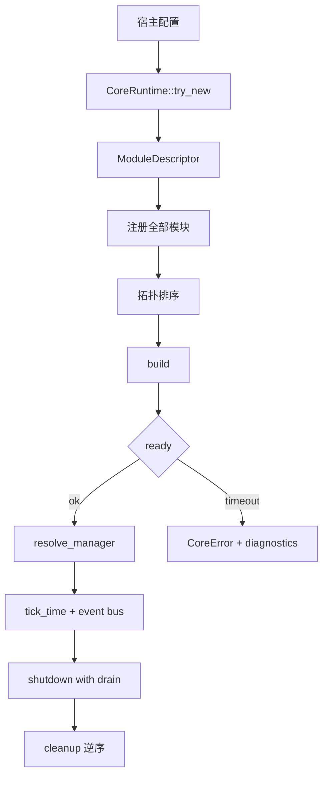

---
related_code:
  - zircon_runtime/src/core/runtime/runtime.rs
  - zircon_runtime/src/core/runtime/lifecycle.rs
  - zircon_runtime/src/core/runtime/descriptors/module_descriptor.rs
  - zircon_runtime/src/core/manager/resolver.rs
implementation_files:
  - zircon_runtime/src/core/runtime/runtime.rs
  - zircon_runtime/src/core/runtime/lifecycle.rs
plan_sources:
  - user: 2026-09-09 扩充 ZirconEngine 公开接口教程、机制案例与最佳实践
  - docs/plans/zircon_runtime/frameworks/02-module-kernel-and-lifecycle-unification.md
tests:
  - zircon_runtime/src/core/runtime/tests/activation
  - zircon_runtime/src/core/runtime/tests/registration
doc_type: workflow-detail
---

# 自定义运行时模块与服务

本教程从一个空的 `CoreRuntime` 开始，构造一个带 manager 的自定义模块，并让宿主在固定生命周期内解析服务、发布事件、推进时钟和安全关闭。示例覆盖模块拥有权、依赖排序、ready 超时和句柄生命周期；不把内部 registry 当作业务 API。

## 你将完成什么

最终入口应能完成以下闭环：

1. 使用 `CoreRuntime::try_new` 创建可失败的运行时。
2. 通过 `ModuleDescriptor` 声明 `Gameplay` 模块和依赖。
3. 在 `build/ready/cleanup` 中建立和撤销服务。
4. 使用 `resolve_manager` 与 `resolve_manager_handle` 读取服务。
5. 每帧调用 `tick_time`，在退出时执行带 drain deadline 的 shutdown。



## 前置条件

- 工具链能构建 workspace，且依赖 `zircon_runtime` 的宿主 crate 已在 `Cargo.toml` 中声明。
- 读过[运行时与模块生命周期](../../core-runtime/runtime-and-module-lifecycle.md)和[模块激活机制](../../mechanisms/module-activation-and-service-resolution.md)。
- 你能为服务定义稳定名称；名称是跨模块契约的一部分，不能使用临时调试字符串。

## 步骤 1：选择运行时构造器

生产入口优先将初始化错误返回给上层。只有在进程预检已经完成且 panic 边界明确时，才选择 `new()`。

```rust
use zircon_runtime::core::CoreRuntime;

fn create_runtime() -> Result<CoreRuntime, Box<dyn std::error::Error>> {
    let runtime = CoreRuntime::try_new()?;
    Ok(runtime)
}
```

需要可重复模拟时，在构造阶段固定随机种子；不要在模块 build 中重置全局随机状态。

```rust
use zircon_runtime::core::CoreRuntime;

let runtime = CoreRuntime::with_random_seed(0x5EED_2026);
```

若宿主需要独立 worker 预算，使用 `try_with_task_graph_options` 并把预算写入启动配置。运行时没有隐式全局任务池，多个实例必须拥有各自的 scope。

## 步骤 2：实现生命周期对象

`ModuleLifecycle` 的 `build` 只创建本模块拥有的对象；`ready` 用来报告异步依赖是否已满足；`cleanup` 负责释放本模块创建的外部资源。以下代码是可编译的最小生命周期实现，业务服务的注册方式取决于实际 manager descriptor。

```rust
use std::sync::Arc;
use zircon_runtime::core::{CoreResult, ModuleContext, ModuleLifecycle};

struct GameplayLifecycle;

impl ModuleLifecycle for GameplayLifecycle {
    fn build(&self, context: &ModuleContext) -> CoreResult<()> {
        let _core = context.core.upgrade();
        // 建立 Gameplay 自己拥有的状态；不要在这里关闭其他模块。
        Ok(())
    }

    fn ready(&self, _context: &ModuleContext) -> CoreResult<bool> {
        // 外部资源准备完成后返回 true；尚未完成时返回 false。
        Ok(true)
    }

    fn cleanup(&self, _context: &ModuleContext) -> CoreResult<()> {
        // 释放本模块的连接、线程和订阅。
        Ok(())
    }
}

let lifecycle = Arc::new(GameplayLifecycle);
```

生命周期回调不应重入注册、激活或关闭命令。重入会使状态机从 `Building` 直接跳到不一致状态，运行时会以 `CoreError` 拒绝或记录诊断。

## 步骤 3：描述依赖和初始化级别

`ModuleDescriptor::new` 创建基础描述，`with_init_level` 提供无冲突时的粗粒度排序，`with_module_dependency` 声明强依赖。显式依赖优先于 init level。

```rust
use zircon_runtime::core::{InitLevel, ModuleDescriptor, ModuleDependencySpec};

let gameplay = ModuleDescriptor::new("Gameplay", "Gameplay domain services")
    .with_init_level(InitLevel::Scene)
    .with_lifecycle(lifecycle);

let presentation = ModuleDescriptor::new("Presentation", "Frame extraction")
    .with_init_level(InitLevel::Post)
    .with_module_dependency(ModuleDependencySpec::named("Gameplay"));
```

依赖名称应在同一 runtime 注册集内唯一。发现未知依赖、重复名称或环时，修正 descriptor 图并重新创建 runtime，不要在已激活实例上动态补注册。

## 步骤 4：注册、激活和解析服务

```rust
use std::time::Duration;

let runtime = create_runtime()?;
runtime.register_module(gameplay)?;
runtime.register_module(presentation)?;
runtime.activate_registered_modules_with_ready_timeout(Duration::from_secs(5))?;
```

服务解析有两种所有权语义。`resolve_manager::<T>` 返回强 `Arc<T>`，适合短期调用；`resolve_manager_handle::<T>` 返回带 runtime 代际约束的句柄，适合跨帧缓存。句柄必须在 shutdown 前停止使用。

```rust
// 真实类型名由模块注册的 ManagerDescriptor 决定。
let manager: std::sync::Arc<MyGameplayManager> =
    runtime.resolve_manager("Gameplay.Manager.GameplayManager")?;
let handle = runtime.resolve_manager_handle::<MyGameplayManager>(
    "Gameplay.Manager.GameplayManager",
)?;
let guard = handle.enter()?;
// 在 guard 生命周期内调用 MyGameplayManager 的实际方法。
drop(guard);
```

如果解析返回 `CoreError::MissingService` 或类型不匹配，先查看模块激活报告和服务注册段；不要通过 `Any` 强制转换或复制私有 registry。

## 步骤 5：驱动时间、状态和事件

每帧先推进 runtime 时钟，再让系统消费同一份 `FrameTimeSnapshot`。固定步上限用于防止暂停后产生无限追帧。

```rust
use std::time::Duration;

let frame = runtime.advance_time_by(Duration::from_millis(16), 4);
println!("frame={}", frame.outer_frame_index());
runtime.publish_event("gameplay.score.changed", serde_json::json!({"value": 42}));
```

事件订阅返回的 guard 必须和消费者同寿命；在 cleanup 中先取消订阅，再释放服务。跨线程发送 payload 时只发送拥有数据，不能把模块内部引用塞入 `serde_json::Value`。

## 步骤 6：关闭与 drain

```rust
runtime.shutdown_registered_modules_with_drain_timeout(Duration::from_secs(5))?;
```

关闭顺序是依赖的逆序。宿主应先停止新请求，再等待短任务 drain，最后让 lifecycle cleanup 释放资源。若 deadline 到期，保留诊断并将进程标记为不洁退出；不要直接 `drop` 逃避 cleanup。

## 观察结果

建议在宿主日志中记录：

| 指标 | 来源 | 通过条件 |
| --- | --- | --- |
| `runtime.activation_ms` | 激活报告 | 小于 profile 预算 |
| `module.ready_timeout` | ready poll | 为 0 |
| `manager.resolve_error` | resolver | 为 0 |
| `runtime.drain_pending` | shutdown diagnostics | 最终为 0 |

可通过 `diagnostic_store_snapshot()` 保存结构化快照；不要只依赖 stdout，因为无头服务通常由日志采集器读取 JSON。

## 常见失败和恢复

| 现象 | 原因 | 恢复 |
| --- | --- | --- |
| 激活排序失败 | 依赖拼写错误或形成环 | 修正 descriptor，重建 runtime |
| ready 超时 | 外部连接未完成 | 延长有界 timeout 或终止 profile |
| 服务解析失败 | 服务未注册或名字漂移 | 对齐 descriptor 名称并添加契约测试 |
| shutdown 卡住 | 强句柄仍在后台任务中 | 停止 admission，等待任务完成 |
| 时间跳变 | 系统休眠或时钟源切换 | 提交 `submit_clock_discontinuity` 并记录原因 |

## 扩展练习

1. 为 `GameplayLifecycle::ready` 增加一个异步资源计数器，并让测试覆盖超时分支。
2. 增加 `Gameplay.Manager` 的 manager descriptor，验证强 `Arc` 与弱 handle 在 shutdown 后的行为差异。
3. 使用 `register_on_transition` 将状态机从 `Loading` 切换到 `Playing`，并发布一个事件。

## 生产清单

- [ ] 所有模块在第一次激活前完成注册。
- [ ] 每个跨模块服务都有稳定名称、类型和契约测试。
- [ ] ready、drain 和 worker 预算均有显式上限。
- [ ] 后台任务只持有 `CoreWeak` 或可终止的 scoped handle。
- [ ] 关闭时先停 admission，再取消订阅，最后 cleanup。
- [ ] 诊断快照能关联到 runtime 实例和 module generation。

## 参考实现和测试

- [CoreRuntime facade](https://github.com/He-Jiahui/ZirconEngine/blob/main/zircon_runtime/src/core/runtime/runtime.rs)
- [生命周期实现](https://github.com/He-Jiahui/ZirconEngine/blob/main/zircon_runtime/src/core/runtime/lifecycle.rs)
- [注册与激活测试](https://github.com/He-Jiahui/ZirconEngine/tree/main/zircon_runtime/src/core/runtime/tests/activation)

## API 语义矩阵

| API | 失败类型 | 所有权 | 适用场景 |
| --- | --- | --- | --- |
| `try_new` | task graph init error | 返回 `CoreRuntime` | 产品入口 |
| `new` | panic | 返回 `CoreRuntime` | 已预检的测试入口 |
| `register_module` | duplicate/dependency error | runtime 取得 descriptor | 激活前组合 |
| `activate_module` | lifecycle/core error | runtime 持有运行模块 | 子图启动 |
| `resolve_manager` | not found/type mismatch | 强 `Arc` | 短期调用 |
| `resolve_manager_handle` | not found/stale generation | 句柄 | 跨帧引用 |
| `publish_event` | 无返回错误 | payload 被复制/拥有 | 低耦合通知 |
| `advance_time_by` | 参数由宿主校验 | 返回 snapshot | fixed tick |
| `shutdown...` | drain timeout | 消耗模块活跃状态 | 退出 |

## 设计一个可测试的 manager

manager 不应读取全局单例。构造器接收 `CoreHandle` 或显式依赖，测试时可使用 fake clock 和 fake event sink。

```rust
struct ScoreManager {
    total: u64,
}

impl ScoreManager {
    fn add(&mut self, value: u64) -> u64 {
        self.total = self.total.saturating_add(value);
        self.total
    }
}

#[test]
fn score_is_monotonic() {
    let mut manager = ScoreManager { total: 0 };
    assert_eq!(manager.add(2), 2);
    assert_eq!(manager.add(3), 5);
}
```

把纯逻辑测试和 runtime integration test 分开：前者不需要 worker；后者验证 descriptor、resolver 和 shutdown 的真实边界。

## 事件命名和 payload 版本

事件 topic 使用 `domain.subject.verb`，payload 顶层带 `schema` 和 `generation`。消费者只读取自己声明的字段，未知字段必须被忽略。

```rust
runtime.publish_event(
    "gameplay.score.changed",
    serde_json::json!({
        "schema": 1,
        "generation": 7,
        "entity": "player-1",
        "value": 42,
    }),
);
```

升级 payload 时保留旧 schema 的兼容读取窗口；不要让事件消费者依赖 Rust enum 的 debug 字符串。

## 故障注入测试

至少覆盖四个故障点：构造失败、依赖排序失败、ready 超时和 cleanup 超时。测试应断言错误类别与诊断字段，而不是只断言 `is_err()`。

```rust
#[test]
fn ready_timeout_keeps_diagnostics() {
    let runtime = test_runtime_with_never_ready_module();
    let result = runtime.activate_registered_modules_with_ready_timeout(
        std::time::Duration::from_millis(1),
    );
    assert!(result.is_err());
    assert!(runtime.diagnostic_store_snapshot().contains("ready"));
}
```

## 性能边界

- descriptor 图只在激活时排序，运行帧不重复拓扑排序。
- resolver 结果应缓存 handle，而不是每个实体查询字符串。
- event payload 避免大数组；大数据使用 asset/resource id。
- cleanup deadline 必须小于进程 supervisor 的总退出预算。

## 下一步

将本教程中的 Gameplay 模块替换为实际业务模块时，先补 `ModuleDescriptor` 和 resolver contract，再写 lifecycle 行为。若模块开始拥有多个无关职责，应拆成多个 descriptor，而不是继续扩展一个 `build` 回调。
