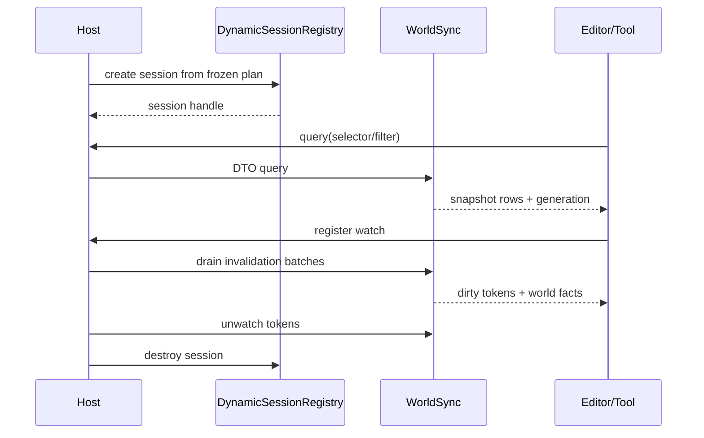

---
related_code:
  - zircon_runtime/src/dynamic_api/session.rs
  - zircon_runtime/src/dynamic_api/session/registry
  - zircon_runtime/src/dynamic_api/session/world_sync.rs
  - zircon_editor/src/core/play/live_link.rs
implementation_files:
  - zircon_runtime/src/dynamic_api/session
  - zircon_runtime/src/dynamic_api/session/world_sync.rs
  - zircon_editor/src/core/play/live_link.rs
plan_sources:
  - user: 2026-09-09 扩充 ZirconEngine 公开接口教程、机制案例与最佳实践
  - docs/plans/zircon_runtime/runtime/02-core-spine-and-root-surface.md
tests:
  - zircon_runtime/src/dynamic_api/tests
  - zircon_editor/tests/editor_world_sync_watch_map.rs
doc_type: workflow-detail
---

# 动态会话与 World Sync

本教程说明编辑器 Play、远程工具或脚本如何创建动态 session，并通过稳定 DTO 查询/监听 world。session 是 ABI ownership 边界；world-sync 是数据投影边界。Rust 宿主不能把 ECS world 指针、trait object 或借用跨过 session。



## 前置条件

- 已完成插件 capability 选择并得到冻结 plan。
- 熟悉 `ComponentSelector`、`QueryFilter`、`WorldQuery`、`WatchRegistration` 等 `zircon_runtime_interface` DTO。
- 已明确 session 的创建线程和关闭 owner。

## 步骤 1：建立动态 session

动态 ABI 的公开生命周期是 `create_session`/`destroy_session`，结果是
`ZrRuntimeSessionHandle`。运行时内部的 slot/registry 不属于宿主 API；宿主如果需要更
高层的 session identity，应在 handle 外再维护自己的 `SessionIdentity`，并把它与日志、
gateway generation 和缓存一起保存。

下面是与当前 `ZrRuntimeApiV8` 表一致的调用形状。`HostError`、`ensure_status` 和日志
函数是宿主自己的错误适配器，不是 runtime interface 中的额外类型。

```rust
use zircon_runtime_interface::{
    ZrByteSlice, ZrRuntimeApiV8, ZrRuntimeSessionConfigV3, ZrRuntimeSessionHandle,
    ZrRuntimeWakeSinkV1, ZIRCON_RUNTIME_ABI_VERSION_V3,
};

fn create_runtime_session(
    api: &ZrRuntimeApiV8,
) -> Result<ZrRuntimeSessionHandle, HostError> {
    let create = api.create_session.ok_or(HostError::MissingSlot("create_session"))?;
    let config = ZrRuntimeSessionConfigV3 {
        abi_version: ZIRCON_RUNTIME_ABI_VERSION_V3,
        profile: ZrByteSlice::from_static(b"editor"),
        project_root: ZrByteSlice::empty(),
        play_scene: ZrByteSlice::empty(),
        play_report_pipe: ZrByteSlice::empty(),
        wake_sink: ZrRuntimeWakeSinkV1::disabled(),
    };
    let mut session = ZrRuntimeSessionHandle::invalid();
    let status = unsafe { create(config, &mut session) };
    ensure_status(status)?;
    if !session.is_valid() {
        return Err(HostError::Protocol("runtime returned an invalid session handle"));
    }
    Ok(session)
}
```

`profile` 可使用 `runtime`、`runtime-pipelined`、`editor`、`dev`、`minimal` 或
`headless`；未知值会返回 `InvalidArgument`。`project_root`、`play_scene` 和
`play_report_pipe` 是 borrowed `ZrByteSlice`，必须在同步调用返回前保持有效。启用
Play 时，project root 和 scene 路径还必须满足 runtime 的路径约束。

## 步骤 2：构造查询 DTO

`WorldQuery` 是带 `kind`/`data` 标签的 enum，当前只有四种 variant：

| variant | 构造方式 | 说明 |
| --- | --- | --- |
| `Components` | `WorldQuery::Components(ComponentWorldQuery { .. })` | 按组件存在性过滤并读取反射值 |
| `Hierarchy` | `WorldQuery::hierarchy(generation_hint)` | 读取层级行 |
| `InspectionFields` | `WorldQuery::inspection_fields(entity, generation_hint)` | 读取一个实体的 Inspector 字段 |
| `TransformSnapshot` | `WorldQuery::transform_snapshot(entity)` | 读取事务起点 Transform；不接受 generation hint |

组件查询的 selector 使用 `ComponentSelector::new`，过滤器是公开字段
`QueryFilter { with, without }`。不要把编辑器 view id、Rust 类型指针或 ECS 借用放入
这些 DTO。

```rust
use zircon_runtime_interface::world_sync::{
    ComponentSelector, ComponentWorldQuery, QueryFilter, WorldQuery,
};

let query = WorldQuery::Components(ComponentWorldQuery {
    filter: QueryFilter {
        with: vec!["zircon.scene.Transform".to_owned()],
        without: vec!["gameplay.Disabled".to_owned()],
    },
    select: vec![
        ComponentSelector::new("zircon.scene.Transform"),
        ComponentSelector::new("gameplay.Health"),
    ],
    generation_hint: last_generation,
});
```

`generation_hint` 与当前 generation 相同（且不是 `u64::MAX`）时，runtime 返回
`WorldQueryResult::NotModified`；否则返回拥有数据的 `ComponentRows`。实体行按
`entity` 确定性排序，组件值是 JSON/反射 DTO，不保证 Rust struct 的内存布局。

## 步骤 3：通过 `query_world` 槽位查询

直接 ABI 调用必须将 DTO 编码为 JSON `ZrByteSlice`，并把结果接收到
`ZrOwnedResultV2`。请求 slice 只借用 `request_json`；结果 allocation 则由 runtime
拥有，解码后必须用同一 session 的 `release_allocation` 释放。完整辅助函数见后文。

```rust
use zircon_runtime_interface::{ZrByteSlice, ZrOwnedResultV2};
use zircon_runtime_interface::world_sync::WorldQueryResult;

let request_json = serde_json::to_vec(&query)?;
let request = ZrByteSlice {
    data: request_json.as_ptr(),
    len: request_json.len(),
};
let query_world = api.query_world.ok_or(HostError::MissingSlot("query_world"))?;
let mut output = ZrOwnedResultV2::empty();
let status = unsafe { query_world(session, request, &mut output) };
let result: WorldQueryResult = decode_owned_json(api, session, status, output)?;
```

`query_world` 的固定函数类型是：

```rust
unsafe extern "C" fn(
    ZrRuntimeSessionHandle,
    ZrByteSlice,
    *mut ZrOwnedResultV2,
) -> ZrStatus
```

输入为空、指针为空或 JSON 无法解码时返回 `InvalidArgument`；超过 query 的字节、
item、嵌套或处理时间预算时返回 `LimitExceeded`。宿主应先检查 `ZrStatus`，再读取
`output.data`，绝不能在 release 后继续使用该指针。

## 步骤 4：注册 watch 并轮询失效批次

watch 不是回调对象，也没有每个 registration 独立的 delta iterator。宿主提交一个
`WatchRegistration`，runtime 返回不透明 `WatchToken`；之后通过同一 session 的
`drain_world_invalidations` 统一取得 `Vec<InvalidationBatch>`，再按 dirty token 分发给
本地 view。

```rust
use zircon_runtime_interface::world_sync::{WatchKey, WatchRegistration, WatchToken};

let registration = WatchRegistration::new(WatchKey::WorldStructure);
let registration_json = serde_json::to_vec(&registration)?;
let watch_world = api.watch_world.ok_or(HostError::MissingSlot("watch_world"))?;
let mut token = WatchToken::new(0);
let status = unsafe {
    watch_world(
        session,
        ZrByteSlice {
            data: registration_json.as_ptr(),
            len: registration_json.len(),
        },
        &mut token,
    )
};
ensure_status(status)?;
if !token.is_valid() {
    return Err(HostError::Protocol("runtime returned an invalid watch token"));
}

loop {
    let batches = drain_world_invalidations(api, session)?;
    if batches.is_empty() {
        break;
    }
    for batch in batches {
        projection.apply_invalidation_batch(batch)?;
    }
}
```

`WatchKey` 的稳定 variant 是 `WorldStructure`、`Subtree { root }`、
`ComponentType { type_name }` 和 `Asset { resource_id }`。每个 token 只在签发它的
session 中有效；不要把 token 当作跨 session 或跨 gateway generation 的全局 id。

## 步骤 5：连接 editor gateway

编辑器侧的 `EditorRuntimeGatewayHandle` 已经把 JSON、foreign allocation 和 ABI 状态
包装成 `query_world`、`watch_world`、`unwatch_world`、`drain_world_invalidations`。
需要把 token 绑定到 view 时，应使用 `WorldSyncPump`，而不是让 view 保存 runtime 的
内部 world：

```rust
let qualified = world_sync_pump.watch_view(
    &gateway,
    registration,
    view_id,
    invalidation_mask,
)?;

let report = world_sync_pump.pump(&gateway, &editor_message_bus)?;
tracing::debug!(
    batches = report.batches(),
    facts = report.published_facts(),
    generation = ?report.last_generation(),
    "world sync pumped"
);
```

`QualifiedWatchToken` 同时保存 opaque token 和签发它的 gateway identity。gateway
替换后，旧 token 会被视为 stale；不能把同一个数值 token 发给新 runtime。编辑器的
`WorldSyncPump::shutdown` 会先清理本地绑定，并且只在 origin identity 仍然匹配时尝试
远端 `unwatch_world`，返回的 receipt 记录 `Unwatched`、`AlreadyAbsent`、
`StaleIdentity` 或失败原因。

## 步骤 6：处理 generation、事实和 replacement

查询结果和失效批次的 generation 是运行时事实，不是客户端自增计数器。客户端应按
以下规则覆盖缓存：

```rust
fn apply_query_result(result: WorldQueryResult, cache: &mut Projection) {
    match result {
        WorldQueryResult::ComponentRows { generation, rows } => {
            cache.replace_components(generation, rows);
        }
        WorldQueryResult::HierarchyRows { generation, rows } => {
            cache.replace_hierarchy(generation, rows);
        }
        WorldQueryResult::InspectionFields { generation, entity, fields } => {
            cache.replace_inspection(generation, entity, fields);
        }
        WorldQueryResult::TransformSnapshot {
            generation,
            world_replacement_epoch,
            entity,
            transform,
        } => cache.accept_transform_snapshot(
            generation,
            world_replacement_epoch,
            entity,
            transform,
        ),
        WorldQueryResult::EntityMissing { generation, entity } => {
            cache.remove_entity(generation, entity);
        }
        WorldQueryResult::NotModified { generation } => cache.confirm(generation),
    }
}
```

`InvalidationBatch` 只包含 `generation`、`dirty: Vec<WatchToken>` 和 `facts`。当前
`WorldFact` 包括 `Spawned`、`Despawned`、`Reparented`、`SceneLoaded`、`SceneUnloaded`、
`WorldReplaced` 和 `AssetReloadApplied`。接口没有“每个 watch 一个 patch/reset
对象”的 wire enum：当 generation 跳跃、收到 `WorldReplaced` 或本地 projection 无法
应用事实时，客户端应重新发起完整 `WorldQuery`，而不是猜测缺失的中间变化。

处理批次时，小于本地 generation 的批次应记录为 stale 并丢弃；generation 跳跃应
触发一次全量查询；`TransformSnapshot` 的 `world_replacement_epoch` 变化则必须使
旧编辑事务失效。

## 步骤 7：撤销 watch 并销毁 session

动态 ABI 没有额外的“停止 admission”或对象式 close 方法。`destroy_session` 自身会
进入关闭流程、等待活动调用和 wake callback 静止，并在仍有 runtime allocation 时拒绝
销毁。宿主需要显式撤销仍存活的 token、释放所有 `ZrOwnedResultV2`，然后调用 destroy：

下面的 `HostError` 分支仍是宿主错误类型的示意；函数指针、参数顺序和 `u8` 返回值是
接口的实际定义。

```rust
let unwatch_world = api.unwatch_world.ok_or(HostError::MissingSlot("unwatch_world"))?;
let mut removed = u8::MAX;
ensure_status(unsafe { unwatch_world(session, token, &mut removed) })?;
match removed {
    0 => tracing::debug!("watch was already absent"),
    1 => tracing::debug!("watch removed"),
    value => return Err(HostError::ProtocolValue("unwatch result", value as u64)),
}

let destroy_session = api
    .destroy_session
    .ok_or(HostError::MissingSlot("destroy_session"))?;
ensure_status(unsafe { destroy_session(session) })?;
```

如果 destroy 返回 teardown error，保留 handle、allocation 账本和 wake registration，
按宿主的重试策略再次清理；不要复用该 handle，也不要用宿主 allocator 释放 runtime
allocation。编辑器场景应先调用 `WorldSyncPump::shutdown`，再释放 gateway/backend。

## ABI 辅助函数：JSON、owned result 与释放

建议将裸 FFI 集中在一个宿主适配器中。以下辅助函数刻意保留 `unsafe` 的最小边界：

```rust
use serde::de::DeserializeOwned;
use zircon_runtime_interface::{
    world_sync::InvalidationBatch,
    ZrByteSlice, ZrOwnedResultV2, ZrRuntimeApiV8, ZrRuntimeSessionHandle, ZrStatus,
};

// HostError 和 ensure_status 由宿主定义：前者保留协议/JSON/状态错误，
// 后者把 ZrStatus 转成 Result<(), HostError>。
fn decode_owned_json<T: DeserializeOwned>(
    api: &ZrRuntimeApiV8,
    session: ZrRuntimeSessionHandle,
    status: ZrStatus,
    output: ZrOwnedResultV2,
) -> Result<T, HostError> {
    let release = api
        .release_allocation
        .ok_or(HostError::MissingSlot("release_allocation"))?;

    let decoded = if !status.is_ok() {
        Err(HostError::RuntimeStatus(status.status_code()))
    } else if !output.allocation.is_valid() {
        Err(HostError::Protocol("successful call returned no owned allocation"))
    } else {
        let len = usize::try_from(output.len)
            .map_err(|_| HostError::Protocol("output length does not fit usize"));
        match len {
            Err(error) => Err(error),
            Ok(0) => Err(HostError::Protocol("unexpected empty JSON output")),
            Ok(len) if output.data.is_null() => {
                Err(HostError::Protocol("non-empty output has a null data pointer"))
            }
            Ok(len) => {
                // The pointer is read only while its allocation is still live.
                let bytes = unsafe { std::slice::from_raw_parts(output.data, len) };
                serde_json::from_slice(bytes).map_err(HostError::Json)
            }
        }
    };

    // Release even when JSON decoding failed. An allocation belongs to this exact session.
    let released = if output.allocation.is_valid() {
        ensure_status(unsafe { release(session, output.allocation) })
    } else {
        Ok(())
    };

    match (decoded, released) {
        (Ok(value), Ok(())) => Ok(value),
        (Err(error), Ok(())) | (Err(error), Err(_)) => Err(error),
        (Ok(_), Err(error)) => Err(error),
    }
}

fn drain_world_invalidations(
    api: &ZrRuntimeApiV8,
    session: ZrRuntimeSessionHandle,
) -> Result<Vec<InvalidationBatch>, HostError> {
    let drain = api
        .drain_world_invalidations
        .ok_or(HostError::MissingSlot("drain_world_invalidations"))?;
    let mut output = ZrOwnedResultV2::empty();
    let status = unsafe { drain(session, &mut output) };

    // An empty carrier represents the normal "nothing pending" case.
    if output.is_empty() {
        ensure_status(status)?;
        return Ok(Vec::new());
    }
    decode_owned_json(api, session, status, output)
}
```

上述代码是 Rust 宿主的 API 调用骨架，不是一个可直接复制的 runtime crate 函数。生产
适配器还应记录 release 失败、检查 provider 的 output 预算、在错误 status 携带了非空
carrier 时照样释放它，并将解码后的值复制到自己的数据结构中。不能缓存
`ZrOwnedResultV2.data`，也不能把 `ZrByteSlice` 指向的请求 buffer 送入异步任务。

### V8 world-sync 槽位矩阵

| 槽位 | 精确签名摘要 | 输入所有权 | 输出/后续动作 |
| --- | --- | --- | --- |
| `query_world` | `(SessionHandle, ZrByteSlice, *mut ZrOwnedResultV2) -> ZrStatus` | caller 借用 JSON `WorldQuery` | 解码 `WorldQueryResult`，release allocation |
| `watch_world` | `(SessionHandle, ZrByteSlice, *mut WatchToken) -> ZrStatus` | caller 借用 JSON `WatchRegistration` | 校验并保存非零 token |
| `unwatch_world` | `(SessionHandle, WatchToken, *mut u8) -> ZrStatus` | token 仅对原 session 有效 | `0`=已不存在，`1`=已移除；删除本地映射 |
| `drain_world_invalidations` | `(SessionHandle, *mut ZrOwnedResultV2) -> ZrStatus` | 无 JSON 请求 | 解码 `Vec<InvalidationBatch>`，release allocation |

`query_world` 和 `watch_world` 分别使用 `ZR_RUNTIME_WORLD_QUERY_REQUEST_LIMIT_V1` 与
`ZR_RUNTIME_WORLD_WATCH_REQUEST_LIMIT_V1`；结果使用 query/invalidation output budget。
这些限制包括最大编码字节、item 数、JSON 嵌套深度和处理时间，不能只靠客户端的
`Vec::len()` 估算。

### 输出 drain 的提交语义

`drain_world_invalidations` 不是“读了就丢”。runtime 先准备一页 pending batches，只有
当 output allocation 成功登记后才提交消费；登记失败会 rollback，使下次 drain 仍可
获得相同的待投递事实。宿主一旦拿到成功 status，就负责在解析结束后 release allocation；
若宿主自己的 JSON 解析失败，应熔断该 foreign-output 通道或重建 session，而不是把
同一 bytes 当成无限重试队列。

一个大批次可以被 runtime 按 output budget 切成多个 page。客户端应持续 drain，直到
得到空 carrier；不要把一次成功 drain 当作“世界已经完全同步”。

### JSON wire 形状

所有请求都由 DTO 的 serde 实现生成，而不是手写字符串。下列片段展示可验证的来源：

```rust
use zircon_runtime_interface::world_sync::{WorldQuery, WatchKey, WatchRegistration};

let hierarchy = WorldQuery::hierarchy(Some(last_generation));
let hierarchy_json = serde_json::to_vec(&hierarchy)?;

let component_watch = WatchRegistration::new(WatchKey::ComponentType {
    type_name: "zircon.scene.Transform".to_owned(),
});
let watch_json = serde_json::to_vec(&component_watch)?;
```

`WorldQuery` 的外层是 `{"kind": ..., "data": ...}`；`WatchRegistration` 的外层为
`{"key": {"kind": ...}}`。`ComponentWorldQuery` 内的 `filter`、`select` 和
`generation_hint` 使用当前 struct 字段名。DTO 都启用 `deny_unknown_fields`，因此旧
宿主不能把未知字段悄悄忽略；升级 query 或 fact variant 时必须协调 interface、runtime、
宿主和 BuildSet。

例如，上面的组件查询在 `serde_json::to_vec` 后具有如下结构（`data` 不能省略，也不能
把 `type_name` 改成 `type_id`）：

```json
{
  "kind": "components",
  "data": {
    "filter": {
      "with": ["zircon.scene.Transform"],
      "without": ["gameplay.Disabled"]
    },
    "select": [
      {"type_name": "zircon.scene.Transform"},
      {"type_name": "gameplay.Health"}
    ],
    "generation_hint": 42
  }
}
```

对应的 `WorldQueryResult::ComponentRows` 是 tagged result；invalidation drain 则是
数组，而不是每个 token 一个回调：

```json
{
  "kind": "component_rows",
  "data": {
    "generation": 43,
    "rows": [
      {"entity": 1001, "components": {"gameplay.Health": {"value": 95}}}
    ]
  }
}
```

```json
[
  {
    "generation": 44,
    "dirty": [7],
    "facts": [{"kind": "spawned", "data": 1002}]
  }
]
```

`WatchRegistration::new(WatchKey::WorldStructure)` 的 JSON 是
`{"key":{"kind":"world_structure"}}`。这些示例只展示 wire 形状；实际组件值、
resource id 和事实数量仍受 runtime 反射与 output budget 约束。

### 常见 ABI 错误

| 表现 | 典型原因 | 宿主处理 |
| --- | --- | --- |
| `InvalidArgument` | 空请求、无效 JSON、空/零 token、空 output 指针 | 修正调用方；不要原样重试 |
| `LimitExceeded` | 超过 byte/item/depth/time budget | 缩小 scope 或 selector，继续按页消费 |
| `NotFound` | session 已销毁或 handle 不属于 registry | 丢弃本地 token/缓存，等待新 session |
| `UnsupportedVersion` | session config ABI 或函数表版本不匹配 | 在加载/建会话前停止握手 |
| `Panic` | runtime 在 FFI wrapper 内捕获 panic | 记录诊断，隔离或重建该 session |
| destroy 返回 `Error` | 仍有 allocation、活动调用或 wake callback | 完成 release/撤销/等待后再尝试销毁 |

## 预期输出与指标

| 指标 | 意义 |
| --- | --- |
| `session.identity` | 请求关联 |
| `world.query.rows` | 查询规模 |
| `world.watch.lag` | 从事实产生到 drain 的消费延迟 |
| `world.invalidation_batches` | 一次 drain 返回的批次数 |
| `world.generation_gap` | 本地 generation 与批次之间的跳跃 |
| `world.generation` | 投影代际 |
| `play.gateway.detach_ms` | 关闭耗时 |

示例日志：

```text
session=s-17 query rows=42 generation=81
session=s-17 invalidation batches=2 generation=90
session=s-17 closed clean=true
```

## 常见失败和恢复

| 失败 | 恢复 |
| --- | --- |
| ABI version mismatch | 拒绝请求并协商支持版本 |
| invalidation page 过大 | 降低查询/事实 scope，继续 drain；不要假设一次 drain 返回全部事实 |
| stale generation | 丢弃旧批次，记录 stale_count |
| generation gap 或 world replacement | 重新执行完整 `WorldQuery`，并丢弃旧 projection |
| gateway missing | 检查 Play backend 是否已完成 build |
| 关闭卡住 | 确认所有 allocation 已 release、watch 已撤销、wake callback 已返回，再重试 destroy |

## 扩展练习

1. 为查询增加分页游标，验证 generation 不变时可连续读取。
2. 模拟 bounded drain 分页，测试 editor projection 能从 generation gap 恢复。
3. 记录 session receipt，关联插件 plan hash 与 world generation。

## 生产清单

- [ ] 所有跨边界数据使用拥有 DTO。
- [ ] session identity/generation 贯穿请求、日志和缓存。
- [ ] watch 有 token 账本、drain 预算和 backpressure 策略。
- [ ] editor 不持有 world 内部指针。
- [ ] 关闭顺序经过 integration contract 验证。

## 参考

- [Dynamic session](https://github.com/He-Jiahui/ZirconEngine/tree/main/zircon_runtime/src/dynamic_api/session)
- [World-sync DTO](https://github.com/He-Jiahui/ZirconEngine/tree/main/zircon_runtime_interface/src/world_sync)
- [Runtime API V8 table](https://github.com/He-Jiahui/ZirconEngine/blob/main/zircon_runtime_interface/src/runtime_api/abi/api_table.rs)
- [World sync tests](https://github.com/He-Jiahui/ZirconEngine/blob/main/zircon_editor/tests/editor_world_sync_watch_map.rs)
- [Play live link](https://github.com/He-Jiahui/ZirconEngine/blob/main/zircon_editor/src/core/play/live_link.rs)

## DTO 契约矩阵

| DTO | 用途 | 所有权 |
| --- | --- | --- |
| `ComponentSelector` | 选择组件 | owned request |
| `QueryFilter` | 过滤实体 | owned request |
| `WorldQuery` | 组合查询 | immutable value |
| `WorldQueryResult` | 返回 rows、transform 或 not-modified | runtime-owned bytes，解码后转为 host-owned value |
| `WatchRegistration` | 描述一个事实 key | borrowed JSON 仅覆盖调用；runtime 保存注册状态 |
| `WatchToken` | 撤销一个 watch | session-owned opaque id |
| `InvalidationBatch` | generation、dirty token 和事实 | runtime-owned bytes，解码后转为 host-owned value |

函数表通过 `ZrRuntimeApiV8`/ABI 版本固定；DTO 使用 serde tagged enum 和
`deny_unknown_fields`。字段缺失、长度越界、未知 enum variant 都应成为 decode error；
不要尝试“尽量解析”。

## 查询性能

查询应尽量声明所需字段，避免空的全量组件投影。对 UI hierarchy 采用投影缓存；对
gameplay 调试使用限流查询，防止工具请求抢占 simulation budget。下面的过滤器和
selector 都是当前 DTO 的实际字段：

```rust
let query = WorldQuery::Components(ComponentWorldQuery {
    filter: QueryFilter {
        with: vec!["gameplay.Selected".to_owned()],
        without: Vec::new(),
    },
    select: vec![
        ComponentSelector::new("zircon.scene.Name"),
        ComponentSelector::new("zircon.transform.Transform"),
    ],
    generation_hint: last_generation,
});
```

## Watch 生命周期

watch admission、token、consumer 和 session destroy 必须由同一 session owner 追踪。重新
连接时创建新 registration，不复用旧 token。当前协议没有 heartbeat 或回调通道；宿主
按 wake、帧循环或定时器调用 `drain_world_invalidations`。

## 安全边界

远程 query 必须通过 capability：允许读取的 component、最大 rows、最大 payload 和频率。拒绝响应只返回稳定 error code；内部路径和 Rust 类型名留在 host diagnostics。

## 测试矩阵

- DTO round-trip：合法/非法长度和未知字段。
- query consistency：同 generation 的 snapshot 可重放。
- watch ordering：批次 generation 单调，dirty token 可验证规范顺序。
- bounded drain：输出 allocation 登记失败时，下一次 drain 仍能取得未提交事实。
- world replacement：replacement epoch 变化后旧事务和 projection 被拒绝或重建。
- session destroy：旧 handle 请求全部被拒绝，未释放 allocation 会阻止销毁。

## 重连和离线缓存

工具重连后先取得新 session handle 和宿主 identity，再请求 full snapshot，最后注册 watch。
离线缓存只能用于显示，不得把旧 world snapshot 写回 runtime；旧 token 必须全部丢弃。

## 扩展练习

1. 为 `Subtree { root }` 和 `ComponentType { type_name }` 设计不同的 projection。
2. 模拟 generation gap，验证 full query 能恢复与事实重放相同的结果。
3. 让 editor live link 在 gateway replacement 时显示可解释的 stale 状态。

## 请求预算和取消

runtime 为 query、watch JSON 和 invalidation output 分配独立的字节、item、嵌套深度和
处理时间预算。当前函数表没有 cancellation token 字段；宿主可在调用线程外设置自己的
deadline，但无论成功、错误还是 decode 失败，都必须先 release 返回的 allocation，再
复用 session 或销毁它。

## 数据一致性级别

world-sync 可提供三种级别：

| 级别 | 语义 | 典型用途 |
| --- | --- | --- |
| snapshot | 单 generation 全量视图 | 初次连接 |
| ordered facts | generation 单调的 `InvalidationBatch` | hierarchy/UI projection |
| best effort | 宿主主动丢弃旧事实 | telemetry |

客户端必须知道当前级别；不能把 best-effort telemetry 当作编辑器权威状态。

## 权限隔离

session plan 可附带 component allow-list、entity scope 和 mutation capability。默认只读；写操作通过独立 operation path，经 editor transaction 或 runtime command queue 执行。world query 本身不提供任意组件写入能力。

## 观测与采样

记录 query rows、编码字节、队列深度、平均/尾部延迟、generation gap 和
`WorldFact::WorldReplaced` 次数。高频 watch 只采样统计，不逐条记录 payload。诊断快照
包含 API version、session handle 的宿主 identity、plan hash 和 world generation。

## 自动化验收

```text
cargo test -p zircon_runtime --lib dynamic_api::tests
cargo test -p zircon_runtime_interface --lib world_sync_contracts
cargo test -p zircon_editor --test editor_world_sync_watch_map
```

验收顺序是 create session、query、watch、drain、bounded output、stale generation、
world replacement、permission deny、unwatch，以及 destroy 后旧 handle 拒绝。
