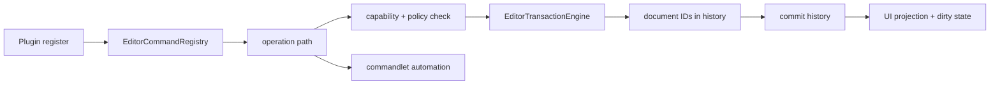

---
related_code:
  - zircon_editor/src/core/editor_extension
  - zircon_editor/src/core/editing/engine/transaction.rs
  - zircon_editor/src/core/commandlet/runner.rs
  - zircon_editor/src/core/asset/type_registry/context_command.rs
implementation_files:
  - zircon_editor/src/core/editor_extension
  - zircon_editor/src/core/editing/engine/transaction.rs
  - zircon_editor/src/core/commandlet/runner.rs
plan_sources:
  - user: 2026-09-09 扩充 ZirconEngine 公开接口教程、机制案例与最佳实践
  - docs/plans/zircon_editor/editor/03-command-transaction-and-undo.md
tests:
  - zircon_editor/tests/integration_contracts
  - zircon_app/tests/editor_mvp_authoring.rs
doc_type: workflow-detail
---

# 编辑器插件命令与可撤销事务

本教程从插件注册一个资产上下文命令开始，经过 operation path 解析、能力检查、事务中的文档关联记录、提交历史，最后说明 commandlet 如何在无 UI 环境复用同一 registry route。目标是保证“点击菜单”和“自动化脚本”使用相同的可用性与 mutation 语义；当前 commandlet runner 只直接实现内置的 typed commandlet，插件自定义 operation 仍需由宿主接入 factory/host。



## 前置条件

- 插件 manifest 已声明 editor capability。
- 目标资产类型已通过 `AssetTypeContribution` 注册。
- 读过[编辑器命令与撤销](../editor-command-undo.md)和[事务最佳实践](../../best-practices/editor-transactions-undo-save.md)。

## 步骤 1：定义 operation path

路径是稳定 API；使用小写 namespace 和动作名，避免把本地化文本当 id。

```rust
use zircon_editor::core::editor_operation::EditorOperationPath;

const OP_RENAME: &str = "asset.rename";
let path = EditorOperationPath::parse(OP_RENAME)?;
```

`EditorOperationPath::parse` 返回 `Result<EditorOperationPath, EditorOperationPathError>`；解析失败时不要把原始字符串继续传给 registry。一个 path 可以被菜单、快捷键、资产 context command 和 commandlet 共同引用。若操作需要参数，参数 schema 也属于契约，应在注册时用 `with_payload_schema_id` 关联。

## 步骤 2：注册 command descriptor

```rust
use zircon_editor::core::commands::{
    EditorCommandAction, EditorCommandCategory, EditorCommandDescriptor,
    EditorCommandRegistry,
};

let operation = EditorOperationPath::parse("asset.rename")?;
let command = EditorCommandDescriptor::new(
    operation.clone(),
    EditorCommandCategory::Edit,
    EditorCommandAction::Operation,
)
.with_required_capabilities(["asset.mutate"])
.with_payload_schema_id("asset.rename.v1");

let mut registry = EditorCommandRegistry::default();
registry.register(command)?;
```

`EditorCommandDescriptor::new` 的三个参数分别是已经解析的 `EditorOperationPath`、`EditorCommandCategory` 和 `EditorCommandAction`；它不接受显示文本或 `EditorOperationInvocation`。内置 presentation 会根据 operation path 生成稳定的 localization key。

需要插件自己的本地化文案时，使用 `localized_operation`，而不是给 `new` 传字符串：

```rust
use zircon_editor::core::commands::{
    EditorCommandDescriptor, EditorCommandPresentation,
};

let operation = EditorOperationPath::parse("asset.rename")?;
let presentation = EditorCommandPresentation::localized(
    "my_asset_plugin",
    "command.my_asset_plugin.asset.rename.label",
    "command.my_asset_plugin.asset.rename.description",
)?;
let command = EditorCommandDescriptor::localized_operation(operation, presentation)
    .with_required_capabilities(["asset.mutate"]);
registry.register(command)?;
```

`EditorCommandDescriptor::localized_operation` 的签名是
`(EditorOperationPath, EditorCommandPresentation) -> EditorCommandDescriptor`，类别和动作固定为 `Command`/`Operation`。如果需要其他类别或动作，先调用 `EditorCommandDescriptor::new`，再用 `with_category` 等 builder 方法配置。`EditorCommandPresentation::localized` 返回 `Result`，bundle 必须由 registry 另外注册并包含对应的 label/description key。

仅调用 `registry.register(command)` 会注册 command metadata；要让 `EditorCommandAction::Operation` 能产生可撤销命令，descriptor 必须和 factory 一起通过 `register_operation` 安装。真实签名如下，其中 `factory` 是插件提供的 `OperationCommandFactoryRegistration`：

```rust
use zircon_editor::core::editing::operation::OperationCommandFactoryRegistration;

let factory: OperationCommandFactoryRegistration = build_rename_factory(operation.clone());
// build_rename_factory 是产品代码；它不是 zircon_editor 提供的 helper。
registry.register_operation(command, factory)?;
```

`OperationCommandFactoryRegistration::new` 的参数顺序为 `(operation, undo_display_name, edit_target, Arc<dyn OperationCommandFactory>)`。factory 的 `create(&EditorOperationInvocation)` 必须返回 `OperationCommand`，其中封装 `Box<dyn EditCommand>`、`HistoryContextId` 和可选 merge mode。descriptor path 与 factory operation 不一致、descriptor 不是 `EditorCommandAction::Operation` 或重复 factory 都会被 registry 拒绝。

资产类型贡献是另一层元数据，可用 `AssetContextCommandDescriptor::new(id, display_name, operation)` 描述右键入口，并按需调用 `with_mutation_access()`；它不会替代 `EditorCommandDescriptor`，也不会自动创建事务。只读命令不要申请 mutation capability。注册失败应阻止插件激活，不留下半个菜单项。

## 步骤 3：解析调用和参数

```rust
use zircon_editor::core::editor_operation::EditorOperationInvocation;

let invocation = EditorOperationInvocation::parse("asset.rename")?
    .with_arguments(serde_json::json!({
        "asset": "asset://hero",
        "new_name": "hero_boss",
    }));
```

`EditorOperationInvocation::parse` 返回带有 `operation_id`、`arguments` 和可选 `operation_group` 的值；`with_arguments` 与 `with_operation_group` 都返回新的 invocation。调用层先做 schema/type validation，再做 selection 和 policy 检查。路径解析错误使用 `EditorOperationPathError`；registry/dispatch 层使用 `EditorCommandRegistryError` 或 `EditorCommandDispatchError`。这些错误不要被压成一个泛化字符串，也不要把用户输入直接拼到路径或文件系统。

## 步骤 4：用 EditContext 打开事务

```rust
use zircon_editor::core::editing::engine::{
    EditCommand, EditContext, EditorTransactionEngine, HistoryContextId,
};

// `edit_context` 必须是实现了 EditContext + 'static 的宿主上下文。
// 编辑器内部通常由 CoreEditContext 持有 scene gateway；它不是插件可直接构造的公开类型。
let engine = EditorTransactionEngine::new(edit_context);
let mut tx = engine.begin("Rename asset", HistoryContextId::Global)?;
tx.push(rename_command)?;
let transaction_id = tx.commit()?;
```

`EditorTransactionEngine::new` 的参数是一个实现 `EditContext + 'static` 的具体值，而不是 history store。`EditContext` 必须提供 world route 捕获/激活、selection snapshot/restore 和 `as_any`/`as_any_mut`；`CoreEditContext` 由编辑器宿主在 crate 内部创建，插件通常接收宿主已经装配好的 engine 或通过 operation factory 间接使用它。

`HistoryContextId` 是枚举，不提供字符串构造器：作者态全局历史使用 `HistoryContextId::Global`，文档历史使用 `HistoryContextId::Document(DocumentId::new(raw_id))`，运行时播放历史使用 `HistoryContextId::PlaySession(play_instance)`。同一 engine 的嵌套事务必须使用相同的 history context，否则 `begin` 返回 `CrossContextNested`。

当前 `TransactionScope` 的 participant API 只有 `add_participant(&mut self, document: DocumentId)`，返回 `()`；它只是把文档 ID 记入 `TransactionRecord`，不接受 callback、snapshot、filesystem writer，也不创建 rollback participant。命令的真正回滚由 `EditCommand::revert` 完成。因此不要调用不存在的 `asset_document_participant`、`project_manifest_participant` 或带 `?` 的 participant builder。只有在确实需要把额外文档 ID 记录到 history 时才写：

```rust
use zircon_editor::core::editor_message::DocumentId;

tx.add_participant(DocumentId::new(42));
```

上面的 `42` 仅是文档 ID 示例；它不代表资产 UUID，也不会替代命令本身的 before/after 数据。

## 步骤 5：执行并提交

```rust
apply_rename(&mut tx, asset_id, "hero_boss")?;
let transaction_id = tx.commit()?;
println!("transaction={}", transaction_id.raw());
```

`apply_rename` 在此处是**架构伪代码**：当前 crate 没有公开的 `apply_rename` helper。生产实现应把一个实现 `EditCommand` 的值传给 `tx.push(command)`；`push` 会立即调用 `EditCommand::apply(&mut dyn EditContext)`，成功后才把命令保留在活动 scope 中。`push` 返回 `Err(EditCommandError)` 时，scope 可能已经被引擎取消；不要继续提交同一个 scope。

`TransactionScope::commit` 消费 scope，返回 `Result<TransactionId, EditCommandError>`，不是带 `history_id()`/`changed()` 方法的 receipt。提交时引擎记录 route、selection 前后快照、命令列表和 document participant 集合，并发布 `TransactionEventKind::Committed`。若命令 apply 失败，引擎依据 `CommandExecutionError` 的 `CommandEffect::{Unchanged, Applied}` 决定是否调用 `revert`；participant 本身不会被单独回滚。不要先更新 UI 或写文件再尝试补一条 history 命令。

若需要在提交前验证应用后的 selection，可使用真实的 `tx.commit_after_apply(|selection| { ... })`；回调返回错误会走正常取消/回滚路径。

## 步骤 6：复用到 commandlet

无头 commandlet 从参数解析到调用 operation，不直接调用私有 mutation helper。当前 parser 使用 `--run`、`--project`、`--automation`、`--dry-run` 和 `--apply` 参数；它不识别 `--command`。

```rust
use zircon_editor::core::commandlet::{
    parse_commandlet_args, run_commandlet, CommandletExitCode,
};

fn run_headless() -> Result<(), String> {
    let request = parse_commandlet_args(["--run", "plugin-list"])
        .map_err(|report| format!("parse failed: {report:?}"))?
        .ok_or_else(|| "--run did not produce a commandlet request".to_owned())?;
    let report = run_commandlet(request);
    if report.exit_code() != CommandletExitCode::Success {
        return Err(format!("commandlet failed: {report:?}"));
    }
    Ok(())
}
```

上例展示的是当前已注册的无头命令 `plugin-list`。`parse_commandlet_args` 返回 `Result<Option<CommandletRequest>, CommandletReport>`：没有 `--run` 时是 `Ok(None)`，参数或命令名错误时是 `Err(report)`。`authoring-automation` 还必须同时提供 `--project` 和 `--automation`。`run_commandlet_with_capabilities` 可在测试或宿主已计算 capability projection 时使用；commandlet report 的稳定字段是 `command`、`status`、`exit_code`、迁移/插件/automation report 和 `error`，并不承诺包含 transaction history id。

## 可观察结果

```json
{
  "operation": "asset.rename",
  "transaction_id": 1042,
  "participants": 2,
  "changed": true,
  "dirty_assets": 1,
  "undo_available": true
}
```

上面的 JSON 是应用层建议的 automation/report envelope，不是 `EditorTransactionEngine` 的直接返回类型。引擎提交返回 `TransactionId`；历史状态通过 `history_status(HistoryContextId)` 查询，包含 `len`、`can_undo`、`can_redo`、`dirty` 和 generation 等字段。按 operation path 统计执行时间、失败类别、取消/回滚次数和写盘耗时；命令文本可本地化，指标 key 不可本地化。

## 失败和恢复

| 现象 | 处理 |
| --- | --- |
| command 不显示 | 检查 capability、asset host 和 registry revision |
| parse 失败 | 输出 operation path 与参数字段，不执行 mutation |
| 权限拒绝 | 由 policy 返回 read-only/locked 原因，保持选择状态 |
| command revert 或 selection restore 失败 | 引擎返回 `RollbackFailed`，进入 faulted 状态；保留诊断并阻止后续 mutation |
| commandlet 与 UI 结果不同 | 检查是否绕过同一个 operation registry |

## 扩展练习

1. 增加批量 rename，限制单次事务资产数并支持分页诊断。
2. 为历史记录加入 schema version，测试旧记录 undo。
3. 让 commandlet 输出机器可读 JSON，并在 CI 中断言 exit code。

## 生产清单

- [ ] operation path、参数 schema 和 capability 稳定。
- [ ] mutation 通过统一事务引擎；UI 在宿主确认 `Committed` 事件或自身 projection 更新后再刷新。
- [ ] 每个 `EditCommand` 有可验证的 `revert`；文档 participant 只记录关联的 `DocumentId`。
- [ ] commandlet 与交互入口共享已注册 descriptor 的 capability/route 契约；自定义 operation 的无头入口有显式 parity 测试。
- [ ] undo/redo、失败和重启恢复都有集成测试。

## 参考

- [Commandlet runner](https://github.com/He-Jiahui/ZirconEngine/blob/main/zircon_editor/src/core/commandlet/runner.rs)
- [Context command descriptor](https://github.com/He-Jiahui/ZirconEngine/blob/main/zircon_editor/src/core/asset/type_registry/context_command.rs)
- [Editor integration contracts](https://github.com/He-Jiahui/ZirconEngine/tree/main/zircon_editor/tests/integration_contracts)

## 命令契约矩阵

| 层 | 契约 | 失败时机 |
| --- | --- | --- |
| declaration | id、display name、operation | 插件注册 |
| invocation | path、参数 schema | parse |
| policy | capability、selection、lock | execute 前 |
| transaction | command、selection、document IDs | apply/commit |
| persistence | file、应用层 save receipt、backup | transaction commit 后的 save 阶段 |
| projection | index、selection、UI | commit 后 |

## 保存和备份

事务 commit 不等于文件已经耐久保存。持久化层应先写临时文件、flush、原子 rename，再发布 save receipt。失败时保留临时文件和旧版本，允许用户重试或恢复。

```text
document.tmp -> fsync -> document.zdoc.bak -> atomic rename(document.zdoc)
```

UI 可以把 `Committed`、`SavePending`、`Saved`、`SaveFailed` 映射为自己的 dirty badge 状态；这些名称是应用层投影建议，不是 `TransactionEventKind` 或 transaction engine 的返回 enum。不要在按钮点击后立即清除 dirty。

## Undo/redo 语义

`engine.undo(history)` 和 `engine.redo(history)` 分别返回 `Result<bool, EditCommandError>`：`true` 表示实际重放了一个 history record，`false` 表示没有可撤销/重做的记录。它们重放已有记录的 `revert`/`apply`，并发布 `UndoApplied` 或 `RedoApplied`，不会另建一条“undo transaction”。不能直接修改底层文件绕开 history；新 mutation 会截断当前 history 分支之后的 redo 路径。

## 并发编辑

编辑器主线程拥有 transaction engine；后台 importer 通过消息提交 intent。若 document generation 已变化，intent 必须重新校验 selection 和 precondition，不能盲目套用旧 patch。

## 能力和只读模式

在只读项目中，命令仍可显示但应明确 disabled reason。把“没有权限”与“当前选择不适用”区分开，便于用户和自动化脚本恢复。

## 自动化断言

commandlet 运行后至少断言当前稳定 envelope 中的 exit code、status、command、error/diagnostics 及对应 migration、plugin 或 automation report。若产品额外写入 transaction id、changed 或 save 状态，它们属于产品自定义 JSON schema，必须和 commandlet 的公开 report 分开断言。CI 不应通过 grep 人类文本判断成功。

## 扩展练习

1. 为批量命令加入 progress receipt 和取消点。
2. 添加崩溃恢复测试：commit 后、projection 前进程退出。
3. 在两个 editor host 间共享 history 时加入 host id 和 document generation。

## 参数 schema 示例

命令参数建议用显式 schema，而不是从 JSON 动态猜类型：

```json
{
  "operation": "asset.rename",
  "schema": 1,
  "arguments": {
    "asset": {"type": "asset_uri", "required": true},
    "new_name": {"type": "string", "min_length": 1, "max_length": 64}
  }
}
```

schema 校验应在 selection 查询前完成，避免对明显无效的请求触碰文件系统。参数错误要指出字段路径和约束，不回显可能包含敏感路径的完整 payload。

## 事务事件和扩展点

事务引擎的 `TransactionEventKind` 当前只有 `Started`、`Canceled`、`Committed`、`UndoApplied`、`RedoApplied`。它不会为 participant 发布 `participant.applied` 或 `transaction.rolled_back` 事件；命令 apply/revert 的细粒度诊断应由 command 或宿主自己的 observer 记录。插件扩展点只能观察已发布事件，不能在事件回调中启动第二个嵌套事务；需要后续 mutation 时入队到下一个 command cycle。

## 崩溃恢复场景

提交后的保存过程被杀死时，应用层可扫描 `.tmp`、`.bak` 和未完成 save receipt：

```text
no receipt + tmp valid -> offer recover
receipt verified        -> mark saved
tmp and bak conflict    -> keep both, require user choice
```

恢复器不得自动覆盖用户文件。恢复结果应成为新的 history entry，确保后续 undo 仍然可解释。

## 性能和批量操作

批量命令每 100 个 command/asset 刷新一次 progress，但仍保持单一 history transaction。若批量规模超过内存预算，拆成可关联的多个 transaction，并在 UI 中显示组 id。不要为了进度而降低 `EditCommand::revert` 的完整性。

## 自动化验收

```text
cargo test -p zircon_editor --test integration_contracts
cargo test -p zircon_app --test editor_mvp_authoring
```

验收至少覆盖 command register、参数拒绝、只读 policy、commit、undo、redo、save failure 和 commandlet parity。

## 典型批量重命名案例

1. 资产浏览器产生选中 UUID 列表。
2. command invocation 只携带 UUID 和目标前缀。
3. policy 检查所有资产是否属于同一 project authority。
4. 每个资产由一个 command 捕获 before 状态；只有在需要关联文档时才调用 `tx.add_participant(DocumentId)`。
5. 先更新内存文档，统一校验冲突，再写入文件。
6. transaction commit 成功并由宿主完成 projection 后刷新 index 和 selection。

冲突检查必须在事务内完成；不能先写第一个文件，遇到第二个冲突才回滚已写文件。

## 插件卸载

插件卸载前查询 command registry 中仍被菜单、快捷键或 automation 引用的 operation。先撤销 UI projection，再撤销 descriptor，最后卸载 native code。history entry 如果仍依赖插件 schema，应保留 migration/decoder，不能因卸载直接使 undo 崩溃。

## 可观测性字段

```json
{
  "operation": "asset.rename",
  "host": "asset-browser",
  "selection_generation": 19,
  "document_generation_before": 44,
  "document_generation_after": 45,
  "rollback": false,
  "save": "saved"
}
```

## 最小回归套件

```text
cargo test -p zircon_editor --test integration_contracts -- editor_command
cargo test -p zircon_app --test editor_mvp_authoring
```

测试名称仅作示例；运行前以 `cargo test -- --list` 确认当前过滤器。
