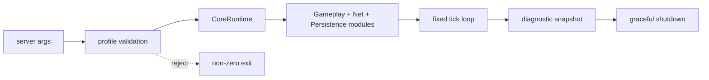

---
related_code:
  - zircon_app/src/bin/server.rs
  - zircon_app/src/entry/builtin_modules.rs
  - zircon_runtime/src/core/runtime/runtime.rs
  - zircon_runtime/src/core/runtime/frame_clock.rs
implementation_files:
  - zircon_app/src/bin/server.rs
  - zircon_runtime/src/core/runtime/runtime.rs
plan_sources:
  - user: 2026-09-09 扩充 ZirconEngine 公开接口教程、机制案例与最佳实践
  - docs/plans/optimize/zircon_app/05-woc-native-server-bot-headless-service-tick-replication-persistence-operations-product-integration-review.md
tests:
  - zircon_app/tests/diagnostic_log_process_lifecycle.rs
  - zircon_app/src/tests
doc_type: workflow-detail
---

# 无头服务器 Profile

无头 profile 是没有窗口、GPU surface 和编辑器 shell 的产品入口。它仍然使用同一套 `CoreRuntime`、模块生命周期、时间策略、诊断存储和插件选择，因此服务器和客户端可以共享 gameplay 代码，同时在入口层明确裁剪 UI 与渲染模块。

## 目标和边界

本教程构建一个可被 CI、容器或专用主机运行的 server binary：

- 从命令行读取项目根和固定 tick rate。
- 仅激活服务器允许的模块集合。
- 使用 deterministic clock 驱动固定步 simulation。
- 以 JSON 日志输出健康状态、tick 延迟和关闭原因。
- 在信号或 stdin EOF 后有界关闭。



## 前置条件

1. 具备可被服务器加载的项目 manifest。
2. 了解 `CoreRuntime::advance_time_by` 的 `max_fixed_steps` 语义。
3. 已决定服务器是否允许 wall-clock（实时）或只允许注入 clock source。

## 步骤 1：定义 profile 配置

配置文件可以使用 TOML；字段名应由宿主自己的 schema 固定，而不是让模块自行读取环境变量。

```toml
[server]
tick_hz = 30
max_catch_up_steps = 4
ready_timeout_ms = 5000
drain_timeout_ms = 5000
deterministic_seed = 3735928559

[modules]
enabled = ["Core", "Gameplay", "Networking", "Persistence"]
disabled = ["Editor", "UI", "Render"]
```

读取后先验证 `tick_hz > 0`、catch-up 有上限、启用模块不存在于 disabled 集合。配置错误应在创建 runtime 前报告，避免半激活实例。

## 步骤 2：构造 deterministic runtime

```rust
use std::time::Duration;
use zircon_runtime::core::CoreRuntime;

struct ServerConfig {
    tick_hz: u32,
    max_catch_up_steps: u32,
    seed: u64,
}

fn make_server_runtime(config: &ServerConfig) -> CoreRuntime {
    CoreRuntime::with_random_seed(config.seed)
}

let config = ServerConfig { tick_hz: 30, max_catch_up_steps: 4, seed: 0xDEAD_BEEF };
let runtime = make_server_runtime(&config);
let fixed_delta = Duration::from_secs_f64(1.0 / f64::from(config.tick_hz));
```

若需要可测试时钟，使用 `with_clock_source` 注入实现了 `ClockSource` 的测试时钟。禁止在每个 system 内自行调用 `Instant::now()`，否则回放和服务器会出现漂移。

## 步骤 3：按 profile 注册模块

服务器入口应复用第一方模块 descriptor，但按 capability/profile 过滤。以下是调用形状；具体 descriptor 名称以 `builtin_modules.rs` 为准。

```rust
for descriptor in builtin_server_descriptors() {
    runtime.register_module(descriptor)?;
}
runtime.activate_registered_modules_with_ready_timeout(
    Duration::from_millis(5_000),
)?;
```

不要为了“让服务器启动”而注册 UI 或 editor 模块的空实现。缺失能力应该成为明确的 profile diagnostic，使部署系统能区分配置错误和代码崩溃。

## 步骤 4：编写固定 tick loop

```rust
use std::time::{Duration, Instant};

let tick_period = Duration::from_secs_f64(1.0 / 30.0);
let mut next_tick = Instant::now();
let mut running = true;

while running {
    let now = Instant::now();
    if now < next_tick {
        std::thread::sleep(next_tick - now);
        continue;
    }

    let frame = runtime.advance_time_by(tick_period, 4);
    simulate_network_input(&runtime, frame);
    persist_authoritative_snapshot(&runtime, frame);
    next_tick += tick_period;
}
```

真实服务器通常由 scheduler/async runtime 驱动等待，这个同步循环只说明调用顺序。关键不变量是每个 simulation tick 只使用 runtime 提供的 frame snapshot，并将过多积压限制在 `max_fixed_steps`。

## 步骤 5：健康检查和诊断

通过 `diagnostic_store_snapshot()` 获取结构化数据；事件总线可发布 `server.health`，供宿主桥接到 HTTP 或 metrics exporter。

```rust
let snapshot = runtime.diagnostic_store_snapshot();
runtime.publish_event(
    "server.health",
    serde_json::json!({
        "tick": snapshot.generation(),
        "ready": true,
    }),
);
```

建议记录 `tick_duration_ms`、`fixed_steps`、`dropped_catch_up_steps`、模块 ready 状态和最后一个错误 generation。日志应带 project id、build receipt id 与 profile 名称，避免多实例混淆。

## 步骤 6：信号和关闭

信号处理器只设置一个原子 stop flag；真正的 shutdown 在 runtime 所属线程执行。

```rust
if stop_flag.load(std::sync::atomic::Ordering::Acquire) {
    runtime.shutdown_registered_modules_with_drain_timeout(
        Duration::from_millis(5_000),
    )?;
}
```

关闭前停止网络 admission 和持久化写入，等待 in-flight job drain，再执行模块逆序清理。任何超时都应输出非零退出码和诊断 receipt。

## 命令行运行

仓库的 binary 名称和参数以当前 `zircon_app/src/bin/server.rs` 为准。典型调用形状：

```text
cargo run -p zircon_app --bin server -- \
  --project E:/Projects/Demo \
  --profile server \
  --tick-hz 30 \
  --log-format json
```

参数解析失败应在 runtime 构造前退出；项目路径不存在、receipt 不匹配或 required plugin 缺失都属于配置失败，不应伪装成空世界继续启动。

## 预期输出

```text
{"event":"runtime.activated","modules":4,"ready_ms":38}
{"event":"server.tick","frame":120,"fixed_steps":1,"duration_ms":2.4}
{"event":"runtime.shutdown","drain_ms":17,"clean":true}
```

采集器可以按 `event` 字段建图，不要依赖人类可读 message 文本。

## 常见失败和恢复

| 失败 | 诊断 | 恢复 |
| --- | --- | --- |
| 容器立即退出 | 参数/manifest 校验失败 | 修正 profile 后重启，不重试无限次 |
| tick 延迟增长 | CPU 饱和或 fixed steps 达上限 | 扩容、降低 tick 或拆分工作 |
| ready 超时 | 网络/持久化依赖未就绪 | 延长有界预算或标记实例 unhealthy |
| 关闭丢数据 | persistence 未 drain | 先停 admission，再等待写入 receipt |
| 与客户端结果不同 | 使用 wall-clock 或随机源漂移 | 注入 clock/seed 并比较 frame snapshot |

## 扩展练习

1. 实现一个 fake clock 测试，连续推进 10,000 tick 并断言状态哈希一致。
2. 增加 `/healthz` 适配层，只暴露最近一次诊断快照。
3. 在超出 catch-up 上限时发布 `server.tick.overrun` 事件并触发 autoscaling 标记。

## 生产清单

- [ ] profile 明确列出 enabled/disabled 模块。
- [ ] tick、catch-up、ready、drain 都有上限。
- [ ] 随机种子、clock source 和 build receipt 可审计。
- [ ] 日志带实例身份和 frame generation。
- [ ] stop signal 不在异步信号线程中直接调用 runtime。
- [ ] 非洁退出会产生可检索诊断记录。

## 参考实现和测试

- [server binary](https://github.com/He-Jiahui/ZirconEngine/blob/main/zircon_app/src/bin/server.rs)
- [运行时 facade](https://github.com/He-Jiahui/ZirconEngine/blob/main/zircon_runtime/src/core/runtime/runtime.rs)
- [进程生命周期测试](https://github.com/He-Jiahui/ZirconEngine/blob/main/zircon_app/tests/diagnostic_log_process_lifecycle.rs)

## 配置字段语义

| 字段 | 约束 | 运行时影响 |
| --- | --- | --- |
| `tick_hz` | 1..=240 | fixed delta |
| `max_catch_up_steps` | 1..=16 | 防止 spiral of death |
| `ready_timeout_ms` | 有限正数 | 模块 ready budget |
| `drain_timeout_ms` | 有限正数 | 关闭预算 |
| `deterministic_seed` | stable u64 | 随机序列 |

配置解析应返回带路径的错误，例如 `server.tick_hz must be > 0`。生产部署把解析后的配置 hash 写入启动 receipt，便于回放和审计。

## 背压与网络输入

网络线程只向 bounded channel 写入拥有的 input DTO；simulation tick 在 runtime 线程批量 drain。channel 满时记录丢弃计数，不阻塞 render 或 persistence。

```rust
let mut inputs = Vec::with_capacity(256);
while let Ok(input) = input_rx.try_recv() {
    inputs.push(input);
}
inputs.sort_by_key(|input| input.sequence());
for input in inputs {
    apply_input(&runtime, input)?;
}
```

输入排序必须由 sequence 和 authoritative tick 决定，不能按网络到达时间决定。重复 sequence 应幂等丢弃，并增加 `server.input.duplicate` 指标。

## 快照和回放

每 N 个 tick 生成 world snapshot，snapshot id 关联 runtime frame 和 plugin plan hash。回放时使用相同 seed、clock policy 和输入序列，比较状态 hash 而非日志文本。

```text
snapshot_id=snap-120 frame=120 state_hash=sha256:...
replay frame=120 state_hash=sha256:... match=true
```

快照写盘应走独立 bounded worker；simulation 只提交 immutable bytes，避免持有 world 可变借用跨线程。

## Supervisor 集成

容器 supervisor 可按退出码区分：0 为 clean，10 为配置错误，20 为依赖缺失，30 为非洁 drain，40 为内部 panic。退出码由宿主统一映射，模块不要自行调用 `std::process::exit`。

## 无头测试层级

1. 配置单元测试：边界值、未知字段和默认值。
2. runtime integration：真实模块激活、tick 和 shutdown。
3. deterministic replay：相同输入得到相同 hash。
4. soak test：长时间运行并观察内存、队列和诊断 generation。

## 安全和资源限制

服务器 profile 需要限制每个客户端实体、消息大小、资产加载数和 snapshot 大小。拒绝请求时只返回稳定错误码，不把文件系统路径或插件内部类型泄露给远端。

## 交付验证

```text
cargo test -p zircon_app --test diagnostic_log_process_lifecycle
cargo run -p zircon_app --bin server -- --profile server --check-only
```

`--check-only` 应完成 manifest、插件、receipt 和模块图验证后退出，不创建长期 worker 或监听 socket。命令不存在时以仓库当前 `server.rs` 参数为准。
