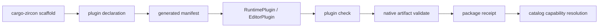

---
related_code:
  - tools/cargo-zircon/src/plugin/scaffold/mod.rs
  - tools/cargo-zircon/src/plugin/check.rs
  - tools/cargo-zircon/src/plugin/validate.rs
  - zircon_runtime/src/plugin/runtime_plugin
implementation_files:
  - tools/cargo-zircon/src/plugin/scaffold
  - tools/cargo-zircon/src/plugin/check.rs
  - zircon_runtime/src/plugin/runtime_plugin
plan_sources:
  - user: 2026-09-09 扩充 ZirconEngine 公开接口教程、机制案例与最佳实践
tests:
  - tools/cargo-zircon/tests/plugin_commands.rs
  - zircon_runtime/src/plugin/runtime_plugin/feature_validation/tests.rs
doc_type: workflow-detail
---

# 原生插件脚手架、验证与打包

本教程使用 `cargo-zircon` 生成一个 runtime 或 editor plugin，然后将声明、manifest、native ABI artifact 和 capability 统一验证。最终包能被 catalog 选择、由动态 session 加载，并产生可追踪的 package receipt。



## 前置条件

- workspace 包含 `cargo-zircon` 工具。
- 已决定插件类型：runtime、editor 或 asset importer。
- 已阅读[插件 manifest 与能力](../../plugins/catalogs-and-manifests.md)和[原生 ABI 最佳实践](../../best-practices/plugin-manifest-capabilities-native-abi.md)。

## 步骤 1：生成脚手架

当前工具的 `new` 解析器只有一个位置参数（插件 ID）和三个选项：`--kind`、`--native`、`--root`。ID 必须是小写 snake case（例如 `weather` 或 `weather_tools`），`--root` 指向包含 `zircon_plugins/`、`zircon_app/` 和两个 first-party catalog 的仓库根目录，而不是插件目录。

```text
# 在 ZirconEngine 仓库根目录运行；省略 --root 时使用当前目录
cargo zircon plugin new weather --kind system --native

# 生成 asset importer（不需要原生动态分发时可省略 --native）
cargo zircon plugin new weather_data --kind importer --root E:/Git/ZirconEngine

# 生成 editor-only 插件
cargo zircon plugin new scene_notes --kind editor --native --root E:/Git/ZirconEngine
```

`--kind` 只能取 `importer`、`system` 或 `editor`。脚手架会一次性写入插件包、`zircon_plugins/Cargo.toml`、runtime/editor catalog 和 `zircon_app/Cargo.toml` 的 wiring；目标包已存在时会拒绝覆盖。生成后先审查 diff，再执行本页的 manifest 检查。

> 术语说明：`system` 是工具层的 runtime plugin 类型，生成的 manifest `category` 为 `runtime`；`importer` 生成 runtime owner 加 `[[asset_importers]]`；`editor` 生成 editor owner。工具当前没有 `--display-name`、`--capability`、`--target` 或 `--id` 选项。

## 步骤 2：阅读声明和 manifest

`plugin.toml` 的声明 owner 是 `runtime/src/capability.rs`（importer/system）或 `editor/src/capability.rs`（editor）中的 `zircon_plugin_sdk::declare_plugin!`。文件首行由工具写入 `@generated from Rust PluginDeclaration`，不要直接编辑由声明投影的字段。当前 schema 使用根级字段；不存在旧式 `[plugin]` 或 `[native]` 包装表。

下面是 `plugin new weather_data --kind importer --native` 生成结果的缩略形状（值会由 ID、workspace 版本和 SDK 版本替换）：

```toml
# @generated from Rust PluginDeclaration; do not edit by hand.
id = "weather_data"
version = "0.1.0"
sdk_api_version = "0.2.0"
display_name = "Weather Data"
category = "asset_importer"
description = "Weather Data plugin package."
supported_targets = ["client_runtime", "editor_host"]
supported_platforms = ["windows", "linux", "macos"]
capabilities = ["runtime.asset.importer.data.weather_data"]
maturity = "experimental"
default_packaging = ["source_template", "library_embed", "native_dynamic"]

[distribution]
forms = ["dist"]
default_packaging = ["native_dynamic"]
abi_version = 3
engine_compat = ">=0.1, <0.2"
dist_crate = "zircon_plugin_weather_data_dist"
descriptor_symbol = "zircon_native_plugin_descriptor_v3"
runtime_entry = "zircon_plugin_weather_data_runtime_entry_v3"

[[asset_importers]]
id = "weather_data.weather_data"
plugin_id = "weather_data"
priority = 100
source_extensions = ["weather_data"]
output_kind = "Data"
importer_version = 1
required_capabilities = ["runtime.asset.importer.data.weather_data"]

[[modules]]
name = "weather_data.runtime"
kind = "runtime"
crate_name = "zircon_plugin_weather_data_runtime"
target_modes = ["client_runtime", "editor_host"]
capabilities = ["runtime.asset.importer.data.weather_data"]

[[modules]]
name = "weather_data.dist"
kind = "native"
crate_name = "zircon_plugin_weather_data_dist"
target_modes = ["client_runtime", "editor_host"]
capabilities = ["runtime.asset.importer.data.weather_data"]
```

`system` manifest 的 `category` 是 `runtime`，只有一个 `<id>.runtime` module；`editor` 使用 `category = "authoring"`、`<id>.editor` module，并在 native 情况下把 `editor_entry` 写入 `[distribution]`。`[[asset_importers]]` 仅由 importer 类型生成，字段包括 importer ID、所属 plugin ID、优先级、输入扩展名、输出 `AssetKind`、版本和所需 capability。`[[modules]]` 是 loader 的模块图节点，`kind` 可为 `runtime`、`editor` 或 native 分发使用的 `native`。

package ID 是 catalog 的稳定键，不应通过改名“复用”旧包；破坏性 ABI 升级应提升 `abi_version`、生成新 artifact/版本，并让 catalog 在新 session 中选择它，而不是覆盖旧字节。

## 步骤 3：实现 runtime/editor plugin

脚手架的 `system` runtime plugin 从声明生成 descriptor，并通过 SDK 宏导出标准 helper。生成的最小实现是一个无副作用的注册入口：

```rust,ignore
use zircon_runtime::plugin::{
    PluginPackageManifest, RuntimeExtensionRegistry, RuntimeExtensionRegistryError,
    RuntimePlugin, RuntimePluginDescriptor,
};

#[derive(Clone, Debug)]
struct WeatherRuntimePlugin {
    descriptor: RuntimePluginDescriptor,
}

impl Default for WeatherRuntimePlugin {
    fn default() -> Self {
        Self {
            descriptor: runtime_plugin_descriptor(),
        }
    }
}

fn runtime_plugin_descriptor() -> RuntimePluginDescriptor {
    WEATHER_DECLARATION.runtime_descriptor(RUNTIME_CRATE_NAME)
}

impl RuntimePlugin for WeatherRuntimePlugin {
    fn descriptor(&self) -> &RuntimePluginDescriptor {
        &self.descriptor
    }

    fn package_manifest(&self) -> PluginPackageManifest {
        generated_package_manifest(self.descriptor.package_manifest())
    }

    fn register(
        &self,
        _registry: &mut RuntimeExtensionRegistry,
    ) -> Result<(), RuntimeExtensionRegistryError> {
        Ok(())
    }
}
```

上段是脚手架生成的 `runtime/src/plugin.rs` 摘录，`WEATHER_DECLARATION` 与
`RUNTIME_CRATE_NAME` 是同文件中由声明模板生成的常量；代码块标为
`rust,ignore`，因为它省略了 package crate 的模块路径和声明常量，不能复制成
独立 crate。`generated_package_manifest` 是同文件中的私有 helper：它把
`CARGO_PKG_VERSION` 和 `zircon_plugin_sdk::SDK_API_VERSION` 写回 manifest。
`RuntimePlugin` 的核心公开方法包括 descriptor、module descriptor、lifecycle、
manifest、project selection、shader sources 和 `register`；其中 module
descriptor/lifecycle 默认转发到 descriptor。不要在教程中假设额外的 `new`、
`run` 或 `weather_descriptor` API。

importer 类型会把真实的 `AssetImporterDescriptor` 注册到同一个 registry。下面的函数体与脚手架 importer 模板一致，扩展名和 capability 应改为项目自己的声明常量：

```rust
use zircon_runtime::asset::{AssetImporterDescriptor, AssetKind};
use zircon_runtime::plugin::{RuntimeExtensionRegistry, RuntimeExtensionRegistryError};

// 下面三个常量由 capability.rs 中的 declare_plugin! 生成。
// const PLUGIN_ID: &str = "weather_data";
// const CAPABILITY: &str = "runtime.asset.importer.data.weather_data";

fn asset_importer_descriptor() -> AssetImporterDescriptor {
    AssetImporterDescriptor::new(
        "weather_data.weather_data",
        PLUGIN_ID,
        AssetKind::Data,
        1,
    )
    .with_priority(100)
    .with_source_extensions(["weather_data"])
    .with_required_capabilities([CAPABILITY])
}

fn register_importer(
    registry: &mut RuntimeExtensionRegistry,
) -> Result<(), RuntimeExtensionRegistryError> {
    registry.register_asset_importer_descriptor(asset_importer_descriptor())
}
```

`register` 阶段只声明 extension、component、resource、event 或系统工厂；不能启动线程、打开 socket、持有跨 session 的 world 引用，或直接修改活跃 session。运行时状态应在注册的 module/system lifecycle 中按 world 创建，并在 owner revoke 时释放。

## 步骤 4：导出原生 ABI

`--native` 会额外生成 `dist` crate（`cdylib`）和 owner crate 的 native projection。runtime owner 使用 SDK 的 `runtime_plugin_exports!` 生成 Rust 侧 helper；`dist` crate 再使用 `native_dist_runtime_plugin_v3!`（editor 对应 `native_dist_editor_plugin_v3!`）导出 descriptor 和 entry。最小 Rust 侧 helper 如下：

```rust
zircon_plugin_sdk::runtime_plugin_exports!(WeatherRuntimePlugin);
```

原生 `dist/src/lib.rs` 的结构（将宏参数替换为脚手架生成的常量）是：

```rust
use zircon_plugin_sdk::native::ZIRCON_NATIVE_PLUGIN_ABI_VERSION;

const PLUGIN_MANIFEST: &str = concat!(include_str!("../../plugin.toml"), "\0");
const DIAGNOSTICS: &[u8] = b"weather_data runtime entry ready\0";
const EMPTY_MANIFEST: &[u8] = b"\0";

zircon_plugin_sdk::native_dist_runtime_plugin_v3! {
    plugin_id: NATIVE_PLUGIN_ID,
    package_manifest: PLUGIN_MANIFEST,
    descriptor_abi_version: ZIRCON_NATIVE_PLUGIN_ABI_VERSION,
    runtime_entry: zircon_plugin_weather_data_runtime_entry_v3,
    runtime_entry_name: NATIVE_RUNTIME_ENTRY.cstr(),
    requested_capabilities: NATIVE_REQUESTED_CAPABILITIES,
    missing_host_diagnostics: b"missing host capability\0",
    runtime: {
        required_capabilities: ["runtime.asset.importer.data.weather_data"],
        denied_capabilities: [],
        negotiated_capabilities: NATIVE_REQUESTED_CAPABILITIES,
        diagnostics: DIAGNOSTICS,
        is_stateless: true,
        state_schema_version: 0,
        command_manifest_schema: None,
        event_manifest_schema: None,
        registration_manifest_schema: Some(
            zircon_plugin_sdk::native::NATIVE_REGISTRATION_MANIFEST_SCHEMA_V3,
        ),
        command_manifest: Some(EMPTY_MANIFEST),
        event_manifest: Some(EMPTY_MANIFEST),
        registration_manifest: Some(NATIVE_RUNTIME_REGISTRATION_MANIFEST),
        invoke_command: None,
        save_state: None,
        restore_state: None,
        unload: None,
        bridge_methods: [],
        on_host_ready: None,
    },
}
```

上面的代码展示真实宏字段；`NATIVE_*` 常量由 `declare_plugin!` 的 `native_projection` 生成，不能手工拼接名字。函数表只放 C-compatible POD、NUL 终止字符串和显式 byte buffer；不要跨 ABI 返回 `String`、`Vec<T>`、trait object、Rust reference 或 unwind。所有 callback 都由 SDK 的 panic fence 包裹，owned bytes 必须按 V3 host allocator/释放规则回收。

## 步骤 5：同步和检查 manifest

`sync-manifest`/`check-manifest` 的 selector 是可选的位置参数；`--root` 是仓库根目录选项。两条命令都会扫描 `zircon_plugins/**/<runtime|editor>/src/capability.rs` 中的 `declare_plugin!`，因此 selector 应写声明里的 package ID。

```text
# 写回所有声明 owner 的 manifest
cargo zircon plugin sync-manifest --root E:/Git/ZirconEngine

# 只同步一个包；发现漂移时退出码为 3，不改文件
cargo zircon plugin check-manifest weather_data --root E:/Git/ZirconEngine

# 检查 workspace、catalog、app wiring；可选地指定 native artifact 根目录
cargo zircon plugin check --root E:/Git/ZirconEngine --artifact-root E:/Git/ZirconEngine/target/release

# validate 的 manifest 路径是位置参数（目录会自动追加 plugin.toml）
cargo zircon plugin validate E:/Git/ZirconEngine/zircon_plugins/weather_data/plugin.toml
```

`sync-manifest` 会写入投影并报告 `Updated`/`Unchanged`；`check-manifest` 使用同一投影算法但只报告 `Drift`。`plugin check` 进一步验证 workspace member、runtime/editor catalog 注册、app feature、声明漂移，以及（提供 `--artifact-root` 时）从 distribution 推导出的原生文件。`plugin validate` 验证 TOML 根字段、枚举、target/platform、capability、module 和 distribution；它只在显式传 `--artifact <FILE>` 时加载并检查单个 native artifact。

## 步骤 6：构建与验证 artifact

```text
cargo build -p zircon_plugin_weather_data_dist --release

# 路径是位置参数；--artifact 可选，触发动态库加载和 descriptor 探针
cargo zircon plugin validate E:/Git/ZirconEngine/zircon_plugins/weather_data/plugin.toml --artifact E:/Git/ZirconEngine/target/release/zircon_plugin_weather_data_dist.dll
```

`validate_native_artifact` 会先检查文件存在，再读取 `[distribution].descriptor_symbol`（脚手架默认 `zircon_native_plugin_descriptor_v3`），加载动态库并探测 descriptor 的 ABI version、plugin ID、package manifest、entry 名称和 capability 字符串。它不会替你计算 package receipt 的 hash；发布流水线应在验证成功后独立计算 SHA-256，并把路径、hash、target triple、ABI 和 source commit 写入 receipt。不要把只改扩展名的 DLL 当作 Linux `.so`，验证器仍会按当前 host 的动态库格式加载。

在 Windows 上，Cargo 生成的 `cdylib` 文件名可能包含平台约定的前缀/后缀；以 `target/release` 中实际文件名为准传给 `--artifact`。若只想检查 schema 而暂时没有 DLL，省略 `--artifact`，不要伪造路径。

## 步骤 7：选择和加载

catalog 选择发生在 session 创建前，输入是已经解析好的 `ProjectPluginManifest` 和 `RuntimeTargetMode`。`feature_dependency_report` 与 `compiled_project_plan` 的参数不是字符串 ID，也不是插件目录：

```rust
use zircon_runtime::core::framework::platform::RuntimeTargetMode;
use zircon_runtime::core::framework::project::ProjectPluginManifest;
use zircon_runtime::plugin::RuntimePluginCatalog;

fn select_plugins(
    catalog: &RuntimePluginCatalog,
    project_plugins: &ProjectPluginManifest,
    target_mode: RuntimeTargetMode,
) -> Result<(), &'static str> {
    let report = catalog.feature_dependency_report(project_plugins, target_mode);
    if !report.blocked_features.is_empty() {
        return Err("plugin capability resolution failed");
    }
    let plan = catalog.compiled_project_plan(project_plugins, target_mode);
    // 将 plan 交给 RuntimeModuleCompositionCompiler；不要在此处修改 catalog。
    let _ = plan;
    Ok(())
}
```

先检查 report，再冻结 plan。plan 按 catalog generation、manifest fingerprint 和 target 缓存；插件集合或 capability 变更应准备新 generation/新 session，不要对活跃 runtime graph 进行增量 native reload。若 report 被阻断，诊断对象会标出缺失 provider、target 不支持、owner 依赖冲突或 dependency cycle，调用方应在 UI/CI 中原样呈现这些原因。

## 预期输出

```text
weather_data: Updated
E:/Git/ZirconEngine/zircon_plugins/weather_data/plugin.toml: valid
# 以下一行是宿主/catalog 激活报告，不是 cargo-zircon 的固定输出
plugin.catalog capability=runtime.asset.importer.data.weather_data provider=weather_data status=selected
```

第一行是 `sync-manifest` 的实际 package/outcome 形状；漂移检查会输出 `Drift` 并以退出码 3 结束。`validate` 成功时输出 `<manifest-path>: valid`，native 探针失败则输出带 diagnostic code 和 hint 的 stderr。

## API/契约矩阵

| 项目 | 契约 | 失败处理 |
| --- | --- | --- |
| package id | 全局稳定 | 重复拒绝 |
| capability | provider/consumer 匹配 | report blocked |
| target/platform | 显式支持 | 不加载 |
| ABI version | `[distribution].abi_version = 3` 与 descriptor 匹配 | native validator 拒绝 |
| descriptor symbol | `[distribution].descriptor_symbol` 指向导出符号 | load failed |
| artifact hash | 由发布 receipt/签名流水线验证 | 隔离 artifact |
| register | descriptor-only | activation 前失败 |

## 常见失败和恢复

| 现象 | 恢复 |
| --- | --- |
| manifest drift | 运行 `check-manifest` 查看退出码 3，再运行 `sync-manifest` 写回 |
| missing export | 用 native validator 检查 macro/target |
| ABI mismatch | 构建对应 ABI 或禁用该 target |
| capability blocked | 安装 provider 或移除 consumer feature |
| plugin panic | panic fence 返回错误，隔离 session |
| hash mismatch | 拒绝加载，重新分发签名包 |
| unknown category/target | 使用 validator 输出的 allowed values 修正声明 |
| package exists | 选择新 snake-case ID；脚手架不会覆盖目录 |

## 扩展练习

1. 运行 `cargo zircon plugin new weather_data --kind importer`，为 `[[asset_importers]]` 增加第二个扩展名并测试 priority 冲突。
2. 运行 `cargo zircon plugin new server_metrics --kind system --native`，在声明中只保留 `server_runtime` target，验证 client/editor profile 的 plan 被阻止。
3. 为 native entry 做 fuzz：空 capability buffer、超长 buffer、错误 `abi_version`、缺少 NUL 终止符和 panic。

## 生产清单

- [ ] 声明是 manifest 的唯一 owner。
- [ ] ID、capability、target、platform 和 maturity 完整。
- [ ] ABI 只交换 C-compatible 数据与显式 ownership。
- [ ] artifact 经过 hash、导出和版本验证。
- [ ] catalog report 在 session 创建前处理。
- [ ] package receipt 可关联 build、源 commit、artifact hash、descriptor symbol 和 ABI。

## 参考

- [Plugin scaffold](https://github.com/He-Jiahui/ZirconEngine/blob/main/tools/cargo-zircon/src/plugin/scaffold/mod.rs)
- [Plugin check](https://github.com/He-Jiahui/ZirconEngine/blob/main/tools/cargo-zircon/src/plugin/check.rs)
- [Plugin command tests](https://github.com/He-Jiahui/ZirconEngine/blob/main/tools/cargo-zircon/tests/plugin_commands.rs)

## 发布目录布局

```text
release/
  plugin.toml
  bin/zircon_plugin_weather_data_dist.dll
  symbols/zircon_plugin_weather_data_dist.pdb
  receipts/plugin-receipt.json
  signatures/plugin-receipt.sig
```

`manifest.lock` 不是 `cargo-zircon plugin` 当前命令生成的固定文件；如发布系统需要锁文件，应由该系统单独产生并在 receipt 中记录版本。symbols 可以单独上传到符号服务器，但 receipt 必须记录可定位的 build id。发布目录不应包含 source checkout、私钥或未验证的临时文件。

## 跨平台策略

每个平台分别构建和验证 artifact。manifest 的 `supported_platforms` 与实际二进制 target 必须交集非空；不能把 Windows DLL 重命名为 Linux `.so` 通过文件名检查。catalog 选择前比较 host triple、架构和 ABI。

## 版本和迁移

插件版本升级分为兼容 feature、ABI 兼容和 schema 迁移三类。manifest 记录 semver 与 ABI version；`sync-manifest` 会从声明更新版本、SDK 版本、targets、capabilities、packaging 和 distribution 投影。schema 迁移由项目工具执行并生成 migration receipt。卸载旧插件前，先确认项目没有依赖其 asset importer products。

## 安全加固

加载前验证签名、hash、路径 canonicalization 和依赖 allow-list。native plugin 在受限目录解压，拒绝符号链接逃逸。panic、非法返回长度和超时都应隔离当前 session，并保留 crash diagnostics。

## 自动化验收

```text
cargo test -p cargo-zircon --test plugin_commands
cargo test -p zircon_runtime --lib plugin::runtime_plugin::feature_validation::tests
```

增加负向测试：缺 `zircon_native_plugin_descriptor_v3` symbol、错误 ABI、重复 capability、路径穿越、hash mismatch 和 plugin register panic。CLI parser 的回归测试应同时覆盖位置 ID、三种 `--kind`、`--root`、`sync-manifest` selector、`check-manifest` drift 和 `validate <path> --artifact <file>`。

## 运行时与编辑器双包

同一个产品插件可以提供 runtime crate 和 editor crate，但脚手架一次只生成一个 owner；需要双包时，在同一 manifest 中由声明投影各自 module，并由项目手动维护额外 editor/runtime crate。manifest 必须分别声明 entry、capability 和 target。editor 包不能被 server profile 误加载；runtime 包也不能假设 editor message bus 存在。

```text
weather/
  runtime/WeatherRuntimePlugin
  editor/WeatherEditorPlugin
  plugin.toml
```

catalog 选择时按 profile 过滤 entry。编辑器开启插件时，先注册 editor extensions，再在 Play session 选择 runtime entry，两个生命周期相互独立。

## ABI 回调超时

host 调用 native callback 时设置 deadline，并将 callback 运行在受控 worker。超时后停止继续调用该 plugin，但不能从另一个线程强行释放 callback 正在使用的内存。待 worker 返回或被进程隔离后，再 retire plugin generation。

## 诊断字段

记录 package id、ABI version、artifact hash、entry symbol、host target、load duration、callback timeout 和 panic count。把这些字段写入 plugin activation report，便于用户区分“未选择”与“加载失败”。

## 交付演练

```text
cargo zircon plugin new weather --kind system --native --root E:/Git/ZirconEngine
cargo zircon plugin check-manifest weather --root E:/Git/ZirconEngine
cargo zircon plugin sync-manifest weather --root E:/Git/ZirconEngine
cargo zircon plugin check --root E:/Git/ZirconEngine
cargo build -p zircon_plugin_weather_dist --release
cargo zircon plugin validate E:/Git/ZirconEngine/zircon_plugins/weather/plugin.toml --artifact E:/Git/ZirconEngine/target/release/zircon_plugin_weather_dist.dll
```

`check-manifest` 应先返回 clean（退出码 0）再继续；若返回 drift（退出码 3），先审查声明 diff 并运行 `sync-manifest`。`plugin check`/`validate` 的非零退出码都应阻断发布。CLI 当前输出是面向人的行文本和 diagnostic code；需要机器可读审计时，在 CI 中捕获 stdout/stderr、退出码和独立生成的 receipt，而不要假设存在未实现的 `--json` 选项。
