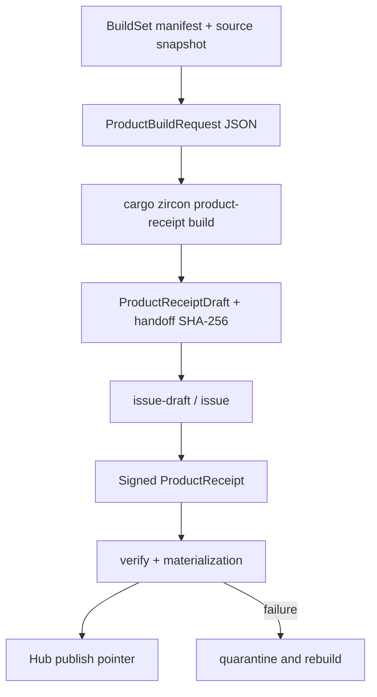

---
related_code:
  - zircon_app/src/entry/export_bootstrap.rs
  - tools/cargo-zircon/src/build/product_build.rs
  - tools/cargo-zircon/src/build/product_build/batch.rs
  - tools/cargo-zircon/src/build/receipt/product_receipt.rs
  - tools/cargo-zircon/src/build/receipt/product_receipt_closure.rs
  - tools/cargo-zircon/src/product_receipt_cli/run.rs
implementation_files:
  - zircon_app/src/entry/export_bootstrap.rs
  - tools/cargo-zircon/src/build/product_build
  - tools/cargo-zircon/src/build/receipt
  - tools/cargo-zircon/src/product_receipt_cli
plan_sources:
  - user: 2026-09-09 扩充 ZirconEngine 公开接口教程、机制案例与最佳实践
  - docs/plans/optimize/zircon_app/08-product-host-bootstrap-loop-dynamic-runtime-shutdown-current-source-review.md
tests:
  - tools/cargo-zircon/tests/product_receipt_cli.rs
  - tools/cargo-zircon/tests/build_receipt.rs
  - tools/cargo-zircon/tests/product_build_owner.rs
doc_type: workflow-detail
---

# 项目导出、产品 Receipt 与 Hub 自动化

本教程描述 ZirconEngine 当前的产品交付闭环：先从不可变的 BuildSet 快照读取源码，再用 `ProductBuildRequest` 驱动 Cargo，生成带 artifact 摘要的 `ProductReceiptDraft`，最后通过 Ed25519 签发、信任注册表验证和物料化检查。Hub/CI 应消费 receipt 和验证报告，而不是通过扫描 Cargo `target` 目录猜测“构建是否完成”。

`cargo-zircon` 的产品命令是 receipt pipeline，不是一个接受项目路径和 `--target` 的通用导出器。实际输入是 JSON 文件；命令行只解析这些文件并把结果写成新的 JSON。这样可以让构建请求、BuildSet 身份、工具链和发布证据被保存并重放。



## 适用范围与前置条件

- 产品构建的不可变 BuildSet backend 当前只在 Windows 实现；在非 Windows 主机上，`build_product_receipt_draft`/`ProductReceiptClosure::capture` 会明确返回平台不支持错误。
- BuildSet manifest、其旁边的 `source` 目录、Cargo manifest、Cargo/rustc/linker 和 SDK 文件必须在构建前准备好。`cargo-zircon product-receipt build` 不会替调用方生成 BuildSet。
- `target_directory` 必须是绝对、规范化、尚不存在的目录；父目录必须已经存在，且不得与 `source` 快照重叠。批量请求的每一个 build 都需要独立的新 target directory。
- 发布签发需要 PKCS#8 Ed25519 私钥。验证需要包含对应公钥的 trust registry；私钥不应进入项目目录、receipt 或 shell 日志。

## 步骤 1：准备 BuildSet 快照

`ProductBuildRequest.build_set_manifest_path` 指向一个 BuildSet manifest。构建器会锁定 manifest 和 `source` 下的文件，检查目录清单、每个文件的长度和 SHA-256，并在 Cargo 执行期间再次检查清单没有变化。`source` 必须是 manifest 的直接子目录；reparse point、符号链接、非普通文件和未物料化的 Git LFS pointer 都会被拒绝。

下面是字段形状示例。`build_set_id` 不是任意标签，而是由 Git revision、dirty overlay digest 和按序文件清单派生的身份；示例中的摘要必须替换为真实值，因此该片段是输入模板而不是可直接复制的完整 manifest。

```json
{
  "schema_version": 1,
  "build_set_kind": "zircon_mvp_product_build_set",
  "status": "completed",
  "build_set_id": "<64-UPPERCASE-hex-build-set-id>",
  "created_utc": "2026-09-09T08:30:00.0000000Z",
  "snapshot_relative_path": "source",
  "source_policy": "tracked_head_plus_tracked_dirty_overlay",
  "git_revision": "<40-hex-git-revision>",
  "dirty_overlay_sha256": "<64-UPPERCASE-hex-overlay-digest>",
  "files": [
    {
      "relative_path": "Cargo.toml",
      "sha256": "<64-UPPERCASE-hex-file-digest>",
      "byte_length": 1234
    }
  ]
}
```

`files` 必须按 ordinal 路径排序且与 `source` 的实际 inventory 一一对应。BuildSet id、overlay digest 和文件 digest 使用大写十六进制；Git revision 使用小写十六进制。manifest 的 `status`、`source_policy` 和 `snapshot_relative_path` 是协议常量，不要为了适配自有 CI 改成别名。BuildSet 身份变更时应创建新的 manifest 和新的 output root，不要原地编辑已经交给构建 worker 的快照。

## 步骤 2：定义 `ProductBuildRequest`

### JSON 请求

`product-receipt build` 从 JSON 反序列化出 `ProductBuildRequest`。该结构使用 `#[serde(deny_unknown_fields)]`，字段缺失或多余字段都会失败；它没有 `Default` 或 `new` 构造器，调用方必须明确给出全部字段。

```json
{
  "schema_version": 1,
  "build_set_manifest_path": "E:/ZirconBuilds/build-set-20260909/build-set.json",
  "manifest_path": "Cargo.toml",
  "target_directory": "E:/ZirconBuilds/owned-targets/demo-runtime-001",
  "toolchain": {
    "cargo_path": "C:/Rust/bin/cargo.exe",
    "rustc_path": "C:/Rust/bin/rustc.exe",
    "linker_path": "C:/BuildTools/VC/bin/Hostx64/x64/link.exe",
    "sdk_files": [
      {
        "logical_name": "windows-kernel32-lib",
        "source_path": "C:/Program Files/Windows Kits/10/Lib/kernel32.lib"
      }
    ]
  },
  "target": {
    "target_triple": "x86_64-pc-windows-msvc",
    "cargo_profile": "release",
    "rustflags": ["-C", "target-cpu=x86-64-v2"]
  },
  "action": {
    "package": "zircon_app",
    "bin": "zircon_runtime",
    "features": ["target-client"]
  },
  "producer": {
    "worker_id": "windows-worker-01",
    "operation_id": "demo-runtime-20260909-001"
  },
  "product": {
    "logical_name": "runtime-executable",
    "relative_path": "bin/zircon_runtime.exe",
    "symbol_relative_directory": "symbols/runtime"
  },
  "environment_policy": "windows-msvc-v1",
  "runtime_dependencies": [
    {
      "logical_name": "runtime-library",
      "relative_path": "bin/zircon_runtime.dll",
      "package": "zircon_runtime",
      "target": "zircon_runtime",
      "artifact_file_name": "zircon_runtime.dll"
    }
  ],
  "sbom": null
}
```

各字段的责任如下。

| 字段 | 作用与约束 |
| --- | --- |
| `schema_version` | 当前必须为 `1`。未知版本 fail closed。 |
| `build_set_manifest_path` | 指向已完成、可锁定的 BuildSet manifest。 |
| `manifest_path` | 相对于 BuildSet `source` 的规范化相对路径，通常是 `Cargo.toml`。不能使用绝对路径或 `..`。 |
| `target_directory` | 构建器独占的绝对路径；已存在、含 `.`/`..`、或与快照重叠都会被拒绝。 |
| `toolchain` | Cargo、rustc、可选 linker 和至少一个 SDK/CRT 文件。文件路径会被打开并纳入 receipt 的 toolchain digest。 |
| `target` | Cargo target triple、profile 和 rustflags。flags 会形成 `codegen_flags_digest`，不是只写在外层日志里的注释。 |
| `action` | Cargo package、必选 binary 名称和 feature 集合。feature 会排序、去重；`dev-dynamic-linking` 不能用于产品构建。 |
| `producer` | 稳定的 worker 与 operation 身份。批量请求中 operation id 必须唯一。 |
| `product` | 主 executable 的逻辑名、receipt 相对路径和 symbol 目录。路径必须是 `/` 分隔的规范化相对路径。 |
| `environment_policy` | 当前 Windows MSVC target 使用 `windows-msvc-v1`；策略会捕获允许的环境变量并计算 digest。 |
| `runtime_dependencies` | 从产品 package 可达的 runtime 动态库声明；每项必须给出 package、target、文件名和 receipt 路径。 |
| `sbom` | 可选的 `ReceiptArtifactSource`，用于把 SBOM 文件纳入摘要闭包。 |

`zircon_runtime` 的动态库由构建器单独以 `--no-default-features` 加上 Cargo 报告的 feature 集合方式捕获；该集合必须包含 `dynamic-api`，且不能包含 `dev-dynamic-linking`。Cargo 发出的 feature 集合如果不满足这两个条件，构建会失败。不要只在 JSON 的 `action.features` 中写一个看似相近的自定义 feature 名称。

### Rust 结构化构造

下面的函数展示当前公开结构的真实字段。它是可编译的调用形状，但 `build_set_manifest_path`、工具链文件和目录必须由调用方预先创建；示例不会伪造摘要或绕过 BuildSet 校验。

```rust
use std::path::PathBuf;

use cargo_zircon::build::product_build::{
    CargoRuntimeDependencyDeclaration, ProductArtifactDeclaration, ProductBuildProducer,
    ProductBuildRequest, ProductBuildSdkSource, ProductBuildTarget, ProductBuildToolchain,
};
use cargo_zircon::build::receipt::BuildAction;

fn request_for_runtime(build_set: PathBuf, target_dir: PathBuf) -> ProductBuildRequest {
    ProductBuildRequest {
        schema_version: 1,
        build_set_manifest_path: build_set,
        manifest_path: "Cargo.toml".to_string(),
        target_directory: target_dir,
        toolchain: ProductBuildToolchain {
            cargo_path: PathBuf::from("C:/Rust/bin/cargo.exe"),
            rustc_path: PathBuf::from("C:/Rust/bin/rustc.exe"),
            linker_path: Some(PathBuf::from("C:/BuildTools/link.exe")),
            sdk_files: vec![ProductBuildSdkSource {
                logical_name: "windows-kernel32-lib".to_string(),
                source_path: PathBuf::from("C:/SDK/kernel32.lib"),
            }],
        },
        target: ProductBuildTarget {
            target_triple: "x86_64-pc-windows-msvc".to_string(),
            cargo_profile: "release".to_string(),
            rustflags: Vec::new(),
        },
        action: BuildAction {
            package: "zircon_app".to_string(),
            bin: Some("zircon_runtime".to_string()),
            features: vec!["target-client".to_string()],
        },
        producer: ProductBuildProducer {
            worker_id: "windows-worker-01".to_string(),
            operation_id: "demo-runtime-001".to_string(),
        },
        product: ProductArtifactDeclaration {
            logical_name: "runtime-executable".to_string(),
            relative_path: "bin/zircon_runtime.exe".to_string(),
            symbol_relative_directory: "symbols/runtime".to_string(),
        },
        environment_policy: "windows-msvc-v1".to_string(),
        runtime_dependencies: vec![CargoRuntimeDependencyDeclaration {
            logical_name: "runtime-library".to_string(),
            relative_path: "bin/zircon_runtime.dll".to_string(),
            package: "zircon_runtime".to_string(),
            target: "zircon_runtime".to_string(),
            artifact_file_name: "zircon_runtime.dll".to_string(),
        }],
        sbom: None,
    }
}
```

`build_product_receipt_draft(request)` 会先排序和验证 request，再打开 BuildSet、运行 `cargo metadata`、执行带 `--message-format=json-render-diagnostics` 的 Cargo build，并按 package、binary 和声明的 runtime dependency 选择 artifact。`select_cargo_product_artifact` 依据 Cargo JSON 的 package/binary 身份选择，不依赖目录枚举顺序。

## 步骤 3：生成 draft 和 handoff digest

### 单产品

```powershell
cargo zircon product-receipt build `
  --request E:/ZirconBuilds/requests/demo-runtime.json `
  --output E:/ZirconBuilds/drafts/demo-runtime-draft.json
```

命令成功时 stdout 输出 draft 的 handoff SHA-256。把该值作为独立的构建-owner 证据保存；不要从 JSON 重新排序、手动格式化或编辑 draft 后继续签发。`ProductReceiptDraft::write_new_with_handoff_sha256` 使用 canonical JSON 写文件并返回同一个摘要，目标文件已存在时不会覆盖。

### 多产品批次

`build-batch` 的输入是：

```jsonc
{
  "schema_version": 1,
  "builds": [
    /* 完整的 runtime ProductBuildRequest */,
    /* 完整的 editor ProductBuildRequest */
  ]
}
```

上面仅表示 JSON 外层形状；真实文件必须把每一项完整展开，不能保留占位键。批次要求 2 到 16 个 build，所有项共享同一 BuildSet、manifest、toolchain、target profile 和 environment policy；action、operation id、target directory、symbol directory、artifact logical name 与 relative path 必须各自满足唯一性约束。

```powershell
cargo zircon product-receipt build-batch `
  --request E:/ZirconBuilds/requests/demo-batch.json `
  --output E:/ZirconBuilds/drafts/demo-batch-draft.json
```

库调用使用同一个公开 batch 结构；不会偷偷替换单产品 request 的字段：

```rust
use cargo_zircon::build::product_build::{
    build_product_receipt_draft_batch, ProductBuildBatchRequest,
};

let batch_request = ProductBuildBatchRequest {
    schema_version: 1,
    builds: vec![runtime_request, editor_request],
};
let draft_batch = build_product_receipt_draft_batch(batch_request)?;
let handoff_sha256 = draft_batch.write_new_with_handoff_sha256("draft-batch.json")?;
```

`build_product_receipt_draft_batch` 要求至少两个、最多十六个 build，并在真正启动 Cargo 前检查共享 BuildSet、target profile、operation id、symbol directory 和 artifact identity。`write_new_with_handoff_sha256` 返回的摘要应随 draft-batch 一起传给签发 worker。

## 步骤 4：校验 draft handoff

Rust owner 可以在移交给签发 worker 前再次校验摘要：

```rust
use cargo_zircon::build::receipt::ProductReceiptDraft;

let bytes = std::fs::read("demo-runtime-draft.json")?;
let handoff = ProductReceiptDraft::parse_and_verify_handoff_sha256(
    &bytes,
    expected_draft_sha256,
)?;
```

`parse_and_verify_handoff_sha256` 返回拥有校验结果的 `VerifiedProductReceiptDraftHandoff`。它先检查原始字节摘要；当传输层对 JSON 做了等价的空白格式化时，也会比较 canonical 序列化摘要。摘要不匹配时必须丢弃该 handoff 并重新生成 draft，不能把 expected digest 改成“当前文件的值”。

## 步骤 5：签发单产品 receipt

### `issue-draft`：签发 BuildSet owner 生成的 draft

```powershell
cargo zircon product-receipt issue-draft `
  --draft E:/ZirconBuilds/drafts/demo-runtime-draft.json `
  --expected-draft-sha256 <DRAFT_HANDOFF_SHA256> `
  --private-key E:/Secrets/zircon-release-signer.pk8 `
  --trust-registry E:/Secrets/zircon-product-receipt-trust.json `
  --signer-id release-worker-01 `
  --created-utc 2026-09-09T08:45:00.0000000Z `
  --output E:/ZirconBuilds/receipts/demo-runtime.json
```

当前实现的调用顺序是：读取 draft -> 校验 handoff SHA-256 -> 读取 trust registry -> 从 PKCS#8 创建 `Ed25519ProductReceiptSigner` -> 调用 `VerifiedProductReceiptDraftHandoff::issue_verified` -> 验证 signer attestation -> 使用 `write_new` 原子写出 publication。`--signer-id` 必须是稳定的小写标识符，并且必须与私钥和 registry issuer 相匹配。

对应的 Rust API 是：

```rust
let publication = handoff.issue_verified(
    "2026-09-09T08:45:00.0000000Z",
    &signer,
    &trust_registry,
)?;
publication.write_new("E:/ZirconBuilds/receipts/demo-runtime.json")?;
println!("{}", publication.receipt_id());
```

`VerifiedProductReceiptPublication` 只暴露 `receipt_id` 和 `write_new`，调用方不能在“已验证 publication”之外修改 receipt 字段。输出路径已有文件时写入失败并保留原文件，适合把 operation id 作为幂等键。

### 直接调用 `ProductReceipt::issue_verified`

当调用方已经拥有一个可信的 `ProductReceiptDraft` 时，公开函数签名是：

```rust
pub fn issue_verified(
    draft: ProductReceiptDraft,
    created_utc: impl Into<String>,
    signer: &dyn ProductReceiptSigner,
    verifier: &dyn ProductReceiptVerifier,
) -> Result<VerifiedProductReceiptPublication, ProductReceiptError>;
```

实际调用必须传四个参数，不能把 signer、artifact 路径或 options 结构当作第二个参数：

```rust
let publication = ProductReceipt::issue_verified(
    draft,
    "2026-09-09T08:45:00.0000000Z",
    &signer,
    &trust_registry,
)?;
publication.write_new(output_path)?;
```

`ProductReceipt::issue` 只返回未经过 verifier 的 `ProductReceipt`；发布门槛应优先使用 `issue_verified`。若调用方确实持有普通 receipt，应调用 `receipt.write_new_verified(output_path, verifier)`；该方法会先执行 attestation 验证再原子写入，而不是提供一个绕过验证的公开写入接口。

## 步骤 6：从 closure 签发 receipt

`issue` 子命令适合签发一个已经描述了 toolchain 和 artifact 源文件的 `ProductReceiptClosure`：

```powershell
cargo zircon product-receipt issue `
  --closure E:/ZirconBuilds/closures/demo-runtime.json `
  --private-key E:/Secrets/zircon-release-signer.pk8 `
  --signer-id release-worker-01 `
  --created-utc 2026-09-09T08:45:00.0000000Z `
  --output E:/ZirconBuilds/receipts/demo-runtime.json
```

closure 的 JSON 字段与 Rust `ProductReceiptClosure` 完全对应；artifact 的 `source_path` 是构建机上的输入文件，`relative_path` 是最终 artifact root 下的路径：

```json
{
  "build_set_id": "<64-UPPERCASE-hex-build-set-id>",
  "toolchain": {
    "cargo_path": "C:/Rust/bin/cargo.exe",
    "rustc_path": "C:/Rust/bin/rustc.exe",
    "linker_path": "C:/BuildTools/link.exe",
    "sdk_fingerprint": "<64-UPPERCASE-hex-sdk-fingerprint>",
    "environment_digest": "<64-UPPERCASE-hex-environment-digest>"
  },
  "target_profile": {
    "target_triple": "x86_64-pc-windows-msvc",
    "cargo_profile": "release",
    "codegen_flags_digest": "<64-UPPERCASE-hex-flags-digest>",
    "cargo_graph_digest": "<64-UPPERCASE-hex-cargo-graph-digest>"
  },
  "action": {
    "package": "zircon_app",
    "bin": "zircon_runtime",
    "features": ["target-client"]
  },
  "producer": {
    "tool": "cargo-zircon",
    "tool_version": "<cargo-zircon-version>",
    "worker_id": "release-worker-01",
    "operation_id": "demo-runtime-20260909-001"
  },
  "build_products": [
    {
      "logical_name": "runtime-executable",
      "relative_path": "bin/zircon_runtime.exe",
      "kind": "executable",
      "source_path": "E:/ZirconBuilds/materialized/bin/zircon_runtime.exe"
    }
  ],
  "runtime_dependencies": [],
  "symbols": [],
  "sbom": null
}
```

这是一个输入模板：摘要、版本和路径必须来自同一次构建，不能复制占位符。当前 CLI 的 `issue` 实现会用同一个 signer 完成签发和本地 attestation 验证；它没有 `--trust-registry` 参数。因此生产流水线仍应在 issue 之后执行带 trust registry 的 `verify`，把“私钥能自证”与“组织信任 registry 接受”分成两个 gate。`ProductReceiptClosure::capture` 会打开并读取每个源文件，计算 canonical digest；在 Windows 之外该 immutable capture backend 当前不可用。

对应的库入口只接收 closure 自身，不接收额外的 artifact 路径列表：

```rust
use cargo_zircon::build::receipt::{ProductReceipt, ProductReceiptClosure};

let draft = ProductReceiptClosure {
    build_set_id,
    toolchain,
    target_profile,
    action,
    producer,
    build_products,
    runtime_dependencies,
    symbols,
    sbom,
}
.capture()?;
let publication = ProductReceipt::issue_verified(
    draft,
    created_utc,
    &signer,
    &trust_registry,
)?;
publication.write_new(output_path)?;
```

上述片段假定 `build_set_id`、`toolchain`、`target_profile`、`action`、`producer` 和各 artifact source 已由调用方按公开结构构造；它说明的是所有权和调用顺序，不是可以跳过文件存在性检查的快捷 API。

## 步骤 7：批量签发和验证

```powershell
cargo zircon product-receipt issue-draft-batch `
  --draft-batch E:/ZirconBuilds/drafts/demo-batch-draft.json `
  --expected-draft-sha256 <BATCH_HANDOFF_SHA256> `
  --private-key E:/Secrets/zircon-release-signer.pk8 `
  --trust-registry E:/Secrets/zircon-product-receipt-trust.json `
  --signer-id release-worker-01 `
  --created-utc 2026-09-09T08:45:00.0000000Z `
  --output E:/ZirconBuilds/receipts/demo-batch.json
```

批次 publication 包含每一个子 receipt 和批次自身的 attestation。`ProductBuildDraftBatch::parse_and_verify_handoff_sha256` 返回的 `VerifiedProductBuildDraftBatchHandoff::issue_verified`，以及 `ProductReceiptBatch::verify_attestations_and_materialization` 会检查：

- 子 receipt 数量在 2 到 16 之间，且全部绑定同一 `build_set_id`；
- action canonical key、producer operation id、artifact logical name 和相对路径没有重复；
- 每个 artifact 的摘要和字节数都能在同一个 `artifact-root` 下找到；
- 批次排序、batch id 和批次 attestation 没有被重新排列或替换。

## 步骤 8：trust registry 与 materialization 验证

单产品验证命令的参数名是 `--artifact-root`，不是 `--artifacts`：

```powershell
cargo zircon product-receipt verify `
  --receipt E:/ZirconBuilds/receipts/demo-runtime.json `
  --trust-registry E:/Secrets/zircon-product-receipt-trust.json `
  --artifact-root E:/ZirconBuilds/materialized

cargo zircon product-receipt verify-batch `
  --receipt-batch E:/ZirconBuilds/receipts/demo-batch.json `
  --trust-registry E:/Secrets/zircon-product-receipt-trust.json `
  --artifact-root E:/ZirconBuilds/materialized
```

最小 trust registry 的形状如下。`disabled: true` 的 issuer 即使公钥正确也会被拒绝；`algorithm` 当前必须是 `ed25519-v1`。

```json
{
  "schema_version": 1,
  "trust_registry_kind": "zircon_product_receipt_trust_registry",
  "issuers": [
    {
      "signer_id": "release-worker-01",
      "algorithm": "ed25519-v1",
      "public_key_hex": "<64-hex-character-public-key>",
      "disabled": false
    }
  ]
}
```

Rust 验证接口按成本递增排列：

```rust
receipt.verify_integrity()?; // schema、规范化字段、receipt id
receipt.verify_attestation(&trust_registry)?; // signer、algorithm、signature
receipt.verify_materialization(artifact_root)?; // 相对路径、长度、SHA-256
receipt.verify_attestation_and_materialization(&trust_registry, artifact_root)?;
receipt.write_new_verified(output_path, &trust_registry)?;
```

`verify_integrity` 不会访问磁盘；`verify_materialization` 不会验证签名；发布 gate 通常调用组合方法。物料化根目录必须是受控目录，验证器会拒绝 reparse point、未声明文件和未声明目录，并把 receipt 的 `/` 相对路径解析到该根目录下，不能把任意用户输入直接当作根目录。

## 步骤 9：Hub/CI 状态机

建议把每一次导出建模为带固定 `run_id` 的单向状态机：

```text
Draft
  -> PreflightPassed
  -> Building
  -> DraftHandoffVerified
  -> ReceiptVerified
  -> SmokePassed
  -> Published

任何状态 --失败--> Failed/Quarantine
Failed/Quarantine --新 run_id--> Draft
```

每个状态至少保存 `run_id`、operation id、BuildSet id、source revision、target triple、Cargo profile、feature 集合、toolchain digest、receipt/draft 路径、命令行脱敏摘要、退出码和时间戳。失败状态不能被人工改写为 `Published`；修复后创建新的 operation id 和新的 output root，保留失败目录供诊断。

推荐的自动化顺序：

1. preflight 检查 BuildSet manifest、source inventory、工具链文件、SDK 文件、签名权限、磁盘空间和输出目录是否为空。
2. 生成单产品或批量 request JSON，并对 canonical JSON 做审阅后提交给 build worker。
3. 运行 `build`/`build-batch`，保存 stdout handoff SHA-256、stderr、Cargo JSON 日志和 draft。
4. 签发 worker 使用 expected handoff digest 执行 `issue-draft`/`issue-draft-batch`。
5. 使用组织 trust registry 执行 `verify`/`verify-batch`，然后再运行 smoke launch。
6. 所有 gate 成功后，以 receipt id 和 content-addressed artifact manifest 更新 Hub release pointer。

Hub 不应读取 Cargo 私有 target 目录来决定发布状态，也不应在已有 receipt 路径上覆盖文件。上传时先提交 manifest，待全部 blob 摘要验证通过后再提交 release pointer，可避免 Hub 指向半物料化目录。

## Receipt 中应观察的字段

签发后的 `ProductReceipt` 至少包含以下审计信息：

| 字段 | 来源 | 用途 |
| --- | --- | --- |
| `receipt_id` | draft canonical identity + `created_utc` | 幂等、回滚和发布指针 |
| `build_set_id` | BuildSet manifest | 绑定不可变源码快照 |
| `toolchain` | cargo/rustc/linker/SDK/environment | 复现工具链和环境 |
| `target_profile` | target triple/profile/flags/Cargo graph | 比较构建配置 |
| `action` | package、binary、features | 说明实际构建动作 |
| `producer` | cargo-zircon version、worker、operation | 追踪执行者 |
| `build_products` | logical name、relative path、kind、length、SHA-256 | 物料化和篡改检测 |
| `runtime_dependencies` / `symbols` / `sbom` | 声明的附属物料 | 完整闭包验证 |
| `attestation` | signer id、algorithm、signature hex | 信任 registry 验证 |

receipt 的相对路径是发布目录内的逻辑路径，不是构建机绝对路径。绝对 source path 只存在于 closure 输入或 worker 日志中；不要把它写入需要跨机器比较的 artifact manifest。

## 常见失败与恢复

| 错误现象 | 根因 | 正确恢复 |
| --- | --- | --- |
| `BuildSet manifest ...` | manifest schema、文件排序、摘要或 source inventory 不一致 | 重新生成完整 BuildSet；不要手改 `build_set_id`。 |
| `Cargo target directory must not already exist` | 复用了旧 target 目录 | 为新的 operation 创建空目录，保留旧目录作为证据。 |
| `unknown product build environment policy` | policy 与 target triple 不匹配 | 当前 Windows MSVC 使用 `windows-msvc-v1`，不要拼写自定义别名。 |
| `product build ... must select one binary target` | `action.bin` 缺失或不是 Cargo binary | 从 Cargo metadata 选择真实 binary 名称。 |
| `Runtime C ABI products require the dynamic-api feature` | 构建出的 runtime cdylib feature 集合不符合协议 | 检查 runtime feature wiring，不能只修改 receipt。 |
| draft handoff SHA 不匹配 | draft 被改写、截断或传输到错误文件 | 丢弃 handoff，重新运行 build，并保留原始 stdout。 |
| signer 不受信任或已 disabled | signer id、公钥或 registry 状态不匹配 | 更新受控 registry 或使用正确密钥；不要关闭验证。 |
| artifact digest/length 不匹配 | 物料化目录被替换、复制不完整或 receipt 指向旧文件 | 清理本次隔离目录并重新物料化，不替换 receipt 内摘要。 |
| 未声明文件/目录 | 发布目录混入临时文件 | 删除临时目录并从 receipt manifest 重新物料化。 |
| receipt 输出已存在 | `write_new` 的防覆盖策略触发 | 选择新的 run/output 路径；先比较旧 receipt，再决定回滚。 |

## 机制案例：可重放的双产品发布

以 runtime 和 editor 两个产品为例：

1. Hub 创建 `run-20260909-001`，锁定一个 BuildSet manifest，并为 runtime/editor 分配两个新的 target directory。
2. 两个 request 使用同一 BuildSet、target profile 和 environment policy，但 `action.bin`、feature、producer operation id、product path 和 symbol directory 不同。
3. `build-batch` 生成包含两个 draft 的 `ProductBuildDraftBatch`；worker 保存 batch handoff SHA-256。
4. 签发 worker 执行 `issue-draft-batch`，trust registry 验证 signer，输出一个包含两个 receipt 的 batch JSON。
5. Hub 把 runtime/editor 文件复制到同一个受控 artifact root，执行 `verify-batch`，再分别启动 smoke 场景。
6. 两个 smoke 都通过后，Hub 记录 batch id、子 receipt id 和 source revision，最后提交 release pointer。

如果 editor 构建失败，runtime receipt 仍然是有效证据，但 batch 不得发布。应保留 runtime 结果，使用新的 run id 只重建 editor，再生成一个新的 batch；不能把旧 batch JSON 的 receipts 数组手动拼接。

## 最佳实践

- 把 BuildSet manifest、request JSON、draft handoff SHA、receipt、trust registry 版本和验证报告作为同一 CI artifact 集合保存。
- 对 request 使用 schema-aware JSON 生成器或 Rust `serde_json`，不要使用字符串替换生成路径和 feature 数组。
- 将 `worker_id`、`operation_id`、`run_id` 和 `receipt_id` 分开：worker 表示执行节点，operation 表示一次构建动作，run 表示 Hub 工作流，receipt id 表示内容身份。
- 每个产品动作使用独立 target directory；批次共享源码快照和工具链，但不共享可写 Cargo target。
- 对 `created_utc`、Rust toolchain、Cargo.lock digest、native SDK 版本和插件 artifact hash 做脱敏记录，确保日后能解释 receipt 差异。
- 将签发与验证分离到不同权限域；构建 worker 不需要发布 pointer 权限，Hub 不需要读取签名私钥。
- 失败时保留完整日志和目录，使用新的 run/output 重试。不要删除 source 快照、重置仓库或在原 receipt 上覆盖 DLL。

## 验收命令

仓库中针对该协议的回归测试包括 CLI 单 receipt、批次、签名、物料化和 product build owner：

```powershell
cargo test -p cargo-zircon --test product_receipt_cli
cargo test -p cargo-zircon --test build_receipt
cargo test -p cargo-zircon --test product_build_owner
```

Windows immutable BuildSet 行为测试还覆盖目录 lease、A-B-A 变更、reparse point、LFS pointer 和清单漂移。CI 运行时应把实际 Rust toolchain、target directory、feature 集合和测试过滤器写入验证报告；只记录“cargo test 成功”不足以证明目标 lane 被执行。

## 扩展练习

1. 为 runtime、editor 和 server 写一个三个 build 的 batch request，验证每个 action、operation id、symbol directory 和 artifact path 的唯一性。
2. 故意修改 draft 一个 artifact 的 `relative_path`，观察 handoff digest 和 `verify_materialization` 分别在哪一步失败。
3. 在 trust registry 中把 issuer 标记为 `disabled`，确认 receipt 签名仍存在但 `verify` fail closed。
4. 保留两个 receipt，改变 `cargo_profile` 或 `rustflags`，比较 `target_profile` 和 receipt id，说明为什么不能复用旧发布 pointer。
5. 为 Hub 添加 receipt diff 页面，只比较 canonical 字段和 digest，不读取 Cargo 私有目录。

## 参考 API 与源码

- [`ProductBuildRequest` 与构建 owner](https://github.com/He-Jiahui/ZirconEngine/blob/main/tools/cargo-zircon/src/build/product_build.rs)
- [`ProductBuildBatchRequest`](https://github.com/He-Jiahui/ZirconEngine/blob/main/tools/cargo-zircon/src/build/product_build/batch.rs)
- [`ProductReceipt` 签发与验证](https://github.com/He-Jiahui/ZirconEngine/blob/main/tools/cargo-zircon/src/build/receipt/product_receipt.rs)
- [`ProductReceiptClosure` 文件捕获](https://github.com/He-Jiahui/ZirconEngine/blob/main/tools/cargo-zircon/src/build/receipt/product_receipt_closure.rs)
- [`product-receipt` CLI 路由](https://github.com/He-Jiahui/ZirconEngine/blob/main/tools/cargo-zircon/src/product_receipt_cli/run.rs)
- [CLI 与库 API 参考](../../hub-tooling/reference/cargo-zircon-cli.md)
- [项目包、设备安装与 Receipt](../../hub-tooling/reference/packages-receipts.md)
