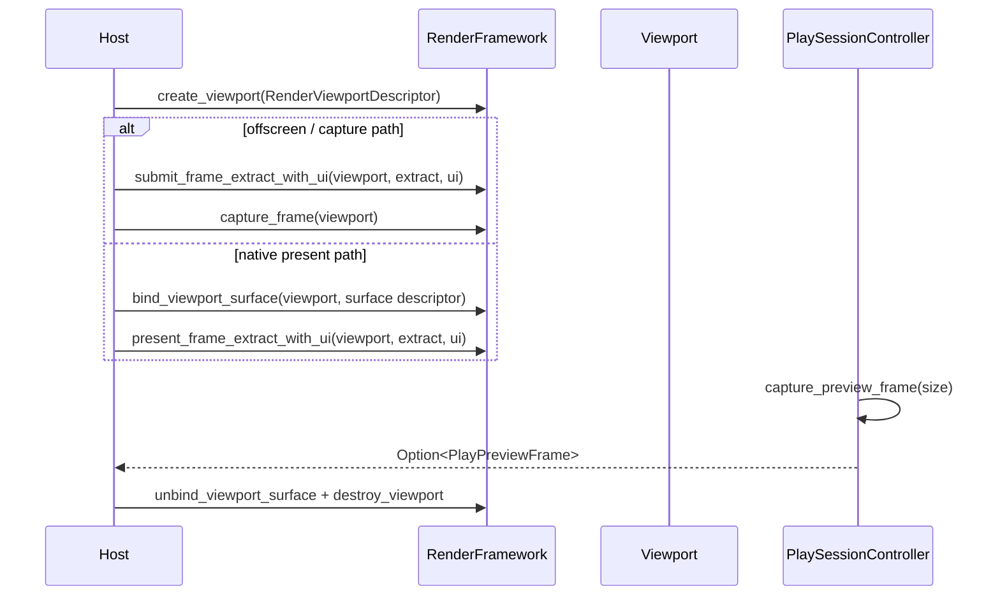

---
related_code:
  - zircon_runtime/src/graphics/runtime/render_framework/mod.rs
  - zircon_editor/src/core/play/controller/preview_routing.rs
  - zircon_editor/src/core/play/preview_frame.rs
  - zircon_runtime/src/core/runtime/runtime.rs
implementation_files:
  - zircon_runtime/src/graphics/runtime/render_framework/mod.rs
  - zircon_editor/src/core/play/controller/preview_routing.rs
plan_sources:
  - user: 2026-09-09 扩充 ZirconEngine 公开接口教程、机制案例与最佳实践
tests:
  - zircon_runtime/tests/virtual_geometry_extract_contract.rs
  - zircon_editor/tests/integration_contracts/viewport_toolbar_template_projection.rs
doc_type: workflow-detail
---

# 创建视口、提取帧并捕获预览图像

本教程说明 `RenderFramework` 的 viewport 生命周期，以及编辑器 `PlaySessionController` 的预览帧读取边界。重点不是手写 GPU command，而是把宿主窗口、不可变 `RenderFrameExtract`、可选 `UiRenderSubmission` 和可比较的 capture provenance 放在正确的所有权层。

`RenderFramework` 有两条帧提交路径：

- `submit_frame_extract[_with_ui]` 为 viewport 生成并保留渲染产品，适合离屏渲染、测试和随后调用 `capture_frame` 的路径。
- `present_frame_extract[_with_ui]` 为已绑定 native surface 的 viewport 生成并呈现一帧，适合窗口输出。

它们都**消费**一个 `RenderFrameExtract`。同一帧只能选择其中一条作为 viewport 的终端提交，不能先 `submit` 再调用一个无参数的 `present`。

## 结果和边界

完成后，你能：

- 以稳定尺寸和可选 hit-proxy 能力创建 opaque viewport handle。
- 使用 `RenderViewportSurfaceDescriptor::new(size, target)` 绑定 Windows native surface。
- 对离屏和窗口呈现路径分别提交场景 extract 与可选 UI submission。
- 通过 `RenderFramework::capture_frame(viewport)` 或 `PlaySessionController::capture_preview_frame(size)` 取得带 generation/provenance 的 RGBA 输出。
- 从 renderer 级 `RenderStats` 中读取当前提交、capture 和 profile 诊断，并在关闭时停止 admission、解绑、销毁。



## 前置条件

1. 宿主拥有有效的 native window handle；当前 `RenderNativeSurfaceTarget` 公开的 native 目标为 `Win32 { hwnd, hinstance }`。
2. 生产场景已经由自己的 extract producer 生成 `RenderFrameExtract`；`RenderFrameExtract::from_snapshot` 只适合 preview、roundtrip 或 synthetic validation。
3. UI 路径已经持有不可变的 `Arc<UiRenderSubmission>`，或明确传入 `None`。
4. 了解[渲染资源生命周期最佳实践](../../best-practices/rendering-resource-lifetime-performance.md)。

## 步骤 1：创建 viewport

`RenderViewportDescriptor` 的公开契约只有尺寸、可选标签和 hit-proxy 开关；颜色格式不是这个 descriptor 的字段，不能自行填入 `ColorFormat`。创建 handle 后，宿主只应把它作为 opaque identity 传回 framework，绝不能把 `raw()` 当数组下标或持久化为跨进程 ID。

```rust
use zircon_runtime::core::framework::render::{
    RenderFramework, RenderViewportDescriptor,
};
use zircon_runtime::core::math::UVec2;

let viewport = renderer.create_viewport(
    RenderViewportDescriptor::new(UVec2::new(1_280, 720))
        .with_label("play-preview")
        .with_hit_proxies(),
)?;
```

`with_hit_proxies()` 只表示该 viewport 需要 hit-proxy 数据；它不是一次 pick 请求。真正的 picking 仍要使用 `request_viewport_pick` / `poll_viewport_pick` 等独立接口。

## 步骤 2：绑定 native surface

窗口呈现前，必须将 viewport 与一个带尺寸的 `RenderViewportSurfaceDescriptor` 绑定。目标类型来自 `zircon_runtime::rhi`，而不是由应用定义一个字符串或裸指针。

```rust
use zircon_runtime::core::framework::render::RenderViewportSurfaceDescriptor;
use zircon_runtime::core::math::UVec2;
use zircon_runtime::rhi::RenderNativeSurfaceTarget;

// hwnd 与 hinstance 来自宿主窗口层的受控句柄桥接；不要从 UI 回调伪造它们。
let surface = RenderViewportSurfaceDescriptor::new(
    UVec2::new(1_280, 720),
    RenderNativeSurfaceTarget::Win32 {
        hwnd,
        hinstance: Some(hinstance),
    },
);
renderer.bind_viewport_surface(viewport, surface)?;
```

这里 `hwnd: u64` 与 `hinstance: Option<u64>` 是当前 Rust/RHI 边界的 ABI 形状。把平台窗口句柄转换为这两个值属于宿主适配层；上面的 `hwnd` 和 `hinstance` 变量不是引擎提供的窗口创建 API。

resize 时应先停止这个 viewport 的新帧 admission，再以新的 `UVec2` 构造 descriptor 并再次 `bind_viewport_surface`。当前 WGPU 实现会在发布 replacement surface 前完成已有提交，并以新尺寸替换该 viewport 的 surface/attachment 状态；不要在 pointer move 回调中重复重绑。

## 步骤 3：构造并提交 extract

生产代码应从场景 extract producer 取得 `RenderFrameExtract`。它的完整构造函数是：

```rust
// 生产 extract producer 的真实数据边界；各输入都必须是已经完成的值对象。
let extract = RenderFrameExtract::new(scene_payload, view_extract, frame_timing);
```

其中 `scene_payload: RenderFrameScenePayload`、`view_extract: RenderViewExtract` 和 `frame_timing: RenderFrameTiming` 分别承载不可变场景侧带、相机/目标尺寸和外层帧时间。它们的具体生产依赖场景、相机和资产子系统，因此本教程不把它们伪造为不存在的 `FrameExtract { generation, camera, world }` 字段。

对于 preview、测试或 synthetic validation，当前公开的 snapshot adapter 可以使用：

```rust
use zircon_runtime::core::framework::render::{
    RenderFrameExtract, RenderSceneSnapshot, RenderWorldSnapshotHandle,
};
use zircon_runtime::core::math::UVec2;

let extract = RenderFrameExtract::from_snapshot(
    RenderWorldSnapshotHandle::new(42),
    retained_scene_snapshot,
)
.with_viewport_size(UVec2::new(1_280, 720));
```

上例的 `retained_scene_snapshot: RenderSceneSnapshot` 必须已由调用方取得。`from_snapshot` 是明确标注的 preview/test/synthetic adapter；生产渲染不要依赖它来恢复高级 sprite、particle、virtual geometry 或 level-owned animation sideband。

### 离屏提交与可选 UI

下列函数只展示已完成 extract 的提交边界，所有调用均对应当前 trait 签名：

```rust
use std::sync::Arc;

use zircon_runtime::core::framework::render::{
    RenderFrameExtract, RenderFramework, RenderFrameworkError, RenderViewportHandle,
    UiRenderSubmission,
};

fn submit_offscreen(
    renderer: &dyn RenderFramework,
    viewport: RenderViewportHandle,
    extract: RenderFrameExtract,
    ui: Option<Arc<UiRenderSubmission>>,
) -> Result<(), RenderFrameworkError> {
    renderer.submit_frame_extract_with_ui(viewport, extract, ui)
}
```

无 UI 时可以直接调用 `submit_frame_extract(viewport, extract)`，也可以将 `None` 传给 `_with_ui` 变体。若从 retained UI 结果构建 submission，`UiRenderSubmission::single(ui_extract)` 已经返回 `Arc<UiRenderSubmission>`，因此可直接包进 `Some(...)`；不要传裸 `UiRenderExtract`。

`submit_frame_extract` 不是“把 work 排队、稍后无参数 present”的前半步。它本身是一个完整的 renderer submission，适合无需 native surface 的产品和 `capture_frame` 读取。

### 窗口呈现与可选 UI

对已在步骤 2 绑定 surface 的 viewport，使用另一份尚未消费的 extract：

```rust
use std::sync::Arc;

use zircon_runtime::core::framework::render::{
    RenderFrameExtract, RenderFramework, RenderFrameworkError, RenderViewportHandle,
    UiRenderSubmission,
};

fn present_to_native_surface(
    renderer: &dyn RenderFramework,
    viewport: RenderViewportHandle,
    extract: RenderFrameExtract,
    ui: Option<Arc<UiRenderSubmission>>,
) -> Result<(), RenderFrameworkError> {
    renderer.present_frame_extract_with_ui(viewport, extract, ui)
}
```

`present_frame_extract_with_ui` 同样接收 `(viewport, extract, Option<Arc<UiRenderSubmission>>)`。它会检查 viewport 是否已经绑定 surface，也会验证 terminal camera target 是否允许 surface present；因此 `RenderFrameworkError::UnsupportedCapability` 或 target 相关错误应被视为配置/生命周期问题，而不是静默回退到 readback。

## 步骤 4：读取 renderer 级 stats

`query_stats` 不接受 viewport 参数，返回的是 renderer 的整体诊断快照。多 viewport 宿主应在每次关键提交后立即采样，并把自己的 viewport label/handle 与 `last_generation` 共同写入观测记录，不能把它误解为“某个 handle 的独占 stats”。

```rust
let stats = renderer.query_stats()?;
let profile = &stats.last_frame_profile;

println!(
    "submitted={} captured={} generation={:?} cpu_submit_us={} gpu_us={:?} mesh_draws={}",
    stats.submitted_frames,
    stats.captured_frames,
    stats.last_generation,
    profile.cpu_submit_time_us,
    profile.gpu_frame_time_us,
    profile.mesh_submission.draw_count,
);
```

`last_frame_profile.gpu_frame_time_us` 是 `Option<u64>`，因为 GPU timing 可以异步解析。需要区分“当前帧 CPU/graph profile”与“已解析 GPU profile”时，读取 `stats.last_resolved_gpu_frame_profile`，并使用其 `frame_generation` 与当前 profile 的 generation 对齐后再比较。

## 步骤 5：捕获 RGBA 输出

### 直接从 RenderFramework 捕获

`capture_frame` 接收 viewport handle，返回 `Result<Option<CapturedFrame>, RenderFrameworkError>`。`None` 表示当前没有可读取的 capture，不是空白图像，也不是错误；host 应保留最近一次 generation 并在下一次合适的 tick 再试。

```rust
if let Some(frame) = renderer.capture_frame(viewport)? {
    std::fs::write("artifacts/viewport.rgba", &frame.rgba)?;
    println!(
        "captured {}x{} generation={} source={}",
        frame.width,
        frame.height,
        frame.generation,
        frame.capture_report.source.label(),
    );
}
```

`CapturedFrame` 的 `width`、`height`、`rgba`、`generation` 和 `capture_report` 都是公开字段。针对轮询式工作流，可使用 `capture_frame_if_newer(viewport, last_generation)`；若 backend 提供非阻塞 mailbox，则可使用 `poll_captured_frame_if_newer`，但 trait 的默认实现只会返回 `None`，不能假定所有 backend 支持。

### 从编辑器 Play controller 捕获

编辑器预览不要绕过 gateway 直接猜测 runtime session 或 instance ID。`PlaySessionController` 根据当前 Play domain 选择 gateway，并且 API 只接受尺寸：

```rust
use zircon_runtime_interface::ZrRuntimeViewportSizeV1;

if let Some(preview) = controller
    .capture_preview_frame(ZrRuntimeViewportSizeV1::new(1_280, 720))?
{
    std::fs::write("artifacts/play-preview.rgba", preview.rgba().as_ref())?;
    println!(
        "captured {}x{} generation={} instance={:?}",
        preview.width(),
        preview.height(),
        preview.generation(),
        preview.identity().instance(),
    );
}
```

该调用返回 `Option<PlayPreviewFrame>`：没有活动 Play runtime 时是 `Ok(None)`；gateway 不可用或 capture/release 失败时才是 `Err(PlayPreviewCaptureError)`。`PlayPreviewFrameIdentity` 还包含 gateway identity、尺寸和 generation；测试证据必须保存它，而不能只留下裸 RGBA 文件。

## 步骤 6：停止 admission、解绑并销毁

关闭路径属于宿主生命周期策略：先停止为该 viewport 生成新的 `RenderFrameExtract`，再解绑和销毁。当前公开 trait 没有“stop admission”或显式 fence 方法；它要求调用方保证销毁后不再将旧 handle 传回 framework。

```rust
renderer.unbind_viewport_surface(viewport)?;
renderer.destroy_viewport(viewport)?;
```

`destroy_viewport` 会移除 viewport 记录、产品和 pick 状态，并释放关联 history；再次调用任一 viewport 方法会得到 unknown-viewport 类错误。不要保留一个旧 `RenderViewportHandle` 并期待它在下次创建时仍代表同一资源。

## 预期观测

| 字段 | 来源 | 解释 | 基线 |
| --- | --- | --- | --- |
| `stats.submitted_frames` | `RenderStats` | renderer 生命周期内的提交计数 | 单调递增 |
| `stats.captured_frames` | `RenderStats` | 已完成 capture 计数 | 不超过有效 capture 请求范围 |
| `stats.last_generation` | `RenderStats` | 最近一次 renderer 生成号 | 与本次记录关联 |
| `last_frame_profile.cpu_submit_time_us` | `RenderFrameProfile` | 当前帧 CPU 提交耗时 | 低于产品预算 |
| `last_resolved_gpu_frame_profile` | `RenderStats` | 已解析的异步 GPU profile | generation 对齐后再比较 |
| `preview.identity()` | `PlayPreviewFrame` | instance、gateway、尺寸、generation provenance | 与当前 Play domain 一致 |

## 失败处理

| 失败 | 常见原因 | 恢复 |
| --- | --- | --- |
| `UnknownViewport` | handle 已销毁、来自另一 renderer，或生命周期顺序错误 | 停止旧调用，创建并登记新 viewport |
| `UnsupportedCapability { viewport surface present }` | backend 不支持 surface present，或 viewport 未绑定 surface | 使用离屏 `submit_frame_extract`，或在可支持的 backend 上先 bind |
| terminal camera target 不可 present | extract 的目标不是可呈现的 surface 目标 | 修正相机 target，再使用 `present_frame_extract` |
| `capture_frame` 返回 `None` | 尚无已完成 capture 或 backend 没有产品 | 保留 generation，在后续 tick 调用 capture/poll API |
| Play preview gateway unavailable | 当前不是活动 Play runtime，或 gateway 已被替换 | 重新读取 controller 的状态，不缓存旧 instance/gateway |
| resize 抖动 | 每个输入事件都 rebind surface | 合并 resize，在帧边界一次性重绑 |

## Capture sidecar 与可比性

引擎返回 RGBA 字节和 generation，但项目、场景、测试配置等归属信息由宿主负责保存。建议为每个 capture 旁边写一个 JSON sidecar：

```json
{
  "width": 1280,
  "height": 720,
  "pixel_layout": "rgba8",
  "capture_generation": 120,
  "viewport_label": "play-preview",
  "scene": "Scenes/Main.zscene",
  "capture_source": "framework_offscreen"
}
```

这是宿主定义的证据格式，不是 `CapturedFrame` 的序列化 schema。若来源是 `PlayPreviewFrame`，还应记录 `identity().gateway()`、`identity().instance()` 和 `identity().generation()` 的可序列化投影。比较像素前先比较尺寸、generation、来源和运行实例；不匹配时应报告“证据不可比”，而不是把不同运行期产品判成视觉回归。

## Viewport API 语义矩阵

| 阶段 | 精确输入 | 输出 | 关键约束 |
| --- | --- | --- | --- |
| create | `RenderViewportDescriptor` | `Result<RenderViewportHandle, RenderFrameworkError>` | handle 是 opaque identity |
| bind | `RenderViewportHandle` + `RenderViewportSurfaceDescriptor` | `Result<(), RenderFrameworkError>` | descriptor 同时携带 `size` 与 native `target` |
| offscreen submit | handle + `RenderFrameExtract` + 可选 `Arc<UiRenderSubmission>` | `Result<(), RenderFrameworkError>` | 一个 extract 被消费一次 |
| native present | handle + `RenderFrameExtract` + 可选 `Arc<UiRenderSubmission>` | `Result<(), RenderFrameworkError>` | 需先绑定 surface 且 target 可 present |
| query stats | 无 viewport 参数 | `Result<RenderStats, RenderFrameworkError>` | 是 renderer 级快照，不是 per-viewport 查询 |
| capture | `RenderViewportHandle` | `Result<Option<CapturedFrame>, RenderFrameworkError>` | `None` 不是错误，也不是黑帧 |
| unbind | `RenderViewportHandle` | `Result<(), RenderFrameworkError>` | 之后不能继续对该 surface present |
| destroy | `RenderViewportHandle` | `Result<(), RenderFrameworkError>` | 销毁后旧 handle 不再有效 |

## 多视口策略

多个 viewport 可以共享同一个 renderer，但每个 viewport 都需要自己的 handle、surface binding、extract admission 和证据标签。以下循环展示离屏路径；每一项提供独立的、尚未消费的 extract：

```rust
for (viewport, extract, ui) in pending_offscreen_frames {
    renderer.submit_frame_extract_with_ui(viewport, extract, ui)?;
}
```

窗口路径也遵循同一形状，只是将调用替换为 `present_frame_extract_with_ui(viewport, extract, ui)`。不能在第二个循环里对同一批已消费的 `extract` 调用 present；若确实要为多个视口渲染相同场景，producer 应为每个 view 产生合适的 extract，或在明确理解 copy-on-write 成本后克隆已有 `RenderFrameExtract`。

UI z-order 由 `UiRenderSubmission` 的 segment/command 顺序和 renderer 的 pass 规则决定，不由 viewport 的创建顺序保证。多视口诊断应记录 label、handle、提交时刻以及捕获 generation，因为 `query_stats()` 只保留 renderer 最近的快照。

## 性能剖析与调试顺序

以 generation 为主键关联 extract、submission、capture 和 profile。超过预算时，优先读取 `last_frame_profile` 的 `cpu_submit_time_us`、`gpu_frame_time_us`、`passes`、`subsystems` 和 `mesh_submission`，而不是依赖不存在的 `gpu_time_ms` 或泛化的 `draw_calls` 字段。

```text
frame_generation=120 cpu_submit_us=1800 gpu_frame_time_us=Some(11200) mesh_draws=438
```

推荐的调试顺序：

1. 确认 handle 仍属于当前 `RenderFramework`，且没有在 resize/关闭时销毁。
2. 对窗口路径确认 `RenderViewportSurfaceDescriptor` 已成功绑定，且 extract 的 terminal camera target 可 present。
3. 确认每个 `RenderFrameExtract` 只进入一次 terminal submission。
4. 对 capture 路径区分 `Err` 与 `Ok(None)`，再比较 `CapturedFrame.generation`。
5. 对编辑器路径检查 `PlayPreviewFrameIdentity` 的 instance、gateway、尺寸和 generation。
6. 最后以 `RenderStats` profile 判断瓶颈位于 CPU submission、已解析 GPU 时间、pass 数量还是 mesh draw 数量。

## 测试矩阵

- headless/offscreen backend：验证 `submit_frame_extract` 后的 capture generation、`Ok(None)` 轮询行为和 stats。
- native surface：验证 `RenderViewportSurfaceDescriptor::new`、resize rebind、unbind 后 present 失败和销毁后的 unknown handle。
- editor preview：验证 `capture_preview_frame(ZrRuntimeViewportSizeV1)` 返回的 gateway identity 与 generation。
- visual acceptance：比较 RGBA、sidecar、capture source 和非空画布，并拒绝 provenance 不同的样本。

## 生产清单

- [ ] viewport、surface、extract admission 和关闭顺序都有单一 owner。
- [ ] `RenderViewportDescriptor` 只使用 `size`、`label`、`requires_hit_proxies` 的公开契约。
- [ ] native surface 通过 `RenderViewportSurfaceDescriptor::new(size, target)` 绑定。
- [ ] 每个 `RenderFrameExtract` 只走 submit 或 present 的一个终端路径。
- [ ] UI 参数是 `Option<Arc<UiRenderSubmission>>`，没有 UI 时明确为 `None`。
- [ ] `query_stats()` 按 renderer 级快照解释，并关联自有 viewport 元数据。
- [ ] capture 保存 generation 与 provenance；Play capture 保存完整 identity。
- [ ] 关闭时停止 admission、unbind、destroy，且不再复用旧 handle。

## 自动化验收命令

```text
cargo test -p zircon_editor --test integration_contracts viewport_toolbar_template_projection
cargo test -p zircon_runtime --test virtual_geometry_extract_contract
```

视觉测试失败时保留原始 RGBA、sidecar、`RenderStats` 快照以及 renderer diagnostics。压缩截图本身不足以复现 viewport 生命周期、capture generation 或 gateway provenance 问题。

## 参考

- [RenderFramework trait](https://github.com/He-Jiahui/ZirconEngine/blob/main/zircon_runtime/src/core/framework/render/framework.rs)
- [Viewport descriptor](https://github.com/He-Jiahui/ZirconEngine/blob/main/zircon_runtime/src/core/framework/render/backend_types/command.rs)
- [Surface descriptor](https://github.com/He-Jiahui/ZirconEngine/blob/main/zircon_runtime/src/core/framework/render/surface.rs)
- [Preview routing](https://github.com/He-Jiahui/ZirconEngine/blob/main/zircon_editor/src/core/play/controller/preview_routing.rs)
- [PlayPreviewFrame](https://github.com/He-Jiahui/ZirconEngine/blob/main/zircon_editor/src/core/play/preview_frame.rs)
