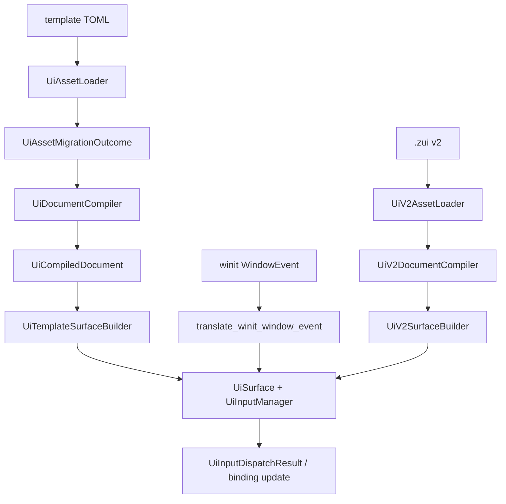

---
related_code:
  - zircon_runtime/src/ui/template/asset/loader.rs
  - zircon_runtime/src/ui/template/asset/schema/migrator.rs
  - zircon_runtime/src/ui/template/asset/compiler/compile.rs
  - zircon_runtime/src/ui/template/asset/compiler/ui_document_compiler.rs
  - zircon_runtime/src/ui/template/build/surface_builder.rs
  - zircon_runtime/src/ui/template/asset/hot_reload_plan.rs
  - zircon_runtime/src/ui/v2/loader.rs
  - zircon_runtime/src/ui/v2/compiler.rs
  - zircon_runtime/src/ui/v2/surface_builder.rs
  - zircon_runtime/src/ui/binding/model_schema_registry.rs
  - zircon_runtime/src/ui/platform_input/winit_translation.rs
  - zircon_runtime/src/ui/platform_input/winit_translation/ime.rs
  - zircon_runtime/src/ui/dispatch/input_manager/manager.rs
  - zircon_runtime/src/ui/text/edit_state.rs
  - zircon_runtime_interface/src/ui/window/input/platform_event.rs
  - zircon_runtime_interface/src/ui/dispatch/input/event.rs
implementation_files:
  - zircon_runtime/src/ui/template
  - zircon_runtime/src/ui/v2
  - zircon_runtime/src/ui/binding
  - zircon_runtime/src/ui/platform_input
  - zircon_runtime/src/ui/dispatch/input_manager
  - zircon_runtime/src/ui/text
plan_sources:
  - user: 2026-09-09 扩充 ZirconEngine 公开接口教程、机制案例与最佳实践
  - docs/plans/optimize/zircon_app/04-woc-native-client-window-input-shell-ui-presentation-frame-product-integration-review.md
tests:
  - zircon_runtime/tests/zui_native_visual_acceptance.rs
  - zircon_runtime/tests/ui_binding_control_prop_ref.rs
  - zircon_runtime/tests/ui_pixel_snapping_policy.rs
  - zircon_runtime/src/ui/tests/asset/fixture_migration.rs
  - zircon_runtime/src/ui/tests/runtime_window_input_pump.rs
  - zircon_runtime/src/ui/tests/widget_text_input_pointer.rs
  - zircon_runtime/src/ui/tests/widget_text_input_mui.rs
  - zircon_runtime/src/ui/tests/v2_asset/asset_loading.rs
doc_type: workflow-detail
---

# UI 模板、绑定与 IME 输入

本教程演示一条可以落到当前 ZirconEngine 源码的 UI 工作流：从带 `[asset]` 头的
TOML 文档开始，读取迁移报告，编译模板和 binding program，构建 retained
`UiSurface`，接收 winit 键盘/IME 事件，再通过热重载计划替换或标记受影响的
surface。

Zircon 同时保留两套有明确边界的资产格式：

| 路径 | 输入类型 | 编译器 | surface builder | 迁移行为 |
| --- | --- | --- | --- | --- |
| 传统 template asset | `UiAssetDocument`，通常由 `.toml` 提供 | `UiDocumentCompiler` | `UiTemplateSurfaceBuilder` | `UiAssetLoader` 可把旧 tree/flat source 迁移到当前版本 |
| UI v2 / `.zui` | `UiV2AssetDocument` | `UiV2DocumentCompiler` | `UiV2SurfaceBuilder` | `UiV2AssetLoader` 只接受当前版本，版本不匹配直接报错 |

不要把 `UiAssetDocument` 传给 v2 builder，也不要把 v2 document 当作传统
`UiRawAssetPrototype`。两条管线的 DTO、错误类型和导入索引不同。



## 前置条件和目标

- 项目已有 UI asset root，并明确采用传统 template 或 v2 `.zui` 管线。
- 文本控件使用组件目录中声明了 `UiHostCapability::TextInput` 的类型；本例使用
  `TextField`。
- binding route（例如 `auth.email`）由宿主的 model/provider 层实现。route 字符串
  本身不会自动调用 Rust closure。
- 目标是构建一个可编辑邮箱字段、提交按钮、绑定错误提示，并在编辑 TOML 后保留
  合法的 focus、selection 和 IME composition 状态。

完成后，source TOML 的结构变化可以在 frame boundary 重新编译；普通的 preedit
不会提前写入业务模型，只有 commit 或显式文本更新才产生 committed model change。

## 步骤 1：写当前 template 文档

传统 loader 要求 `[asset]`、`[root]` 和树节点字段。旧的扁平示例
`id = "..."`、`[[nodes]]` 不是当前 tree authority 的完整输入；扁平表只能通过
迁移路径（见后文）读取。

```toml
[asset]
kind = "layout"
id = "screen.login"
version = 3
display_name = "Login"

[root]
node_id = "login_root"
kind = "native"
type = "VerticalBox"
control_id = "LoginRoot"
layout = { width = { stretch = "Stretch" }, height = { stretch = "Stretch" }, container = { kind = "VerticalBox", gap = 12.0 } }

[[root.children]]
[root.children.node]
node_id = "email"
kind = "native"
type = "TextField"
control_id = "EmailField"
props = { label = "Email", value_text = "", placeholder = "name@example.com" }

[[root.children.node.bindings]]
id = "Auth/EmailChanged"
event = "Change"
route = "auth.email"

[[root.children]]
[root.children.node]
node_id = "submit"
kind = "native"
type = "Button"
control_id = "SubmitButton"
props = { text = "Sign in" }

[[root.children.node.bindings]]
id = "Auth/Submit"
event = "Click"
route = "auth.submit"
```

几个字段的职责不同：

- `asset.id` 是编译缓存、错误和依赖图的资产身份；`node_id` 是树内稳定身份。
- `control_id` 面向 inspector、自动化和 binding 诊断；不要把可本地化文案放进它。
- `props` 必须符合组件 descriptor 的字段类型。`TextField` 的文本值字段是
  `value_text`；不同 MUI-like 组件可能使用 `value`、`text` 或 `query`，以 descriptor
  为准。
- `bindings` 只描述事件、route、action 和 target。它不会改变输入管理器的焦点和
  composition 生命周期。

## 步骤 2：加载、迁移和诊断

需要向 editor 或 CI 暴露迁移信息时，调用带 report 的入口；不要调用不存在的
`document.migration_report()`：

```rust
use zircon_runtime::ui::template::UiAssetLoader;

let outcome = UiAssetLoader::load_toml_file_with_migration_report("ui/login.toml")?;
let document = outcome.document;
let report = outcome.report;

println!(
    "asset={} source={:?} source_version={:?} target_version={} can_edit={}",
    document.asset.id,
    report.source_kind,
    report.source_schema_version,
    report.target_schema_version,
    report.can_edit,
);
for step in &report.steps {
    tracing::debug!(?step, "ui asset migration step");
}
for diagnostic in &report.diagnostics {
    tracing::warn!(
        severity = ?diagnostic.severity,
        code = %diagnostic.code,
        message = %diagnostic.message,
        "ui asset migration diagnostic",
    );
}
```

`UiAssetMigrationOutcome` 的字段含义如下：

| 字段 | 语义 |
| --- | --- |
| `document` | 已 materialize、可交给 `UiDocumentCompiler` 的 tree document |
| `report.source_kind` | `CurrentTree`、`OlderTree`、`FlatNodeTable` 或 `FutureVersion` |
| `source_schema_version` / `target_schema_version` | 输入和当前 schema 版本；当前 target 为 `UI_ASSET_CURRENT_SOURCE_SCHEMA_VERSION` |
| `steps` | 例如 `FlatNodeTableMaterialized`、`SourceVersionBumped`、`CurrentTreeValidated` |
| `diagnostics` | 可展示给 editor 的 info/warning/error；不要假设有 `warnings()` 辅助方法 |
| `can_edit` | future schema 时为 false；当前支持版本可继续编辑 |

只需要 document 时可以使用：

```rust
let document = UiAssetLoader::load_toml_file("ui/login.toml")?;
```

这个 convenience API 会丢弃 report，但仍然执行相同的迁移和 tree authority
校验。缺少 `[asset]`、不支持的版本、循环树、重复 stylesheet id 或非法 selector
都会返回 `UiAssetError`；不要把错误降级成空 surface。生产 editor 通常保存
`toml::to_string_pretty(&document)` 生成的 canonical tree source，而不是继续写旧
flat 表。

## 步骤 3：导入 widget 和 prototype store

传统 tree document 的导入由 compiler 直接注册。`UiAssetDocument` 没有公开的
`into_prototype()` 方法，下面这种调用是错误的：

```rust
// 错误：UiAssetDocument 不提供 into_prototype()。
// builder.insert(document.into_prototype()?);
```

对于普通布局，加载被导入的 widget/style document 并注册到 compiler：

```rust
use zircon_runtime::ui::template::{UiAssetLoader, UiDocumentCompiler};

let button_asset = UiAssetLoader::load_toml_file("ui/common/buttons.toml")?;
let style_asset = UiAssetLoader::load_toml_file("ui/theme/editor_base.toml")?;

let mut compiler = UiDocumentCompiler::default();
compiler.register_widget_import(
    "asset://ui/common/buttons.ui#ToolbarButton",
    button_asset,
)?;
compiler.register_style_import("asset://ui/theme/editor_base.ui", style_asset)?;
```

`register_widget_import` 只接受 `Layout` 或 `Widget`，`register_style_import` 只接受
`Style`。同一个 reference 再注册时会替换 compiler 中的 document，因此热重载时
应先构建新 compiler/cache generation，再发布新 surface，避免一半节点来自旧导入。

当宿主需要共享扁平 prototype（例如组件包索引）时，使用专门的 flat loader。它的
输入必须有 `[asset]`、`[root] node = "..."` 和 `[nodes.<id>]` 表：

```rust
use zircon_runtime::ui::template::{UiAssetLoader, UiPrototypeStoreBuilder};

let prototype =
    UiAssetLoader::load_flat_prototype_toml_file("ui/common/login_widget.flat.toml")?;
let mut store_builder = UiPrototypeStoreBuilder::new();
store_builder.insert(prototype);
let prototypes = store_builder.build()?;
let widget = prototypes
    .get("ui.common.login_widget")
    .ok_or("prototype missing")?;
```

`UiPrototypeStoreBuilder::build` 会检查声明的 widget/style import 是否都已插入，
并拒绝 flat graph 的循环或缺失节点。prototype store 是导入索引，不是运行时
surface；不要在异步任务中持有可变 prototype 引用。替换 prototype 时创建新的
store generation。

## 步骤 4：编译 document 和 binding program

`UiDocumentCompiler::default().compile(&document)` 是传统 template 的唯一公开编译
入口。它依次执行 document shape、localization、component contract、binding
expression、control id 唯一性、style 和资源依赖校验，然后产生
`UiCompiledDocument`：

```rust
use zircon_runtime::ui::template::UiDocumentCompiler;

let compiled = compiler.compile(&document)?;
let instance = compiled.template_instance();
let binding_program = instance.binding_program();

println!(
    "asset={} root={} bindings={} resources={}",
    compiled.asset.id,
    instance.root.control_id.as_deref().unwrap_or("<root>"),
    binding_program.binding_count(),
    compiled.resource_dependencies().len(),
);
```

`UiCompiledDocument::template_instance()` 借用实例；如果需要把实例移动到另一个
owner，使用 `compiled.clone().into_template_instance()`。binding program 会保留
asset/node/binding generation，surface builder 会把它安装到 `UiSurface`，而不是由
调用者手动遍历 TOML。

### 注册 model schema/provider

model registry 要先注册 schema，再注册引用该 schema 的 provider；provider 版本和
schema 版本是身份的一部分：

```rust
use zircon_runtime::ui::binding::UiModelSchemaRegistry;
use zircon_runtime_interface::ui::binding::{UiModelProviderSchema, UiModelSchema};

fn install_model_contract(
    registry: &mut UiModelSchemaRegistry,
    schema: UiModelSchema,
    provider: UiModelProviderSchema,
) -> Result<(), Box<dyn std::error::Error>> {
    registry.register_schema(schema)?;
    registry.register_provider(provider)?;
    Ok(())
}
```

上例中的 `schema` 和 `provider` 是由产品模型层构造的真实 DTO；如果教程需要一个
具体 `auth_schema()` 工厂，那是产品代码，不是 Zircon 的通用 API，应该在产品文档
中实现（伪代码）：

```rust
// 伪代码：产品层定义字段 id、UiValueKind、ReadOnly/ReadWrite 和 provider 版本。
let schema = auth_schema();
let provider = auth_provider_for(schema.key().clone());
install_model_contract(&mut registry, schema, provider)?;
```

重复同一身份且内容相同返回 `Ok(false)`；同一身份但字段或 provider schema 不同会
返回 `UiModelSchemaRegistrationError::SchemaIdentityCollision` 或
`ProviderIdentityCollision`。binding 缺失字段应让 compiler/registry 报错，不要
静默写入空字符串。

## 步骤 5：创建传统 retained surface

传统 builder 的参数顺序是 `(tree_id, &UiCompiledDocument)`，没有 theme 或 prototype
参数：

```rust
use zircon_runtime::ui::template::UiTemplateSurfaceBuilder;
use zircon_runtime_interface::ui::{
    event_ui::UiTreeId,
    layout::UiSize,
};

let tree_id = UiTreeId::new("screen.login");
let mut surface =
    UiTemplateSurfaceBuilder::build_surface_from_compiled_document(tree_id, &compiled)?;
surface.compute_layout(UiSize::new(960.0, 640.0))?;
```

`build_surface_from_compiled_document` 会调用 `UiTemplateTreeBuilder` 生成 runtime
tree，并安装编译后的 binding program。`compute_layout` 之后，hit-test、文本测量、
render extract 和输入路由才有稳定的 frame。surface 的 root、node id、layout slot
和 metadata 都由 builder 产生；不要自己拼接 `UiTemplateNode` 来绕过校验。

### v2 `.zui` surface 的准确参数

v2 管线是另一组类型。最小 view document 形状如下：

```toml
[asset]
kind = "view"
id = "asset://ui/screen/login.zui"
version = 2

[root]
node = "root"

[nodes.root]
component = "VerticalGroup"
control_id = "LoginRoot"

[[nodes.root.children]]
node = "email"

[nodes.email]
component = "TextField"
control_id = "EmailField"

[nodes.email.props]
value_text = ""
```

对应的 Rust 调用是：

```rust
use zircon_runtime::ui::v2::{
    UiV2AssetLoader, UiV2DocumentCompiler, UiV2SurfaceBuilder,
};
use zircon_runtime_interface::ui::event_ui::UiTreeId;

let document = UiV2AssetLoader::load_toml_file("ui/screen/login.zui")?;
let compiled = UiV2DocumentCompiler::compile(&document)?;
let surface = UiV2SurfaceBuilder::build_surface_from_compiled_document(
    UiTreeId::new("screen.login.v2"),
    &document,
    &compiled,
)?;
```

v2 builder 的四个关键公开形状是：

```rust
UiV2SurfaceBuilder::build_surface(tree_id, &document)?;
UiV2SurfaceBuilder::build_surface_from_compiled_document(tree_id, &document, &compiled)?;
UiV2SurfaceBuilder::build_surface_from_compiled_document_with_theme(
    tree_id, &document, &compiled, &theme_registry,
)?;
```

若有导入组件，先把 `UiV2AssetDocument` 插入 `UiV2PrototypeStore`，再调用：

```rust
use zircon_runtime::ui::v2::{UiV2PrototypeStore, UiV2SurfaceBuilder};

let mut store = UiV2PrototypeStore::new();
store.insert(imported_document);
let surface = UiV2SurfaceBuilder::build_surface_with_prototype_store(
    UiTreeId::new("screen.login.v2"),
    &document,
    &store,
)?;
```

这里的 `&document` 和 `&compiled` 都必须是 v2 类型；不能传传统
`UiCompiledDocument`、`UiPrototypeStore` 或把 theme 当作第二个参数。v2 loader 没有
`load_toml_file_with_migration_report`；它检查 `UI_V2_ASSET_SCHEMA_VERSION`，旧版本
和 future version 都返回 `UiV2AssetError::UnsupportedSchemaVersion`。

## 步骤 6：把 winit 事件送入 UI 输入管理器

平台适配器返回的是一个 `Option<UiWindowInputPumpEvent>`，不是 event vector。正确的
调用顺序是：平台事件带上 `UiWindowInputContext`，翻译一次，再由 surface 配合
`UiInputManager` 分发：

```rust
use zircon_runtime::ui::{
    dispatch::UiInputManager,
    platform_input::translate_winit_window_event,
};
use zircon_runtime_interface::ui::window::UiWindowInputContext;

fn forward_window_event(
    surface: &mut zircon_runtime::ui::surface::UiSurface,
    input_manager: &mut UiInputManager,
    context: UiWindowInputContext,
    event: &winit::event::WindowEvent,
) -> Result<(), Box<dyn std::error::Error>> {
    if let Some(pump_event) = translate_winit_window_event(context, event) {
        let result = surface.dispatch_window_input_pump_event(input_manager, pump_event)?;
        tracing::debug!(
            routed = result.diagnostics.routed,
            target = ?result.diagnostics.route_target,
            handled_phase = ?result.diagnostics.handled_phase,
            "ui window input dispatched",
        );
    }
    Ok(())
}
```

`UiWindowInputContext::default()` 可以用于没有真实窗口身份的测试；生产宿主应使用
`UiWindowInputContext::from_window_metadata(...)`，并按需调用
`with_window_metrics(...)`、`with_user_id(...)`、`with_device_id(...)`、
`with_surface_id(...)`。上下文中的 timestamp、sequence、window/surface identity
决定事件排序、DPI 转换和诊断关联。

`UiInputManager` 还提供批处理入口：

```rust
let outcome = surface.dispatch_window_input_pump_batch(&mut input_manager, batch)?;
for result in outcome.results {
    if let Some(constraint) = result.diagnostics.text_constraint {
        tracing::debug!(?constraint, "text input constraints applied");
    }
}
```

输入 manager 会先同步 text document owner，再执行 pointer/keyboard/text/IME 路由、
默认 action、component events、timer 和诊断。UI surface 只有在 manager 分发后才会
更新 focus、selection、dirty flags；不要直接调用不存在的 `ui_surface.route_input`。

## 步骤 7：IME preedit、commit、cancel 和删除周边文本

当前平台翻译器覆盖 winit 的五种 `Ime` 事件：

| winit 事件 | 生成的 Zircon kind | 文本/范围 | 业务语义 |
| --- | --- | --- | --- |
| `Ime::Preedit(text, range)` | `Preedit` | `text` 和 UTF-8 byte `cursor_range` | 替换/显示临时 composition，不提交 model |
| `Ime::Commit(text)` | `Commit` | `text`，无 cursor range | 结束 composition，并产生 committed edit（若内容变化） |
| `Ime::Disabled` | `Cancel` | 空文本 | 输入法失效或焦点丢失，恢复 composition 前的文本 |
| `Ime::DeleteSurrounding { before_bytes, after_bytes }` | `DeleteSurrounding` | 两侧 UTF-8 byte 数 | 删除 caret 周围文本；不是普通 commit |
| `Ime::Enabled` | 无事件 (`None`) | - | 只表示平台能力开启，不改变文档 |

如果需要在测试中直接构造平台事件，使用公开 constructor：

```rust
use zircon_runtime_interface::ui::{
    dispatch::UiImeInputEventKind,
    surface::UiTextByteRange,
    window::{UiWindowInputContext, UiWindowPlatformInputEvent},
};

let context = UiWindowInputContext::default();
let preedit = UiWindowPlatformInputEvent::ime_with_cursor_range(
    context.clone(),
    UiImeInputEventKind::Preedit,
    "ni",
    Some(UiTextByteRange::new(0, 2)),
);
let commit = UiWindowPlatformInputEvent::ime(
    context.clone(),
    UiImeInputEventKind::Commit,
    "你",
);
let cancel = UiWindowPlatformInputEvent::ime(
    context.clone(),
    UiImeInputEventKind::Cancel,
    "",
);
let delete_surrounding =
    UiWindowPlatformInputEvent::ime_delete_surrounding(context, 2, 1);
```

把这些 platform events 放入 `UiWindowInputPumpEvent::Input(...)` 后，再调用
`surface.dispatch_window_input_pump_event(&mut input_manager, event)`。直接构造
`UiImeInputEvent` 也可以用于接口测试，但必须满足 `validate()`：preedit clauses 只能
出现在 `Preedit`，所有 cursor/clause range 必须是 text 的合法 UTF-8 byte 边界。

文本编辑状态位于 retained editable node 的 metadata/state 中：

- committed text、caret offset 和 selection range 表示业务可见文档；
- `composition.range`、`composition.text`、`restore_text` 和 preedit clauses 表示
  临时输入；
- `UiTextEditAction::SetComposition` 会先恢复上一次 composition source，再替换新的
  preedit；
- `UiTextEditAction::CommitComposition` 清除 composition 并产生
  `CompositionCommit` intent；
- `UiTextEditAction::CancelComposition` 用 `restore_text` 恢复原文，不产生 committed
  edit。

因此，IME 事件序列应当是：

```text
Preedit("n") -> Preedit("ni") -> Commit("你")
```

而不是把每次 preedit 当作 `UiTextInputEvent` 写回 `auth.email`。业务 provider 可以
在 `Change`、`Commit` 或 `Blur` 时机校验，具体时机由组件 descriptor 的
`validation_timing`（当前支持 `change`、`commit`、`blur`）决定。

### secure text 和 model update

密码等 secure input 的 dispatch result 会将敏感值从公开诊断中去除，并在
`UiInputDispatchDiagnostics` 中设置 `secure_text_redacted`。外部 model refresh 使用
`UiInputManager::update_text_model(surface, request)` 时必须带当前
`UiTextDocumentKey`；focus 期间若 document generation 过期，manager 会返回 conflict
或 defer，而不是覆盖用户正在编辑的文本。request 的具体字段和安全策略属于
`zircon_runtime_interface::ui::text` DTO，产品层应保存 receipt/status，不要只看 UI
属性的最终字符串。

## 步骤 8：按钮 route 与宿主 operation

`Auth/Submit` binding 的 `route = "auth.submit"` 只会生成一个结构化 invocation。
运行时 operation registry、editor command registry 或动态 ABI host 负责决定该
route 是否有权限、是否需要 payload、是否异步。以下是宿主接线的**伪代码**，因为
具体 registry 由产品 profile 注入，并不是 `UiSurface` 的通用方法：

```rust
// 伪代码：host_operation_registry 是产品/宿主层对象。
let invocation = result.component_events.iter()
    .find(|event| event.binding_id == "Auth/Submit");
if let Some(invocation) = invocation {
    host_operation_registry.dispatch(invocation)?;
}
```

不要在按钮 callback 中直接修改 session/world 状态。正确边界是：binding 编译器
验证 route/target，input manager 产生 invocation，宿主根据 capability 和 profile
执行 operation，再通过 model update 或 surface state 回传结果。route 缺失时应显示
disabled reason 或错误诊断，而不是吞掉 click。

## 步骤 9：热重载和 generation swap

watcher 折叠出 `UiAssetWatchInvalidationReport` 后，先把它转换成纯计划对象：

```rust
use zircon_runtime::ui::template::UiAssetHotReloadPlan;
use zircon_runtime_interface::ui::layout::UiSize;

let plan = UiAssetHotReloadPlan::from_watch_report(&watch_report);
if !plan.is_empty() {
    let dirty = plan.mark_surface_roots_dirty(&mut surface)?;
    tracing::info!(
        roots = dirty.roots_marked,
        dirty = ?dirty.dirty,
        "ui hot reload marked surface roots",
    );
}
```

`mark_surface_roots_dirty` 目前按 aggregate dirty domains 标记 surface roots；它不
会读取文件，也不会替换 compiled document。只刷新 layout/render 的简单场景可以
调用：

```rust
let rebuild = plan.rebuild_dirty_surface(&mut surface, UiSize::new(960.0, 640.0))?;
tracing::info!(
    layout = rebuild.layout_recomputed,
    render = rebuild.render_rebuilt,
    "ui dirty surface rebuilt",
);
```

模板 source 真正改变时，应使用 `UiAssetHotReloadExecutor` 的 staged publication
路径：

1. 由 watcher report 生成 `UiAssetHotReloadPlan`，并调用 `evict_compile_cache` 移除
   受影响 asset 的旧 artifact。
2. 在 `UiAssetSurfaceRebuilder::prepare_surface` 中加载新 document、注册导入、编译
   新 binding program，并返回与旧 surface 相同 `UiTreeId` 的 replacement。
3. 让 `UiBindingReloadTransaction` 比较旧/新 program，迁移仍然存在的 component
   state；删除节点时显式清除 focus、selection、composition。
4. 通过 `plan.execute_runtime_reload(executor, theme_document)` 在 frame boundary
   发布 staged surface。旧 surface 在新 surface 首帧准备前继续作为可见版本。

`UiAssetHotReloadExecutor` 的 `cache`、`surface_index`、`surfaces`、可选 resolver/
theme registry 和 template rebuilder 都是宿主所有的状态，下面的组装仅作**伪代码**：

```rust
// 伪代码：这些 owner 必须由 runtime/editor session 持有，不能在每次事件中临时 new。
let executor = UiAssetHotReloadExecutor {
    cache: &mut compile_cache,
    surface_index: &mut surface_index,
    surfaces: &mut surfaces,
    resource_resolver: Some(&mut resource_resolver),
    theme_registry: Some(&mut theme_registry),
    template_rebuilder: Some(&mut template_rebuilder),
};
let report = plan.execute_runtime_reload(executor, changed_theme_document)?;
```

模板、theme、font、icon/texture 的 dirty domain 不同：template 通常触发 full
rebuild，theme 触发 style/layout/text/render，font 还会影响 shaping 和 hit-test，
icon/texture 主要触发 render。不要因为一个 icon 变化而重新解析整个 model schema。

## 预期日志和可观测性

建议每个 generation 记录 asset id、tree id、source/compiled generation、cache hit、
节点数、binding 数、layout pass、input queue depth 和 IME latency：

```text
ui.compile asset=screen.login source=3 cache=miss nodes=3 bindings=2 duration_ms=6
ui.input kind=preedit text_bytes=2 focused=EmailField composition_range=0..2
ui.input kind=commit text_bytes=3 focused=EmailField status=applied
ui.binding update=auth.email source=ime status=accepted document=18
ui.hot_reload template=screen.login old_generation=7 new_generation=8 dirty_roots=1
```

secure input 不得把原文写入日志、diagnostic note、telemetry label 或 panic message；
只记录字节长度、状态和 generation。

## 常见失败和恢复

| 现象 | 根因 | 恢复 |
| --- | --- | --- |
| `ui asset source is missing [asset]` | 把旧 template 示例直接交给正式 loader | 添加 `[asset]`，或明确使用 flat migration fixture |
| `UnsupportedSchemaVersion` | 输入高于当前 source/v2 schema | 升级工具链；future version 只能只读查看，不能强行编辑 |
| `SchemaMigrationFailed` / missing node | flat root 或 child 引用了不存在节点 | 修正 `[root] node` 和 `[nodes.<id>]`，重新 canonicalize |
| `UnknownImport` / `ImportKindMismatch` | compiler/store 没注册导入，或把 style 当 widget | 先加载正确 asset kind，再 register/build |
| component prop type error | `TextField`/`Input` 等 descriptor 字段名或类型不匹配 | 查 descriptor；不要把 `value`、`text`、`value_text` 混用 |
| binding field missing | schema/provider 未注册或版本不一致 | 先 `register_schema`，再 `register_provider`，检查 exact key |
| preedit 每次都污染 model | 把 `Preedit` 当普通 text event | 让 input manager 维护 composition，commit 后再同步 model |
| IME 乱码或 range 越界 | 使用字符索引而非 UTF-8 byte range，或自行截断 | 使用 `UiTextByteRange`，让翻译器/validator 校验 byte boundary |
| 输入法关闭后残留临时文字 | 未处理 `Cancel` | 走 `Ime::Disabled -> CancelComposition`，恢复 `restore_text` |
| focus/selection 在热重载后丢失 | 直接 drop 旧 surface 或 node id 改名 | 在 rebuilder 中保持 identity，使用 binding reload state migration |
| 热重载闪烁 | 在任意事件中立即替换可见 surface | staged replacement，frame boundary 发布，保留旧 surface 到首帧 |
| UI 卡顿 | 每个属性更新都标记 root/full layout | 精确 dirty domain，启用 compile cache，避免每帧重写 shaping 文本 |

## API 语义矩阵

| API | 准确签名/返回 | 作用 | 注意 |
| --- | --- | --- | --- |
| `UiAssetLoader::load_toml_file` | `path -> Result<UiAssetDocument, UiAssetError>` | 加载并迁移传统 tree source | 丢弃 migration report |
| `UiAssetLoader::load_toml_file_with_migration_report` | `path -> Result<UiAssetMigrationOutcome, UiAssetError>` | 加载、迁移并返回 steps/diagnostics | 推荐 editor/CI 使用 |
| `UiAssetLoader::load_flat_prototype_toml_file` | `path -> Result<UiRawAssetPrototype, UiAssetError>` | 读取 flat prototype | 不能替代 tree document loader |
| `UiDocumentCompiler::compile` | `&UiAssetDocument -> Result<UiCompiledDocument, UiAssetError>` | 校验并编译传统 document | compiler 内含 binding/style/resource 阶段 |
| `UiTemplateSurfaceBuilder::build_surface_from_compiled_document` | `(UiTreeId, &UiCompiledDocument) -> Result<UiSurface, UiTemplateBuildError>` | 构建传统 retained surface | 参数没有 theme/store |
| `UiV2AssetLoader::load_toml_file` | `path -> Result<UiV2AssetDocument, UiV2AssetError>` | 读取 v2 TOML | 只接受 `version = 2` |
| `UiV2DocumentCompiler::compile` | `&UiV2AssetDocument -> Result<UiV2CompiledDocument, UiV2AssetError>` | 展平 arena、校验组件图 | store 版本用 `compile_with_prototype_store` |
| `UiV2SurfaceBuilder::build_surface_from_compiled_document` | `(UiTreeId, &UiV2AssetDocument, &UiV2CompiledDocument)` | 构建 v2 surface | document 参数不能省略 |
| `UiV2SurfaceBuilder::build_surface_from_compiled_document_with_theme` | `(tree_id, &document, &compiled, &UiThemeRegistry)` | 构建并解析 theme token | theme 是第四个参数 |
| `UiModelSchemaRegistry::register_schema` | `UiModelSchema -> Result<bool, UiModelSchemaRegistrationError>` | 注册字段 schema | 先于 provider |
| `UiModelSchemaRegistry::register_provider` | `UiModelProviderSchema -> Result<bool, ...>` | 注册 provider identity | 引用不存在 schema 会失败 |
| `translate_winit_window_event` | `(UiWindowInputContext, &WindowEvent) -> Option<UiWindowInputPumpEvent>` | winit -> shared window/input DTO | 返回单个 option，不是 vector |
| `UiSurface::dispatch_window_input_pump_event` | `(&mut UiInputManager, UiWindowInputPumpEvent) -> Result<UiInputDispatchResult, UiTreeError>` | 统一路由窗口、键盘、IME | manager 维护 text/focus/timer 状态 |
| `UiAssetHotReloadPlan::mark_surface_roots_dirty` | `(&mut UiSurface) -> Result<UiAssetHotReloadSurfaceDirtyReport, UiTreeError>` | 标记 aggregate dirty domains | 不读取文件、不替换 artifact |
| `UiAssetHotReloadPlan::rebuild_dirty_surface` | `(&mut UiSurface, UiSize) -> Result<UiSurfaceRebuildReport, UiTreeError>` | 重算已标记 surface | 真正 source replacement 走 executor |

## 端到端测试

至少覆盖 loader/migration、binding、输入和视觉回归四组测试：

```text
cargo test -p zircon_runtime --test zui_native_visual_acceptance
cargo test -p zircon_runtime --test ui_binding_control_prop_ref
cargo test -p zircon_runtime --test ui_pixel_snapping_policy
cargo test -p zircon_runtime --lib asset::fixture_migration
cargo test -p zircon_runtime --lib runtime_window_input_pump
cargo test -p zircon_runtime --lib widget_text_input_pointer
cargo test -p zircon_runtime --lib widget_text_input_mui
```

真实测试目标和 binary 名称以当前 Cargo manifest 为准；上面的 `--lib` 示例表示
仓库内模块测试组织方式，若 Cargo 不接受该筛选，直接运行对应 package 的 test
target。视觉验收同时检查非空画布、semantic tree、DPI/pixel snapping、焦点和
composition；只比较像素不能发现输入语义丢失。

## 案例：表单提交失败

1. `TextField` 收到 `Preedit`，surface 的 composition metadata 更新，但
   `auth.email` provider 不变。
2. `Commit("user@example.com")` 结束 composition；input manager 产生 committed
   edit 和 `Change`/`Commit` component event（取决于 descriptor timing）。
3. `auth.submit` invocation 进入宿主 operation registry；provider 返回 validation
   error，错误写入 `auth.error` model field。
4. model update 只使错误 label 和按钮状态相关节点 dirty；`EmailField` 保持 focus、
   selection 和当前 document generation。
5. 若网络重试，使用 request id/document key 去重；过期 response 返回 conflict，
   不覆盖用户新输入。

## 案例：DPI 变化期间输入

窗口收到 `ScaleFactorChanged` 时，先让 `UiWindowInputPumpEvent::Window` 更新
surface window metrics，再计算 layout/pixel snapping。随后到达的 pointer/key/IME
事件沿用新的 `UiWindowInputContext.window_metrics`。正在 composition 的文本不会因
DPI 改变被清空；IME candidate rectangle 的 host request 可依据新 layout 重新计算。

## 生产清单

- [ ] source、migration report、compiled artifact、surface generation 可追踪。
- [ ] 传统 template 与 v2 `.zui` 的 loader/compiler/builder 没有混用。
- [ ] 所有公开示例使用当前真实签名；未知宿主桥接明确标注伪代码。
- [ ] schema 先于 provider 注册，并测试 duplicate/collision/missing field。
- [ ] IME `Preedit`、`Commit`、`Cancel`、`DeleteSurrounding` 分开处理。
- [ ] UTF-8 byte range 与 grapheme boundary 经统一 validator 检查。
- [ ] secure input 的原文不进入日志、diagnostics 或 telemetry。
- [ ] 热重载按 dependency/dirty domain 工作，在 frame boundary 发布 replacement。
- [ ] node/control identity 稳定，focus、selection、composition 有迁移或明确 reset 原因。
- [ ] 视觉验收覆盖非空画布、像素吸附、DPI、accessibility tree 和 input focus。

## 参考源码

- [传统 UI loader](https://github.com/He-Jiahui/ZirconEngine/blob/main/zircon_runtime/src/ui/template/asset/loader.rs)
- [schema migrator](https://github.com/He-Jiahui/ZirconEngine/blob/main/zircon_runtime/src/ui/template/asset/schema/migrator.rs)
- [传统 document compiler](https://github.com/He-Jiahui/ZirconEngine/blob/main/zircon_runtime/src/ui/template/asset/compiler/compile.rs)
- [传统 surface builder](https://github.com/He-Jiahui/ZirconEngine/blob/main/zircon_runtime/src/ui/template/build/surface_builder.rs)
- [v2 loader/compiler/builder](https://github.com/He-Jiahui/ZirconEngine/tree/main/zircon_runtime/src/ui/v2)
- [winit IME translation](https://github.com/He-Jiahui/ZirconEngine/blob/main/zircon_runtime/src/ui/platform_input/winit_translation/ime.rs)
- [input manager](https://github.com/He-Jiahui/ZirconEngine/blob/main/zircon_runtime/src/ui/dispatch/input_manager/manager.rs)
- [text composition state](https://github.com/He-Jiahui/ZirconEngine/blob/main/zircon_runtime/src/ui/text/edit_state.rs)
- [hot reload plan](https://github.com/He-Jiahui/ZirconEngine/blob/main/zircon_runtime/src/ui/template/asset/hot_reload_plan.rs)
