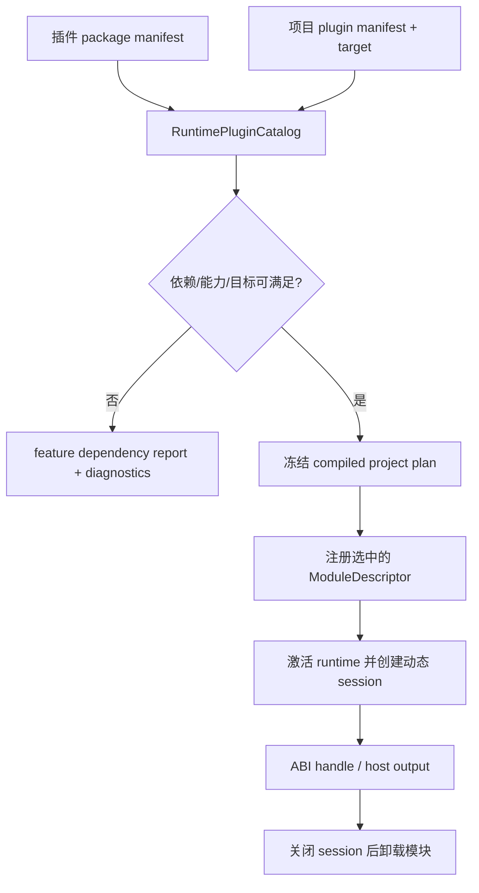

---
related_code:
  - zircon_runtime/src/dynamic_api/session.rs
  - zircon_runtime/src/dynamic_api/session
  - zircon_runtime/src/plugin/runtime_plugin/runtime_plugin_catalog.rs
  - zircon_runtime/src/plugin/package_manifest/plugin_package_manifest.rs
  - zircon_editor/src/core/play/plugin_activation/mod.rs
implementation_files:
  - zircon_runtime/src/dynamic_api/session
  - zircon_runtime/src/plugin/runtime_plugin
  - zircon_editor/src/core/play/plugin_activation
plan_sources:
  - user: 2026-09-09 扩展 ZirconEngine Wiki 教程与机制说明
  - docs/plans/zircon_runtime/runtime/02-core-spine-and-root-surface.md
tests:
  - zircon_runtime/src/dynamic_api/tests
  - zircon_runtime/src/plugin/runtime_plugin/feature_validation/tests.rs
  - zircon_editor/src/core/play/plugin_activation
doc_type: workflow-detail
---

# 为动态会话选择并接入运行时插件

本教程解释“项目配置声明想要的能力”如何变成一次运行时会话中的已选模块，以及为何动态 ABI 与插件装载必须由统一边界拥有。它面向启动器、编辑器 Play 流程和插件集成者；先阅读[动态运行时与 ABI V8](../app-runtime-api/dynamic-runtime-abi.md)及[插件生命周期与能力协商](../plugins/lifecycle-and-capabilities.md)。

## 前置条件和成功标准

- 插件包具有可验证的 manifest，声明自身 ID、依赖、能力与 target 适用性。
- 项目 manifest 只表达期望的插件/feature 组合；它不应直接把私有插件模块链接进应用。
- 宿主通过 runtime plugin catalog 做依赖排序和 feature capability 解析，再建立动态会话。

成功时，catalog 会针对 project manifest 和 target 生成冻结的选择计划；会话只运行该计划允许的模块，宿主则通过 ABI DTO/handle 获取输出。动态会话的所有权和 wake 注册位于[session registry](https://github.com/He-Jiahui/ZirconEngine/tree/main/zircon_runtime/src/dynamic_api/session/registry)，插件选择位于[runtime plugin catalog](https://github.com/He-Jiahui/ZirconEngine/tree/main/zircon_runtime/src/plugin/runtime_plugin/runtime_plugin_catalog)。



## 步骤 1：先让清单成为唯一配置来源

将包 ID、依赖、feature 与 distribution 信息写入 package manifest，将项目启用集写入 project manifest。不要让应用层通过 `use` 私有插件 crate 的方式绕过清单：这会跳过 target、能力和依赖报告，也会令动态加载与静态链接的行为分叉。相关模型可从[package manifest](https://github.com/He-Jiahui/ZirconEngine/blob/main/zircon_runtime/src/plugin/package_manifest/plugin_package_manifest.rs)和[清单与第一方插件目录](../plugins/catalogs-and-manifests.md)开始查阅。

## 步骤 2：先检查选择报告，再创建会话

以下伪代码是**机制示意**，故意不把内部 catalog 构造器伪装成稳定宿主 API。当前实现确实以 `RuntimePluginCatalog`、项目 plugin manifest 和 `RuntimeTargetMode` 计算 feature dependency report；宿主应先消费它的 diagnostics 和 blocked features。

```rust
// 示意：catalog 的来源是已发现且已验证的 RuntimePlugin 集合。
let report = catalog.feature_dependency_report(&project_plugins, target_mode);
if !report.blocked_features.is_empty() {
    return Err("required plugin capability is unavailable".into());
}

// 仅在报告可接受后，冻结本次 project plan 并交给 runtime 组合层。
let plan = catalog.compiled_project_plan(&project_plugins, target_mode);
start_session_from_plan(plan)?;
```

这一步应发生在 runtime 激活前。冻结后临时增加模块会破坏 CoreRuntime 的“先注册、后激活”组合语义；需要改动插件集合时，关闭当前会话并按新清单创建下一次会话。

## 步骤 3：在 ABI 边界使用输出与生命周期

动态 API 的 host 输出由宿主一侧拥有和解码，Rust 实现细节不会穿过 ABI。调用方需要保存会话 handle，按会话边界请求输出，并在退出时归还/销毁所有 ABI 分配物。不要缓存跨 session 的内部指针、插件 trait 对象或旧世界引用。

```text
会话开始：验证清单 -> 选择计划 -> 建立 ABI session handle
帧/请求：通过 ABI DTO 传入 -> 宿主接收并解码输出
会话结束：停止请求 -> 释放 host-owned 输出 -> 关闭 session -> 卸载可卸载模块
```

ABI 版本、ownership、错误代码和 host 解码细节以[动态运行时与 ABI V8](../app-runtime-api/dynamic-runtime-abi.md)为准；不要为方便而在插件与宿主间共享 Rust 内存所有权。

## 失败处理

| 问题 | 识别方式 | 处理 |
| --- | --- | --- |
| 缺少 required plugin/capability | catalog 的 dependency report | 阻止本次启动，展示 diagnostics；不要用空实现伪造能力。 |
| target 不支持 feature | report 标记 target unsupported | 选择支持的 target 或从项目 manifest 移除该 feature。 |
| 插件顺序形成环 | catalog 的模块顺序诊断 | 修正 package 依赖，不按加载顺序手工打补丁。 |
| 会话关闭仍有调用 | session owner/wake 生命周期诊断 | 先停止 admission 和 wake，再释放输出与代码所有者。 |
| ABI 解码失败 | 版本、长度或 ownership 校验 | 拒绝该输出并保留诊断；绝不猜测字节布局。 |

## 验收清单与实践建议

- [ ] 插件和项目都通过各自 manifest 声明能力与依赖。
- [ ] 每次启动都先检查 feature dependency report，再冻结 project plan。
- [ ] runtime 只注册被该计划选择的模块，激活后不增量补注册。
- [ ] 所有动态输出按 ABI ownership 规则释放，且不跨 session 保存内部引用。
- [ ] 用[动态 API 测试](https://github.com/He-Jiahui/ZirconEngine/tree/main/zircon_runtime/src/dynamic_api/tests)和[编辑器插件激活实现](https://github.com/He-Jiahui/ZirconEngine/tree/main/zircon_editor/src/core/play/plugin_activation)验证目标场景。

最佳实践是把一次会话视为不可变插件组合的执行容器。配置改变时创建新会话，而不是热补丁旧会话的 module graph；这能同时维持依赖报告、生命周期顺序和 ABI ownership 的可验证性。
