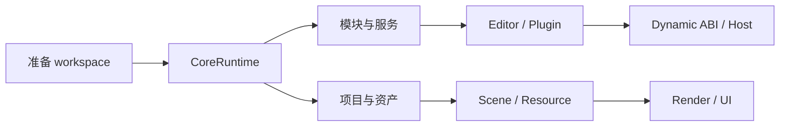

---
related_code:
  - zircon_runtime/src/core/runtime/runtime.rs
  - zircon_runtime/src/asset/project/manager/open.rs
  - zircon_editor/src/core/editor_operation.rs
  - zircon_runtime_interface/src/runtime_api
implementation_files:
  - zircon_runtime/src/core/runtime/runtime.rs
  - zircon_runtime/src/asset/project/manager
  - zircon_editor/src/core/editor_operation.rs
plan_sources:
  - user: 2026-09-09 扩展 ZirconEngine Wiki 教程与机制说明
  - docs/wiki/getting-started.md
tests:
  - zircon_runtime/src/core/runtime/tests
  - zircon_runtime/src/asset/tests/project
  - zircon_editor/src/tests
doc_type: category-index
---

# ZirconEngine 教程

本分区是面向“第一次把系统跑起来”的实践路径。每篇教程都按目标、前置条件、步骤、观测结果和恢复路径组织；代码示例优先使用当前公开入口，不能直接复制的片段会明确标为示意。

## 选择教程

| 你的目标 | 从哪里开始 | 完成后应看到什么 |
| --- | --- | --- |
| 启动一个最小运行时并接入自定义模块 | [启动 CoreRuntime 与模块](runtime-module-startup.md) | descriptor 注册、ready、激活和逆序关闭均有明确边界 |
| 打开项目并导入资源 | [项目资产导入](project-asset-import.md) | manifest、`.zmeta`、artifact 和 resource generation 连成一条链 |
| 给编辑器增加可撤销操作 | [命令与撤销](editor-command-undo.md) | command、transaction、history、dirty 和 journal 保持同一事实 |
| 接入动态会话或插件 | [动态会话与插件接入](dynamic-session-plugin-onboarding.md) | capability、ABI、session identity 和失败恢复可观测 |

## 教程地图

图中的箭头表示“可以继续学习的依赖关系”，不是强制的运行时调用顺序。服务器或无头产品可以跳过窗口和渲染路径，但仍需遵守 runtime、资源和错误边界。

## 通用学习方法

1. **先读边界**：先确认对象的权威 owner、生命周期和 feature 前提，再复制调用形状。
2. **再跑最小路径**：只启用完成目标所需的模块；每一步保留返回的 receipt、generation 或 identity。
3. **最后扩展**：把同步示例改成异步或跨 ABI 前，先阅读对应[机制指南](../mechanisms/index.md)和[最佳实践](../best-practices/index.md)。

### 示例中的三种代码

| 标记 | 含义 | 使用方式 |
| --- | --- | --- |
| 真实入口 | 类型和函数名在当前 facade 中可定位 | 可以复制后补齐业务参数 |
| 调用形状 | 只展示 ownership、错误和阶段关系 | 必须按当前 crate 的签名替换占位符 |
| 示意伪代码 | 用于解释机制或数据流 | 不应直接编译，也不应当作稳定 API 承诺 |

## 完成标准

完成一篇教程不等于产品验收通过。至少应确认：

- 相关 feature/profile 已启用，且没有把 `target-server` 当作窗口产品使用；
- 所有可失败步骤都保留 `Result` 和结构化错误；
- 异步回调重新检查 session、generation 或句柄 identity；
- 退出时先停止新工作，再 drain operation/service，最后释放 owner；
- 结果能在 diagnostics、receipt、snapshot 或测试断言中被观察。

## 继续阅读

- 想知道为什么这些步骤有固定顺序，读[机制指南](../mechanisms/index.md)。
- 想把示例用于生产，读[最佳实践](../best-practices/index.md)。
- 想按具体业务场景组合多个子系统，读[方案配方](../recipes/index.md)。
- 想查单个类型的完整签名，读[Rust API 索引](../api-index.md)。
