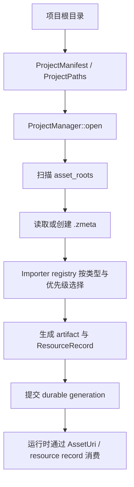

---
related_code:
  - zircon_runtime/src/asset/project/manifest/project_manifest.rs
  - zircon_runtime/src/asset/project/manager/open.rs
  - zircon_runtime/src/asset/project/manager/scan_and_import.rs
  - zircon_runtime/src/asset/importer/mod.rs
  - zircon_runtime/src/asset/watch/asset_watcher.rs
implementation_files:
  - zircon_runtime/src/asset/project/manager
  - zircon_runtime/src/asset/importer
plan_sources:
  - user: 2026-09-09 扩展 ZirconEngine Wiki 教程与机制说明
tests:
  - zircon_runtime/src/asset/tests/project/asset_flow_sample
  - zircon_runtime/src/asset/tests/project/manager
  - zircon_runtime/src/asset/tests/pipeline
doc_type: workflow-detail
---

# 打开项目并完成一次资产导入

本教程展示从项目根目录到可由运行时记录引用的资产 generation。它适用于工具、导入 commandlet 和自定义宿主；资产概念与所有可用类型见[项目资产与导入管线](../scene-assets/project-assets.md)，场景运行时边界见[场景运行时与 Level](../scene-assets/scene-runtime.md)。

## 前置条件与预期结果

- 项目根目录含有效 manifest，`ProjectManifest` 提供项目标识、默认场景与 `asset_roots`。
- 资产源文件必须位于配置的 asset root 中；不要把绝对文件路径当作持久化资产身份。
- 已注册的 importer 要能处理输入扩展名；冲突由优先级和 registry 规则解决，不能由调用方随意挑选。

成功时，项目 manager 会扫描根目录，为源资产读取或创建 `.zmeta`，写入 artifact 与 resource records，并返回本 generation 中导入的记录。入口代码在[项目打开逻辑](https://github.com/He-Jiahui/ZirconEngine/blob/main/zircon_runtime/src/asset/project/manager/open.rs)和[全量导入逻辑](https://github.com/He-Jiahui/ZirconEngine/blob/main/zircon_runtime/src/asset/project/manager/scan_and_import.rs)。



## 步骤 1：维护可移动的项目身份

manifest 是项目根文档。`project_guid`、`default_scene`、`asset_roots` 与格式版本属于项目契约；`.zmeta` 中的稳定 `AssetUuid` 将源文件和生成物关联。因此重命名或移动资产必须走 manager 的 mutation/preflight 路径，不能手改元数据或复制 artifact。

建议从显式 asset root 开始，例如把可导入源放在 manifest 声明的 `Assets/` 下，并将工具缓存、日志和临时输出放在 root 之外。路径解析和越界检查由 `ProjectPaths` 统一拥有，相关实现见[项目 manifest](https://github.com/He-Jiahui/ZirconEngine/blob/main/zircon_runtime/src/asset/project/manifest/project_manifest.rs)。

## 步骤 2：打开并执行首轮全量导入

下面是当前公开 API 的最小调用形状：

```rust
use zircon_runtime::asset::project::ProjectManager;

fn import_project(root: &str) -> Result<(), Box<dyn std::error::Error>> {
    let mut project = ProjectManager::open(root)?;
    let records = project.scan_and_import()?;
    println!("imported {} resource records", records.len());
    Ok(())
}
```

`scan_and_import` 先在候选 manager 上准备 generation，提交成功后才替换调用方状态，因此遇到失败不要根据部分内存结果继续运行。要读取已生成内容，可通过 `load_artifact` 或 `load_artifact_by_id`；运行时侧应持有 URI、ID 或 resource handle，而不是猜测 artifact 文件名。

## 步骤 3：处理增量变更

文件系统监听器将底层事件折叠为 `AssetWatchBatch`。当宿主已验证一批变更后，可调用 `scan_and_import_watch_changes`；它会决定是否使用增量路径。以下是**机制示意**，强调数据流而非承诺一个固定的 watcher 驱动 API：

```rust
// 示意：watcher 输出经去抖和 sidecar 回声过滤后，才交给项目 manager。
// AssetWatchBatch 的 changes 是公开字段；requires_reconciliation=true 时应走全量扫描。
let changes = &batch.changes;
let changed_records = project.scan_and_import_watch_changes(changes)?;
publish_generation(changed_records);
```

不要把 `.zmeta` 自身变化当成用户源资产重新导入，也不要在 generation 未匹配当前资源时发布热重载。观察器的职责和回声规则见[AssetWatcher](https://github.com/He-Jiahui/ZirconEngine/blob/main/zircon_runtime/src/asset/watch/asset_watcher.rs)。

## 故障路径

| 失败 | 常见原因 | 应对 |
| --- | --- | --- |
| 打不开项目 | manifest 缺失/格式不兼容，或 asset root 路径无效 | 先修正项目根契约，不要创建空 manager 覆盖原项目。 |
| importer 找不到或冲突 | 未注册对应 importer，或多个 handler 优先级不明确 | 在启动组合阶段注册 importer；以 registry 的错误和优先级为准。 |
| UUID 或依赖错误 | 复制了 sidecar、引用了缺失资产，或迁移失败 | 恢复唯一元数据和依赖；使用诊断而非直接修改 artifact。 |
| 监听触发循环 | 将 sidecar/生成物回写事件当成源变更 | 保留 watcher 的回声过滤，按 batch 处理。 |

## 验收清单与实践建议

- [ ] `ProjectManager::open` 能加载既有 manifest，并规范化项目路径。
- [ ] 首轮 `scan_and_import` 成功后，返回的 records 与本次 generation 相符。
- [ ] 所有持久化引用使用稳定 URI/UUID，而非 OS 绝对路径或 artifact 文件名。
- [ ] 失败 generation 不发布给运行时，也不把候选状态作为后续导入的基础。
- [ ] 针对项目流优先阅读并扩展[asset flow sample 测试](https://github.com/He-Jiahui/ZirconEngine/tree/main/zircon_runtime/src/asset/tests/project/asset_flow_sample)。

批量导入器应把“扫描、预检、提交、发布”保持为四个可观测阶段。尤其不要在扫描循环中对运行时直接发出单个资产已更新的通知；先完成 generation，再以同一批次建立一致的资源视图。
