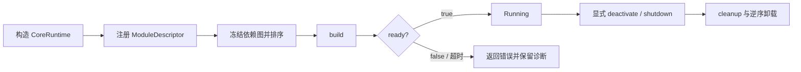

---
related_code:
  - zircon_runtime/src/core/runtime/runtime.rs
  - zircon_runtime/src/core/runtime/handle/activation.rs
  - zircon_runtime/src/core/runtime/descriptors/module_descriptor.rs
  - zircon_runtime/src/core/runtime/lifecycle.rs
implementation_files:
  - zircon_runtime/src/core/runtime/runtime.rs
  - zircon_runtime/src/core/runtime/handle/activation.rs
plan_sources:
  - user: 2026-09-09 扩展 ZirconEngine Wiki 教程与机制说明
  - docs/plans/zircon_runtime/frameworks/02-module-kernel-and-lifecycle-unification.md
tests:
  - zircon_runtime/src/core/runtime/tests/activation
  - zircon_runtime/src/core/runtime/tests/registration
doc_type: workflow-detail
---

# 从零启动 CoreRuntime 并接入一个模块

本教程把“创建运行时、声明模块、激活、显式关闭”串成一条最小链路。它适用于独立宿主或产品入口中的运行时组合；产品 profile、窗口和编辑器宿主的选择请先看[快速开始](../getting-started.md)，模块 API 的完整语义见[运行时与模块生命周期](../core-runtime/runtime-and-module-lifecycle.md)。

## 前置条件与目标

- 使用 workspace 当前的 `zircon_runtime` crate；不要依赖 runtime 的私有 `core::*` 子模块实现细节。
- 在调用 `activate_registered_modules` 前收集完所有 `ModuleDescriptor`。激活会冻结依赖图，之后继续注册不是有效的组合方式。
- 为关闭阶段保留运行时所有权，并为 drain 预留明确预算。

完成后，模块应按依赖和初始化层级进入 `Running`，而宿主可在退出时以激活逆序安全卸载。下面的实际入口位于[运行时 facade](https://github.com/He-Jiahui/ZirconEngine/blob/main/zircon_runtime/src/core/runtime/runtime.rs)和[激活实现](https://github.com/He-Jiahui/ZirconEngine/blob/main/zircon_runtime/src/core/runtime/handle/activation.rs)。



## 步骤 1：选择可失败构造器

产品宿主应优先使用 `CoreRuntime::try_new()`，这样任务图初始化错误可返回给上层。`CoreRuntime::new()` 会在初始化失败时 panic，适合已完成进程预检、且不需要恢复路径的非常薄入口。

```rust
use zircon_runtime::core::CoreRuntime;

fn make_runtime() -> Result<CoreRuntime, Box<dyn std::error::Error>> {
    CoreRuntime::try_new().map_err(Into::into)
}
```

同一进程可能运行多个 runtime 时，改用 `try_with_task_graph_options` 并显式给出 worker 预算；不要假设存在全局任务池。该约束来自[构造器定义](https://github.com/He-Jiahui/ZirconEngine/blob/main/zircon_runtime/src/core/runtime/runtime.rs)。

## 步骤 2：把模块行为放进 lifecycle

模块通过 `ModuleDescriptor` 描述名称、依赖、初始化层级、服务和 lifecycle。以下片段是**机制示意**：`ModuleLifecycle` 的回调形状和 `ModuleDescriptor::with_lifecycle` 是当前机制，但业务服务注册应按实际 crate 的公开 facade 补齐，不要把这里的空实现当作业务模板。

```rust
use std::sync::Arc;
use zircon_runtime::core::{CoreResult, ModuleContext, ModuleDescriptor, ModuleLifecycle};

#[derive(Debug)]
struct GameplayLifecycle;

impl ModuleLifecycle for GameplayLifecycle {
    fn build(&self, context: &ModuleContext) -> CoreResult<()> {
        let _core = context.core.upgrade();
        // 在这里构造本模块拥有的服务；不要执行跨模块启动。
        Ok(())
    }

    fn ready(&self, _context: &ModuleContext) -> CoreResult<bool> {
        Ok(true)
    }

    fn cleanup(&self, _context: &ModuleContext) -> CoreResult<()> {
        // 释放本模块创建的外部资源。
        Ok(())
    }
}

let gameplay = ModuleDescriptor::new("Gameplay", "Gameplay services")
    .with_lifecycle(Arc::new(GameplayLifecycle));
```

`build` 用于建立本模块服务，`ready` 允许异步前置条件尚未满足时返回 `false`，`cleanup` 则是撤销阶段。不要在回调内重入同一模块的生命周期命令；运行时会拒绝这种重入。生命周期契约及 `cleanup_until` 的 deadline 语义见[模块生命周期源码](https://github.com/He-Jiahui/ZirconEngine/blob/main/zircon_runtime/src/core/runtime/lifecycle.rs)。

## 步骤 3：注册、激活与读取结果

```rust
use std::time::Duration;

let runtime = make_runtime()?;
runtime.register_module(gameplay)?;
runtime.activate_registered_modules_with_ready_timeout(Duration::from_secs(5))?;
// 此处再解析已由模块注册的 service / manager。
```

若只需启动一个根模块及其依赖闭包，可用 `activate_module` 或带 timeout 的变体；启动完整产品组合时使用批量 API。初始化层级只是在无冲突时给出全局顺序，显式依赖仍决定 dependency-first 的拓扑关系。

## 失败处理

| 现象 | 应检查 | 处理方式 |
| --- | --- | --- |
| `try_new` 失败 | 任务图初始化资源和宿主 worker 预算 | 向上返回错误；不要退化为 `new()`。 |
| 激活报告依赖或排序错误 | descriptor 名称、依赖声明与 `InitLevel` | 修正模块图后重新创建并注册；不要在已激活的 runtime 上补注册。 |
| `ready` 超时 | 模块自己的外部资源或异步准备条件 | 使用有界 ready timeout，记录模块诊断，并由宿主决定重试或退出。 |
| 卸载被阻止 | 仍活动模块或服务对目标的依赖 | 先关闭依赖方；不要绕过阻止而手动清空 registry。 |

## 关闭和验收清单

```rust
runtime.shutdown_registered_modules_with_drain_timeout(Duration::from_secs(5))?;
```

- [ ] 使用可失败构造器或明确记录 panic 边界。
- [ ] 所有 descriptor 均在第一次激活前注册。
- [ ] `ready` 和关闭均有宿主定义的时间预算。
- [ ] 模块仅清理自己拥有的资源，不持有会延长 runtime 生命周期的无界强句柄。
- [ ] 验证覆盖注册、激活、依赖排序与失败关闭；可从[activation 测试](https://github.com/He-Jiahui/ZirconEngine/tree/main/zircon_runtime/src/core/runtime/tests/activation)开始定位。

## 实践建议

把 module descriptor 当作组合清单，而不是服务定位器。跨模块协作应通过已声明的服务依赖和 `CoreWeak`，而不是在 lifecycle 回调里直接启动、关闭或修改其他模块。这样才能保留运行时的事务性激活和可诊断的逆序卸载。
