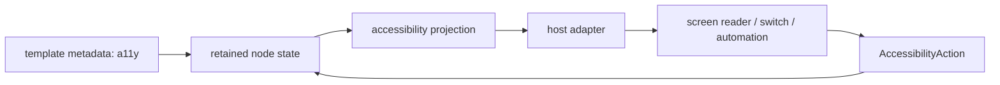

---
related_code:
  - zircon_runtime_interface/src/ui/accessibility.rs
  - zircon_runtime_interface/src/ui/surface/diagnostics.rs
  - zircon_runtime_interface/src/ui/focus.rs
  - zircon_runtime_interface/src/ui/window/runtime_event_adapter.rs
implementation_files:
  - zircon_runtime/src/ui/surface
  - zircon_app/src/entry/runtime_entry_app/event_dispatch.rs
plan_sources:
  - user: 2026-09-09 扩充公开 UI 接口、机制案例与教程
tests:
  - zircon_runtime_interface/src/tests/ui_contract_spine.rs
  - zircon_runtime_interface/src/tests/window_input_contracts.rs
doc_type: best-practice
---

# UI 可访问性、诊断与上线检查

## 可访问性是 surface 合同的一部分

`zircon_runtime_interface::ui::accessibility` 定义跨 runtime/host 的语义与动作数据；
它不等同于屏幕阅读器实现。作者节点的 `UiTemplateNodeMetadata.a11y` 是语义输入，
运行时必须将焦点、可见性、enabled 状态、文本和可执行 action 投影为一致的辅助树。
不要只给图标加 tooltip 就宣称控件可访问。



## 焦点、导航与语义一致性

可访问动作应遵从与键盘相同的 `UiFocusContract`：disabled 或隐藏节点不得保留在可达
焦点链，modal 关闭要利用 `UiModalFocusRestoreState` 恢复，而不是把焦点丢给 window。
`UiFocusChangeEvent` 的 reason 与 `UiFocusVisible` 让宿主能够区分键盘焦点环、指针交互
和程序恢复。`UiFocusedInputKind::AccessibilityAction` 应走正常 invocation/command
路径，不能建立绕过权限、事务或输入消费的第二套按钮实现。

## 调试 API 应如何使用

| 目标 | 数据 | 生产使用准则 |
| --- | --- | --- |
| 脏化过多 | `UiInvalidationDebugReport`, `UiDamageDebugReport` | 按需 capture；报告用于定位 domain 误标记 |
| 命中异常 | `UiHitGridDebugStats`, `UiHitTestDebugDump` | 检查 coordinate space、scope、clip 和 reject reason |
| 绘制过重 | `UiRenderDebugStats`, `UiMaterialBatchDebugStat`, `UiOverdrawDebugStats` | 先找 batch split/overdraw，再动资源策略 |
| 自动化定位 | `UiWidgetReflectorNode`, `UiReflectorSnapshot`, `UiReflectionDiff` | 依赖 stable path/control_id，不依赖 vector index |
| 帧时序 | `UiDebugTimelineSnapshot`, `UiDebugTimelineRetention` | 限制保留长度，避免诊断自身造成内存压力 |

`UiSurfaceDebugOptions` 和 `UiSurfaceDebugCaptureContext` 约束捕获范围；启用后输出的
`UiSurfaceDebugSnapshot` 版本由 `UI_SURFACE_DEBUG_SCHEMA_VERSION` 标识。消费工具应
检查 schema 版本，而不是猜测字段长期不变。

## 机制案例：一次“按钮无法读出”的定位

1. inspector 从 `UiReflectorSnapshot` 用 `control_id` 找到 retained node。
2. 确认 node render-visible、enabled，且 `UiFocusContract` 允许 tab focus。
3. 检查 metadata a11y label/role/action 是否随动态文本更新。
4. 通过 host runtime event adapter 验证辅助动作转换为 `UiFocusedInputKind::AccessibilityAction`。
5. 用 `UiInvocationResult` 断言它与鼠标点击走同一 command、权限和事务。

若第 2 步失败，修作者/状态模型；若第 3 步失败，修 projection；若第 4 步失败，修宿主
适配层。不要为自动化测试直接调用按钮私有回调，这会绕过真正的问题。

## 上线前检查表

1. 每个可操作图标都有稳定可本地化的名称、角色、状态和值。
2. Tab 顺序在窗口缩放、动态列表和模态打开/关闭后仍可预测。
3. 键盘、指针、触控、手柄和辅助动作共享同一业务 command 及错误路径。
4. 文字缩放、RTL、IME composition、系统高对比/主题变化不会截断或欺骗辅助树。
5. 不将密码/`SecureText`、私有输入录制或敏感 asset path 写进 debug snapshot。
6. 在性能测试中关闭大体量 timeline/overdraw capture，单独运行诊断基准。
7. 对 `UiReflectionDiff`、focus restore、IME 和 window focus lost 写契约测试。

## 当前能力与参考差异

Slint 通过其平台后端自动接入可访问树，Godot 的 Control 有成熟的 focus/navigation
实践。Zircon 的公开接口已为语义、焦点、host adapter 和 diagnostics 提供合同，但不应
假设每个目标平台已经实现同一屏幕阅读器 backend。部署前读取
`PlatformRuntimeCapabilityReport`，把 unsupported 或 planned capability 明确展示在
产品兼容性矩阵中。
产品兼容性矩阵中。

## 调用示例：快照版本门禁

```rust
let snapshot = surface.capture_debug_snapshot(options)?;
assert_eq!(snapshot.schema_version(), UI_SURFACE_DEBUG_SCHEMA_VERSION);
```

CI 应运行键盘、辅助动作、视觉焦点、缩放、RTL、高对比和敏感文本脱敏检查。

```rust
let action = UiFocusedInputKind::AccessibilityAction;
assert_eq!(action, UiFocusedInputKind::AccessibilityAction);
```
