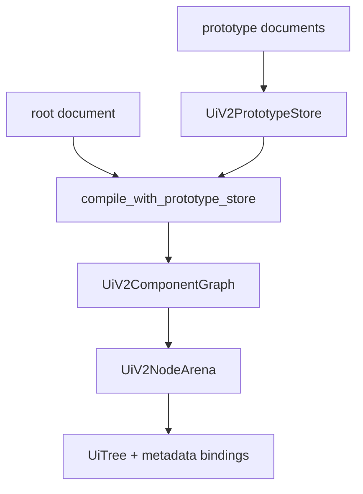

---
related_code:
  - zircon_runtime_interface/src/ui/v2/style.rs
  - zircon_runtime_interface/src/ui/v2/repeat.rs
  - zircon_runtime_interface/src/ui/design_tokens.rs
  - zircon_runtime/src/ui/v2/compiler.rs
  - zircon_runtime/src/ui/v2/style.rs
implementation_files:
  - zircon_runtime/src/ui/v2/compiler.rs
  - zircon_runtime/src/ui/v2/style.rs
plan_sources:
  - user: 2026-09-09 扩充公开 UI 接口、机制案例与教程
tests:
  - zircon_runtime_interface/src/tests/ui_v2_contracts.rs
  - zircon_runtime_interface/src/tests/ui_theme_contracts.rs
doc_type: api-reference
---

# UI 组件、绑定、样式与主题

## 组件编译链

`UiV2ComponentDefinition`、`UiV2ChildMount` 和 `UiV2ComponentGraph` 描述作者组件与
import 关系。`UiV2DocumentCompiler::compile_with_prototype_store` 在进入帧循环前展开
原型；`UiV2ComponentInstancer::instantiate_document` 是公开的组件实例化入口。循环
import、缺失别名或无效 child mount 必须以 `UiV2AssetError` 结束，不能降级成空控件。



## 样式级联与 token

公开结构 `UiV2StyleSheet`、`UiV2StyleRule`、`UiV2StyleDeclarationBlock` 和
`UiV2ResolvedStyleSheet` 分别对应作者规则、单条规则、属性集合和静态解析结果。
`UiV2StyleResolver::resolve` / `resolve_with_theme` 解析静态样式；surface 随后根据
pseudo state 应用运行时规则。公开调用者不得持有 `UiV2RuntimeStyleIndex`，它是
crate 内部的增量索引。

规则按 selector specificity 和作者顺序排序，后来的同等 specificity 声明覆盖前者。
selector 可包含 type、`.class`、`#control_id`、state、child/descendant 和 `:host` 语义；
`::part` 当前不匹配运行时树，不能当作组件公开皮肤 API。

```toml
[tokens]
accent = "theme.colors.accent"

[[stylesheets.rules]]
selector = "Button.primary:hover"
[stylesheets.rules.set]
background = "$accent"

[[nodes]]
id = "save"
component = "Button"
classes = ["primary"]
```

主题注册通过 `UiThemeRegistry`，编辑器设计 token 可由
`UiV2StyleResolver::register_editor_design_tokens` 写入。`build_surface_from_compiled_document_with_theme`
在构建时解析 token；主题替换必须作为受控 surface 样式更新，不能只改作者 TOML 字符串。

## 状态、绑定与 repeat

节点 metadata 内的 `bindings` 是作者事件/绑定描述；它不意味着任意 Rust closure 会
自动执行。跨 runtime 边界使用 `UiBindingCodec` 和 event UI 的 invocation/control
协议，确保参数值、route 和错误可序列化、可观察。

`UiV2Repeat` 描述重复结构，其 `validate(node_id)` 返回
`UiV2RepeatValidationError`；成功后 `metadata_value()` 以
`UI_V2_REPEAT_ATTRIBUTE` 及常量字段存入树 metadata。`virtual_rows` 类型由
`UI_V2_REPEAT_KIND_VIRTUAL_ROWS` 识别，`UI_V2_REPEAT_FIELD_VIRTUAL_CONTROL_PREFIX`
必须稳定，避免滚动后自动化、焦点和状态重用错位。

## 生命周期与性能原则

| 变化 | 合理操作 | 不合理操作 |
| --- | --- | --- |
| hover/focus/disabled | 更新组件状态，让运行时 selector 重算受影响 subtree | 重新加载 `.zui` |
| 数据列表窗口移动 | 更新 repeat/virtual window 和脏 slot | 重建全树 |
| 导入组件版本更换 | 重建 prototype store、重新编译根 | 混用旧 compiled 与新 store |
| theme 切换 | 通过 theme-aware surface 路径重解析 token | 把 token 文本替换为硬编码颜色 |

运行时样式索引保存基础 attributes，应用 state rule 后计算 `UiDirtyFlags`。文本属性改变会
推进 text layout revision；因此动画或频繁状态变化应避免每帧改写会触发 shaping 的文本
属性。样式 token 来源保留在 metadata 中，使 inspector 可解释最终值来自何处。

## 负例与检查表

1. 不用 `control_id` 作纯显示文案；它是稳定定位身份。
2. 不把私有 `part` selector 写成插件契约，当前匹配器会拒绝它。
3. 先验证 repeat，再分配数据和渲染资源；无效 repeat 不应产生部分实例。
4. 对经常切换的状态优先使用 class/state selector；避免动态生成样式表。
5. 组件公开属性需在 schema、bindings、错误路径和热重载策略中同时记录。

Slint 的属性绑定由其语言和编译器管理，Godot 的 Theme 是资源图。Zircon 目前选择可
传输的 V2 document + 显式宿主 invocation；这使动态 runtime ABI 可审计，但不承诺
Slint 式任意表达式绑定语法。
Slint 式任意表达式绑定语法。

## 调用示例：主题切换

```rust
let compiled = UiV2DocumentCompiler::compile(&document)?;
let surface = UiV2SurfaceBuilder::build_surface_from_compiled_document_with_theme(
    tree_id, &document, &compiled, &light_theme,
)?;
```

测试 selector specificity、state rule、token 循环、缺失 token、repeat validation 和 component cycle。

```rust
let mut store = UiV2PrototypeStore::new();
store.insert(document.clone());
assert!(!store.is_empty());
```
