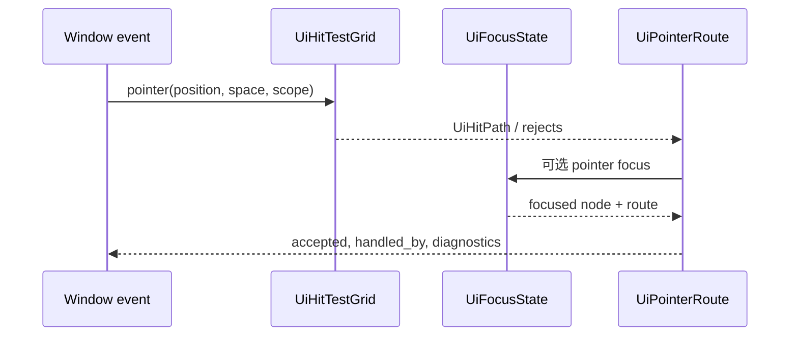

---
related_code:
  - zircon_runtime_interface/src/ui/surface/hit.rs
  - zircon_runtime_interface/src/ui/focus.rs
  - zircon_runtime_interface/src/ui/tree/node/tree_node.rs
  - zircon_runtime_interface/src/ui/window/input.rs
implementation_files:
  - zircon_runtime/src/ui/surface
plan_sources:
  - user: 2026-09-09 扩充公开 UI 接口、机制案例与教程
tests:
  - zircon_runtime_interface/src/tests/ui_dispatch_error_contracts.rs
  - zircon_runtime_interface/src/tests/ui_ecs_node_lookup_contracts.rs
doc_type: api-reference
---

# UI 事件路由、焦点与命中测试

## 三个不同的问题

命中测试回答“指针坐标落在哪个渲染可见节点”；焦点回答“键盘、文本或 IME 应交给谁”；
路由回答“该事件沿哪条祖先链传播、谁消费”。三者不可互相替代：一个节点可以命中但
`UiInputPolicy` 禁止输入，也可以获得程序焦点却不接收指针。



## 公共合同

| 类型 | 用途 | 关键字段或方法 |
| --- | --- | --- |
| `UiHitTestQuery` | 一次命中请求 | 坐标空间、point、scope 必须来自同一 surface/window |
| `UiHitCoordinateSpace` | 坐标解释 | 不要把逻辑像素、物理像素和 world ray 混用 |
| `UiHitTestGrid` | 加速网格 | `UiHitTestCell` 和 debug dump 是诊断数据，不是控件身份 |
| `UiHitPath` / `UiHitRouteNode` | 根到目标的命中路径 | 用于解释 clip、z-order 与 ancestor input policy |
| `UiHitTestReject` | 被排除的候选 | `UiHitTestRejectReason` 是调试输入穿透的依据 |
| `UiPointerRoute` | 指针事件分发结果 | 包含 phase、button、routing path |
| `UiFocusState` / `UiFocusPath` | 当前和祖先焦点关系 | surface 级状态，不应跨 surface 缓存 |
| `UiFocusedInput` | 交付后的事实记录 | `accepted=false` 不等价于平台事件丢失 |

`UiInputPolicy`、`UiPointerEvents`、`UiVisibility` 位于 `ui::tree`。它们是节点的
声明式约束；布局存在不表示节点可命中，隐藏、禁用、clip 或 policy 都可能使候选被拒绝。

## 焦点链与键盘可达性

`focus_chain(&UiTree) -> Vec<UiNodeId>` 是公开的可预测 Tab 顺序算法。它以可达根
的前序遍历为基础：显式 `UiTabIndex` 先按 `(order, preorder)` 排序，未声明 index 的
可聚焦节点保持前序。该算法会排除不可渲染、disabled、`UiFocusMode::None` 与
`tabbable=false` 的节点。

```rust
use zircon_runtime_interface::ui::{focus_chain, UiFocusMode};

assert!(UiFocusMode::All.allows_pointer_focus());
assert!(UiFocusMode::All.allows_tab_focus());
assert!(UiFocusMode::Click.allows_pointer_focus());
assert!(!UiFocusMode::Click.allows_tab_focus());
// 实际 tree 由 UiSurface 持有；在 surface 更新后重新计算而非缓存旧 Vec。
let _ = focus_chain;
```

`UiFocusCause` 控制 focus-visible 语义：`Navigation` 产生键盘焦点环，`Pointer`
通常隐藏它，`Programmatic` 和 `Restore` 不应伪装成键盘导航。`UiFocusContract` 的
`focusable`、`mode`、`autofocus`、`restore_on_close` 共同决定行为；只写 `autofocus`
但不设 `focusable` 不会得到可访问的输入目标。

## 路由与消费的约束

跨边界消息使用 `UiControlRequest`、`UiInvocationRequest`、`UiNotification`，响应为
`UiControlResponse`、`UiInvocationResponse` 或 `UiInvocationResult`。`UiRouteId` 与
`UiSubscriptionId` 是协议身份，调用方须保留 request/context 与 response 的关联，不能
依响应到达顺序配对。失败用 `UiInvocationError` 表达，而不是把错误序列化进业务 value。

当输入已有消费记录，动作映射应使用
`InputActionEvaluator::evaluate_with_consumed_input` 或
`evaluate_with_active_contexts_and_consumed_input`，而不是再次调用 `evaluate`。这样 UI
文本框消费的 Enter、Escape 或方向键不会同时触发游戏动作。

## 负例与调试流程

| 症状 | 常见原因 | 首选证据 |
| --- | --- | --- |
| 点击穿透浮层 | scope、z-index、clip 或 pointer policy 不一致 | `UiHitTestDebugDump`、reject reason |
| Tab 落到不可见控件 | 只隐藏视觉属性或缓存了旧 focus chain | `focus_chain` 与 `UiVisibility` |
| 鼠标点击后无焦点 | `UiFocusMode::None` / 节点 disabled | `UiFocusContract`、`UiFocusChangeEvent` |
| IME 写入错误控件 | 在窗口层绕过 focused route | `UiFocusedInputKind::Ime` 记录 |

在 frame 级诊断打开后，使用 `UiSurfaceDebugSnapshot` 中的 hit-grid、render command 和
invalidation 段落定位；这些快照适合测试和 inspector，不能在 release 热路径逐帧导出。

## 实践清单

1. 所有坐标在进入命中测试前转换一次，并记录 `UiHitCoordinateSpace`。
2. 弹窗关闭时使用焦点恢复契约，不要手工猜测“上一个控件”。
3. 不为鼠标专用控件赋 `UiFocusMode::All`，也不为键盘输入框赋 `Click`。
4. 先让 UI 记录消费，再评估游戏 action；活动 context 是多窗口/编辑器模式的必要条件。
5. 用稳定 `UiNodeId` 仅限定同一 surface 帧序列；重建 surface 后重新查找。

## 调用示例：焦点链断言

```rust
let chain = focus_chain(&surface_tree);
assert!(chain.windows(2).all(|pair| pair[0] != pair[1]));
let request = UiInvocationRequest::new(route_id, "activate");
let response = host.dispatch(request)?;
```

契约测试覆盖 pointer capture、disabled/hidden、modal restore、坐标空间错误和 invocation error。
