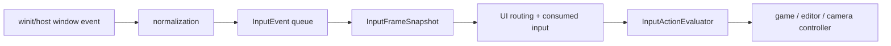

---
related_code:
  - zircon_runtime/src/input/mod.rs
  - zircon_runtime/src/input/runtime/action_evaluator.rs
  - zircon_runtime/src/input/runtime/recording.rs
  - zircon_runtime_interface/src/ui/window/input.rs
  - zircon_runtime/src/platform/capability/backends/input.rs
implementation_files:
  - zircon_runtime/src/input/runtime/action_evaluator.rs
  - zircon_runtime/src/input/runtime/recording.rs
plan_sources:
  - user: 2026-09-09 扩充公开 UI 接口、机制案例与教程
tests:
  - zircon_runtime/src/platform/tests/headless_synthetic_input.rs
  - zircon_runtime_interface/src/tests/window_input_contracts.rs
doc_type: api-reference
---

# 键盘、指针、手柄与窗口输入

## 输入管线

平台窗口事件先归一化为 `InputEvent`，`InputManager` 在帧边界生成
`InputFrameSnapshot`，再由 `InputActionEvaluator` 按 action map、活动 context 与消费
集合求值。UI routing 应先运行并写入消费结果，游戏玩法和相机控制器随后才评估动作。



## 模块与事件 API

`InputModule` 以 `InputConfig` 构造，公开名称为 `INPUT_MANAGER_NAME`、
`INPUT_ACTION_MANAGER_NAME`、`INPUT_DRIVER_NAME`。`DefaultInputManager` 是默认状态
容器，`InputDriver` 负责帧驱动，`DefaultInputActionManager` 持有 action map。
`InputEvent`、`InputEventRecord`、`InputSnapshot` 是基础协议类型；`InputEventQueueStatus`
和 `InputEventRecordingStatus` 是溢出与记录完备性的诊断，不是普通游戏状态。

| 输入类别 | 公开类型 | 注意事项 |
| --- | --- | --- |
| 键盘 | `InputButton`, `ButtonInputState`, `InputBinding` | physical/logical 解释由窗口适配层固定，不能混比较 |
| 指针 | `CursorPosition`, `MouseWheelEvent`, `MouseScrollUnit`, `CursorHostRequest` | wheel unit 必须保留，不能都按像素处理 |
| 触控 | `TouchPoint`, `TouchPhase` | touch identity 不能用坐标替代 |
| 手柄 | `GamepadId`, `GamepadAxis`, `GamepadButton`, `GamepadAxisState` | deadzone/threshold 用公开常量统一 |
| IME | `ImeEvent`, `ImePreedit`, `ImeDeleteSurrounding` | 交给 focused editable UI，非 action map |
| 窗口 | `WindowStatusEvent`, `WindowTheme`, file drag/drop | window 焦点失去时应清理按下状态 |

## 动作评估 API

```rust
use zircon_runtime::input::InputActionEvaluator;

let evaluator = InputActionEvaluator::new(action_map);
let state = evaluator.evaluate_with_active_contexts_and_consumed_input(
    &frame,
    &active_contexts,
    &consumed_buttons,
    &consumed_events,
);
let _ = state;
```

可用方法为 `evaluate`、`evaluate_with_consumed_buttons`、`evaluate_with_consumed_input`、
`evaluate_with_active_contexts`、`evaluate_with_active_contexts_and_consumed_buttons`、
`evaluate_with_active_contexts_and_consumed_input`。使用最能表达当前边界的方法：仅有按钮
冲突时传 buttons；UI/IME/指针已处理的事件也要排除时传 consumed input；编辑器、游戏、
文本框共存时一定传 active contexts。`set_action_map` 应在安全帧边界替换，而不是处理中途。

## 手柄阈值、相机和负例

使用 `GAMEPAD_AXIS_DEADZONE_LOWER/UPPER`、`GAMEPAD_AXIS_LIVEZONE_LOWER/UPPER`、
`GAMEPAD_BUTTON_PRESS_THRESHOLD`、`GAMEPAD_BUTTON_RELEASE_THRESHOLD` 和 change
threshold 形成滞回，避免模拟扳机抖动。`OrbitCameraController`、
`FreeCameraController`、`PanCameraController` 是上层消费者；它们的 `update` 必须接收
同一帧 snapshot，不能从平台回调直接改相机。

错误案例：

1. `evaluate` 之后再让 UI 消费 Enter，会导致一次确认既提交文本又触发菜单。
2. 不处理 focus lost 会留下永久按下的 WASD 或鼠标抓取状态。
3. 将 line wheel 和 pixel wheel 同乘同一灵敏度会导致触控板不可用；使用
   `PIXEL_SCROLL_LINE_DELTA_SCALE` 及 unit 分支。
4. 不用 `GamepadId` 区分设备会使第二控制器的断开清理第一个玩家状态。

## 录制与确定性重放

`InputRecording::new/from_frames/push_frame/push_captured_frame` 收集
`InputRecordingFrame`。`replay_cursor()` 返回借用 recording 的 `InputReplayCursor`；它
可通过 `replay_next_frame` 或 `submit_next_frame_events` 驱动测试。前者会先调用
`InputManager::begin_frame()`，后者只提交该帧事件，适合调用方已经管理帧边界的场景。检查
`discarded_record_count()`、`recording_enabled()`、`is_complete()`，若队列已丢事件就
不能把重放结果当作确定性回归证据。

平台能力以 `PlatformRuntimeCapabilityReport` 表示：Keyboard/Mouse/Touch/Gamepad/IME
backend 可能是 unsupported、planned 或 ready。headless 测试要显式选择 synthetic input，
而不要假设桌面 host 存在。Fyrox/Godot 的 Input 单例风格在这里被替换为可记录的帧快照，
便于 UI、编辑器和运行时共享同一事件事实。

## 调用示例：确定性重放

```rust
let mut recording = InputRecording::new();
recording.push_captured_frame(frame_index, input_manager);
let mut cursor = recording.replay_cursor();
let expected_frame_count = recording.frame_count();
let mut replayed_frame_count = 0;
while let Some(report) = cursor.replay_next_frame(&manager) {
    // InputReplayFrameReport 只有 frame_index、event_count 和 snapshot 公开字段。
    assert!(report.event_count <= recording.event_count());
    println!(
        "replayed frame={} events={} cursor={:?}",
        report.frame_index, report.event_count, report.snapshot.cursor_position
    );
    replayed_frame_count += 1;
}
assert_eq!(replayed_frame_count, expected_frame_count);
assert!(cursor.is_finished());
```

`replay_next_frame` 在录制结束时返回 `None`，不是 `Result`，因此不能使用 `?`。
`InputReplayFrameReport` 不提供 `accepted_events()` 或 `submitted_events()`；需要验证
录制完整性时，在开始重放前检查 `recording.is_complete()` 和
`recording.discarded_record_count()`，逐帧只读取 `frame_index`、`event_count` 与
`snapshot`。

测试覆盖 queue overflow、focus lost、deadzone 边界、GamepadId、wheel unit、IME 消费和 headless backend。
