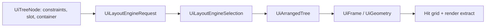

---
related_code:
  - zircon_runtime_interface/src/ui/layout/mod.rs
  - zircon_runtime_interface/src/ui/layout/engine.rs
  - zircon_runtime/src/ui/v2/surface_tree/layout.rs
  - zircon_runtime/src/ui/v2/surface_tree/slot.rs
implementation_files:
  - zircon_runtime/src/ui/v2/surface_tree/layout.rs
  - zircon_runtime/src/ui/v2/surface_tree/node.rs
plan_sources:
  - user: 2026-09-09 扩充公开 UI 接口、机制案例与教程
tests:
  - zircon_runtime_interface/src/tests/ui_layout.rs
doc_type: api-reference
---

# UI 布局、容器与虚拟列表

## 布局模型

布局由 `UiTree` 的约束、slot 和 container 计算为 `UiArrangedTree`；绘制和命中只能
消费已排列的几何，不应各自重新推导宽高。`UiLayoutEngineSelectionReport` 记录选择
的后端、能力和回退原因，因而“使用 Taffy”是运行时选择而非对所有作者节点的保证。



## 类型地图

| 组 | 公开 API | 要点 |
| --- | --- | --- |
| 约束 | `AxisConstraint`, `BoxConstraints`, `DesiredSize`, `StretchMode` | min/max/preferred/weight 共同参与尺寸协商；不要只写 preferred |
| 变换 | `Anchor`, `Pivot`, `Position`, `UiLayoutTransform`, `UiRenderTransform` | layout 位置和 render transform 的语义不同 |
| 容器 | `UiContainerKind`, `UiLinearBoxConfig`, `UiGridBoxConfig`, `UiWrapBoxConfig` | 容器决定 slot 如何解释 |
| 滚动 | `UiScrollableBoxConfig`, `UiScrollState`, `UiScrollbarVisibility` | scroll 状态属于 retained surface |
| 虚拟化 | `UiVirtualListConfig`, `UiVirtualListWindow` | 窗口是可见范围，不是业务数据集合 |
| 诊断 | `UiLayoutDebugNode`, `UiLayoutDebugPacket` | 用于检查约束与最终 frame 的落差 |

## V2 作者布局解析

V2 的 `layout` 是节点或 slot 的表。解析器接受 `width`/`height` 的约束表、
`anchor`、`pivot`、`position`、`container`、`input_policy`、`clip`、`boundary`、
`z_index`。未知或类型不正确的 layout 字段由 `UiV2AssetError::InvalidDocument`
携带 asset 与节点 path 失败，而非静默使用零尺寸。

```toml
[[nodes]]
id = "inventory"
component = "ScrollableBox"

[nodes.layout]
container = "scrollable"
clip = true
z_index = 10

[nodes.layout.width]
min = 320.0
preferred = 480.0
stretch = "fill"
```

`HorizontalBox`、`VerticalBox`、`WrapBox`、`GridBox`、`MasonryBox`、`CanvasBox`、
`SizeBox` 和 `ScrollableBox` 映射为 `UiContainerKind`。V2 的 Material 风格别名也会
推导容器，例如 `Stack direction="row"` 为水平线性容器，`Grid container=true` 为
grid。数值 `spacing` 在该兼容解析路径按默认 8px 单位换算；显式浮点值应表达清楚，
不要依赖此兼容规则做像素精确布局。

## Taffy 选择与回退

`UiLayoutEngineRequest` 描述需求，`UiLayoutEngineSupport` 和
`UiLayoutEngineCapability` 描述当前后端支持集，选择结果为
`UiLayoutEngineSelection`。在诊断中检查 `UiLayoutEngineFallbackReason`：它表明为何
没有使用期望后端或功能，而不是可忽略的性能提示。

应用层不直接调用私有 Taffy tree。应把 `UiLayoutStyle`、`UiLayoutDisplay`、
`UiFlexDirection`、`UiGridTrack`、`UiOverflow` 写入接口契约并让 surface 执行。这样
headless、不同窗口 backend 与未来布局引擎能保持同一数据模型。

## 虚拟化机制案例

虚拟列表把“全部数据项”与“当前可测量/可绘制的窗口”分开：

```text
数据集 50,000 项
  -> scroll offset + viewport
  -> UiVirtualListWindow [first, last)
  -> 仅创建/排列可见行及 overscan
  -> render extract
```

`UiVirtualListConfig` 应使用稳定数据键驱动 row 身份；不要以可见索引作为业务选择
ID，否则滚动后焦点、拖拽与选择会指向新行。滚动偏移变化通常只使 window 和受影响
slot 脏化，若每次滚动重建整个 `UiTree`，即使画面正确也违背 retained 模型。

## 常见失败和最佳实践

1. 将弹窗放入会裁剪的滚动祖先会导致它被正确地裁掉；用独立 overlay surface。
2. `max < min`、非有限浮点数或不合法 stretch 应在资产加载期失败；不要修补最终 frame。
3. 用 `LayoutBoundary` 切断不必要的祖先重算，但不要将依赖父尺寸的节点错误设为边界。
4. 像素对齐由 `UiPixelSnapping`/`UiPixelSnappingPolicy` 控制；不要在逻辑布局中到处 `round()`。
5. 性能调优先读 `UiLayoutDebugPacket` 和选择报告，再考虑更换容器种类。

## 参考引擎差异

Godot `Container` 倾向以节点类编码布局；Fyrox 也有面板对象树。Zircon 将 container、
slot、约束和后端选择放在可传输的数据合同中，因此开发者应以 contract 为单位测试，不
应从 UI V2 的私有解析函数复制布局策略。
应从 UI V2 的私有解析函数复制布局策略。

## 调用示例：显式约束

```rust
let constraints = BoxConstraints {
    width: AxisConstraint { min: 240.0, max: 640.0, preferred: 320.0, ..Default::default() },
    height: AxisConstraint::default(),
};
```

测试覆盖 min/max 冲突、负 spacing、滚动 overscan、scale factor、fallback reason 和 virtual window 稳定键。

```rust
let window = UiVirtualListWindow { first_visible: 0, last_visible_exclusive: 20 };
assert!(window.last_visible_exclusive >= window.first_visible);
```
