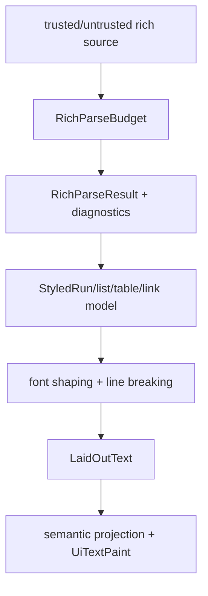

---
related_code:
  - zircon_runtime/src/text/rich
  - zircon_runtime/src/text/model/rich.rs
  - zircon_runtime_interface/src/ui/text.rs
  - zircon_runtime_interface/src/ui/surface/mod.rs
implementation_files:
  - zircon_runtime/src/text/rich
  - zircon_runtime/src/text/model/rich.rs
plan_sources:
  - user: 2026-09-09 扩充公开 UI 接口、机制案例与教程
tests:
  - zircon_runtime_interface/src/tests/render_contracts/text_shape.rs
  - zircon_runtime_interface/src/tests/ui_contract_spine.rs
doc_type: api-reference
---

# 富文本、链接、表格与语义投影

## 数据层次

富文本分为作者语义、布局结果和绘制结果三层。`RichTextParser` 产出
`RichParseResult`；`StyledRun`、`RichListItem`、`RichTable`、`LinkRef` 等类型保存语义；
`LaidOutText`、`LaidOutLine` 和 `LayoutItem` 保存换行后的几何；最终由
`UiResolvedTextLayout`、`UiTextPaintRun` 投影到 renderer。不要在 paint 层重新解析 Markdown
或 HTML 类语法。



## 公开结构

| 类型 | 说明 | 约束 |
| --- | --- | --- |
| `RichTextContentTrust` | 内容信任等级 | 不可信内容不能提升为可执行 widget |
| `RichParseBudget` | 字符、节点、深度等预算 | 超预算是可观察错误，不是无限放宽 |
| `RichTextAuthoringDiagnostic` | source range、severity、code、recovery | 编辑器显示并可定位原文 |
| `StyleOverride` / `ParagraphOverride` | 局部样式覆盖 | 只影响声明的字段 |
| `LinkRef` | 链接目标与显示范围 | 激活时走受控 action/权限检查 |
| `RichTableColumn/Cell/Table` | 表格结构和 cell box style | 行列 span 受 `MAX_RICH_TABLE_ROW_SPAN` 限制 |
| `RichIconAssetId` / `RichInlineWidgetSlotId` | 内联资源/控件槽 | 生命周期由 asset/widget owner 管理 |

## 解析和恢复

```rust
use zircon_runtime::{RichParseBudget, RichTextParser, RichTextContentTrust};

let parser = RichTextParser::default();
let result = parser.parse_with_budget(
    source,
    RichParseBudget::default(),
    RichTextContentTrust::Untrusted,
)?;
for diagnostic in &result.diagnostics {
    // 将 severity/code/source range 发送到 editor diagnostics。
    tracing::warn!(?diagnostic, "rich text authoring diagnostic");
}
Ok::<(), zircon_runtime::RichTextParseError>(())
```

具体 parser 方法以当前 crate 文档为准；示例强调预算、trust 和 diagnostics 三个必须传递
的语义。`RichTextAuthoringRecovery` 可表示跳过节点、保留文本或停止；调用者不能把
`recovered=true` 当作语义完全等价。

## 链接和内联控件

`LinkRef` 只描述目标和范围，激活动作应映射为 `UiActionDescriptor` 或受权限保护的
`UiInvocationRequest`。链接文本可跨 shaping cluster，选中范围应使用 `TextRange`。
内联 widget slot 需要稳定 `RichInlineWidgetSlotId`，并在 widget owner 销毁时释放；不能
把 slot ID 直接转换为 `UiNodeId`。

## 表格布局与错误

表格列宽、padding、cell box style 先进入文本 layout，再参与容器约束。span 大于
`MAX_RICH_TABLE_ROW_SPAN`、重复占用同一网格或缺少 cell 内容时，应生成 authoring
diagnostic 并按 recovery 策略处理。不要在 renderer 中悄悄截断 span，因为辅助语义和
视觉列数会分叉。

## 性能和安全清单

1. 不可信富文本始终设置有限 `RichParseBudget`，并隔离 image/icon asset 解析。
2. 以 source digest、locale、font query、width constraint 建立 layout cache key。
3. 只在语义/样式变化时重整形；光标移动优先复用 glyph artifact。
4. 对链接、图片和 widget 设 host 权限及项目路径边界。
5. 用 authoring diagnostics 驱动编辑器修复，而不是向用户显示 panic/unwrap。

与 Slint 的轻量文本元素相比，Zircon 的 rich model 更强调跨 runtime 的可诊断投影；与
Godot BBCode 相比，它没有承诺在 renderer 中接受任意标签。支持的语法、预算和 trust
必须作为产品文档的一部分版本化。
必须作为产品文档的一部分版本化。

## 调用示例：安全链接动作

```rust
fn activate_link(link: &LinkRef, route: UiRouteId) -> UiInvocationRequest {
    UiInvocationRequest::new(route, "rich.link.activate")
        .with_argument("target", link.target().to_owned())
}
```

测试 parse budget、诊断 recovery、链接权限、table span 上限、emoji cluster 和 widget 销毁。
