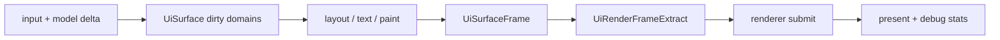

---
related_code:
  - zircon_runtime_interface/src/ui/surface/frame.rs
  - zircon_runtime_interface/src/ui/surface/mod.rs
  - zircon_runtime_interface/src/ui/pipeline/frame_report.rs
  - zircon_runtime/src/ui/surface
implementation_files:
  - zircon_runtime/src/ui/surface
plan_sources:
  - user: 2026-09-09 扩充公开 UI 接口、机制案例与教程
tests:
  - zircon_runtime_interface/src/tests/ui_painter_style_contracts.rs
  - zircon_runtime_interface/src/tests/ui_geometry_metrics.rs
doc_type: api-reference
---

# UI Surface、帧更新与渲染提取

## Surface 是运行时所有者

`UiSurface` 持有 retained `UiTree`、组件状态、布局/文本测量缓存和运行时样式状态。它
不是纯 renderer，也不是作者文档的可变镜像。每个窗口、HUD 或 editor chrome 应有明确
的 `UiTreeId` / surface 所有权，跨线程只传送接口层的不可变 extract 或命令，不共享可变
tree。



## 帧与渲染公开数据

| 类型 | 用途 | 注意事项 |
| --- | --- | --- |
| `UiSurfaceFrame` | surface 一次更新的统一产物 | 对应 frame 边界，不能和另一 surface 的 generation 拼接 |
| `UiSurfaceFrameDomainGenerations` | layout/text/paint 等域的版本 | 用于检测过期 extract，而不是全局时钟 |
| `UiSurfaceWindowState` | window metrics 与可见性快照 | 窗口缩放变化应先更新此状态 |
| `UiRenderExtract` / `UiRenderFrameExtract` | renderer 所需的提取数据 | 是渲染边界上的数据，而非可回写 UI tree 的句柄 |
| `UiRenderCommand` / `UiRenderFrameCommands` | 绘制命令序列 | 顺序、clip 与 resource state 都有语义 |
| `UiBatchPlan`, `UiBatch`, `UiBatchStats` | 批处理计划与统计 | 合批必须保持 paint/clip/opacity 正确性 |
| `UiRenderResourceKey`, `UiRenderResourceState` | 图像、字体、材质资源状态 | key 生命周期受资源系统支配 |

## 资源就绪与过期保护

渲染提取可能引用 `UiVisualAssetRef`、文本 shape artifact、image brush 或 material
brush。资源未就绪时 renderer 应依据 `UiRenderResourceState` 和 extract 的诊断选择占位、
跳过或重试；不能把资源不存在解释成“透明”。提交端必须验证 surface/window generation，
防止已销毁窗口或更换尺寸的命令被 present。

`UiRenderCachePlan`、`UiRenderCacheStatus`、`UiRenderCacheInvalidationReason` 提供缓存
可复用性。缓存命中不是正确性的前提：任何 clip、几何、文本、opacity 或资源依赖变化
都可使单个 paint entry 失效。

## Rust 集成轮廓

以下为接口消费形状，不直接暴露 `UiSurface` 的私有帧驱动方法：

```rust
use zircon_runtime_interface::ui::{UiRenderFrameExtract, UiSurfaceFrame};

fn submit_ui(frame: &UiSurfaceFrame, extract: &UiRenderFrameExtract) {
    // 1. 确认 extract 所属 surface/window generation 与 frame 一致。
    // 2. 解析 UiRenderResourceKey 的资源状态。
    // 3. 依 UiRenderCommand 顺序和 UiClipState 录制图形后端命令。
    // 4. 保存 UiRenderStats / UiBatchStats，用于预算和回归测试。
    let _ = (frame, extract);
}
```

## 文本与特效边界

文本绘制使用 `UiTextPaint`、`UiShapedText`、`UiResolvedTextLayout`，而不是直接把 UTF-8
字节当作 glyph 索引。`UiTextRenderMode`、`UiTextOutlineEffect`、`UiTextShadowEffect`、
`UiTextDistanceFieldEffects` 影响 shader/resource 选择；`MAX_TEXT_EFFECT_EXTENT_PX`
是受控上限，扩大特效时要同时扩大 damage 和 clip 预算。

## 调试与性能

`UiRenderDebugStatsV2`、`UiRenderDebugSnapshot`、`UiBackendRenderDebugStats`、
`UiMaterialBatchDebugStat` 和 `UiOverdrawDebugStats` 用于回答“哪一类 paint 导致了
成本”。`UiSurfaceDebugOptions` 控制捕获；release 路径不要无条件分配
`UiRenderCommandDebugRecord` 或 overdraw 网格。

检查顺序：先看 invalidation 原因，再看 batch split reason，再看资源状态，最后才优化
draw call 数。把所有节点强制合批会破坏 z-order、clip 或混合；把所有表面缓存又会延迟
动态文本和光标更新。

## 当前边界

Zircon 公开的是 renderer 可消费的 extract 数据。它没有承诺像 Godot `CanvasItem` 那样
让游戏代码直接发任意即时绘制命令，也没有暴露 UI V2 私有 raster 队列；自定义绘制应
通过已定义的 brush/payload 或渲染模块扩展合同进入。
通过已定义的 brush/payload 或渲染模块扩展合同进入。

## 调用示例：过期帧拒绝

```rust
fn accept_extract(current: u64, extract: &UiRenderFrameExtract) -> bool {
    extract.domain_generations().window >= current
}
```

测试覆盖 window destroy、resource pending、clip stack、batch split 和 cache invalidation。
