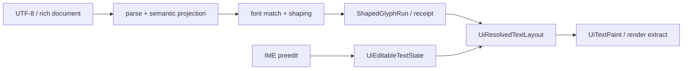

---
related_code:
  - zircon_runtime/src/text/mod.rs
  - zircon_runtime/src/text/context.rs
  - zircon_runtime/src/text/model/shaped_run.rs
  - zircon_runtime_interface/src/ui/surface/mod.rs
  - zircon_runtime_interface/src/ui/window/input.rs
implementation_files:
  - zircon_runtime/src/text
  - zircon_runtime/src/ui/text/mod.rs
plan_sources:
  - user: 2026-09-09 扩充公开 UI 接口、机制案例与教程
tests:
  - zircon_runtime_interface/src/tests/render_contracts/text_shape.rs
  - zircon_runtime_interface/src/tests/window_input_contracts/ime.rs
doc_type: api-reference
---

# 文本、字体整形、可编辑控件与 IME

## 文本服务边界

`zircon_runtime::text` 是 UI 与渲染共享的文本运行时。`TextRuntimeContext` 绑定 core、
目标模式、字体集合与生命周期；`shared_text_layout_service()` 提供共享整形服务。
应用层应通过 `text_runtime_context_for_core` 获得上下文，不能构造私有 layout session 或
直接访问 glyph atlas。



## 公开 API 导览

| 领域 | 类型/函数 | 使用重点 |
| --- | --- | --- |
| 上下文 | `TextRuntimeContext`, `TextRuntimeContextHealthSnapshot`, `TextRuntimeContextLifecycleState` | 检查生命周期和健康状态；`TextRuntimeContextAccessError` 不是可忽略空值 |
| 字体 | `FontQuery`, `FontMatch`, `FontFaceDescriptor`, `FontFamilyDescriptor`, `FontWeight`, `VariationCoords` | 字体选择可复现；不要依赖机器默认字体得到相同换行 |
| 整形 | `TextShapeRequest`, `TextLayoutService::shape`, `shared_text_layout_service` | 输入是文本/字体语义，返回公开的 `TextShapeResult`（`runs`、指标和解析方向） |
| 整形结果 | `TextShapeResult`, `TextShapeRun`, `TextGlyph` | 通过 `source_range`、`visual_range` 和 glyph 顺序消费 cluster；不要自行把字符索引当 glyph 索引 |
| 后端产物 | `ShapedGlyphRun`（只读模型） | 后端内部 canonical artifact；当前没有应用层构造器，不能调用 `horizontal`/`vertical`/`with_*` |
| OpenType | `TextOpenTypeFeature`, `TextShapeRequest::with_features` | 使用 neutral framework 类型传入特征；`OpenTypeFeature`/`normalized_open_type_features` 属于 runtime 模型侧，不能直接替代 request 特征 |
| 富文本 | `RichTextParser`, `RichParseBudget`, `RichParseResult`, `RichTextAuthoringDiagnostic` | 不可信内容要设预算和 trust policy |
| UI 文本 | `UiEditableTextState`, `UiTextSelection`, `UiTextComposition`, `UiTextCaret` | 编辑状态按 grapheme/visual 边界处理，不按字节偏移猜测 |
| IME | `ImeEvent`, `ImePreedit`, `ImeCursorRange`, `ImeHostRequest` | preedit 与已提交文本分开，候选窗由 host request 协调 |

## 整形失败是数据

`TextShapingFailureReceipt` 带有 `TextShapingFailureCode`、phase、dependency、
disposition 与 budget kind。`allows_alternate_backend()` 仅表示该 receipt 允许后备，
并不自动保证后备可得到等价排版。`TextShapingFailureReport` 应写入诊断或测试证据，
不要以 tofu 字形静默掩盖缺字、Unicode 数据不匹配或预算耗尽。

公开整形合同从 `TextShapeRequest` 开始。下面的示例只使用应用 crate 可见的类型和方法：

```rust
use zircon_runtime::core::framework::text::{
    TextFontRequest, TextLayoutError, TextOpenTypeFeature, TextShapeRequest,
};
use zircon_runtime::text::shared_text_layout_service;

fn shape_label() -> Result<(), TextLayoutError> {
    let families = ["Noto Sans CJK SC"];
    let font = TextFontRequest {
        families: &families,
        size: 16.0,
        ..TextFontRequest::default()
    };
    let features = [TextOpenTypeFeature::new(*b"kern", 1)];
    let mut request =
        TextShapeRequest::new("Zircon 文本", font).with_features(&features);
    request.language = Some("zh-Hans");
    request.include_kerning = true;

    let result = shared_text_layout_service().shape(request)?;
    for run in &result.runs {
        for glyph in &run.glyphs {
            // source_range/visual_range 是 UTF-8 字节范围；glyph_id 只用于字形资源查找。
            println!(
                "glyph={} source={:?} visual={:?} advance={}",
                glyph.glyph_id, glyph.source_range, glyph.visual_range, glyph.advance
            );
        }
    }
    println!("measured width={}", result.metrics.width);
    Ok(())
}
```

`TextShapeRequest` 的 `language`、`direction`、`writing_mode`、`line_height`、`tab_size`
和 `include_kerning` 是公开字段；`with_features` 是唯一的 builder-style 特征方法。
当前 `TextLayoutService::shape` 返回 `TextShapeResult`，其中每个 `TextShapeRun` 包含
`TextGlyph` 列表。`ShapedGlyphRun` 虽然在 runtime 模型中可见并用于序列化/内部布局，
但没有公开构造器；`ShapedGlyphRun::horizontal`、`horizontal_with_kerning`、`vertical`、
`vertical_with_kerning` 以及对应的 `with_language`/`with_kerning`/`with_features` 都是
内部 `BackendShapeRequest` 的实现方法，不能复制到业务代码。

> **伪代码（不可直接编译）**：如果文档需要描述后端阶段，可写成
> `backend_shape(request) -> ShapedGlyphRun -> project_to_TextShapeResult`。这只是管线
> 示意；应用层应调用上面的 `TextLayoutService::shape`，不能直接构造或接收该后端类型。

## 编辑和 IME 状态机

```text
focus editable node
  -> host receives ImeEvent::Preedit
  -> UiTextComposition + clauses + cursor range
  -> commit text / delete surrounding
  -> selection, caret, layout revision
  -> ImeHostRequest updates candidate rectangle
  -> blur/cancel clears composition (not committed text)
```

`ImePreedit` 的 clauses 受 `UiTextPreeditClauseError` 验证。选区使用
`UiTextSelection` 与 `UiTextRange`，光标可携带 `UiTextCaretAffinity` 和
`UiTextVisualBoundaryBias`。对组合字符、emoji ZWJ、RTL 或 vertical 文本，禁止把
`str` 的 byte index 直接塞给 UI range；使用 shaping cluster 和 text range 语义。

## 可访问、性能与错误处理

1. 文本输入必须在焦点变化时更新 IME host request；不要将 IME 当成普通 keypress。
2. `TextSystemFontPolicy` 应随 runtime target 明确设定，CI/headless 不应依系统字体漂移。
3. 富文本输入设置 `RichParseBudget`，并处理 `RichTextParseError` 与 authoring diagnostics。
4. 在同一 layout generation 内复用 shape artifact；样式、字体、宽度或 locale 改变时失效。
5. 长文档用 hard-line/window 化接口，避免为了光标移动复制全段 glyph 序列。

Slint 和浏览器文本输入都强调 composition 与 committed text 分离。Zircon 同样如此，
但当前公开合同不承诺 DOM contenteditable 兼容层；宿主应消费 `ImeHostRequest` 与窗口
事件适配器，而不是尝试模拟浏览器事件顺序。

## 调用示例：Unicode 快照

```rust
let unicode = compiled_unicode_data_snapshot_id();
assert_eq!(unicode, compiled_unicode_data_snapshot().id());
let query = FontQuery::single_family("Noto Sans CJK SC");
```

测试覆盖 grapheme/cluster 光标、RTL、vertical、缺字后备、IME cancel/commit 和 shaping budget。
