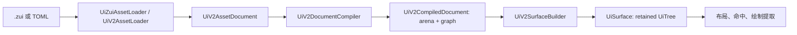

---
related_code:
  - zircon_runtime_interface/src/ui/v2/asset.rs
  - zircon_runtime_interface/src/ui/v2/arena.rs
  - zircon_runtime_interface/src/ui/tree/node/tree_node.rs
  - zircon_runtime/src/ui/v2/surface_builder.rs
implementation_files:
  - zircon_runtime/src/ui/v2/compiler.rs
  - zircon_runtime/src/ui/v2/surface_tree/node.rs
plan_sources:
  - user: 2026-09-09 扩充公开 UI 接口、机制案例与教程
tests:
  - zircon_runtime_interface/src/tests/ui_v2_contracts.rs
  - zircon_runtime/src/ui/v2/loader/owned_schema_error_tests.rs
doc_type: api-reference
---

# UI V2 资产、编译文档与保留树

## 契约边界

UI V2 的作者输入是 `UiV2AssetDocument`，跨 crate 的稳定数据契约定义在
`zircon_runtime_interface::ui::v2`；运行时的解析、组件展开和 `UiSurface` 构建在
`zircon_runtime::ui::v2`。应用代码应依赖重导出的公开类型，不能引用
`surface_tree`、`UiV2RuntimeStyleIndex` 或 `UiV2RuntimeSurfaceBuildError`，后三者是
`pub(crate)` 的实现细节。



## 公开类型与不变量

| 类型 | 责任 | 不变量 / 使用规则 |
| --- | --- | --- |
| `UiV2AssetHeader` | schema、资产 ID、kind 元数据 | 资产 ID 是诊断和缓存身份，不要用显示标题替代 |
| `UiV2AssetDocument` | 根节点、组件、tokens、样式表、imports 的完整作者文档 | 可持久化；构建后仍可复用 |
| `UiV2NodeDefinition` | 单个作者节点 | `source_id` 用于稳定路径和诊断，不应在热更新时随机生成 |
| `UiV2NodeArena` | 编译后的紧凑节点集合 | 通过 `node(handle)` 读取，不能假定 handle 是数组索引 |
| `UiV2NodeHandle` | arena 节点句柄 | 仅在同一个 arena 内有效 |
| `UiV2CompiledDocument` | 编译输出 | 编译成功并不等于所有运行时资源已上传 |
| `UiTreeId` / `UiNodeId` | 运行时表面、节点身份 | `UiNodeId` 是该 tree 内的运行时 ID；不是作者 `source_id` |
| `UiNodePath` | 面向诊断/反射的稳定路径 | V2 根路径以 `v2/` 起始；无 `control_id` 的同级节点含索引 |

`UI_V2_ASSET_SCHEMA_VERSION` 是当前可接受的作者 schema 版本。读取器必须让
loader 验证版本，而不能自行修改 TOML 后强行反序列化。

## 读取、编译和构建 API

```rust
use zircon_runtime::ui::v2::{
    UiV2AssetLoader, UiV2DocumentCompiler, UiV2SurfaceBuilder,
};
use zircon_runtime_interface::ui::event_ui::UiTreeId;

// 任一失败都保留 UiV2AssetError 的 asset_id、节点或 selector 上下文。
let document = UiV2AssetLoader::load_toml_file("ui/hud.zui")?;
let compiled = UiV2DocumentCompiler::compile(&document)?;
let surface = UiV2SurfaceBuilder::build_surface_from_compiled_document(
    UiTreeId::new("game.hud"),
    &document,
    &compiled,
)?;
Ok::<(), zircon_runtime_interface::ui::v2::UiV2AssetError>(())
```

可选的公开入口分别承担不同成本：

| API | 何时用 | 成本和错误 |
| --- | --- | --- |
| `UiV2AssetLoader::load_toml_str/file` | TOML 作者资产 | `UiV2AssetError`，包括 schema、引用、节点字段错误 |
| `UiZuiAssetLoader::load_zui_str/file` | `.zui` 文本格式 | 与上相同；不要把文件扩展名当作格式验证 |
| `UiV2DocumentCompiler::compile` | 无 imports 的单文档 | 返回含 arena/graph 的 `UiV2CompiledDocument` |
| `compile_with_prototype_store` | 项目或包组件 import | 缺少 prototype、循环图或无效引用必须中止构建 |
| `UiV2SurfaceBuilder::build_surface` | 简单一次性构建 | 每次会编译；不适合每帧调用 |
| `build_surface_with_prototype_store` | 已建立原型库的会话 | 展开 imports，但仍返回新的 retained surface |
| `build_surface_from_compiled_document[_with_theme]` | 已缓存的编译产物 | 避免重复编译；theme 参与静态 token 解析 |

## 保留树的构建语义

构建器按 arena 深度优先插入 `UiTreeNode`。每个节点的 `props`、`state`、作者
`layout`、静态样式和 slot 覆盖被合成为 `UiTemplateNodeMetadata`；之后才由 surface
保存脏位、布局缓存、焦点、滚动和组件状态。故而作者资产不是可直接 mutate 的
运行时 UI 状态。

```text
source_id / control_id
       | 编译、import 展开
       v
UiV2NodeHandle ----> UiNodeId（本次 surface 分配）
       |                    |
       +--> UiNodePath <----+  供反射、诊断、自动化定位
```

根节点缺失时 tree 可以为空；但编译 arena 有根却无法插入时构建以
`UiV2AssetError::InvalidDocument` 失败。缺少 handle 时错误是
`UiV2AssetError::MissingNode`，它通常说明资产、编译产物和原型 store 来自不同版本。

## 原型 store、身份与并发

`UiV2PrototypeStore` 是会话启动期构建的只读原型集合。其公开 API 为
`new`、`insert`、`insert_alias`、`get`、`len`、`is_empty`、`documents`；返回值采用
`Arc<UiV2AssetDocument>`，因此调用者可安全持有文档所有权而无需克隆整份资产。

```rust
use zircon_runtime::ui::v2::{UiV2PrototypeStoreBuilder, UiV2DocumentCompiler};

let mut builder = UiV2PrototypeStoreBuilder::new();
builder.insert_with_aliases(document, ["package://controls/button"]);
let store = builder.build()?; // 冻结为可共享查找表
let compiled = UiV2DocumentCompiler::compile_with_prototype_store(&root, &store)?;
Ok::<(), zircon_runtime_interface::ui::v2::UiV2AssetError>(())
```

`UiV2PrototypeStoreBuilder::build_for_roots` 应在已知入口组件集合时使用，使未引用
或循环组件在启动期暴露。`UiV2PrototypeStoreFileCache` 提供 `new`、
`with_persistent_cache`、`load_store_cached`、`load_store`、`clear`；它是 I/O 缓存，
不是渲染资源生命周期管理器。

## 失败处置与检查表

1. 用 loader 保留错误上下文，不要 `unwrap()` 后报告“UI 无法显示”。
2. 在重载时同时替换 document、compiled document 和 prototype store；不可混配。
3. 将 `UiTreeId` 视为 surface namespace，窗口、HUD 和浮层不要共用同一 ID。
4. 将 build 放在加载、窗口创建或明确热重载事务中；每帧只提交脏状态。
5. 为每个可自动化定位的控件提供唯一、稳定的 `control_id`。

## 与参考引擎的取舍

Slint 以编译期 UI 声明为中心，Godot 的 `Control` 则把节点作为场景对象公开。
Zircon 的差异是明确分离作者文档、可传输的 interface arena 与保留 surface；当前
没有公开的 `UiNode` 可供任意业务直接增删。需要动态内容时应通过 V2 repeat、绑定
或重新构建受控 surface，而非依赖未公开的树 mutation 细节。

## 调用示例：缓存与重载

```rust
let mut cache = UiV2PrototypeStoreFileCache::with_persistent_cache("target/ui-cache");
let outcome = cache.load_store_cached(["ui/root.zui", "ui/common.zui"])?;
let store = outcome.store;
let root = outcome.root_document;
let compiled = UiV2DocumentCompiler::compile_with_prototype_store(&root, store.as_ref())?;
```

热重载测试应覆盖 `MissingNode`、`InvalidDocument`、未知 schema 和循环 component graph。
