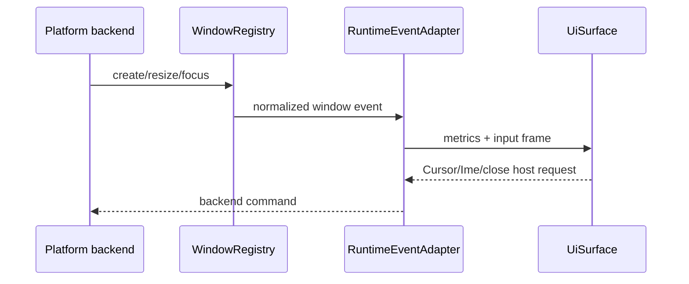

---
related_code:
  - zircon_runtime_interface/src/ui/window/mod.rs
  - zircon_runtime_interface/src/ui/window/input.rs
  - zircon_runtime_interface/src/ui/window/metrics.rs
  - zircon_runtime/src/platform/window_registry
  - zircon_app/src/entry/runtime_entry_app/window_lifecycle
implementation_files:
  - zircon_app/src/entry/runtime_entry_app/window_events/dispatch.rs
  - zircon_app/src/entry/runtime_entry_app/window_lifecycle
plan_sources:
  - user: 2026-09-09 扩充公开 UI 接口、机制案例与教程
tests:
  - zircon_runtime_interface/src/tests/window_input_contracts/window_events.rs
  - zircon_runtime/src/platform/tests/target_modes.rs
doc_type: api-reference
---

# Window、Host Request 与 DPI 缩放

## 窗口不是 UI 树

窗口 registry 管理平台窗口身份、角色和生命周期；UI surface 只消费窗口快照并产出
渲染/输入请求。`UiWindow`、`UiWindowMetrics`、`UiWindowMetadata` 以及
`RuntimeEventAdapter` 位于 interface，具体创建/销毁由 `zircon_app` 的 runtime entry
host 执行。应用不可用 `UiTreeId` 冒充 `WindowId`。



## Metrics 与缩放

`UiWindowMetrics` 区分 logical size、physical size、scale factor 和 viewport；布局使用
逻辑单位，raster/upload 使用物理像素。`ScaleFactor` 变化必须使 layout、text shape、
hit grid 和 render cache 同时失效。不要只调整 projection matrix，否则鼠标命中与视觉会
偏移一个缩放倍数。

## Host 请求类型

窗口输入合同包含 `CursorHostRequest`、`ImeHostRequest`、`ImeCursorArea`、
`ImeCursorRange`、`WindowStatusEvent`。请求需带目标窗口、代际或 focused node 上下文；
host 处理失败要回传结构化 error。IME candidate rectangle 使用物理像素或 host 约定的
坐标空间，必须在文档中注明转换点。

| 变化 | surface 操作 | host 操作 |
| --- | --- | --- |
| focus gained | 恢复/申请焦点链 | 激活输入上下文 |
| focus lost | 清理 pressed/buttons，保留可恢复焦点 | 释放 cursor/IME |
| resize/scale | 更新 `UiSurfaceWindowState`，重排 | 调整 swapchain/surface |
| close request | 进入 close transaction | 由 app 决定是否拒绝/确认 |

## 平台能力和 headless

通过 `PlatformConfig::planning_capability_report` 与
`PlatformRuntimeCapabilityReport` 检查 window metrics、event loop、IME、cursor、
drag/drop 等 backend。headless 运行不应调用桌面 host request；使用 synthetic input
和固定 metrics 进行 UI 契约测试。unsupported 必须转为可诊断状态，不要 silently no-op。

## 最佳实践

1. 将所有窗口事件归一化后再进入 UI；禁止平台回调直接 mutate tree。
2. 以 generation 拒绝过期 resize/present 命令，窗口销毁后清空 pending host request。
3. 将拖放文件路径先做项目边界和权限检查，再传递给业务绑定。
4. 记录 logical/physical 坐标和 scale factor，便于复现高 DPI 命中问题。
5. 在测试中覆盖 focus、resize、scale、close、IME 和 synthetic input 的组合，而不是只测点击。
5. 在测试中覆盖 focus、resize、scale、close、IME 和 synthetic input 的组合，而不是只测点击。

## 调用示例：缩放变更

```rust
fn on_scale_changed(surface: &mut UiSurface, metrics: UiWindowMetrics) {
    surface.update_window_state(UiSurfaceWindowState::from(metrics));
    surface.invalidate_layout_and_text();
}
```

测试 logical/physical 坐标、过期 generation、窗口销毁 pending request 和 IME candidate rectangle。

```rust
let request = CursorHostRequest::SetGrabMode(CursorGrabMode::None);
assert!(matches!(request, CursorHostRequest::SetGrabMode(_)));
```
